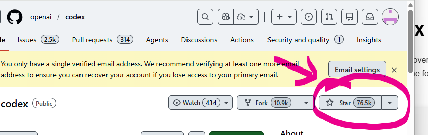
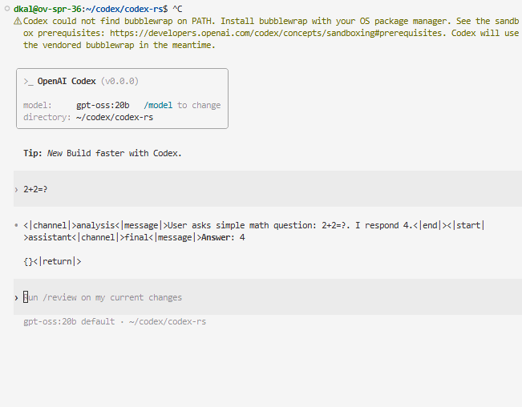

# What is Codex CLI?

[Codex CLI](https://developers.openai.com/codex/cli) is an open-source command-line interface for interacting with large language models, built by OpenAI. It provides a user-friendly way to send prompts, receive responses, and manage conversations with LLMs directly from the terminal. Codex CLI is designed to be compatible with Ollama's API, making it a great tool for testing and demonstrating OVMS's Ollama-compatible endpoints.

Codex CLI is **VERY** popular:



# Changes required to make Codex CLI work with OVMS

Codex CLI probes several Ollama-compatible endpoints during startup to discover the server and available models. This document is initial draft which changes need to be made to satisfy Codex's Responses API usage.

## 1. `GET /api/tags` (Ollama model listing)

Codex calls `GET /api/tags` to discover available models. This branch implements such endpoint and returns all loaded models (single models, DAG pipelines, MediaPipe graphs) in the Ollama response format.

Model names that already contain a tag (colon, e.g. `gpt-oss:20b`) are returned as-is. Names without a tag get `:latest` appended automatically. This ensures Codex's exact string matching works correctly and avoids unwanted pull attempts.

```json
{
  "models": [
    {
      "name": "my-model:latest",
      "model": "my-model:latest",
      "modified_at": "2026-04-16T12:00:00Z",
      "size": 0,
      "digest": "",
      "details": {
        "parent_model": "",
        "format": "openvino",
        "family": "",
        "families": null,
        "parameter_size": "",
        "quantization_level": ""
      }
    }
  ]
}
```

Both `/api/tags` and `/v3/api/tags` are accepted.

## 2. `GET /api/version` (Ollama version check)

Codex calls `GET /api/version` to verify the server is reachable and Ollama-compatible. This branch implements the new endpoint and returns the OVMS version:

```json
{"version": "2025.1"}
```

Both `/api/version` and `/v3/api/version` are accepted.

## 3. Skip non-function tool types in tools array

Codex client sends a `tools` array that may contain non-function tool types such as `web_search`. Previously, OVMS rejected the entire request with `"Only function tools are supported"` **error**. Now, non-function tool types are silently removed from the array with a warning log, and only function tools are processed. This allows Codex requests to succeed without modification.

**Non-function tool types defined by the Responses API (all skipped by OVMS):**
- `web_search_preview` / `web_search` — Web search tool
- `file_search` — File search tool
- `code_interpreter` — Code interpreter tool
- `computer_use_preview` — Computer use tool
- `mcp` — Model Context Protocol tool
- `image_generation` — Image generation tool

---

## 4. Responses API gap analysis

This section documents the complete gap analysis between what Codex CLI sends/expects and what OVMS currently supports in its Responses API (`/v3/responses`).

### 4.1 What Already Works

These Codex request features are already implemented in OVMS:

| Feature | Codex sends | OVMS handles |
|---------|-------------|--------------|
| `model` | `"gpt-oss:20b"` | ✅ Parsed and used for model selection |
| `input` (array of messages) | Array of `{type: "message", role, content}` | ✅ Parsed — roles passed through to chatHistory |
| `input` content types | `input_text`, `input_image` | ✅ Both supported |
| `stream: true` | Always true | ✅ Full streaming with SSE lifecycle events |
| `tools` (function type) | `{type: "function", name, parameters}` | ✅ Parsed via `parseTools()` |
| `tool_choice: "auto"` | `"auto"` | ✅ Supported (auto/none/required/specific) |
| `reasoning` | `null` | ✅ Accepted (null = disabled; object with `effort` = enabled) |
| `max_output_tokens` | Not always sent | ✅ Parsed as unsigned int |
| Non-function tool types | `web_search`, `spawn_agent`, etc. | ✅ Skipped with warning (fix #3 above) |

### 4.2 Critical Gaps (Will Cause Failures)

#### 4.2.1 `instructions` field not parsed

**Impact: HIGH — Codex will not have system prompt**

Codex sends a top-level `instructions` field containing the system prompt (personality, rules, tool guidelines). This is the Responses API equivalent of a `system` message in Chat Completions.

```json
{
  "instructions": "You are a coding agent running in the Codex CLI...",
  "input": [...]
}
```

OVMS does **not** parse the `instructions` field at all. It is silently ignored. This means the model receives no system prompt, which severely degrades response quality and agent behavior.

**Fix required:** In `parseResponsesPart()` (openai_responses.cpp), add parsing of the `instructions` field. When present, prepend a `{role: "system", content: instructions}` entry to the beginning of `request.chatHistory` before processing the `input` array.

#### 4.2.2 `function_call_output` input items breaks the parser

**Impact: HIGH — Multi-turn tool use with Codex CLI is broken**

After the model returns a function call and Codex executes it, Codex sends the result back as an input item of type `function_call_output`:

```json
{
  "input": [
    {"type": "message", "role": "user", "content": [...]},
    {"type": "function_call_output", "call_id": "call_abc123", "output": "command output..."}
  ]
}
```

OVMS's `parseInput()` assumes every input array item has a `role` field (line ~99). A `function_call_output` item has no `role`; it has `type`, `call_id`, and `output`. OVMS will fail with:
```
"input item role is missing or invalid"
```

This breaks the entire agentic loop — Codex can send a command, but cannot relay results back.

**Fix required:** In `parseInput()`, check the `type` field of each input item. If `type == "function_call_output"`, extract `call_id` and `output` and convert to the appropriate chat history format (typically `{role: "tool", tool_call_id: call_id, content: output}`). Only fall through to the existing `role`-based parsing for `type == "message"` items.

#### 4.2.3 `developer` role not mapped to `system`

**Impact: MEDIUM — Developer messages may not work correctly**

Codex sends messages with `role: "developer"` (the Responses API equivalent of `system`). OVMS passes the role through verbatim to chatHistory. Whether this works depends on the chat template — most templates recognize `system` but not `developer`.

```json
{"type": "message", "role": "developer", "content": [...]}
```

**Fix required:** In `parseInput()`, map `role: "developer"` to `role: "system"` when building chatHistory, unless the model's chat template explicitly supports the `developer` role.

### 4.3 Non-Critical Gaps (Gracefully Ignored or Cosmetic)

These fields are sent by Codex but either safely ignored or have minor cosmetic impact:

| Field | Codex sends | OVMS behavior | Impact |
|-------|-------------|---------------|--------|
| `store: false` | `false` | Hardcoded `true` in response | Cosmetic — no actual storage in either case |
| `parallel_tool_calls: false` | `false` | Hardcoded `true` in response | Model behavior depends on prompt, not this flag |
| `include: []` | Empty array | Not parsed, ignored | No effect (empty anyway) |
| `prompt_cache_key` | UUID string | Not parsed, ignored | No KV cache keying (future optimization) |
| `client_metadata` | `{x-codex-installation-id: ...}` | Not parsed, ignored | No tracking needed |
| `previous_response_id` | Not sent in initial turn | TODO in code (line ~386) | Would matter for multi-turn stateful sessions |

### 4.4 Streaming Event Compatibility

OVMS emits the following Responses API streaming events, which Codex expects:

| Event | Supported |
|-------|-----------|
| `response.created` | ✅ |
| `response.in_progress` | ✅ |
| `response.completed` | ✅ |
| `response.incomplete` | ✅ |
| `response.failed` | ✅ |
| `response.output_item.added` | ✅ |
| `response.output_text.delta` | ✅ |
| `response.output_text.done` | ✅ |
| `response.content_part.added` | ✅ |
| `response.content_part.done` | ✅ |
| `response.function_call_arguments.delta` | ✅ |
| `response.function_call_arguments.done` | ✅ |
| `response.reasoning_summary_text.delta` | ✅ |
| `response.reasoning_summary_text.done` | ✅ |

The streaming event format appears fully compatible with what Codex expects.

### 4.5 Summary

Items 1-3 are **blocking** for a working Codex CLI agentic session. The first prompt will appear to work (simple Q&A), but:
- Without `instructions`, the model won't follow Codex's coding agent persona
- Without `function_call_output` support, Codex cannot complete any tool-call round-trip
- Without `developer`→`system` mapping, system prompts in the input array may be ignored by the chat template


## How to setup Codex

### Build
```
https://github.com/openai/codex/blob/main/docs/install.md#build-from-source
```

### Install or copy
```
cp target/debug/codex  ~/.cargo/bin/codex
```

### Run
```
CODEX_OSS_BASE_URL=http://localhost:11338/v3 codex --oss -m gpt-oss:20
```

