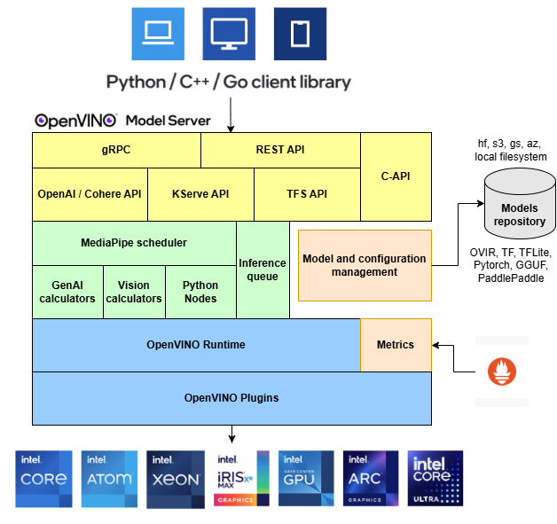

# OpenVINO&trade; Model Server

Model Server hosts models and makes them accessible to software components over standard network protocols: a client sends a request to the model server, which performs model inference and sends a response back to the client. Model Server offers many advantages for efficient model deployment: 
- Remote inference enables using lightweight clients with only the necessary functions to perform API calls to edge or cloud deployments.
- Applications are independent of the model framework, hardware device, and infrastructure.
- Client applications in any programming language that supports REST or gRPC calls can be used to run inference remotely on the model server.
- Clients require fewer updates since client libraries change very rarely.
- Model topology and weights are not exposed directly to client applications, making it easier to control access to the model.
- Ideal architecture for microservices-based applications and deployments in cloud environments – including Kubernetes and OpenShift clusters.
- Efficient resource utilization with horizontal and vertical inference scaling.

OpenVINO&trade; Model Server (OVMS) is a high-performance system for serving models. Implemented in C++ for scalability and optimized for deployment on Intel architectures, the model server uses the same architecture and API as [TensorFlow Serving](https://github.com/tensorflow/serving) and [KServe](https://github.com/kserve/kserve) while applying OpenVINO for inference execution. Inference service is provided via gRPC or REST API, making deploying new algorithms and AI experiments easy.

The models used by the server need to be stored locally or hosted remotely by object storage services. For more details, refer to [Preparing Model Repository](docs/models_repository.md) documentation. Model server works inside [Docker containers](docs/deploying_server.md), on [Bare Metal](docs/deploying_server.md), and in [Kubernetes environment](docs/deploying_server.md).
Start using OpenVINO Model Server with a fast-forward serving example from the [Quickstart guide](docs/ovms_quickstart.md) or explore [Model Server features](docs/features.md).

Read [release notes](https://github.com/openvinotoolkit/model_server/releases) to find out what’s new.

Key features: 
- support for multiple frameworks, such as Caffe, TensorFlow, MXNet, PaddlePaddle and ONNX
- online deployment of new [model versions](https://docs.openvino.ai/2023.0/ovms_docs_model_version_policy.html)
- [configuration updates in runtime](https://docs.openvino.ai/2023.0/ovms_docs_online_config_changes.html)
- support for AI accelerators, such as 
[Intel Movidius Myriad VPUs](https://docs.openvino.ai/2023.0/openvino_docs_OV_UG_supported_plugins_MYRIAD.html), 
[GPU](https://docs.openvino.ai/2023.0/openvino_docs_OV_UG_supported_plugins_GPU.html), and 
- works with Bare Metal Hosts as well as [Docker containers](https://docs.openvino.ai/2023.0/ovms_docs_deploying_server.html) 
- [model reshaping](https://docs.openvino.ai/2023.0/ovms_docs_shape_batch_layout.html) in runtime
- [directed Acyclic Graph Scheduler](https://docs.openvino.ai/2023.0/ovms_docs_dag.html) - connecting multiple models to deploy complex processing solutions and reducing data transfer overhead
- [custom nodes in DAG pipelines](https://docs.openvino.ai/2023.0/ovms_docs_custom_node_development.html) - allowing model inference and data transformations to be implemented with a custom node C/C++ dynamic library
- [serving stateful models](https://docs.openvino.ai/2023.0/ovms_docs_stateful_models.html) - models that operate on sequences of data and maintain their state between inference requests
- [binary format of the input data](https://docs.openvino.ai/2023.0/ovms_docs_binary_input.html) - data can be sent in JPEG or PNG formats to reduce traffic and offload the client applications
- [model caching](https://docs.openvino.ai/2023.0/ovms_docs_model_cache.html) - cache the models on first load and re-use models from cache on subsequent loads
- [metrics](https://docs.openvino.ai/2023.0/ovms_docs_metrics.html) - metrics compatible with Prometheus standard

**Note:** OVMS has been tested on RedHat, and Ubuntu. The latest publicly released docker images are based on Ubuntu and UBI.
They are stored in:
- [Dockerhub](https://hub.docker.com/r/openvino/model_server)
- [RedHat Ecosystem Catalog](https://catalog.redhat.com/software/containers/intel/openvino-model-server/607833052937385fc98515de)

## Run OpenVINO Model Server

A demonstration on how to use OpenVINO Model Server can be found in [our quick-start guide](https://docs.openvino.ai/2023.0/ovms_docs_quick_start_guide.html). 
For more information on using Model Server in various scenarios you can check the following guides:

* [Model repository configuration](https://docs.openvino.ai/2023.0/ovms_docs_models_repository.html)

* [Deployment options](https://docs.openvino.ai/2023.0/ovms_docs_deploying_server.html)

* [Performance tuning](https://docs.openvino.ai/2023.0/ovms_docs_performance_tuning.html)

* [Directed Acyclic Graph Scheduler](https://docs.openvino.ai/2023.0/ovms_docs_dag.html)

* [Custom nodes development](https://docs.openvino.ai/2023.0/ovms_docs_custom_node_development.html)

* [Serving stateful models](https://docs.openvino.ai/2023.0/ovms_docs_stateful_models.html)

* [Deploy using a Kubernetes Helm Chart](https://github.com/openvinotoolkit/operator/tree/main/helm-charts/ovms)

* [Deployment using Kubernetes Operator](https://operatorhub.io/operator/ovms-operator)

* [Using binary input data](https://docs.openvino.ai/2023.0/ovms_docs_binary_input.html)

## References

* [OpenVINO&trade;](https://software.intel.com/en-us/openvino-toolkit)

* [TensorFlow Serving](https://github.com/tensorflow/serving)

* [gRPC](https://grpc.io/)

* [RESTful API](https://restfulapi.net/)

* [Benchmarking results](https://docs.openvino.ai/2023.0/openvino_docs_performance_benchmarks_ovms.html)

* [Speed and Scale AI Inference Operations Across Multiple Architectures](https://techdecoded.intel.io/essentials/speed-and-scale-ai-inference-operations-across-multiple-architectures/?elq_cid=3646480_ts1607680426276&erpm_id=6470692_ts1607680426276) - webinar recording

* [What is new in OpenVINO Model Server C++](https://www.intel.com/content/www/us/en/artificial-intelligence/posts/whats-new-openvino-model-server.html)

* [Capital Health Improves Stroke Care with AI](https://www.intel.co.uk/content/www/uk/en/customer-spotlight/stories/capital-health-ai-customer-story.html) - use case example

## Contact

If you have a question, a feature request, or a bug report, feel free to submit a Github issue.

---
\* Other names and brands may be claimed as the property of others.
