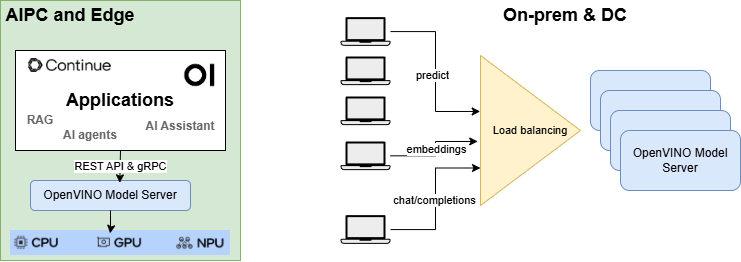

# OpenVINO&trade; Model Server

Model Server hosts models and makes them accessible to software components over standard network protocols: a client sends a request to the model server, which performs model inference and sends a response back to the client. Model Server offers many advantages for efficient model deployment:
- Remote inference enables using lightweight clients with only the necessary functions to perform API calls to edge or cloud deployments.
- Applications are independent of the model framework, hardware device, and infrastructure.
- Client applications in any programming language that supports REST or gRPC calls can be used to run inference remotely on the model server.
- Clients require fewer updates since client libraries change very rarely.
- Model topology and weights are not exposed directly to client applications, making it easier to control access to the model.
- Ideal architecture for microservices-based applications and deployments in cloud environments – including Kubernetes and OpenShift clusters.
- Efficient resource utilization with horizontal and vertical inference scaling.

OpenVINO&trade; Model Server (OVMS) is a high-performance system for serving models. Implemented in C++ for scalability and optimized for deployment on Intel architectures. It uses the [generative API](https://docs.openvino.ai/2025/model-server/ovms_docs_clients_genai.html) like OpenAI and Cohere, [KServe](https://docs.openvino.ai/2025/model-server/ovms_docs_clients_kfs.html) and [TensorFlow Serving](https://docs.openvino.ai/2025/model-server/ovms_docs_clients_tfs.html) and while applying OpenVINO for inference execution. Inference service is provided via gRPC or REST API, making deploying new algorithms and AI experiments easy.

The models used by the server can be stored locally, hosted remotely by object storage services or pulled from HuggingFace Hub. For more details, refer to [Preparing Model Repository](https://docs.openvino.ai/2025/model-server/ovms_docs_models_repository.html) and [Deployment](https://docs.openvino.ai/2025/model-server/ovms_docs_deploying_server.html) documentation.
Model server works inside Docker containers, Bare Metal and in Kubernetes environment.

Start using OpenVINO Model Server with a fast-forward serving example from the [QuickStart guide](https://docs.openvino.ai/2025/model-server/ovms_docs_quick_start_guide.html) or [LLM QuickStart guide](https://docs.openvino.ai/2025/model-server/ovms_docs_llm_quickstart.html).

Read [release notes](https://github.com/openvinotoolkit/model_server/releases) to find out what’s new.

### Key features:
- **[NEW]** [Image generation compatible with OpenAI API](https://docs.openvino.ai/2025/model-server/ovms_demos_image_generation.html)
- **[NEW]** Native Windows support. Check updated [deployment guide](https://docs.openvino.ai/2025/model-server/ovms_docs_deploying_server_baremetal.html)
- **[NEW]** [Text Embeddings compatible with OpenAI API](https://docs.openvino.ai/2025/model-server/ovms_demos_embeddings.html)
- **[NEW]** [Reranking compatible with Cohere API](https://docs.openvino.ai/2025/model-server/ovms_demos_rerank.html)
- **[NEW]** [Efficient Text Generation via OpenAI API](https://docs.openvino.ai/2025/model-server/ovms_demos_continuous_batching.html)
- [Python code execution](docs/python_support/reference.md)
- [gRPC streaming](docs/streaming_endpoints.md)
- [MediaPipe graphs serving](docs/mediapipe.md)
- Model management - including [model versioning](docs/model_version_policy.md) and [model updates in runtime](docs/online_config_changes.md)
- [Dynamic model inputs](docs/shape_batch_size_and_layout.md)
- [Directed Acyclic Graph Scheduler](docs/dag_scheduler.md) along with [custom nodes in DAG pipelines](docs/custom_node_development.md)
- [Metrics](docs/metrics.md) - metrics compatible with Prometheus standard
- Support for multiple frameworks, such as TensorFlow, PaddlePaddle and ONNX
- Support for [AI accelerators](./docs/accelerators.md)

Check full list of [features](./docs/features.md)

**Note:** OVMS has been tested on RedHat, Ubuntu and Windows. 
Public docker images are stored in:
- [Dockerhub](https://hub.docker.com/r/openvino/model_server)
- [RedHat Ecosystem Catalog](https://catalog.redhat.com/software/containers/intel/openvino-model-server/607833052937385fc98515de)
Binary packages for Linux and Windows are on [Github](https://github.com/openvinotoolkit/model_server/releases)

## Run OpenVINO Model Server

A demonstration on how to use OpenVINO Model Server can be found in our [quick-start guide for vision use case](docs/ovms_quickstart.md) and [LLM text generation](docs/llm/quickstart.md).

Check also other instructions:

[Preparing model repository](https://docs.openvino.ai/2025/model-server/ovms_docs_models_repository.html)

[Deployment](https://docs.openvino.ai/2025/model-server/ovms_docs_deploying_server.html)

[Writing client code](https://docs.openvino.ai/2025/model-server/ovms_docs_server_app.html)

[Demos](https://docs.openvino.ai/2025/model-server/ovms_docs_demos.html)

## References

* [OpenVINO&trade;](https://software.intel.com/en-us/openvino-toolkit)

* [RAG building blocks made easy and affordable with OpenVINO Model Server](https://medium.com/openvino-toolkit/rag-building-blocks-made-easy-and-affordable-with-openvino-model-server-e7b03da5012b)

* [Simplified Deployments with OpenVINO™ Model Server and TensorFlow Serving](https://community.intel.com/t5/Blogs/Tech-Innovation/Artificial-Intelligence-AI/Simplified-Deployments-with-OpenVINO-Model-Server-and-TensorFlow/post/1353218)

* [Simple deployment with KServe API](https://blog.openvino.ai/blog-posts/kserve-api)

* [Inference Scaling with OpenVINO™ Model Server in Kubernetes and OpenShift Clusters](https://www.intel.com/content/www/us/en/developer/articles/technical/deploy-openvino-in-openshift-and-kubernetes.html)

* [Benchmarking results](https://docs.openvino.ai/2025/about-openvino/performance-benchmarks.html)

## Contact

If you have a question, a feature request, or a bug report, feel free to submit a Github issue.

---
\* Other names and brands may be claimed as the property of others.
