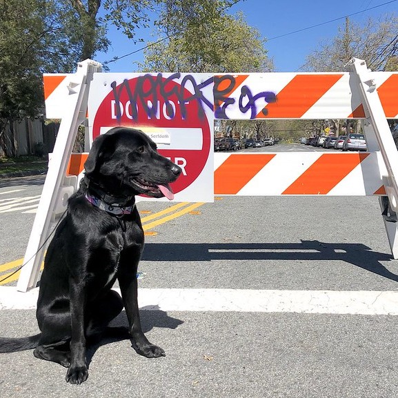

# Classification Example with a PaddlePaddle Model {#ovms_demo_using_paddlepaddle_model}

## Overview

This guide demonstrates how to run inference requests for PaddlePaddle model with OpenVINO Model Server.
As an example, we will use [MobileNetV3_large_x1_0_infer](https://paddle-imagenet-models-name.bj.bcebos.com/dygraph/inference/MobileNetV3_large_x1_0_infer.tar) to perform classification on an image.

## Prerequisites

**Model preparation**: Python 3.9 or higher with pip 

**Model Server deployment**: Installed Docker Engine or OVMS binary package according to the [baremetal deployment guide](../../../docs/deploying_server_baremetal.md)

## Preparing to Run

Clone the repository and enter classification_using_paddlepaddle_model directory

```console
git clone https://github.com/openvinotoolkit/model_server.git
cd model_server/demos/classification_using_paddlepaddle_model/python
```

You can download the model and prepare the workspace by just running:

```console
python download_model.py
```

## Deploying OVMS

Deploy OVMS with vehicles analysis pipeline using the following command:

```bash
docker run -p 9000:9000 -d -v ${PWD}/model:/models openvino/model_server --port 9000 --model_path /models --model_name mobilenet --shape "(1,3,-1,-1)"
```

On unix baremetal or Windows open another command window and run
```console
cd demos\classification_using_paddlepaddle_model\python
ovms --port 9000 --model_path model --model_name mobilenet --shape "(1,3,-1,-1)"
```

## Requesting the Service

Install python dependencies:
```console
pip3 install -r requirements.txt
``` 

Now you can run the client:
```console
python classification_using_paddlepaddle_model.py --grpc_port 9000 --image_input_path ../../common/static/images/coco.jpg
```
Exemplary result of running the demo:

```bash
probability: 0.74 => Labrador_retriever
probability: 0.05 => Staffordshire_bullterrier
probability: 0.05 => flat-coated_retriever
probability: 0.03 => kelpie
probability: 0.01 => schipperke
```

