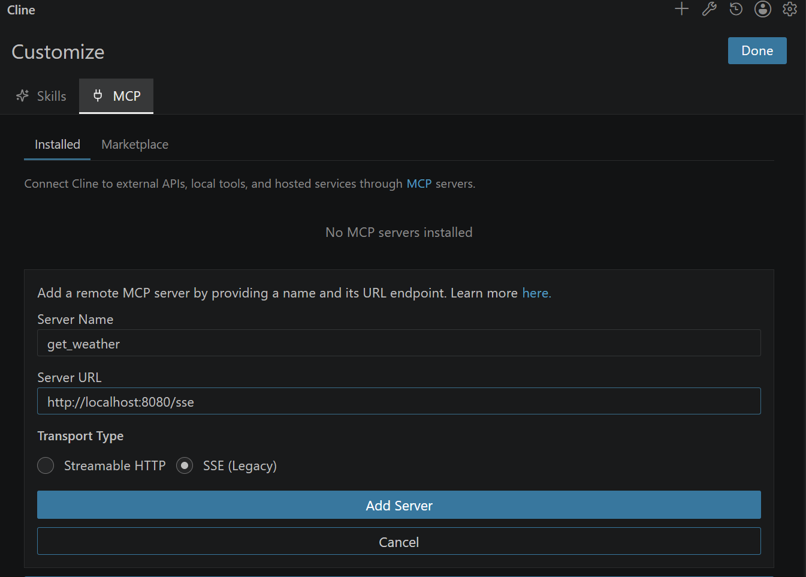
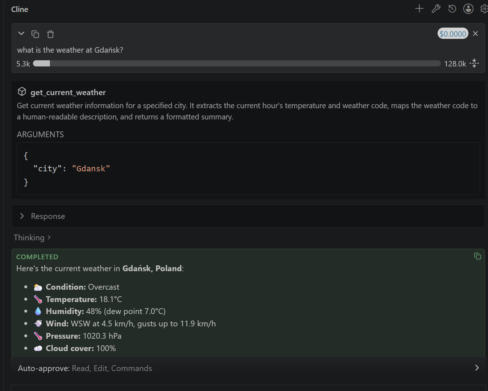

# Cline Coding Agent with OpenVINO Model Server {#ovms_demos_cline_integration}

## Intro
[Cline](https://cline.bot/) is an autonomous coding agent extension for Visual Studio Code. It can read and edit
files, run terminal commands, browse the web and call tools exposed by MCP servers, all driven by an LLM reachable
through an OpenAI-compatible API. This demo shows how to serve that LLM locally with OpenVINO Model Server (OVMS)
so that Cline runs entirely on your own machine, without sending code or prompts to an external service.


## Requirements
- Windows (standalone package) or Linux (Docker)
- Python installed (for model preparation only)
- Visual Studio Code with the [Cline extension](https://marketplace.visualstudio.com/items?itemName=saoudrizwan.claude-dev) installed
- Make sure that Cline works with `next` version (to change it go to Visual Studio Code settings and search `@ext:saoudrizwan.claude-dev`, check `next` option from dropdown) 
- Hardware: Intel Panther Lake (PTL, Core Ultra iGPU with large unified memory) or a discrete Intel Arc B70 GPU
  (dedicated VRAM). All of the suggested models below can run on either, though B70 gives better performance.
- Memory requirements depend on the chosen model (see table below)

## Suggested models

| Model  | Notes |
|---|---|
| `OpenVINO/Qwen3.8-27B-int8-ov` | Vision-capable (VLM); general purpose chat/agent model |
| `OpenVINO/Muse-Glimmer-30B-int4-ov` | Vision-capable (VLM); general purpose chat/agent model |
| `OpenVINO/LFM2.5-8B-A1B-int4-ov` | Smaller model, use when RAM/VRAM is limited or for quick, low-latency edits |

## Deploy OVMS

### Windows: deploying on bare metal

::::{tab-set}
:::{tab-item} OpenVINO/Qwen3.8-27B-int8-ov
:sync: OpenVINO/Qwen3.8-27B-int8-ov
```bat
mkdir c:\models
ovms --model_repository_path c:\models --source_model OpenVINO/Qwen3.8-27B-int8-ov --rest_port 8000 --model_name Qwen3.8-27B
```
:::

:::{tab-item} OpenVINO/Muse-Glimmer-30B-int4-ov
:sync: OpenVINO/Muse-Glimmer-30B-int4-ov
```bat
mkdir c:\models
ovms --model_repository_path c:\models --source_model OpenVINO/Muse-Glimmer-30B-int4-ov --rest_port 8000 --model_name Muse-Glimmer-30B
```
:::

:::{tab-item} OpenVINO/LFM2.5-8B-A1B-int4-ov
:sync: OpenVINO/LFM2.5-8B-A1B-int4-ov
```bat
mkdir c:\models
ovms --model_repository_path c:\models --source_model OpenVINO/LFM2.5-8B-A1B-int4-ov--rest_port 8000 --model_name LFM2.5-8B-A1B
```
> **Note:** Smaller MoE model, good fallback choice when RAM/VRAM is constrained or for quick low-latency edits.
:::
::::

### Linux: via Docker

Prepare enivronment:
```bash
mkdir -p ${HOME}/models
export GPU_ARGS=$(if ls /dev/dri/render* >/dev/null 2>&1; then echo "--device /dev/dri --group-add $(stat -c '%g' /dev/dri/render* | head -n1)"; fi) 

```

::::{tab-set}
:::{tab-item} OpenVINO/Qwen3.8-27B-int8-ov
:sync: OpenVINO/Qwen3.8-27B-int8-ov
```bash
docker run -d -p 8000:8000 --rm --user $(id -u):$(id -g) -v ${HOME}/models:/models/:rw ${GPU_ARGS} \
    openvino/model_server:latest-gpu \
    --model_repository_path /models --source_model OpenVINO/Qwen3.8-27B-int8-ov --rest_port 8000 --allowed_media_domains raw.githubusercontent.com --model_name Qwen3.8-27B
```
:::

:::{tab-item} OpenVINO/Muse-Glimmer-30B-int4-ov
:sync: OpenVINO/Muse-Glimmer-30B-int4-ov
```bash
docker run -d -p 8000:8000 --rm --user $(id -u):$(id -g) -v ${HOME}/models:/models/:rw ${GPU_ARGS} \
    openvino/model_server:latest-gpu \
    --model_repository_path /models --source_model OpenVINO/Muse-Glimmer-30B-int4-ov --rest_port 8000 --allowed_media_domains raw.githubusercontent.com --model_name Muse-Glimmer-30B
```
:::

:::{tab-item} OpenVINO/LFM2.5-8B-A1B-int4-ov
:sync: OpenVINO/LFM2.5-8B-A1B-int4-ov
```bash
docker run -d -p 8000:8000 --rm --user $(id -u):$(id -g) -v ${HOME}/models:/models/:rw ${GPU_ARGS} \
    openvino/model_server:latest-gpu \
    --model_repository_path /models --source_model OpenVINO/LFM2.5-8B-A1B-int4-ov --rest_port 8000 --model_name LFM2.5-8B-A1B
```
> **Note:** Smaller MoE model, good fallback choice when RAM/VRAM is constrained or for quick low-latency edits.
:::
::::

## Set Up Visual Studio Code

### Install the [Cline extension](https://marketplace.visualstudio.com/items?itemName=saoudrizwan.claude-dev)

### Point Cline at your OVMS instance

Open Cline's settings and add a new API provider configuration:
- **API Provider:** `OpenAI Compatible`
- **Base URL:** `http://localhost:8000/v1`
- **API Key:** any placeholder value, e.g. `unused` (OVMS does not require authentication by default)
- **Model ID:** the `--model_name` you used when starting OVMS, e.g. `Qwen3.8-27B`

Cline lets Plan mode and Act mode use different models/providers, so you can, for example, keep a small model like
`LFM2.5-8B-A1B` for quick Plan-mode questions and switch to `Qwen3.8-27B` (on B70) for Act-mode code changes. 
You can set that checking **Use different models for Plan and Act modes**.

## Usage examples

### Chat (Plan mode)
Ask a question about the codebase without letting Cline make changes:
```text
Explain how request validation works in this repository and list the files involved.
```

### Coding / agentic (Act mode)
Switch to Act mode and give Cline a task that requires editing files and running commands:
```text
Add a unit test for the `parseConfig` function and run the test suite to confirm it passes.
```
Cline will use its built-in tools (file read/write, terminal, browser) to make the change and verify it, relying on
OVMS's auto-detected tool-call format (derived from the model's chat template) to turn the model's tool calls into
these actions.

### Image input
With `Qwen3.8-27B-int8-ov` or `Muse-Glimmer-30B-int4-ov` deployed as a VLM, attach an
image to a Cline chat message, e.g.:
```text
[attach a screenshot of a UI bug]
What is wrong with this layout and which CSS file should I fix?
```
Image attachments are only available when the configured model declares `supportsImages` in Cline's model
configuration; enable it for the custom OpenAI-compatible model entry when using a vision-capable model like
`Qwen3.8-27B-int8-ov`.

## `reasoning_effort` usage

Cline exposes a reasoning-effort control that is sent as part of the chat
completion request. OVMS supports the OpenAI API `reasoning_effort` field natively, so this setting is honored
across all of the suggested models above, regardless of the underlying chat template.
It may be changed in Cline's **Settings** under **Reasonig Effort** section.

## MCP usage

Cline can call tools exposed by MCP servers, the same way it calls its own built-in tools. Reuse the weather MCP
server from the [AI Agents with MCP servers](../continuous_batching/agentic_ai/README.md) demo, or point Cline at any other MCP server, by clicking **Customize** icon and providing:
- **Server name**
- **Server URL**
- **Transport Type**



Once the server is registered and enabled, Act-mode prompts such as "What is the current weather in Tokyo?" will
make the OVMS-served model emit a tool call that Cline routes to the MCP server, exactly like the standalone agent
script in the MCP demo above, but from within the editor.



## Agentic and coding capabilities summary

- **Agentic**: Act mode combines the model's tool-calling ability (auto-detected by OVMS from the model's chat
  template) with Cline's built-in tools (terminal, file read/write, browser) and any MCP servers you register,
  letting Cline plan and execute multi-step tasks autonomously.
- **Coding**: Use `Qwen3.8-27B` on B70 for the strongest code generation/editing quality among the suggested models;
  fall back to `LFM2.5-8B-A1B` for lightweight or latency-sensitive edits.
- **MCP**: any MCP server (weather, filesystem, browser, etc.) becomes available to Cline the same way it is
  available to the OpenAI Agents SDK example in the agentic AI demo.
- **Image input**: use `Qwen3.8-27B` or `Muse-Glimmer-30B-int4-ov` for prompts that include screenshots or diagrams.

