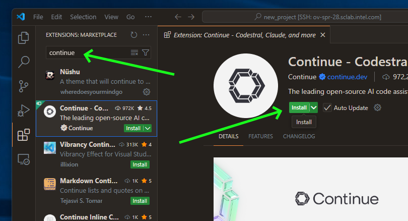
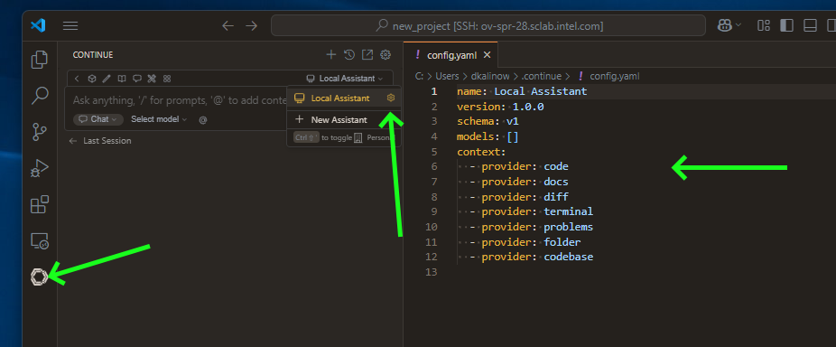
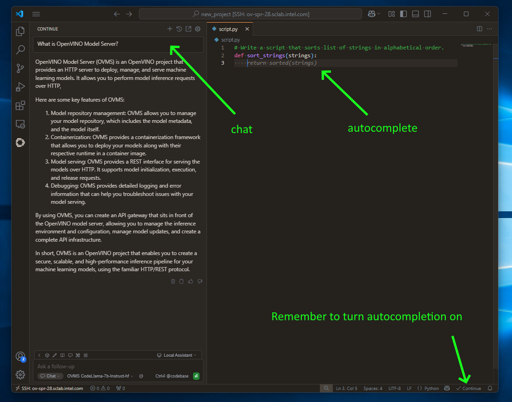
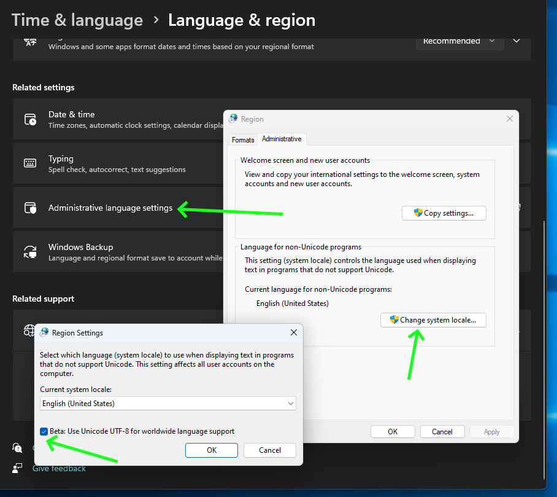

# Code Completion and Copilot served via OpenVINO Model Server

## Intro


## Prepare Code Chat/Edit Model 
We need to use medium size model in order to keep 50ms/word for human to feel the chat responsive.
This will work in streaming mode.

Prepare export model tool:
```bash
git clone https://github.com/openvinotoolkit/model_server --branch releases/2025/1
cd model_server/demos/common/export_models
python3.10 -m venv .venv
. .venv/bin/activate
pip install -r requirements.txt
mkdir models
```

Export `codellama/CodeLlama-7b-Instruct-hf`:
```bash
python export_model.py text_generation --source_model codellama/CodeLlama-7b-Instruct-hf --weight-format int4 --config_file_path models/config_all.json --model_repository_path models --cache_size 4 --overwrite_models
```

## Prepare Code Completion Model
For that we need smaller, lighter model that will produce code quicker than chat.
Code completion needs to be responsive enough in order not to wait for code to appear.
Code completion works in non-streaming mode.


Export `Qwen/Qwen2.5-Coder-1.5B`:
```bash
python export_model.py text_generation --source_model Qwen/Qwen2.5-Coder-1.5B --weight-format int4 --config_file_path models/config_all.json --model_repository_path models --cache_size 4 --overwrite_models
```

Examine that workspace is set up properly:

```bash
cat models/config_all.json
{
    "mediapipe_config_list": [
        {
            "name": "codellama/CodeLlama-7b-Instruct-hf",
            "base_path": "codellama/CodeLlama-7b-Instruct-hf"
        },
        {
            "name": "Qwen/Qwen2.5-Coder-1.5B",
            "base_path": "Qwen/Qwen2.5-Coder-1.5B"
        }
    ],
    "model_config_list": []
}
```

```bash
tree models
models
├── codellama
│   └── CodeLlama-7b-Instruct-hf
│       ├── config.json
│       ├── generation_config.json
│       ├── graph.pbtxt
│       ├── openvino_detokenizer.bin
│       ├── openvino_detokenizer.xml
│       ├── openvino_model.bin
│       ├── openvino_model.xml
│       ├── openvino_tokenizer.bin
│       ├── openvino_tokenizer.xml
│       ├── special_tokens_map.json
│       ├── tokenizer_config.json
│       ├── tokenizer.json
│       └── tokenizer.model
├── config_all.json
└── Qwen
    └── Qwen2.5-Coder-1.5B
        ├── added_tokens.json
        ├── config.json
        ├── generation_config.json
        ├── graph.pbtxt
        ├── merges.txt
        ├── openvino_detokenizer.bin
        ├── openvino_detokenizer.xml
        ├── openvino_model.bin
        ├── openvino_model.xml
        ├── openvino_tokenizer.bin
        ├── openvino_tokenizer.xml
        ├── special_tokens_map.json
        ├── tokenizer_config.json
        ├── tokenizer.json
        └── vocab.json

4 directories, 29 files
```

## Set Up Server
Run OpenVINO Model Server with both models at the same time:

```bash
docker run -d --rm -v $(pwd)/:/workspace/ -p 4444:4444 code_completion_ovms_rc2 --rest_port 4444 --config_path /workspace/models/config_all.json
```

## Set Up Visual Studio Code

### Download [Continue plugin](https://www.continue.dev/)



### Setup Local Assistant

We need to point Continue plugin to our OpenVINO Model Server.
Open configuration file:



Add both models. Specify roles:
```
name: Local Assistant
version: 1.0.0
schema: v1
models:
  -
    name: OVMS CodeLlama-7b-Instruct-hf
    provider: openai
    model: codellama/CodeLlama-7b-Instruct-hf
    apiKey: unused
    apiBase: http://ov-spr-28.sclab.intel.com:80/v3
    roles:
      - chat
      - edit
      - apply
  -
    name: OVMS Qwen2.5-Coder-1.5B
    provider: openai
    model: Qwen/Qwen2.5-Coder-1.5B
    apiKey: unused
    apiBase: http://ov-spr-28.sclab.intel.com:80/v3
    roles:
      - autocomplete
context:
  - provider: code
  - provider: docs
  - provider: diff
  - provider: terminal
  - provider: problems
  - provider: folder
  - provider: codebase
```

## Have Fun

- use chatting by clicking continue button in the left sidebar
- use `CTRL+I` to select and include source in chat message
- use `CTRL+L` to select and edit the source via chat request
- simply write code to see code autocompletion (NOTE: this is turned off by default)



## Outtro
- OVMS can be used as copilot service for any tool that uses OpenAI API
- Leverage unused server Intel CPU 
- Host own Copilot at home on desktop Intel CPU
- OpenVINO Model Server implements OpenAI API which allows to integrate with any tool that already uses ChatGPT


## Troubleshooting

OpenVINO Model Server uses python to apply chat templates. If you get an error during model loading, enable Unicode UTF-8 in your system settings:



### TODO
- rerank
- embeddings
- model context protocol?
