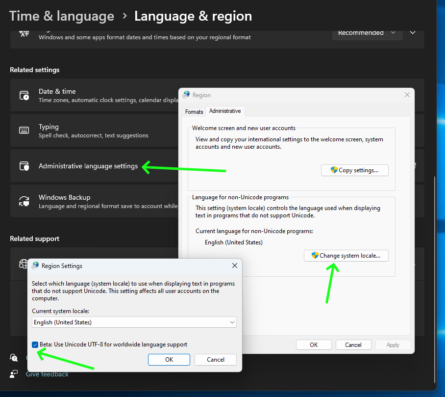

# Visual Studio Code Local Assistant {#ovms_demos_code_completion_vsc}

## Intro
With the rise of AI PC capabilities, hosting own Visual Studio code assistant is at your reach. In this demo, we will showcase how to deploy local LLM serving with OVMS and integrate it with Continue extension. It will employ iGPU or NPU acceleration.

# Requirements
- Windows (for standalone app) or Linux (using Docker)
- Python installed (for model preparation only)
- Intel Meteor Lake, Lunar Lake, Arrow Lake or newer Intel CPU.

## Prepare Code Chat/Edit Model 
We need to use medium size model in order to keep 50ms/word for human to feel the chat responsive.
This will work in streaming mode, meaning we will see the chat response/code diff generation slowly roll out in real-time.

Download export script, install its dependencies and create directory for the models:
```console
curl https://raw.githubusercontent.com/openvinotoolkit/model_server/refs/heads/releases/2025/1/demos/common/export_models/export_model.py -o export_model.py
pip3 install -r https://raw.githubusercontent.com/openvinotoolkit/model_server/refs/heads/releases/2025/1/demos/common/export_models/requirements.txt
mkdir models
```
> **Note:** The users in China need to set environment variable HF_ENDPOINT="https://hf-mirror.com" before running the export script to connect to the HF Hub.

Export `codellama/CodeLlama-7b-Instruct-hf`:
```console
python export_model.py text_generation --source_model codellama/CodeLlama-7b-Instruct-hf --weight-format int4 --config_file_path models/config_all.json --model_repository_path models --target_device GPU --cache_size 1 --overwrite_models
```

> **Note:** Use `--target_device NPU` for Intel NPU or omit this parameter to run on Intel CPU

## Prepare Code Completion Model
For this task we need smaller, lighter model that will produce code quicker than chat task.
Since we do not want to wait for the code to appear, we need to use smaller model. It should be responsive enough to generate multi-line blocks of code ahead of time as we type.
Code completion works in non-streaming, unary mode. Do not use instruct model, there is no chat involved in the process.

Export `Qwen/Qwen2.5-Coder-1.5B`:
```console
python export_model.py text_generation --source_model Qwen/Qwen2.5-Coder-1.5B --weight-format int4 --config_file_path models/config_all.json --model_repository_path models --target_device GPU --cache_size 1 --overwrite_models
```

> **Note:** Use `--target_device NPU` for Intel NPU or omit this parameter to run on Intel CPU

Examine that workspace is set up properly `models/config_all.json`:
```
{
    "mediapipe_config_list": [
        {
            "name": "codellama/CodeLlama-7b-Instruct-hf",
            "base_path": "codellama/CodeLlama-7b-Instruct-hf"
        },
        {
            "name": "Qwen/Qwen2.5-Coder-1.5B",
            "base_path": "Qwen/Qwen2.5-Coder-1.5B"
        }
    ],
    "model_config_list": []
}
```

```bash
tree models
models
├── codellama
│   └── CodeLlama-7b-Instruct-hf
│       ├── config.json
│       ├── generation_config.json
│       ├── graph.pbtxt
│       ├── openvino_detokenizer.bin
│       ├── openvino_detokenizer.xml
│       ├── openvino_model.bin
│       ├── openvino_model.xml
│       ├── openvino_tokenizer.bin
│       ├── openvino_tokenizer.xml
│       ├── special_tokens_map.json
│       ├── tokenizer_config.json
│       ├── tokenizer.json
│       └── tokenizer.model
├── config_all.json
└── Qwen
    └── Qwen2.5-Coder-1.5B
        ├── added_tokens.json
        ├── config.json
        ├── generation_config.json
        ├── graph.pbtxt
        ├── merges.txt
        ├── openvino_detokenizer.bin
        ├── openvino_detokenizer.xml
        ├── openvino_model.bin
        ├── openvino_model.xml
        ├── openvino_tokenizer.bin
        ├── openvino_tokenizer.xml
        ├── special_tokens_map.json
        ├── tokenizer_config.json
        ├── tokenizer.json
        └── vocab.json

4 directories, 29 files
```

## Set Up Server
Run OpenVINO Model Server with both models loaded at the same time:

### Windows: deploying on bare metal
Please refer to OpenVINO Model Server installation first: [link](../../docs/deploying_server_baremetal.md)

```bat
ovms --rest_port 8000 --config_path ./models/config_all.json
```

### Linux: via Docker
```bash
docker run -d --rm --device /dev/dri --group-add=$(stat -c "%g" /dev/dri/render* | head -n 1) -u $(id -u):$(id -g) \
  -p 8000:8000 -v $(pwd)/:/workspace/ openvino/model_server:2025.1 --rest_port 8000 --config_path /workspace/models/config_all.json
```

> **Note:** For Intel NPU use `--device /dev/accel --group-add=$(stat -c "%g" /dev/dri/render* | head -n 1)`

## Set Up Visual Studio Code

### Download [Continue plugin](https://www.continue.dev/)


### Setup Local Assistant

We need to point Continue plugin to our OpenVINO Model Server instance.
Open configuration file:


Add both models. Specify roles:
```
name: Local Assistant
version: 1.0.0
schema: v1
models:
  -
    name: OVMS CodeLlama-7b-Instruct-hf
    provider: openai
    model: codellama/CodeLlama-7b-Instruct-hf
    apiKey: unused
    apiBase: localhost:8000/v3
    roles:
      - chat
      - edit
      - apply
  -
    name: OVMS Qwen2.5-Coder-1.5B
    provider: openai
    model: Qwen/Qwen2.5-Coder-1.5B
    apiKey: unused
    apiBase: localhost:8000/v3
    roles:
      - autocomplete
context:
  - provider: code
  - provider: docs
  - provider: diff
  - provider: terminal
  - provider: problems
  - provider: folder
  - provider: codebase
```

## Have Fun

- to use chatting feature click continue button on the left sidebar
- use `CTRL+I` to select and include source in chat message
- use `CTRL+L` to select and edit the source via chat request
- simply write code to see code autocompletion (NOTE: this is turned off by default)


## Troubleshooting

OpenVINO Model Server uses python to apply chat templates. If you get an error during model loading, enable Unicode UTF-8 in your system settings:


