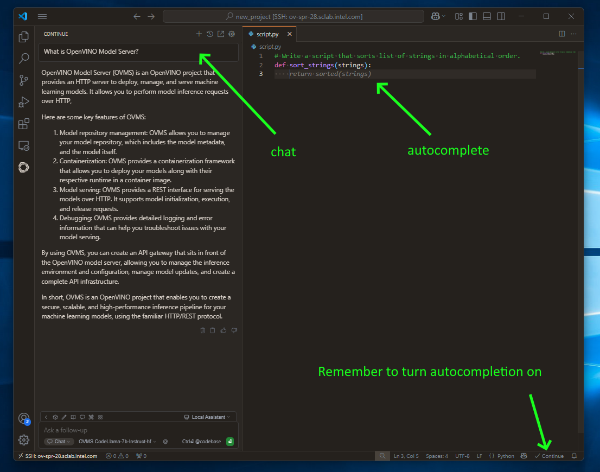

# Visual Studio Code Local Assistant {#ovms_demos_code_completion_vsc}

## Intro
With the rise of AI PC capabilities, hosting own Visual Studio code assistant is at your reach. In this demo, we will showcase how to deploy local LLM serving with OVMS and integrate it with Continue extension. It will employ GPU acceleration.

# Requirements
- Windows (for standalone app) or Linux (using Docker)
- Python installed (for model preparation only)
- Intel Meteor Lake, Lunar Lake, Arrow Lake or newer Intel CPU.

## Prepare Code Chat/Edit Model 
We need to use medium size model to get reliable responses but also to fit it to the available memory on the host or discrete GPU.

Download export script, install its dependencies and create directory for the models:
```console
curl https://raw.githubusercontent.com/openvinotoolkit/model_server/refs/heads/releases/2025/4/demos/common/export_models/export_model.py -o export_model.py
pip3 install -r https://raw.githubusercontent.com/openvinotoolkit/model_server/refs/heads/releases/2025/4/demos/common/export_models/requirements.txt
mkdir models
```
> **Note:** The users in China need to set environment variable HF_ENDPOINT="https://hf-mirror.com" before running the export script to connect to the HF Hub.

Pull and add the model on Linux:
::::{tab-set}
:::{tab-item} Qwen/Qwen3-Coder-30B-A3B-Instruct
:sync: Qwen/Qwen3-Coder-30B-A3B-Instruct
```bash
python export_model.py text_generation --source_model Qwen/Qwen3-Coder-30B-A3B-Instruct --weight-format int4 --config_file_path models/config_all.json --model_repository_path models --target_device GPU --tool_parser qwen3coder --overwrite_models
curl -L -o models/Qwen/Qwen3-Coder-30B-A3B-Instruct/chat_template.jinja https://raw.githubusercontent.com/openvinotoolkit/model_server/refs/heads/releases/2025/4/extras/chat_template_examples/chat_template_qwen3coder_instruct.jinja
```
> **Note:** This model requires ~150GB disk space and 60GB RAM for conversion. For deployment the model require ~16GB disk space and same amount of VRAM on the GPU.

:::
:::{tab-item} mistralai/Codestral-22B-v0.1 
:sync: mistralai/Codestral-22B-v0.1
```bash
python export_model.py text_generation --source_model mistralai/Codestral-22B-v0.1 --weight-format int4 --config_file_path models/config_all.json --model_repository_path models --target_device GPU --overwrite_models
curl -L -o models/mistralai/Codestral-22B-v0.1/chat_template.jinja https://raw.githubusercontent.com/vllm-project/vllm/refs/tags/v0.10.1.1/examples/tool_chat_template_mistral_parallel.jinja

```
> **Note:** This model requires ~12GB disk space and same amount of VRAM on the GPU for deployment. For conversion, the original model will be pulled and quantization will require the amount of RAM of the model size.

:::
:::{tab-item} OpenVINO/Qwen3-8B-int4-ov
:sync: OpenVINO/Qwen3-8B-int4-ov
```bash
docker run -d --rm --user $(id -u):$(id -g) -v $(pwd)/models:/models/:rw \
    openvino/model_server:weekly \
    --pull \
    --source_model OpenVINO/Qwen3-8B-int4-ov \
    --model_repository_path /models \
    --model_name OpenVINO/Qwen3-8B-int4-ov \
    --task text_generation

docker run -d --rm --user $(id -u):$(id -g) -v $(pwd)/models:/models/:rw \
    -e http_proxy=$http_proxy -e https_proxy=$https_proxy -e no_proxy=$no_proxy \
    openvino/model_server:weekly \
    --add_to_config \
    --config_path /models/config_all.json \
    --model_name OpenVINO/Qwen3-8B-int4-ov \
    --model_path OpenVINO/Qwen3-8B-int4-ov
```
:::
:::{tab-item} OpenVINO/Qwen3-4B-int4-ov
:sync: OpenVINO/Qwen3-4B-int4-ov
```bash
docker run -d --rm --user $(id -u):$(id -g) -v $(pwd)/models:/models/:rw \
    openvino/model_server:weekly \
    --pull \
    --source_model OpenVINO/Qwen3-4B-int4-ov \
    --model_repository_path /models \
    --model_name OpenVINO/Qwen3-4B-int4-ov \
    --task text_generation
    
docker run -d --rm --user $(id -u):$(id -g) -v $(pwd)/models:/models/:rw \
    -e http_proxy=$http_proxy -e https_proxy=$https_proxy -e no_proxy=$no_proxy \
    openvino/model_server:weekly \
    --add_to_config --config_path /models/config_all.json \
    --model_name OpenVINO/Qwen3-4B-int4-ov \
    --model_path OpenVINO/Qwen3-4B-int4-ov
```
:::
:::{tab-item} OpenVINO/Qwen2.5-Coder-3B-Instruct-int4-ov
:sync: OpenVINO/Qwen2.5-Coder-3B-Instruct-int4-ov
```bash
docker run -d --rm --user $(id -u):$(id -g) -v $(pwd)/models:/models/:rw \
    openvino/model_server:weekly \
    --pull \
    --source_model OpenVINO/Qwen2.5-Coder-3B-Instruct-int4-ov \
    --model_repository_path /models \
    --model_name OpenVINO/Qwen2.5-Coder-3B-Instruct-int4-ov \
    --task text_generation
    
docker run -d --rm --user $(id -u):$(id -g) -v $(pwd)/models:/models/:rw \
    -e http_proxy=$http_proxy -e https_proxy=$https_proxy -e no_proxy=$no_proxy \
    openvino/model_server:weekly \
    --add_to_config \
    --config_path /models/config_all.json \
    --model_name OpenVINO/Qwen2.5-Coder-3B-Instruct-int4-ov \
    --model_path OpenVINO/Qwen2.5-Coder-3B-Instruct-int4-ov
```

> **Note:** `Qwen2.5-Coder` models are available on [HuggingFace OpenVINO repository](https://huggingface.co/OpenVINO/models?search=qwen2.5-coder) in different sizes and precisions. It is possible to choose it for any use and hardware. 

:::
::::

Pull and add the model on Windows:
::::{tab-set}
:::{tab-item} Qwen/Qwen3-Coder-30B-A3B-Instruct
:sync: Qwen/Qwen3-Coder-30B-A3B-Instruct
```bat
python export_model.py text_generation --source_model Qwen/Qwen3-Coder-30B-A3B-Instruct --weight-format int8 --config_file_path models/config_all.json --model_repository_path models --target_device GPU --tool_parser qwen3coder --cache_size 2 --overwrite_models
curl -L -o models/Qwen/Qwen3-Coder-30B-A3B-Instruct/chat_template.jinja https://raw.githubusercontent.com/openvinotoolkit/model_server/refs/heads/releases/2025/4/extras/chat_template_examples/chat_template_qwen3coder_instruct.jinja

ovms.exe --add_to_config --config_path models/config_all.json --model_name Qwen/Qwen3-Coder-30B-A3B-Instruct --model_path Qwen/Qwen3-Coder-30B-A3B-Instruct
```
> **Note:** This model requires ~16GB disk space and same amount of VRAM on the GPU.

:::
:::{tab-item} mistralai/Codestral-22B-v0.1 
:sync: mistralai/Codestral-22B-v0.1
```bat
python export_model.py text_generation --source_model mistralai/Codestral-22B-v0.1 --weight-format int4 --config_file_path models/config_all.json --model_repository_path models --target_device GPU --cache_size 2 --overwrite_models
```
> **Note:** This model requires ~12GB disk space and same amount of VRAM on the GPU.

:::
:::{tab-item} OpenVINO/Qwen3-8B-int4-ov
:sync: OpenVINO/Qwen3-8B-int4-ov
```bat
ovms.exe --pull --source_model OpenVINO/Qwen3-8B-int4-ov --model_repository_path models --model_name OpenVINO/Qwen3-8B-int4-ov --target_device GPU --task text_generation

ovms.exe --add_to_config --config_path models/config_all.json --model_name OpenVINO/Qwen3-8B-int4-ov --model_path OpenVINO/Qwen3-8B-int4-ov
```
:::
:::{tab-item} OpenVINO/Qwen3-4B-int4-ov
:sync: OpenVINO/Qwen3-4B-int4-ov
```bat
ovms.exe --pull --source_model OpenVINO/Qwen3-4B-int4-ov --model_repository_path models --model_name OpenVINO/Qwen3-4B-int4-ov --target_device GPU --task text_generation
    
ovms.exe --add_to_config --config_path models/config_all.json --model_name OpenVINO/Qwen3-4B-int4-ov --model_path OpenVINO/Qwen3-4B-int4-ov
```
:::
:::{tab-item} OpenVINO/Qwen2.5-Coder-3B-Instruct-int4-ov
:sync: OpenVINO/Qwen2.5-Coder-3B-Instruct-int4-ov
```bat
ovms.exe --pull --source_model OpenVINO/Qwen2.5-Coder-3B-Instruct-int4-ov --model_repository_path models --model_name OpenVINO/Qwen2.5-Coder-3B-Instruct-int4-ov --target_device GPU --task text_generation

ovms.exe --add_to_config --config_path models/config_all.json --model_name OpenVINO/Qwen2.5-Coder-3B-Instruct-int4-ov --model_path OpenVINO/Qwen2.5-Coder-3B-Instruct-int4-ov
```

> **Note:** `Qwen2.5-Coder` models are available on [HuggingFace OpenVINO repository](https://huggingface.co/OpenVINO/models?search=qwen2.5-coder) in different sizes and precisions. It is possible to choose it for any use and hardware. 

:::
::::

## Set Up Server
Run OpenVINO Model Server with all downloaded models loaded at the same time:

::::{tab-set}
:::{tab-item} Windows
:sync: Windows
### Windows: deploying on bare metal
Please refer to OpenVINO Model Server installation first: [link](../../docs/deploying_server_baremetal.md)

```bat
ovms --rest_port 8000 --config_path ./models/config_all.json
```
:::
:::{tab-item} Linux CPU
:sync: Linux CPU
### Linux: via Docker with CPU
```bash
docker run -d --rm -u $(id -u):$(id -g) \
  -p 8000:8000 -v $(pwd)/:/workspace/ openvino/model_server:latest --rest_port 8000 --config_path /workspace/models/config_all.json
```
:::
:::{tab-item} Linux GPU
:sync: Linux GPU
### Linux: via Docker with GPU
```bash
docker run -d --rm --device /dev/dri --group-add=$(stat -c "%g" /dev/dri/render* | head -n 1) -u $(id -u):$(id -g) \
  -p 8000:8000 -v $(pwd)/:/workspace/ openvino/model_server:latest-gpu --rest_port 8000 --config_path /workspace/models/config_all.json
```
:::
::::

## Set Up Visual Studio Code

### Download [Continue plugin](https://www.continue.dev/)

> **Note:** This demo has been tested with Continue plugin version `1.2.11`. While newer versions should work, some configuration options may vary.


### Setup Local Assistant

We need to point Continue plugin to our OpenVINO Model Server instance.
Open configuration file:


Prepare a config:

::::{tab-set}
:::{tab-item} Qwen/Qwen3-Coder-30B-A3B-Instruct
:sync: Qwen/Qwen3-Coder-30B-A3B-Instruct
```
name: Local Assistant
version: 1.0.0
schema: v1
models:
  - name: OVMS Qwen/Qwen3-Coder-30B-A3B
    provider: openai
    model: Qwen/Qwen3-Coder-30B-A3B-Instruct
    apiKey: unused
    apiBase: http://localhost:8000/v3
    roles:
      - chat
      - edit
      - apply
      - autocomplete
    capabilities:
      - tool_use
    requestOptions:
      extraBodyProperties:
        chat_template_kwargs:
          enable_thinking: false

    autocompleteOptions:
      maxPromptTokens: 500
      debounceDelay: 124
      modelTimeout: 400
      onlyMyCode: true
      useCache: true
context:
  - provider: code
  - provider: docs
  - provider: diff
  - provider: terminal
  - provider: problems
  - provider: folder
  - provider: codebase
```
:::
:::{tab-item} mistralai/Codestral-22B-v0.1 
:sync: mistralai/Codestral-22B-v0.1
```
name: Local Assistant
version: 1.0.0
schema: v1
models:
  - name: OVMS mistralai/Codestral-22B-v0.1 
    provider: openai
    model: mistralai/Codestral-22B-v0.1 
    apiKey: unused
    apiBase: http://ov-spr-19.sclab.intel.com:8000/v3
    roles:
      - chat
      - edit
      - apply
      - autocomplete
    capabilities:
      - tool_use
    requestOptions:
      extraBodyProperties:
        chat_template_kwargs:
          enable_thinking: false

    autocompleteOptions:
      maxPromptTokens: 500
      debounceDelay: 124
      useCache: true
      onlyMyCode: true
      modelTimeout: 400
context:
  - provider: code
  - provider: docs
  - provider: diff
  - provider: terminal
  - provider: problems
  - provider: folder
  - provider: codebase
```
:::
:::{tab-item} OpenVINO/Qwen3-8B-int4-ov
:sync: OpenVINO/Qwen3-8B-int4-ov
```
name: Local Assistant
version: 1.0.0
schema: v1
models:
  - name: OVMS Qwen/Qwen3-8B
    provider: openai
    model: OpenVINO/Qwen3-8B-int4-ov
    apiKey: unused
    apiBase: http://localhost:8000/v3
    roles:
      - chat
      - edit
      - apply
      - autocomplete
    capabilities:
      - tool_use
    requestOptions:
      extraBodyProperties:
        chat_template_kwargs:
          enable_thinking: false

    autocompleteOptions:
      maxPromptTokens: 500
      debounceDelay: 124
      useCache: true
      onlyMyCode: true
      modelTimeout: 1000
context:
  - provider: code
  - provider: docs
  - provider: diff
  - provider: terminal
  - provider: problems
  - provider: folder
  - provider: codebase
```
:::
:::{tab-item} OpenVINO/Qwen3-4B-int4-ov
:sync: OpenVINO/Qwen3-4B-int4-ov
```
name: Local Assistant
version: 1.0.0
schema: v1
models:
  - name: OVMS OpenVINO/Qwen3-4B
    provider: openai
    model: OpenVINO/Qwen3-4B-int4-ov
    apiKey: unused
    apiBase: http://localhost:8000/v3
    roles:
      - chat
      - edit
      - apply
      - autocomplete
    capabilities:
      - tool_use
    requestOptions:
      extraBodyProperties:
        chat_template_kwargs:
          enable_thinking: false

    autocompleteOptions:
      maxPromptTokens: 500
      debounceDelay: 124
      useCache: true
      onlyMyCode: true
      modelTimeout: 1000
context:
  - provider: code
  - provider: docs
  - provider: diff
  - provider: terminal
  - provider: problems
  - provider: folder
  - provider: codebase
```
:::
:::{tab-item} OpenVINO/Qwen2.5-Coder-3B-Instruct-int4-ov
:sync: OpenVINO/Qwen2.5-Coder-3B-Instruct-int4-ov
```
name: Local Assistant
version: 1.0.0
schema: v1
models:
  - name: OVMS OpenVINO/Qwen2.5-Coder-3B-Instruct-int4-ov
    provider: openai
    model: OpenVINO/Qwen2.5-Coder-3B-Instruct-int4-ov
    apiKey: unused
    apiBase: http://localhost:8000/v3
    roles:
      - chat
      - edit
      - apply
      - autocomplete
    capabilities:
      - tool_use
    requestOptions:
      extraBodyProperties:
        chat_template_kwargs:
          enable_thinking: false
    autocompleteOptions:
      maxPromptTokens: 500
      debounceDelay: 124
      useCache: true
      onlyMyCode: true
      modelTimeout: 700
context:
  - provider: code
  - provider: docs
  - provider: diff
  - provider: terminal
  - provider: problems
  - provider: folder
  - provider: codebase
```
:::
::::

> **Note:** For more information about this config, see [configuration reference](https://docs.continue.dev/reference#models).

## Chatting, code editing and autocompletion in action

- to use chatting feature click continue button on the left sidebar
- use `CTRL+I` to select and include source in chat message
- use `CTRL+L` to select and edit the source via chat request
- simply write code to see code autocompletion (NOTE: this is turned off by default)




## AI Agents in action
Continue.dev plugin is shipped with multiple built-in tools. For full list please [visit Continue documentation](https://docs.continue.dev/features/agent/how-it-works#what-tools-are-available-in-plan-mode-read-only).

To use them, select Agent Mode:


Select model that support tool calling from model list:


Example use cases for tools:

* Run terminal commands


* Look up web links


* Search files


