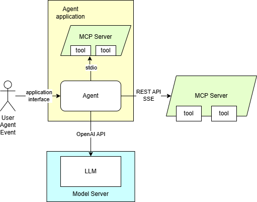

# Agentic AI with OpenVINO Model Server {#ovms_demos_continuous_batching_agent}

OpenVINO Model Server can be used to serve language models for AI Agents. It supports the usage of tools in the context of content generation.
It can be integrated with MCP servers and AI agent frameworks. 
You can learn more about [tools calling based on OpenAI API](https://platform.openai.com/docs/guides/function-calling?api-mode=responses)

Here are presented required steps to deploy language models trained for tools support. The diagram depicting the demo setup is below:


The application employing OpenAI agent SDK is using MCP server. It is equipped with a set of tools to providing context for the content generation.
The tools can also be used for automation purposes based on input in text format.  

## Export LLM model
Currently supported models:
- Qwen/Qwen3-8B
- meta-llama/Llama-3.1-8B-Instruct
- NousResearch/Hermes-3-Llama-3.1-8B
- microsoft/Phi-4-mini-instruct

The model chat template defines how the conversation with tools and tools schema should be embedded in the prompt. 
The model response with tool call follow a specific syntax which is process by a response parser. The export tool allows choosing which template and response parser should be applied.

Download export script, install it's dependencies and create directory for the models:
```console
curl https://raw.githubusercontent.com/openvinotoolkit/model_server/refs/heads/releases/2025/2/demos/common/export_models/export_model.py -o export_model.py
pip3 install -r https://raw.githubusercontent.com/openvinotoolkit/model_server/refs/heads/releases/2025/2/demos/common/export_models/requirements.txt
mkdir models
```
Run `export_model.py` script to download and quantize the model:

> **Note:** The users in China need to set environment variable HF_ENDPOINT="https://hf-mirror.com" before running the export script to connect to the HF Hub.

::::{tab-set}

:::{tab-item} CPU
```console
python export_model.py text_generation --source_model Qwen/Qwen3-8B --weight-format int8 --config_file_path models/config.json --model_repository_path models --tools_model_type qwen3 --overwrite_models --enable_prefix_caching
```
:::

:::{tab-item} GPU
```console
python export_model.py text_generation --source_model Qwen/Qwen3-8B --weight-format int8 --config_file_path models/config.json --model_repository_path models --tools_model_type qwen3 --target_device GPU --enable_prefix_caching --cache_size 2
```
:::

::::

You can use similar commands for different models. Change the source_model and the tools_model_type (note that as of today the following types as available: `[phi4, llama3, qwen3, hermes3]`).
> **Note:** The tuned chat template will be copied to the model folder as template.jinja and the response parser will be set in the graph.pbtxt


## Start OVMS

Starting the model server is identical like with other demos with generative endpoints:

**Deploying with Docker**

Select deployment option depending on how you prepared models in the previous step.

::::{tab-set}

:::{tab-item} CPU

Running this command starts the container with CPU only target device:
```bash
docker run -d --rm -p 8000:8000 -v $(pwd)/models:/models:ro openvino/model_server:2025.2.1 --rest_port 8000 --model_path /models/Qwen/Qwen3-8B --model_name Qwen/Qwen3-8B
```
:::

:::{tab-item} GPU

In case you want to use GPU device to run the generation, add extra docker parameters `--device /dev/dri --group-add=$(stat -c "%g" /dev/dri/render* | head -n 1)`
to `docker run` command, use the image with GPU support. Export the models with precision matching the GPU capacity and adjust pipeline configuration.
It can be applied using the commands below:
```bash
docker run -d --rm -p 8000:8000 --device /dev/dri --group-add=$(stat -c "%g" /dev/dri/render* | head -n 1) -v $(pwd)/models:/models:ro openvino/model_server:2025.2.1-gpu \
--rest_port 8000 --model_path /models/Qwen/Qwen3-8B --model_name Qwen/Qwen3-8B
```
:::

::::

**Deploying on Bare Metal**

Assuming you have unpacked model server package with python enabled version, make sure to:

- **On Windows**: run `setupvars` script
- **On Linux**: set `LD_LIBRARY_PATH` and `PATH` environment variables

as mentioned in [deployment guide](../../../docs/deploying_server_baremetal.md), in every new shell that will start OpenVINO Model Server.

Depending on how you prepared models in the first step of this demo, they are deployed to either CPU or GPU (it's defined in `graph.pbtxt`). If you run on GPU, make sure to have appropriate drivers installed, so the device is accessible for the model server.

```bat
ovms --rest_port 8000 --model_path models/Qwen/Qwen3-8B --model_name Qwen/Qwen3-8B
```

## Start MCP server with SSE interface

### Linux
```bash
git clone https://github.com/isdaniel/mcp_weather_server
cd mcp_weather_server
docker build . -t mcp_weather_server
docker run -d -v $(pwd)/src/mcp_weather_server:/mcp_weather_server  -p 8080:8080 mcp_weather_server bash -c ". .venv/bin/activate ; python /mcp_weather_server/server-see.py"
```

> **Note:** On Windows the MCP server will be demonstrated as an instance with stdio interface inside the agent application

## Start the agent

Install the application requirements

```console
curl https://raw.githubusercontent.com/openvinotoolkit/model_server/releases/2025/2/demos/continuous_batching/agentic_ai/openai_agent.py -o openai_agent.py
pip install -r https://raw.githubusercontent.com/openvinotoolkit/model_server/releases/2025/2/demos/continuous_batching/agentic_ai/requirements.txt
```
Make sure nodejs and npx are installed. On ubuntu it would require `sudo apt install nodejs npm`. On windows, visit https://nodejs.org/en/download. 

Run the agentic application
```console
python openai_agent.py --query "What is the weather now in Tokyo?" --model Qwen/Qwen3-8B --base-url http://localhost:8000/v3 --mcp-server-url http://localhost:8080/sse
```
```
Using SSE weather MCP  server
Secure MCP Filesystem Server running on stdio
Allowed directories: [ '/tmp' ]

Running: What is the weather now in New York?
The current weather in New York, based on the latest available data from the response, is **Clear sky** with a temperature of **22°C** on **Wednesday, June 11th, 2025**. 

Note: The provided data includes a forecast from May 29th to June 11th, 2025. If you need real-time updates, ensure the data source is current.
```
```console
python openai_agent.py --query "List the files in folder /root." --model Qwen/Qwen3-8B --base-url http://localhost:8000/v3 --mcp-server-url http://localhost:8080/sse
```
```
Using SSE weather MCP  server
Secure MCP Filesystem Server running on stdio
Allowed directories: [ '/tmp' ]

Running: List the files in folder /root.
The directory `/root` is not accessible as it's outside the allowed directories. The only permitted path is `/tmp`. Would you like me to help you with files or directories within `/tmp` instead?
```

> **Note:** The tool checking the weather forecast in the demo is making a remote call to a REST API server. Make sure you have internet connection and proxy configured while running the agent. 