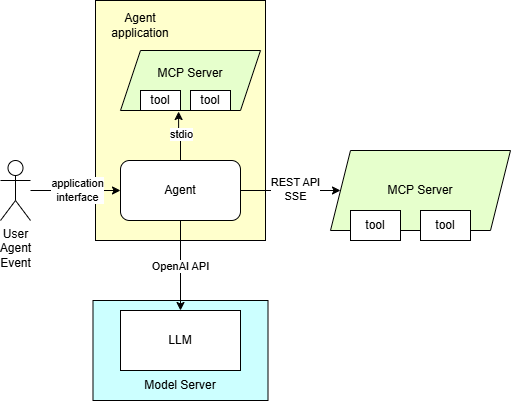

# Agentic AI with OpenVINO Model Server {#ovms_demos_continuous_batching_agent}

OpenVINO Model Server can be used to serve language models for AI Agents. It supports the usage of tools in the context of content generation.
It can be integrated with MCP servers and AI agent frameworks. 
You can learn more about [tools calling based on OpenAI API](https://platform.openai.com/docs/guides/function-calling?api-mode=responses)

Here are presented required steps to deploy language models trained for tools support. The diagram depicting the demo setup is below:


The application employing OpenAI agent SDK is using MCP server. It is equipped with a set of tools to providing context for the content generation.
The tools can also be used for automation purposes based on input in text format.  


## Start MCP server with SSE interface

### Linux
```bash
git clone https://github.com/isdaniel/mcp_weather_server
cd mcp_weather_server && git checkout v0.5.0
docker build -t mcp-weather-server:sse .
docker run -d -p 8080:8080 -e PORT=8080 mcp-weather-server:sse uv run python -m mcp_weather_server --mode sse
```

### Windows
On Windows the MCP server will be demonstrated as an instance with stdio interface inside the agent application. 
File system MCP server requires NodeJS and npx, visit https://nodejs.org/en/download. The weather MCP should be installed as python package:
```bat 
pip install python-dateutil mcp_weather_server
```

## Start the agent

Install the application requirements

```console
curl https://raw.githubusercontent.com/openvinotoolkit/model_server/main/demos/continuous_batching/agentic_ai/openai_agent.py -O -L
pip install openai-agents openai
mkdir models
```

## Start OVMS

This deployment procedure assumes the model was pulled or exported using the procedure above. The exception are models from OpenVINO organization if they support tools correctly with the default template like "OpenVINO/Qwen3-8B-int4-ov" - they can be deployed in a single command pulling and staring the server.


### Deploying on Windows with GPU
Assuming you have unpacked model server package with python enabled version, make sure to run `setupvars` script
as mentioned in [deployment guide](../../../docs/deploying_server_baremetal.md), in every new shell that will start OpenVINO Model Server.

::::{tab-set}
:::{tab-item} Qwen3-8B
:sync: Qwen3-8B
Pull and start OVMS:
```bat
ovms.exe --rest_port 8000 --source_model OpenVINO/Qwen3-8B-int4-ov --model_repository_path models --tool_parser hermes3 --target_device GPU --task text_generation --cache_dir .cache
```

Use MCP server:
```bat
python openai_agent.py --query "What is the current weather in Tokyo?" --model OpenVINO/Qwen3-8B-int4-ov --base-url http://localhost:8000/v3 --mcp-server-url http://localhost:8080/sse --mcp-server weather
```

Exemplary output:
```text
The current weather in Tokyo is partly cloudy with a temperature of 8.4°C. The relative humidity is at 91%, and the dew point is 7.0°C. The wind is blowing from the SSE at 4.2 km/h, with gusts up to 15.5 km/h. The atmospheric pressure is 1016.0 hPa, with 72% cloud cover. Visibility is 24.1 km.
```
:::
:::{tab-item} Qwen3-4B
:sync: Qwen3-4B
Pull and start OVMS:
```bat
ovms.exe --rest_port 8000 --source_model OpenVINO/Qwen3-4B-int4-ov --model_repository_path models --tool_parser hermes3 --target_device GPU --task text_generation --cache_dir .cache
```

Use MCP server:
```bat
python openai_agent.py --query "What is the current weather in Tokyo?" --model OpenVINO/Qwen3-4B-int4-ov --base-url http://localhost:8000/v3 --mcp-server-url http://localhost:8080/sse --mcp-server weather
```

Exemplary output:
```text
The current weather in Tokyo is partly cloudy with a temperature of 8.4°C. The relative humidity is at 91%, and the dew point is 7.0°C. The wind is coming from the SSE at 4.2 km/h with gusts up to 15.5 km/h. The atmospheric pressure is 1016.0 hPa, with 72% cloud cover. Visibility is 24.1 km.
```
:::
:::{tab-item} Phi-4-mini-instruct
:sync: Phi-4-mini-instruct
Pull and start OVMS:
```bat
ovms.exe --rest_port 8000 --source_model OpenVINO/Phi-4-mini-instruct-int4-ov --model_repository_path models --tool_parser phi4 --target_device GPU --task text_generation --enable_tool_guided_generation true --cache_dir .cache --max_num_batched_tokens 99999
```

Use MCP server:
```bat
python openai_agent.py --query "What is the current weather in Tokyo?" --model OpenVINO/Phi-4-mini-instruct-int4-ov --base-url http://localhost:8000/v3 --mcp-server-url http://localhost:8080/sse --mcp-server weather --tool-choice required
```

Exemplary output:
```text
The current weather in Tokyo is partly cloudy with a temperature of 8.4°C. The relative humidity is quite high at 91%, and the dew point is at 7.0°C, indicating that the air is moist. Winds are coming from the southeast at a gentle breeze of 4.2 km/h, with gusts reaching up to 15.5 km/h. The atmospheric pressure is steady at 1016.0 hPa, and cloud cover is at 72%. Visibility is excellent at 24.1 km, suggesting clear conditions for most outdoor activities.
```
:::
:::{tab-item} Qwen3-Coder-30B-A3B-Instruct
:sync: Qwen3-Coder-30B-A3B-Instruct
Pull and start OVMS:
```bat
set MOE_USE_MICRO_GEMM_PREFILL=0
ovms.exe --rest_port 8000 --source_model OpenVINO/Qwen3-Coder-30B-A3B-Instruct-int4-ov --model_repository_path models --tool_parser qwen3coder --target_device GPU --task text_generation --cache_dir .cache
```

Use MCP server:
```bat
python openai_agent.py --query "What is the current weather in Tokyo?" --model OpenVINO/Qwen3-Coder-30B-A3B-Instruct-int4-ov --base-url http://localhost:8000/v3 --mcp-server-url http://localhost:8080/sse --mcp-server weather
```

Exemplary output:
```text
The current weather in Tokyo is mainly clear with a temperature of 8.7°C. The relative humidity is at 89%, and the dew point is 6.9°C. The wind is blowing from the SSE at 5.0 km/h, with gusts reaching up to 22.0 km/h. The atmospheric pressure is 1014.4 hPa, and there is 34% cloud cover. The visibility is 24.1 km.
```
:::
:::{tab-item} gpt-oss-20b
:sync: gpt-oss-20b
Pull and start OVMS:
```bat
ovms.exe --rest_port 8000 --source_model OpenVINO/gpt-oss-20b-int4-ov --model_repository_path models --tool_parser gptoss --reasoning_parser gptoss --task text_generation --target_device GPU
```
> **Note:** Continuous batching and paged attention are supported for GPT‑OSS. However, when deployed on GPU, the model may experience reduced accuracy under high‑concurrency workloads. This issue will be resolved in version 2026.1 and in the upcoming weekly release. CPU execution is not affected.

Use MCP server:
```bat
python openai_agent.py --query "What is the current weather in Tokyo?" --model OpenVINO/gpt-oss-20b-int4-ov --base-url http://localhost:8000/v3 --mcp-server-url http://localhost:8080/sse --mcp-server weather
```

Exemplary output:
```text
**Tokyo – Current Weather**

- **Condition:** Mainly clear
- **Temperature:** 8.7 °C
- **Humidity:** 89 %
- **Dew Point:** 6.9 °C
- **Wind:** SSE at 5 km/h (gusts up to 22 km/h)
- **Pressure:** 1014.4 hPa
- **Cloud Cover:** 34 %
- **Visibility:** 24.1 km

Let me know if you’d like more details or a forecast!
```

:::
::::

### Deploying on Windows with NPU

::::{tab-set}
:::{tab-item} Qwen3-8B
:sync: Qwen3-8B
Pull and start OVMS:
```bat
ovms.exe --rest_port 8000 --source_model OpenVINO/Qwen3-8B-int4-cw-ov --model_repository_path models --tool_parser hermes3 --target_device NPU --task text_generation --cache_dir .cache --max_prompt_len 8000
```

Use MCP server:
```bat
python openai_agent.py --query "What is the current weather in Tokyo?" --model OpenVINO/Qwen3-8B-int4-cw-ov --base-url http://localhost:8000/v3 --mcp-server-url http://localhost:8080/sse --mcp-server weather
```

Exemplary output:
```text
The current weather in Tokyo is mainly clear with a temperature of 11.5°C. The relative humidity is at 82%, and the dew point is 8.5°C. The wind is blowing from the S at 6.8 km/h, with gusts up to 13.7 km/h. The atmospheric pressure is 1017.1 hPa, and there is 21% cloud cover. Visibility is 24.1 km.
```
:::
:::{tab-item} Qwen3-4B
:sync: Qwen3-4B
Pull and start OVMS:
```bat
ovms.exe --rest_port 8000 --source_model FluidInference/qwen3-4b-int4-ov-npu --model_repository_path models --tool_parser hermes3 --target_device NPU --task text_generation --cache_dir .cache --max_prompt_len 8000
```

Use MCP server:
```bat
python openai_agent.py --query "What is the current weather in Tokyo?" --model OpenVINO/Qwen3-8B-int4-cw-ov --base-url http://localhost:8000/v3 --mcp-server-url http://localhost:8080/sse --mcp-server weather
```

Exemplary output:
```text
The current weather in Tokyo is mainly clear, with a temperature of 11.5°C. The relative humidity is at 82%, and the dew point is at 8.5°C. There is a wind blowing from the south at 6.8 km/h, with gusts up to 13.7 km/h. The atmospheric pressure is 1017.1 hPa, and there is 21% cloud cover. The visibility is 24.1 km.
```
:::
::::

> **Note:** Setting the `--max_prompt_len` parameter too high may lead to performance degradation. It is recommended to use the smallest value that meets your requirements.

### Deploying in a docker container on CPU

::::{tab-set}
:::{tab-item} Qwen3-8B
:sync: Qwen3-8B
Pull and start OVMS:
```bash
docker run -d --user $(id -u):$(id -g) --rm -p 8000:8000 -v $(pwd)/models:/models openvino/model_server:weekly \
--rest_port 8000 --model_repository_path models --source_model OpenVINO/Qwen3-8B-int4-ov --tool_parser hermes3 --task text_generation
```

Use MCP server:
```bash
python openai_agent.py --query "What is the current weather in Tokyo?" --model OpenVINO/Qwen3-8B-int4-ov --base-url http://localhost:8000/v3 --mcp-server-url http://localhost:8080/sse --mcp-server weather
```

Exemplary output:
```text
The current weather in Tokyo is clear sky with a temperature of 8.3°C (feels like 5.0°C). The relative humidity is at 50%, and the dew point is -1.5°C. Wind is blowing from the NNW at 6.8 km/h with gusts up to 21.2 km/h. The atmospheric pressure is 1021.5 hPa with 0% cloud cover, and visibility is 24.1 km.
```
:::
:::{tab-item} Qwen3-4B
:sync: Qwen3-4B
Pull and start OVMS:
```bash
docker run -d --user $(id -u):$(id -g) --rm -p 8000:8000 -v $(pwd)/models:/models openvino/model_server:weekly \
--rest_port 8000 --model_repository_path models --source_model OpenVINO/Qwen3-4B-int4-ov --tool_parser hermes3 --task text_generation
```

Use MCP server:
```bash
python openai_agent.py --query "What is the current weather in Tokyo?" --model OpenVINO/Qwen3-4B-int4-ov --base-url http://localhost:8000/v3 --mcp-server-url http://localhost:8080/sse --mcp-server weather
```

Exemplary output:
```text
The current weather in Tokyo is clear with a temperature of 8.3°C (feels like 5.0°C). The relative humidity is at 50%, and the dew point is at -1.5°C. Winds are coming from the NNW at 6.8 km/h with gusts up to 21.2 km/h. The atmospheric pressure is 1021.5 hPa with 0% cloud cover. Visibility is 24.1 km.
```
:::
:::{tab-item} Phi-4-mini-instruct
:sync: Phi-4-mini-instruct
Pull and start OVMS:
```bash
docker run -d --user $(id -u):$(id -g) --rm -p 8000:8000 -v $(pwd)/models:/models openvino/model_server:weekly \
--rest_port 8000 --model_repository_path models --source_model OpenVINO/Phi-4-mini-instruct-int4-ov --tool_parser phi4 --task text_generation
```

Use MCP server:
```bash
python openai_agent.py --query "What is the current weather in Tokyo?" --model OpenVINO/Phi-4-mini-instruct-int4-ov --base-url http://localhost:8000/v3 --mcp-server-url http://localhost:8080/sse --mcp-server weather --tool-choice required
```

Exemplary output:
```text
The current weather in Tokyo is mostly clear with a temperature of 12.4°C. The relative humidity is at 68%, and the dew point is at 6.7°C. Winds are coming from the SSE at a speed of 5.3 km/h, with gusts reaching up to 25.2 km/h. The atmospheric pressure is 1017.9 hPa, and there is a 23% cloud cover. Visibility is good at 24.1 km.
```
:::
:::{tab-item} Qwen3-Coder-30B-A3B-Instruct
:sync: Qwen3-Coder-30B-A3B-Instruct
Pull and start OVMS:
```bash
docker run -d --user $(id -u):$(id -g) --rm -e MOE_USE_MICRO_GEMM_PREFILL=0 -p 8000:8000 -v $(pwd)/models:/models openvino/model_server:weekly \
--rest_port 8000 --source_model OpenVINO/Qwen3-Coder-30B-A3B-Instruct-int4-ov --model_repository_path models --tool_parser qwen3coder --task text_generation
```

Use MCP server:
```bash
python openai_agent.py --query "What is the current weather in Tokyo?" --model OpenVINO/Qwen3-Coder-30B-A3B-Instruct-int4-ov --base-url http://localhost:8000/v3 --mcp-server-url http://localhost:8080/sse --mcp-server weather
```

Exemplary output:
```text
The current weather in Tokyo is as follows:
- **Condition**: Mainly clear
- **Temperature**: 11.8°C
- **Relative Humidity**: 78%
- **Dew Point**: 8.1°C
- **Wind**: Blowing from the SSE at 6.4 km/h with gusts up to 9.7 km/h
- **Atmospheric Pressure**: 1017.5 hPa
- **Cloud Cover**: 22%
- **Visibility**: 24.1 km
- **UV Index**: Not specified

It's a relatively pleasant day with clear skies and mild temperatures.
```
:::
::::


### Deploying in a docker container on GPU

In case you want to use GPU device to run the generation, add extra docker parameters `--device /dev/dri --group-add=$(stat -c "%g" /dev/dri/render* | head -n 1)`
to `docker run` command, use the image with GPU support. Export the models with precision matching the GPU capacity and adjust pipeline configuration.
It can be applied using the commands below:

::::{tab-set}
:::{tab-item} Qwen3-8B
:sync: Qwen3-8B
Pull and start OVMS:
```bash
docker run -d --user $(id -u):$(id -g) --rm -p 8000:8000 -v $(pwd)/models:/models --device /dev/dri --group-add=$(stat -c "%g" /dev/dri/render* | head -n 1) openvino/model_server:weekly \
--rest_port 8000 --model_repository_path models --source_model OpenVINO/Qwen3-8B-int4-ov --tool_parser hermes3 --target_device GPU --task text_generation
```

Use MCP server:
```bash
python openai_agent.py --query "What is the current weather in Tokyo?" --model OpenVINO/Qwen3-8B-int4-ov --base-url http://localhost:8000/v3 --mcp-server-url http://localhost:8080/sse --mcp-server weather
```

Exemplary output:
```text
The current weather in Tokyo is mainly clear with a temperature of 11.7°C. The relative humidity is at 74%, and the dew point is 7.2°C. The wind is blowing from the southeast at 4.2 km/h, with gusts up to 22.7 km/h. The atmospheric pressure is 1018.0 hPa, and there is 44% cloud cover. Visibility is 24.1 km.
```
:::
:::{tab-item} Qwen3-4B
:sync: Qwen3-4B
Pull and start OVMS:
```bash
docker run -d --user $(id -u):$(id -g) --rm -p 8000:8000 -v $(pwd)/models:/models --device /dev/dri --group-add=$(stat -c "%g" /dev/dri/render* | head -n 1) openvino/model_server:weekly \
--rest_port 8000 --model_repository_path models --source_model OpenVINO/Qwen3-4B-int4-ov --tool_parser hermes3 --target_device GPU --task text_generation
```

Use MCP server:
```bash
python openai_agent.py --query "What is the current weather in Tokyo?" --model OpenVINO/Qwen3-4B-int4-ov --base-url http://localhost:8000/v3 --mcp-server-url http://localhost:8080/sse --mcp-server weather
```

Exemplary output:
```text
The current weather in Tokyo is mainly clear. The temperature is 11.7°C, with a relative humidity of 74% and a dew point of 7.2°C. The wind is coming from the SSE at 4.2 km/h, with gusts up to 22.7 km/h. The atmospheric pressure is 1018.0 hPa, with 44% cloud cover. Visibility is 24.1 km.
```
:::
:::{tab-item} Qwen3-Coder-30B-A3B-Instruct
:sync: Qwen3-Coder-30B-A3B-Instruct
Pull and start OVMS:
```bash
docker run -d --user $(id -u):$(id -g) -e MOE_USE_MICRO_GEMM_PREFILL=0 --rm -p 8000:8000 -v $(pwd)/models:/models --device /dev/dri --group-add=$(stat -c "%g" /dev/dri/render* | head -n 1) openvino/model_server:weekly \
--rest_port 8000 --source_model OpenVINO/Qwen3-Coder-30B-A3B-Instruct-int4-ov --model_repository_path models --tool_parser qwen3coder --target_device GPU --task text_generation --enable_tool_guided_generation true
```

Use MCP server:
```bash
python openai_agent.py --query "What is the current weather in Tokyo?" --model OpenVINO/Qwen3-Coder-30B-A3B-Instruct-int4-ov --base-url http://localhost:8000/v3 --mcp-server-url http://localhost:8080/sse --mcp-server weather
```

Exemplary output:
```text
The current weather in Tokyo is as follows:
- **Condition**: Mainly clear
- **Temperature**: 11.7°C
- **Relative Humidity**: 74%
- **Dew Point**: 7.2°C
- **Wind**: SSE at 4.2 km/h, with gusts up to 22.7 km/h
- **Atmospheric Pressure**: 1018.0 hPa
- **Cloud Cover**: 44%
- **Visibility**: 24.1 km
```
:::
:::{tab-item} gpt-oss-20b
:sync: gpt-oss-20b
Pull and start OVMS:
```bash
docker run -d --user $(id -u):$(id -g) --rm -p 8000:8000 -v $(pwd)/models:/models --device /dev/dri --group-add=$(stat -c "%g" /dev/dri/render* | head -n 1) openvino/model_server:weekly \
--rest_port 8000 --source_model OpenVINO/gpt-oss-20b-int4-ov --model_repository_path models \
--tool_parser gptoss --reasoning_parser gptoss --target_device GPU --task text_generation
```
> **Note:** Continuous batching and paged attention are supported for GPT‑OSS. However, when deployed on GPU, the model may experience reduced accuracy under high‑concurrency workloads. This issue will be resolved in version 2026.1 and in the upcoming weekly release. CPU execution is not affected.

Use MCP server:
```bash
python openai_agent.py --query "What is the current weather in Tokyo?" --model OpenVINO/gpt-oss-20b-int4-ov --base-url http://localhost:8000/v3 --mcp-server-url http://localhost:8080/sse --mcp-server weather
```

Exemplary output:
```text
**Tokyo – Current Weather**

- **Condition:** Mainly clear
- **Temperature:** 11.7 °C
- **Humidity:** 74 %
- **Dew Point:** 7.2 °C
- **Wind:** 4.2 km/h from the SSE, gusts up to 22.7 km/h
- **Pressure:** 1018.0 hPa
- **Cloud Cover:** 44 %
- **Visibility:** 24.1 km

Enjoy your day!
```
:::
::::

### Deploying in a docker container on NPU

The case of NPU is similar to GPU, but `--device` should be set to `/dev/accel`, `--group-add` parameter should be the same.
Running `docker run` command, use the image with GPU support. Export the models with precision matching the [NPU capacity](https://docs.openvino.ai/nightly/openvino-workflow-generative/inference-with-genai/inference-with-genai-on-npu.html) and adjust pipeline configuration.
It can be applied using the commands below:

::::{tab-set}
:::{tab-item} Qwen3-8B
:sync: Qwen3-8B
Pull and start OVMS:
```bash
docker run -d --user $(id -u):$(id -g) --rm -p 8000:8000 -v $(pwd)/models:/models --device /dev/accel --group-add=$(stat -c "%g" /dev/dri/render*  | head -1) openvino/model_server:weekly \
--rest_port 8000 --model_repository_path models --source_model OpenVINO/Qwen3-8B-int4-cw-ov --tool_parser hermes3 --target_device NPU --task text_generation --max_prompt_len 8000
```

Use MCP server:
```bash
python openai_agent.py --query "What is the current weather in Tokyo?" --model OpenVINO/Qwen3-8B-int4-cw-ov --base-url http://localhost:8000/v3 --mcp-server-url http://localhost:8080/sse --mcp-server weather
```

Exemplary output:
```text
The current weather in Tokyo is clear sky with a temperature of 8.3°C (feels like 5.0°C). The relative humidity is at 50%, and the dew point is at -1.5°C. The wind is blowing from the NNW at 6.8 km/h with gusts up to 21.2 km/h. The atmospheric pressure is 1021.5 hPa with 0% cloud cover, and the visibility is 24.1 km.
```
:::
:::{tab-item} Qwen3-4B
:sync: Qwen3-4B
Pull and start OVMS:
```bash
docker run -d --user $(id -u):$(id -g) --rm -p 8000:8000 -v $(pwd)/models:/models --device /dev/accel --group-add=$(stat -c "%g" /dev/dri/render* | head -n 1) openvino/model_server:weekly \
--rest_port 8000 --model_repository_path models --source_model FluidInference/qwen3-4b-int4-ov-npu --tool_parser hermes3 --target_device NPU --task text_generation --max_prompt_len 8000
```

Use MCP server:
```bash
python openai_agent.py --query "What is the current weather in Tokyo?" --model FluidInference/qwen3-4b-int4-ov-npu --base-url http://localhost:8000/v3 --mcp-server-url http://localhost:8080/sse --mcp-server weather --stream
```

Exemplary output:
```text
The current weather in Tokyo is clear sky with a temperature of 8.3°C (feels like 5.0°C). The relative humidity is at 50%, and the dew point is at -1.5°C. There is a wind blowing from the NNW at 6.8 km/h with gusts up to 21.2 km/h. The atmospheric pressure is 1021.5 hPa with 0% cloud cover. The visibility is 24.1 km.
```
:::
::::

> **Note:** The tool checking the weather forecast in the demo is making a remote call to a REST API server. Make sure you have internet connection and proxy configured while running the agent. 

> **Note:**  For more interactive mode you can run the application with streaming enabled by providing `--stream` parameter to the script.

### Using Llama index 

Pull and start OVMS:
```bash
docker run -d --user $(id -u):$(id -g) --rm -p 8000:8000 -v $(pwd)/models:/models openvino/model_server:weekly \
--rest_port 8000 --model_repository_path models --source_model OpenVINO/Qwen3-8B-int4-ov --tool_parser hermes3 --task text_generation
```

You can try also similar implementation based on llama_index library working the same way:
```bash
pip install llama-index-llms-openai-like==0.5.3 llama-index-core==0.14.5 llama-index-tools-mcp==0.4.2
curl https://raw.githubusercontent.com/openvinotoolkit/model_server/main/demos/continuous_batching/agentic_ai/llama_index_agent.py -o llama_index_agent.py
python llama_index_agent.py --query "What is the current weather in Tokyo?" --model OpenVINO/Qwen3-8B-int4-ov --base-url http://localhost:8000/v3 --mcp-server-url http://localhost:8080/sse --mcp-server weather --stream --enable-thinking
```

## Testing accuracy

Testing model accuracy is critical for a successful adoption in AI application. The recommended methodology is to use BFCL tool like describe in the [testing guide](../accuracy/README.md#running-the-tests-for-agentic-models-with-function-calls).
Here is example of the response from the OpenVINO/Qwen3-8B-int4-ov model:

```
--test-category simple_python
{"accuracy": 0.9525, "correct_count": 381, "total_count": 400}

--test-category multiple
{"accuracy": 0.89, "correct_count": 178, "total_count": 200}

--test-category parallel
{"accuracy": 0.89, "correct_count": 178, "total_count": 200}

--test-category irrelevance
{"accuracy": 0.825, "correct_count": 198, "total_count": 240}
```

Models can be also compared using the [leaderboard reports](https://gorilla.cs.berkeley.edu/leaderboard.html#leaderboard).

### Export using python script

Use those steps to convert the model from HuggingFace Hub to OpenVINO format and export it to a local storage.

```text
# Download export script, install its dependencies and create directory for the models
curl https://raw.githubusercontent.com/openvinotoolkit/model_server/refs/heads/main/demos/common/export_models/export_model.py -o export_model.py
pip3 install -r https://raw.githubusercontent.com/openvinotoolkit/model_server/refs/heads/main/demos/common/export_models/requirements.txt
mkdir models
```
Run `export_model.py` script to download and quantize the model:

> **Note:** The users in China need to set environment variable HF_ENDPOINT="https://hf-mirror.com" or "https://www.modelscope.cn/models" before running the export script to connect to the HF Hub.

```text
python export_model.py text_generation --source_model meta-llama/Llama-3.2-3B-Instruct --weight-format int8 --config_file_path models/config.json --model_repository_path models --tool_parser llama3
curl -L -o models/meta-llama/Llama-3.2-3B-Instruct/chat_template.jinja https://raw.githubusercontent.com/vllm-project/vllm/refs/tags/v0.9.0/examples/tool_chat_template_llama3.2_json.jinja
```

> **Note:** To use these models on NPU, set `--weight-format` to either **int4** or **nf4**. When specifying `--extra_quantization_params`, ensure that `ratio` is set to **1.0** and `group_size` is set to **-1** or **128**. For more details, see [OpenVINO GenAI on NPU](https://docs.openvino.ai/nightly/openvino-workflow-generative/inference-with-genai/inference-with-genai-on-npu.html).