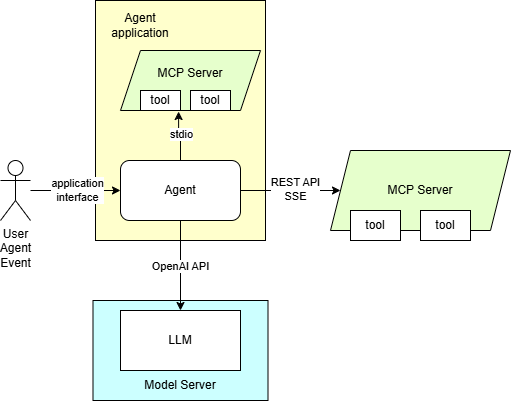

# Agentic AI with OpenVINO Model Server {#ovms_demos_continuous_batching_agent}

OpenVINO Model Server can be used to serve language models for AI Agents. It supports the usage of tools in the context of content generation.
It can be integrated with MCP servers and AI agent frameworks. 
You can learn more about [tools calling based on OpenAI API](https://platform.openai.com/docs/guides/function-calling?api-mode=responses)

Here are presented required steps to deploy language models trained for tools support. The diagram depicting the demo setup is below:


The application employing OpenAI agent SDK is using MCP server. It is equipped with a set of tools to providing context for the content generation.
The tools can also be used for automation purposes based on input in text format.  


## Start MCP server with SSE interface

### Linux
```bash
git clone https://github.com/isdaniel/mcp_weather_server
cd mcp_weather_server && git checkout v0.5.0
docker build -t mcp-weather-server:sse .
docker run -d -p 8080:8080 -e PORT=8080 mcp-weather-server:sse uv run python -m mcp_weather_server --mode sse
```

### Windows
On Windows the MCP server will be demonstrated as an instance with stdio interface inside the agent application. 
File system MCP server requires NodeJS and npx, visit https://nodejs.org/en/download. The weather MCP should be installed as python package:
```bat 
pip install python-dateutil mcp_weather_server "mcp<2"
```

## Prepare the agent

Install the application requirements

```console
curl https://raw.githubusercontent.com/openvinotoolkit/model_server/main/demos/continuous_batching/agentic_ai/openai_agent.py -O -L
pip install openai-agents openai
```

## Start OVMS

This deployment procedure assumes the model was pulled or exported using the procedure above. The exception are models from OpenVINO organization if they support tools correctly with the default template like "OpenVINO/Qwen3-4B-int4-ov" - they can be deployed in a single command pulling and starting the server.


### Deploying on Windows
Assuming you have unpacked model server package with python enabled version, make sure to run `setupvars` script
as mentioned in [deployment guide](../../../docs/deploying_server_baremetal.md), in every new shell that will start OpenVINO Model Server.

::::{tab-set}
:::{tab-item} Qwen3.5-9B
:sync: Qwen3.5-9B
Pull and start OVMS:
```bat
ovms.exe --rest_port 8000 --source_model OpenVINO/Qwen3.5-9B-int4-ov --model_repository_path c:\models --cache_dir .cache --allowed_media_domains raw.githubusercontent.com
```

Use MCP server, with additional image of Gdańsk old town. VLM model deduces location and calls `get_weather` tool to summarize the weather conditions in the city.

```{image} https://images.pexels.com/photos/20015887/pexels-photo-20015887.jpeg
:alt: poland
:width: 360px
```

> **Note**: Image source: [Link](https://images.pexels.com/photos/20015887/pexels-photo-20015887.jpeg)

```bat
python openai_agent.py --query "What is the current weather in location depicted in the image?" --image https://raw.githubusercontent.com/openvinotoolkit/model_server/refs/heads/releases/2026/1/demos/continuous_batching/agentic_ai/photo.jpeg --model OpenVINO/Qwen3.5-9B-int4-ov --base-url http://localhost:8000/v1 --mcp-server weather
```

Exemplary output:
```text
The current weather in Gdańsk is overcast with a temperature of 8.8°C (feels like 4.2°C). The relative humidity is 52%, and the wind is blowing from the SSW at 17.0 km/h with gusts up to 36.7 km/h. The atmospheric pressure is 1010.7 hPa with 84% cloud cover. The UV index is moderate at 3.5, and visibility is 40.9 km.
```
:::
:::{tab-item} Qwen3-4B
:sync: Qwen3-4B
Pull and start OVMS:
```bat
ovms.exe --rest_port 8000 --source_model OpenVINO/Qwen3-4B-int4-ov --model_repository_path c:\models --cache_dir .cache
```

Use MCP server:
```bat
python openai_agent.py --query "What is the current weather in Tokyo?" --model OpenVINO/Qwen3-4B-int4-ov --base-url http://localhost:8000/v1 --mcp-server weather
```

Exemplary output:
```text
The current weather in Tokyo is overcast with a temperature of 9.4°C (feels like 6.4°C). The relative humidity is at 42%, and the dew point is at -2.9°C. Wind is blowing from the NE at 3.6 km/h with gusts up to 24.8 km/h. The atmospheric pressure is 1018.9 hPa with 84% cloud cover. Visibility is 24.1 km.
```
:::
:::{tab-item} LFM2.5-350M
:sync: LFM2.5-350M
Pull and start OVMS:
```bat
ovms.exe --rest_port 8000 --source_model OpenVINO/LFM2.5-350M-int8-ov --model_repository_path c:\models --cache_dir .cache
```

Use MCP server:
```bat
python openai_agent.py --query "What is the current weather in Tokyo?" --model OpenVINO/LFM2.5-350M-int8-ov --base-url http://localhost:8000/v1 --mcp-server weather
```

Exemplary output:
```text
The current weather in Tokyo is Overcast with a temperature of 9.4°C (feels like 6.4°C), relative humidity at 42%, and dew point at -2.9°C. Wind is blowing from the NE at 3.6 km/h with gusts up to 24.8 km/h. Atmospheric pressure is 1018.9 hPa with 84% cloud cover. Visibility is 24.1 km.
```
:::
:::{tab-item} Qwen3-30B-A3B-Instruct-2507
:sync: Qwen3-30B-A3B-Instruct-2507
Pull and start OVMS:
```bat
ovms.exe --rest_port 8000 --source_model OpenVINO/Qwen3-30B-A3B-Instruct-2507-int4-ov --model_repository_path c:\models --cache_dir .cache
```

Use MCP server:
```bat
python openai_agent.py --query "What is the current weather in Tokyo?" --model OpenVINO/Qwen3-30B-A3B-Instruct-2507-int4-ov --base-url http://localhost:8000/v1 --mcp-server weather
```

Exemplary output:
```text
The current weather in Tokyo is Overcast with a temperature of 9.4°C (feels like 6.4°C), relative humidity at 42%, and dew point at -2.9°C. The wind is blowing from the northeast at 3.6 km/h with gusts up to 24.8 km/h. The atmospheric pressure is 1018.9 hPa with 84% cloud cover. Visibility is 24.1 km.
```
:::
:::{tab-item} Qwen3.6-35B-A3B
:sync: Qwen3.6-35B-A3B
Vision Language MoE model (35B total / 3B active parameters). Requires OpenVINO 2026.2 or newer and a GPU with sufficient memory to fit the INT4 weights. Tested on PantherLake iGPU with 32GB RAM with iGPU allocation increase and B70 dGPU.

Pull and start OVMS:
```bat
ovms.exe --rest_port 8000 --source_model OpenVINO/Qwen3.6-35B-A3B-int4-ov --model_repository_path c:\models --cache_dir .cache --allowed_media_domains raw.githubusercontent.com
```

Use MCP server, with additional image of Gdańsk old town. VLM model deduces location and calls `get_weather` tool to summarize the weather conditions in the city.

```{image} https://images.pexels.com/photos/20015887/pexels-photo-20015887.jpeg
:alt: poland
:width: 360px
```

> **Note**: Image source: [Link](https://images.pexels.com/photos/20015887/pexels-photo-20015887.jpeg)

```bat
python openai_agent.py --query "What is the current weather in location depicted in the image?" --image https://raw.githubusercontent.com/openvinotoolkit/model_server/refs/heads/releases/2026/1/demos/continuous_batching/agentic_ai/photo.jpeg --model OpenVINO/Qwen3.6-35B-A3B-int4-ov --base-url http://localhost:8000/v1 --mcp-server weather
```
:::
:::{tab-item} gpt-oss-20b
:sync: gpt-oss-20b
Pull and start OVMS:
```bat
ovms.exe --rest_port 8000 --source_model OpenVINO/gpt-oss-20b-int4-ov --model_repository_path c:\models --cache_dir .cache
```

Use MCP server:
```bat
python openai_agent.py --query "What is the current weather in Tokyo?" --model OpenVINO/gpt-oss-20b-int4-ov --base-url http://localhost:8000/v1 --mcp-server weather
```

Exemplary output:
```text
**Tokyo Current Weather**

- **Condition:** Overcast  
- **Temperature:** 9.4°C (feels like 6.4°C)  
- **Humidity:** 42%  
- **Dew Point:** 2.9°C  
- **Wind:** 3.6km/h from the NE, gusts up to 24.8km/h  
- **Pressure:** 1018.9hPa  
- **Cloud Cover:** 84%  
- **Visibility:** 24.1km  

Let me know if you'd like forecast details or anything else!
```

:::
::::


### Deploying in a docker container

In case you want to use GPU device to run the generation, add extra docker parameters `--device /dev/dri --group-add=$(stat -c "%g" /dev/dri/render* | head -n 1)`
to `docker run` command, use the image with GPU support. Use the models with size and quantization precision matching the GPU capacity and adjust pipeline configuration.
It can be applied using the commands below:

::::{tab-set}
:::{tab-item} Qwen3.5-9B
:sync: Qwen3.5-9B
Pull and start OVMS:
```bash
mkdir -p ${HOME}/models
export GPU_ARGS=$(if ls /dev/dri/render* >/dev/null 2>&1; then echo "--device /dev/dri --group-add $(stat -c '%g' /dev/dri/render* | head -n1)"; fi) 
docker run -d --user $(id -u):$(id -g) --rm -p 8000:8000 -v ${HOME}/models:/models ${GPU_ARGS} openvino/model_server:latest-gpu \
--rest_port 8000 --model_repository_path /models --source_model OpenVINO/Qwen3.5-9B-int4-ov --allowed_media_domains raw.githubusercontent.com
```

Use MCP server, with additional image of Gdańsk old town. VLM model deduces location and calls `get_weather` tool to summarize the weather conditions in the city.

```{image} https://images.pexels.com/photos/20015887/pexels-photo-20015887.jpeg
:alt: poland
:width: 360px
```

> **Note**: Image source: [Link](https://images.pexels.com/photos/20015887/pexels-photo-20015887.jpeg)

```text
python openai_agent.py --query "What is the current weather in location depicted in the image?" --image https://raw.githubusercontent.com/openvinotoolkit/model_server/refs/heads/releases/2026/1/demos/continuous_batching/agentic_ai/photo.jpeg --model OpenVINO/Qwen3.5-9B-int4-ov --base-url http://localhost:8000/v1 --mcp-server-url http://localhost:8080/sse --mcp-server weather
```

Exemplary output:
```text
The current weather in Gdańsk is overcast with a temperature of 8.8°C (feels like 4.2°C). The relative humidity is 52%, and the wind is blowing from the SSW at 17.0 km/h with gusts up to 36.7 km/h. The atmospheric pressure is 1010.7 hPa with 84% cloud cover. The UV index is moderate at 3.5, and visibility is 40.9 km.
```
:::
:::{tab-item} Qwen3-4B
:sync: Qwen3-4B
Pull and start OVMS:
```bash
mkdir -p ${HOME}/models
export GPU_ARGS=$(if ls /dev/dri/render* >/dev/null 2>&1; then echo "--device /dev/dri --group-add $(stat -c '%g' /dev/dri/render* | head -n1)"; fi) 
docker run -d --user $(id -u):$(id -g) --rm -p 8000:8000 -v ${HOME}/models:/models ${GPU_ARGS} openvino/model_server:latest-gpu \
--rest_port 8000 --model_repository_path /models --source_model OpenVINO/Qwen3-4B-int4-ov
```

Use MCP server:
```bash
python openai_agent.py --query "What is the current weather in Tokyo?" --model OpenVINO/Qwen3-4B-int4-ov --base-url http://localhost:8000/v1 --mcp-server-url http://localhost:8080/sse --mcp-server weather
```

Exemplary output:
```text
The current weather in Tokyo is overcast with a temperature of 9.4°C (feels like 6.4°C). The relative humidity is at 42%, and the dew point is at -2.9°C. Wind is blowing from the NE at 3.6 km/h with gusts up to 24.8 km/h. The atmospheric pressure is 1018.9 hPa with 84% cloud cover. Visibility is 24.1 km.
```
:::
:::{tab-item} LFM2.5-350M
:sync: LFM2.5-350M
Pull and start OVMS:
```bash
mkdir -p ${HOME}/models
export GPU_ARGS=$(if ls /dev/dri/render* >/dev/null 2>&1; then echo "--device /dev/dri --group-add $(stat -c '%g' /dev/dri/render* | head -n1)"; fi) 
docker run -d --user $(id -u):$(id -g) --rm -p 8000:8000 -v ${HOME}/models:/models ${GPU_ARGS} openvino/model_server:latest-gpu \
--rest_port 8000 --model_repository_path /models --source_model OpenVINO/LFM2.5-350M-int8-ov
```

Use MCP server:
```bash
python openai_agent.py --query "What is the current weather in Tokyo?" --model OpenVINO/LFM2.5-350M-int8-ov --base-url http://localhost:8000/v1 --mcp-server-url http://localhost:8080/sse --mcp-server weather
```

Exemplary output:
```text
The current weather in Tokyo is overcast with a temperature of 9.4°C (feels like 6.4°C). The relative humidity is 42%, and the dew point is -2.9°C. Wind is blowing from the northeast at 3.6 km/h, with gusts up to 24.8 km/h. The atmospheric pressure is 1018.9 hPa, and there is 84% cloud cover. Visibility is 24.1 km.
```
:::
:::{tab-item} Qwen3-30B-A3B-Instruct-2507
:sync: Qwen3-30B-A3B-Instruct-2507
Pull and start OVMS:
```bash
mkdir -p ${HOME}/models
export GPU_ARGS=$(if ls /dev/dri/render* >/dev/null 2>&1; then echo "--device /dev/dri --group-add $(stat -c '%g' /dev/dri/render* | head -n1)"; fi) 
docker run -d --user $(id -u):$(id -g) --rm -p 8000:8000 -v ${HOME}/models:/models ${GPU_ARGS} openvino/model_server:latest-gpu \
--rest_port 8000 --model_repository_path /models --source_model OpenVINO/Qwen3-30B-A3B-Instruct-2507-int4-ov
```

Use MCP server:
```bash
python openai_agent.py --query "What is the current weather in Tokyo?" --model OpenVINO/Qwen3-30B-A3B-Instruct-2507-int4-ov --base-url http://localhost:8000/v1 --mcp-server-url http://localhost:8080/sse --mcp-server weather
```

Exemplary output:
```text
The current weather in Tokyo is overcast with a temperature of 9.4°C (feels like 6.4°C). The relative humidity is 42%, and the dew point is -2.9°C. Wind is blowing from the northeast at 3.6 km/h, with gusts up to 24.8 km/h. The atmospheric pressure is 1018.9 hPa, and there is 84% cloud cover. Visibility is 24.1 km.
```
:::
:::{tab-item} Qwen3.6-35B-A3B
:sync: Qwen3.6-35B-A3B
Vision Language MoE model (35B total / 3B active parameters). Requires OpenVINO 2026.2 or newer and a GPU with sufficient memory to fit the INT4 weights. Tested on PantherLake iGPU with 32GB RAM with iGPU allocation increase and B70 dGPU.

Pull and start OVMS:
```bash
mkdir -p ${HOME}/models
export GPU_ARGS=$(if ls /dev/dri/render* >/dev/null 2>&1; then echo "--device /dev/dri --group-add $(stat -c '%g' /dev/dri/render* | head -n1)"; fi) 
docker run -d --user $(id -u):$(id -g) --rm -p 8000:8000 -v ${HOME}/models:/models ${GPU_ARGS} openvino/model_server:latest-gpu \
--rest_port 8000 --source_model OpenVINO/Qwen3.6-35B-A3B-int4-ov --model_repository_path /models --allowed_media_domains raw.githubusercontent.com
```

Use MCP server, with additional image of Gdańsk old town. VLM model deduces location and calls `get_weather` tool to summarize the weather conditions in the city.

```{image} https://images.pexels.com/photos/20015887/pexels-photo-20015887.jpeg
:alt: poland
:width: 360px
```

> **Note**: Image source: [Link](https://images.pexels.com/photos/20015887/pexels-photo-20015887.jpeg)

```bash
python openai_agent.py --query "What is the current weather in location depicted in the image?" --image https://raw.githubusercontent.com/openvinotoolkit/model_server/refs/heads/releases/2026/1/demos/continuous_batching/agentic_ai/photo.jpeg --model OpenVINO/Qwen3.6-35B-A3B-int4-ov --base-url http://localhost:8000/v1 --mcp-server-url http://localhost:8080/sse --mcp-server weather
```
:::
:::{tab-item} gpt-oss-20b
:sync: gpt-oss-20b
Pull and start OVMS:
```bash
mkdir -p ${HOME}/models
export GPU_ARGS=$(if ls /dev/dri/render* >/dev/null 2>&1; then echo "--device /dev/dri --group-add $(stat -c '%g' /dev/dri/render* | head -n1)"; fi) 
docker run -d --user $(id -u):$(id -g) --rm -p 8000:8000 -v ${HOME}/models:/models ${GPU_ARGS} openvino/model_server:latest-gpu \
--rest_port 8000 --source_model OpenVINO/gpt-oss-20b-int4-ov --model_repository_path /models
```

Use MCP server:
```bash
python openai_agent.py --query "What is the current weather in Tokyo?" --model OpenVINO/gpt-oss-20b-int4-ov --base-url http://localhost:8000/v1 --mcp-server-url http://localhost:8080/sse --mcp-server weather
```

Exemplary output:
```text
**Tokyo Current Weather**

- **Condition:** Overcast  
- **Temperature:** 9.4°C (feels like 6.4°C)  
- **Humidity:** 42%  
- **Dew Point:** 2.9°C  
- **Wind:** 3.6km/h from the NE, gusts up to 24.8km/h  
- **Pressure:** 1018.9hPa  
- **Cloud Cover:** 84%  
- **Visibility:** 24.1km  

Let me know if you'd like forecast details or anything else!
```
:::
::::

### Using Llama index agentic framework

Pull and start OVMS:
```bash
mkdir -p ${HOME}/models
export GPU_ARGS=$(if ls /dev/dri/render* >/dev/null 2>&1; then echo "--device /dev/dri --group-add $(stat -c '%g' /dev/dri/render* | head -n1)"; fi) 
docker run -d --user $(id -u):$(id -g) --rm -p 8000:8000 -v ${HOME}/models:/models ${GPU_ARGS} openvino/model_server:latest-gpu \
--rest_port 8000 --model_repository_path /models --source_model OpenVINO/Qwen3-8B-int4-ov
```

You can try also similar implementation based on llama_index library working the same way like openai-agent:
```bash
pip install llama-index-llms-openai-like==0.5.3 llama-index-core==0.14.5 llama-index-tools-mcp==0.4.2
curl https://raw.githubusercontent.com/openvinotoolkit/model_server/main/demos/continuous_batching/agentic_ai/llama_index_agent.py -o llama_index_agent.py
python llama_index_agent.py --query "What is the current weather in Tokyo?" --model OpenVINO/Qwen3-8B-int4-ov --base-url http://localhost:8000/v1 --mcp-server-url http://localhost:8080/sse --mcp-server weather --stream --enable-thinking
```

### References
- [Export models to OpenVINO format](../../common/export_models/README.md)
- [Testing LLM and VLM serving accuracy](../accuracy/README.md)
- [LLM calculator reference](../../../docs/llm/reference.md)