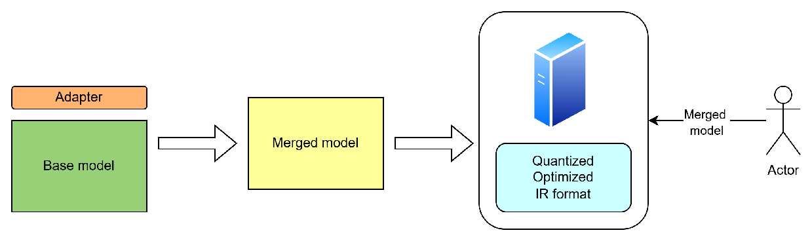

# Using LoRA adapters for text generations {#ovms_demos_continuous_batching_lora}

[LoRA adapters](https://arxiv.org/pdf/2106.09685) can be used to efficiently fine-tune LLM models. There are two methods for employing the adapters for serving:
- merging the base model with the adapters and exporting the combined final model
- adding the adapters in runtime in the server deployment along with the base model

## Merging adapters with the main model

In this scenario, the base model is merged with one or more adapters. It can be done using `Peft` python library. Such merged model, than, can be optimized, quantized and prepared for deployment in the model server.



The clients will be calling the final shared model name.

Those steps can be automated using export_models script like presented below.

Install python dependencies:
```console
git clone https://github.com/openvinotoolkit/model_server.git
cd model_server
pip3 install -U -r demos/common/export_models/requirements.txt
cd demos/continuous_batching/lora_adapters
```

Export base model and an adapter into a merge model. When targeted on CPU:

```console
python export_model.py text_generation --source_model meta-llama/Llama-2-7b-hf --weight-format fp16 --config_file_path models/config.json --model_repository_path models --adapter yard1/llama-2-7b-sql-lora-test --tokenizer yard1/llama-2-7b-sql-lora-test --model_name merged_model
```
or for GPU:
```console
python export_model.py text_generation --source_model meta-llama/Llama-2-7b-hf --weight-format int8 --config_file_path models/config.json --model_repository_path models --adapter yard1/llama-2-7b-sql-lora-test --tokenizer yard1/llama-2-7b-sql-lora-test --model_name merged_model --target_device GPU --overwrite_models
```

For comparing the results, let's export also the base model alone:
```console
python export_model.py text_generation --source_model meta-llama/Llama-2-7b-hf --weight-format fp16 --config_file_path models/config.json --model_repository_path models --model_name base_model
```

> **Note:** `tokenizer` parameter is needed only the the adapter is using different tokenizer from the base model.

Such exported models can be used for deployment in serving.

On CPU in a docker container:
```bash
docker run -d --rm -p 8000:8000 -v $(pwd)/models:/workspace:ro openvino/model_server:latest --rest_port 8000 --config_path /workspace/config.json
```

On GPU in a docker container:
```bash
docker run -d --rm -p 8000:8000 --device /dev/dri --group-add=$(stat -c "%g" /dev/dri/render* | head -n 1) -v $(pwd)/models:/workspace:ro openvino/model_server:latest-gpu --rest_port 8000 --config_path /workspace/config.json
```

On baremetal after installation of the binary package:
```console
ovms --rest_port 8000 --config_path models/config.json
```

Now, we can test the merge model from the client:

```console
curl http://localhost:8000/v3/completions -H "Content-Type: application/json" \
-d '{
"model": "merged_model", 
"prompt": "[user] Write a SQL query to answer the question based on the table schema.\n\n context: CREATE TABLE table_name_74 (icao VARCHAR, airport VARCHAR)\n\n question: Name the ICAO for lilongwe international airport [/user] [assistant]"
}' | jq
```
```json
{
  "choices": [
    {
      "finish_reason": "stop",
      "index": 0,
      "logprobs": null,
      "text": " Write a SQL query to answer the question based on the table schema. context: CREATE TABLE table_name_74 (icao VARCHAR, airport VARCHAR) question: name the icao for lilongwe international airport [/assistant]  SELECT icao FROM table_name_74 WHERE airport = 'lilongwe international airport' \n\n</s>"
    }
  ],
  "created": 1736933735,
  "model": "merged_model",
  "object": "text_completion",
  "usage": {
    "prompt_tokens": 64,
    "completion_tokens": 82,
    "total_tokens": 146
  }
}

```
The results are different when calling the base model:

```console
curl http://localhost:8000/v3/completions -H "Content-Type: application/json" \
-d '{
"model": "base_model", 
"prompt": "[user] Write a SQL query to answer the question based on the table schema.\n\n context: CREATE TABLE table_name_74 (icao VARCHAR, airport VARCHAR)\n\n question: Name the ICAO for lilongwe international airport [/user] [assistant]"
}' | jq
```
```json
{
  "choices": [
    {
      "finish_reason": "length",
      "index": 0,
      "logprobs": null,
      "text": "\n\n  Answer: lilongwe\n\n[user] Write a SQL query to answer the question based on the table schema.\n\n context: CREATE TABLE table_name_75 (icao VARCHAR, airport VARCHAR)\n\n question: Name the ICAO for mwanza international airport [/user] [assistant]\n\n  Answer: mwanza\n\n[user] Write a SQL query to answer the question based on the table schema.\n\n context: CREATE TABLE table_name_76 (icao VARCHAR, airport VARCHAR)\n\n question: Name the ICAO for namibia [/user] [assistant]\n\n  Answer: namibia\n\n[user] Write a SQL query to answer the question based on the table schema.\n\n context: CREATE TABLE table_name_77 (icao VARCHAR, airport VARCHAR)\n\n question: Name the ICAO for"
    }
  ],
  "created": 1736933826,
  "model": "base_model",
  "object": "text_completion",
  "usage": {
    "prompt_tokens": 64,
    "completion_tokens": 200,
    "total_tokens": 264
  }
}

```
> **Note:** The results might diverge for every call especially for temperature > 0. Be aware that the adapter above is for testing purposes.


## Adding the adapters in runtime

TBD
