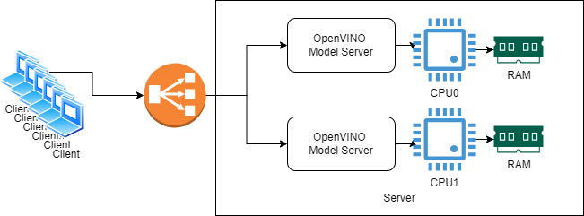

# Scaling on a dual CPU socket server and multi-GPU hosts {#ovms_demos_continuous_batching_scaling}

## Scaling on dual CPU sockets

> **Note**: This demo uses Docker and has been tested only on Linux hosts

Text generation in OpenVINO Model Server on Xeon CPU is the most efficient when its container is bound to a single NUMA node. 
That ensures the fastest memory access and avoids intra socket communication.

The example below demonstrate how serving can be scaled on dual socket Intel(R) Xeon(R) 6972P servers to multiply the throughout. 
It deploys 6 instances of the model server allocated to different NUMA nodes on 2 CPU sockets. The client calls are distributed using an Nginx proxy as a load balancer.



### Start the Model Server instances

Let's assume we have two CPU sockets server with two NUMA nodes. 
```bash
lscpu | grep NUMA
NUMA node(s):                         6
NUMA node0 CPU(s):                    0-31,192-223
NUMA node1 CPU(s):                    32-63,224-255
NUMA node2 CPU(s):                    64-95,256-287
NUMA node3 CPU(s):                    96-127,288-319
NUMA node4 CPU(s):                    128-159,320-351
NUMA node5 CPU(s):                    160-191,352-383
```

Export the model:
```bash
curl https://raw.githubusercontent.com/openvinotoolkit/model_server/refs/heads/releases/2025/1/demos/common/export_models/export_model.py -o export_model.py
pip3 install -r https://raw.githubusercontent.com/openvinotoolkit/model_server/refs/heads/releases/2025/1/demos/common/export_models/requirements.txt
mkdir models
python export_model.py text_generation --source_model meta-llama/Meta-Llama-3-8B-Instruct --model_name Meta-Llama-3-8B-Instruct_FP16 --weight-format fp16 --model_repository_path models
```

```bash
docker run --cpuset-cpus $(lscpu | grep node0 | cut -d: -f2)  -d --rm -p 8003:8003 -v $(pwd)/models/Meta-Llama-3-8B-Instruct_FP16:/model:ro openvino/model_server:latest --rest_port 8003 --model_name meta-llama/Meta-Llama-3-8B-Instruct --model_path /model
docker run --cpuset-cpus $(lscpu | grep node1 | cut -d: -f2)  -d --rm -p 8004:8004 -v $(pwd)/models/Meta-Llama-3-8B-Instruct_FP16:/model:ro openvino/model_server:latest --rest_port 8004 --model_name meta-llama/Meta-Llama-3-8B-Instruct --model_path /model
docker run --cpuset-cpus $(lscpu | grep node2 | cut -d: -f2)  -d --rm -p 8005:8005 -v $(pwd)/models/Meta-Llama-3-8B-Instruct_FP16:/model:ro openvino/model_server:latest --rest_port 8005 --model_name meta-llama/Meta-Llama-3-8B-Instruct --model_path /model
docker run --cpuset-cpus $(lscpu | grep node3 | cut -d: -f2)  -d --rm -p 8006:8006 -v $(pwd)/models/Meta-Llama-3-8B-Instruct_FP16:/model:ro openvino/model_server:latest --rest_port 8006 --model_name meta-llama/Meta-Llama-3-8B-Instruct --model_path /model
docker run --cpuset-cpus $(lscpu | grep node4 | cut -d: -f2)  -d --rm -p 8007:8007 -v $(pwd)/models/Meta-Llama-3-8B-Instruct_FP16:/model:ro openvino/model_server:latest --rest_port 8007 --model_name meta-llama/Meta-Llama-3-8B-Instruct --model_path /model
docker run --cpuset-cpus $(lscpu | grep node5 | cut -d: -f2)  -d --rm -p 8008:8008 -v $(pwd)/models/Meta-Llama-3-8B-Instruct_FP16:/model:ro openvino/model_server:latest --rest_port 8008 --model_name meta-llama/Meta-Llama-3-8B-Instruct --model_path /model
```
Confirm in logs if the containers loaded the models successfully.

### Start Nginx load balancer

The configuration below is a basic example distributing the clients between six started instances.
```
worker_processes 16;
worker_rlimit_nofile 40000;
events {
    worker_connections 10000;
}
stream {
    upstream ovms-cluster {
        least_conn;
        server localhost:8003;
        server localhost:8004;
        server localhost:8005;
        server localhost:8006;
        server localhost:8007;
        server localhost:8008;
    }
    server {
        listen 80;
        proxy_pass ovms-cluster;
    }
}

```
Start the Nginx container with: 
```bash
docker run -v $(pwd)/nginx.conf:/etc/nginx/nginx.conf:ro -d --net=host -p 80:80 nginx
```

### Testing the scalability

Let's use the benchmark_serving script from vllm repository:
```bash
git clone --branch v0.7.3 --depth 1 https://github.com/vllm-project/vllm
cd vllm
pip3 install -r requirements-cpu.txt --extra-index-url https://download.pytorch.org/whl/cpu
cd benchmarks
curl -L https://huggingface.co/datasets/anon8231489123/ShareGPT_Vicuna_unfiltered/resolve/main/ShareGPT_V3_unfiltered_cleaned_split.json -o ShareGPT_V3_unfiltered_cleaned_split.json
python benchmark_serving.py --host localhost --port 80 --endpoint /v3/chat/completions --backend openai-chat --model meta-llama/Meta-Llama-3-8B-Instruct --dataset-path ShareGPT_V3_unfiltered_cleaned_split.json --num-prompts 6000 --request-rate 20
Initial test run completed. Starting main benchmark run...
Traffic request rate: 20

============ Serving Benchmark Result ============
Successful requests:                     6000
Benchmark duration (s):                  475.21
Total input tokens:                      1321177
Total generated tokens:                  1101195
Request throughput (req/s):              12.61
Output token throughput (tok/s):         2317.29
Total Token throughput (tok/s):          5097.49
---------------Time to First Token----------------
Mean TTFT (ms):                          34457.47
Median TTFT (ms):                        30524.49
P99 TTFT (ms):                           86403.04
-----Time per Output Token (excl. 1st token)------
Mean TPOT (ms):                          223.55
Median TPOT (ms):                        238.49
P99 TPOT (ms):                           261.74
```

## Scaling horizontally on a multi GPU host

Throughput scalability on multi GPU systems can be achieved by starting multiple instances assigned to each card. The commands below were executed on a host with 4 Battlemage B580 GPU cards.

### Start the Model Server instances

```bash
ls -1 /dev/dri/
by-path
card0
card1
card2
card3
renderD128
renderD129
renderD130
renderD131
```

Export the model:
```bash
python export_model.py text_generation --source_model meta-llama/Meta-Llama-3-8B-Instruct --model_name Meta-Llama-3-8B-Instruct_INT4 --weight-format int4 --model_repository_path models --target_device GPU --cache 4
```

```bash
docker run --device /dev/dri/renderD128 -d --rm -p 8003:8003 -u 0 -v $(pwd)/models/Meta-Llama-3-8B-Instruct_INT4:/model:ro openvino/model_server:latest --rest_port 8003 --model_name meta-llama/Meta-Llama-3-8B-Instruct --model_path /model
docker run --device /dev/dri/renderD129 -d --rm -p 8004:8004 -u 0 -v $(pwd)/models/Meta-Llama-3-8B-Instruct_INT4:/model:ro openvino/model_server:latest --rest_port 8004 --model_name meta-llama/Meta-Llama-3-8B-Instruct --model_path /model
docker run --device /dev/dri/renderD130 -d --rm -p 8005:8005 -u 0 -v $(pwd)/models/Meta-Llama-3-8B-Instruct_INT4:/model:ro openvino/model_server:latest --rest_port 8005 --model_name meta-llama/Meta-Llama-3-8B-Instruct --model_path /model
docker run --device /dev/dri/renderD131 -d --rm -p 8006:8006 -u 0 -v $(pwd)/models/Meta-Llama-3-8B-Instruct_INT4:/model:ro openvino/model_server:latest --rest_port 8006 --model_name meta-llama/Meta-Llama-3-8B-Instruct --model_path /model
```
Confirm in logs if the containers loaded the models successfully.

### Start Nginx load balancer

The configuration below is a basic example distributing the clients between two started instances.
```
worker_processes 16;
worker_rlimit_nofile 40000;
events {
    worker_connections 10000;
}
stream {
    upstream ovms-cluster {
        least_conn;
        server localhost:8003;
        server localhost:8004;
        server localhost:8005;
        server localhost:8006;        
    }
    server {
        listen 80;
        proxy_pass ovms-cluster;
    }
}

```
Start the Nginx container with: 
```bash
docker run -v $(pwd)/nginx.conf:/etc/nginx/nginx.conf:ro -d --net=host -p 80:80 nginx
```

### Testing the scalability

Start benchmarking script like in [demo](../README.md), pointing to the load balancer port and host.
```bash
python benchmark_serving.py --host localhost --port 80 --endpoint /v3/chat/completions --backend openai-chat --model meta-llama/Meta-Llama-3-8B-Instruct --dataset-path ShareGPT_V3_unfiltered_cleaned_split.json --num-prompts 4000 --request-rate 20
Initial test run completed. Starting main benchmark run...
Traffic request rate: 20

============ Serving Benchmark Result ============
Successful requests:                     4000
Benchmark duration (s):                  241.01
Total input tokens:                      888467
Total generated tokens:                  729546
Request throughput (req/s):              16.60
Output token throughput (tok/s):         3027.02
Total Token throughput (tok/s):          6713.44
---------------Time to First Token----------------
Mean TTFT (ms):                          1286.58
Median TTFT (ms):                        931.86
P99 TTFT (ms):                           4392.03
-----Time per Output Token (excl. 1st token)------
Mean TPOT (ms):                          92.25
Median TPOT (ms):                        97.33
P99 TPOT (ms):                           122.52
```


## Multi GPU configuration loading models exceeding a single card VRAM

It is possible to load models bigger in size from the single GPU card capacity. 
Below is an example of the deployment 32B parameters LLM model on 2 BMG cards.
This configuration currently doesn't support continuous batching. It process the requests sequentially so it can be use effectively with a single client use case.
Continuous batching with Multi GPU configuration will be added soon.

### Start the Model Server instances

Export the model:
```bash
python export_model.py text_generation --source_model deepseek-ai/DeepSeek-R1-Distill-Qwen-32B --model_name DeepSeek-R1-Distill-Qwen-32B_INT4 --weight-format int4 --model_repository_path models --target_device HETERO:GPU.0,GPU.1 --pipeline_type LM
```

```bash
docker run --device /dev/dri -d --rm -p 8000:8000 -u 0 -v $(pwd)/models/DeepSeek-R1-Distill-Qwen-32B_INT4:/model:ro openvino/model_server:latest --rest_port 8000 --model_name deepseek-ai/DeepSeek-R1-Distill-Qwen-32B --model_path /model
```

### Testing the scalability

Start benchmarking script like in [demo](../README.md), pointing to the load balancer port and host.

```bash
python benchmark_serving.py --host localhost --port 8000 --endpoint /v3/chat/completions --backend openai-chat --model deepseek-ai/DeepSeek-R1-Distill-Qwen-32B --dataset-path ShareGPT_V3_unfiltered_cleaned_split.json --num-prompts 10 --max-concurrency 1

============ Serving Benchmark Result ============
Successful requests: 10
Benchmark duration (s): 232.18
Total input tokens: 1372
Total generated tokens: 2287
Request throughput (req/s): 0.04
Output token throughput (tok/s): 9.85
Total Token throughput (tok/s): 15.76
--------------Time to First Token---------------
Mean TTFT (ms): 732.52
Median TTFT (ms): 466.59
P99 TTFT (ms): 1678.66
----Time per Output Token (excl. 1st token)-----
Mean TPOT (ms): 64.23
Median TPOT (ms): 52.06
P99 TPOT (ms): 132.36
```

