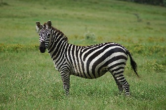

# VLM models via OpenAI API {#ovms_demos_continuous_batching_vlm}

```{toctree}
---
maxdepth: 1
hidden:
---
ovms_demos_vlm_npu
```

This demo shows how to deploy Vision Language Models in the OpenVINO Model Server.
Text generation use case is exposed via OpenAI API `chat/completions` endpoint.

> **Note:** This demo was tested on 4th - 6th generation Intel® Xeon® Scalable Processors, Intel® Arc™ GPU Series and Intel® Core Ultra Series on Ubuntu24, RedHat9 and Windows11.

## Prerequisites

**Model preparation**: Python 3.10 or higher with pip and HuggingFace account

**Model Server deployment**: Installed Docker Engine or OVMS binary package according to the [baremetal deployment guide](../../../docs/deploying_server_baremetal.md)

**(Optional) Client**: git and Python for using OpenAI client package and vLLM benchmark app


## Fast deployment with OpenVINO models pulled directly from HuggingFace Hub
VLM models can be deployed in a single command by using pre-configured models from [OpenVINO HuggingFace organization](https://huggingface.co/OpenVINO)
For other models go to the model preparation step and deployment for converted models.
Here is an example of `Qwen3-VL-8B-Instruct-int4` deployment:

:::{dropdown} **Deploying with Docker**

Select deployment option depending on how you prepared models in the previous step.

**CPU**

Running this command starts the container with CPU only target device:
```bash
mkdir -p models
docker run -d -u $(id -u):$(id -g) --rm -p 8000:8000 -v $(pwd)/models:/models:rw openvino/model_server:latest --rest_port 8000 --source_model Junrui2021/Qwen3-VL-8B-Instruct-int4 --model_repository_path /models --task text_generation --pipeline_type VLM_CB --allowed_media_domains raw.githubusercontent.com
```
**GPU**

In case you want to use GPU device to run the generation, add extra docker parameters `--device /dev/dri --group-add=$(stat -c "%g" /dev/dri/render* | head -n 1)`
to `docker run` command, use the image with GPU support.
It can be applied using the commands below:
```bash
mkdir -p models
docker run -d -u $(id -u):$(id -g) --rm -p 8000:8000 --device /dev/dri --group-add=$(stat -c "%g" /dev/dri/render* | head -n 1) -v $(pwd)/models:/models:rw openvino/model_server:latest-gpu --rest_port 8000 --source_model Junrui2021/Qwen3-VL-8B-Instruct-int4 --model_repository_path /models --task text_generation --target_device GPU --pipeline_type VLM_CB --allowed_media_domains raw.githubusercontent.com
```
:::

:::{dropdown} **Deploying on Bare Metal**

If you run on GPU make sure to have appropriate drivers installed, so the device is accessible for the model server.

```bat
mkdir models
ovms --rest_port 8000 --source_model Junrui2021/Qwen3-VL-8B-Instruct-int4 --model_repository_path models --task text_generation --pipeline_type VLM_CB --target_device CPU --allowed_media_domains raw.githubusercontent.com
```
or
```bat
ovms --rest_port 8000 --source_model Junrui2021/Qwen3-VL-8B-Instruct-int4 --model_repository_path models --task text_generation --pipeline_type VLM_CB --target_device GPU --allowed_media_domains raw.githubusercontent.com
```
:::

## Readiness Check

Wait for the model to load. You can check the status with a simple command:
```console
curl http://localhost:8000/v3/models
```
```json
{
  "object": "list",
  "data": [
    {
      "id": "Junrui2021/Qwen3-VL-8B-Instruct-int4`",
      "object": "model",
      "created": 1772928358,
      "owned_by": "OVMS"
    }
  ]
}
```

## Request Generation

Let's send a request with text an image in the messages context.
 

:::{dropdown} **Unary call with curl using image url**
**Note**: using urls in request requires `--allowed_media_domains` parameter described [here](../../../docs/parameters.md)

```bash
curl http://localhost:8000/v3/chat/completions  -H "Content-Type: application/json" -d "{ \"model\": \"Junrui2021/Qwen3-VL-8B-Instruct-int4\", \"messages\":[{\"role\": \"user\", \"content\": [{\"type\": \"text\", \"text\": \"Describe what is one the picture.\"},{\"type\": \"image_url\", \"image_url\": {\"url\": \"http://raw.githubusercontent.com/openvinotoolkit/model_server/refs/heads/releases/2025/3/demos/common/static/images/zebra.jpeg\"}}]}], \"max_completion_tokens\": 100}"
```
```json
{
  "choices": [
    {
      "finish_reason": "stop",
      "index": 0,
      "logprobs": null,
      "message": {
        "content": "The picture features a zebra standing in a grassy plain. Zebras are known for their distinctive black and white striped patterns, which help them blend in for camouflage purposes. The zebra pictured is standing on a green field with patches of grass, indicating it may be in its natural habitat. Zebras are typically social animals and are often found in savannahs and grasslands.",
        "role": "assistant"
      }
    }
  ],
  "created": 1741731554,
  "model": "Junrui2021/Qwen3-VL-8B-Instruct-int4",
  "object": "chat.completion",
  "usage": {
    "prompt_tokens": 19,
    "completion_tokens": 83,
    "total_tokens": 102
  }
}
```
:::

:::{dropdown} **Unary call with python requests library**

```console
pip3 install requests
curl https://raw.githubusercontent.com/openvinotoolkit/model_server/refs/heads/main/demos/common/static/images/zebra.jpeg -o zebra.jpeg
```
```python
import requests
import base64
base_url='http://127.0.0.1:8000/v3'
model_name = "Junrui2021/Qwen3-VL-8B-Instruct-int4"

def convert_image(Image):
    with open(Image,'rb' ) as file:
        base64_image = base64.b64encode(file.read()).decode("utf-8")
    return base64_image

import requests
payload = {"model": "Junrui2021/Qwen3-VL-8B-Instruct-int4",
    "messages": [
        {
            "role": "user",
            "content": [
              {"type": "text", "text": "Describe what is one the picture."},
              {"type": "image_url", "image_url": {"url": f"data:image/jpeg;base64,{convert_image('zebra.jpeg')}"}}
            ]
        }
        ],
    "max_completion_tokens": 100
}
headers = {"Content-Type": "application/json", "Authorization": "not used"}
response = requests.post(base_url + "/chat/completions", json=payload, headers=headers)
print(response.text)
```
```json
{
  "choices": [
    {
      "finish_reason": "stop",
      "index": 0,
      "logprobs": null,
      "message": {
        "content": "The picture features a zebra standing in a grassy plain. Zebras are known for their distinctive black and white striped patterns, which help them blend in for camouflage purposes. The zebra pictured is standing on a green field with patches of grass, indicating it may be in its natural habitat. Zebras are typically social animals and are often found in savannahs and grasslands.",
        "role": "assistant"
      }
    }
  ],
  "created": 1741731554,
  "model": "Junrui2021/Qwen3-VL-8B-Instruct-int4",
  "object": "chat.completion",
  "usage": {
    "prompt_tokens": 19,
    "completion_tokens": 83,
    "total_tokens": 102
  }
}
```
:::
:::{dropdown} **Streaming request with OpenAI client**

The endpoints `chat/completions` is compatible with OpenAI client so it can be easily used to generate code also in streaming mode:

Install the client library:
```console
pip3 install openai
```
```python
from openai import OpenAI
import base64
base_url='http://localhost:8080/v3'
model_name = "Junrui2021/Qwen3-VL-8B-Instruct-int4"

client = OpenAI(api_key='unused', base_url=base_url)

def convert_image(Image):
    with open(Image,'rb' ) as file:
        base64_image = base64.b64encode(file.read()).decode("utf-8")
    return base64_image

stream = client.chat.completions.create(
    model=model_name,
    messages=[
        {
            "role": "user",
            "content": [
              {"type": "text", "text": "Describe what is one the picture."},
              {"type": "image_url", "image_url": {"url": f"data:image/jpeg;base64,{convert_image('zebra.jpeg')}"}}
            ]
        }
        ],
    stream=True,
)
for chunk in stream:
    if chunk.choices[0].delta.content is not None:
        print(chunk.choices[0].delta.content, end="", flush=True)
```

Output:
```
The picture features a zebra standing in a grassy area. The zebra is characterized by its distinctive black and white striped pattern, which covers its entire body, including its legs, neck, and head. Zebras have small, rounded ears and a long, flowing tail. The background appears to be a natural grassy habitat, typical of a savanna or plain.
```

:::


## Testing the model accuracy over serving API

Check the [guide of using lm-evaluation-harness](../accuracy/README.md)

## VLM models deployment with NPU acceleration

Check [VLM usage with NPU acceleration](../../vlm_npu/README.md)


## References
- [Export models to OpenVINO format](../common/export_models/README.md)
- [Supported VLM models](https://openvinotoolkit.github.io/openvino.genai/docs/supported-models/#visual-language-models-vlms)
- [Chat Completions API](../../../docs/model_server_rest_api_chat.md)
- [Writing client code](../../../docs/clients_genai.md)
- [LLM calculator reference](../../../docs/llm/reference.md)
