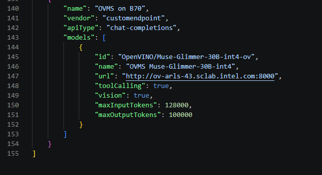
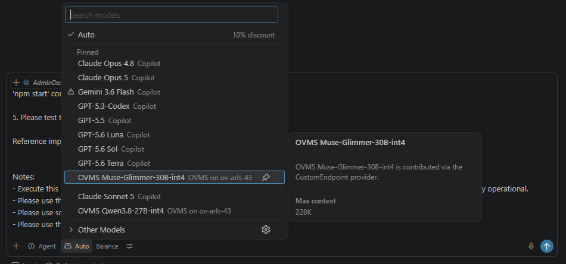
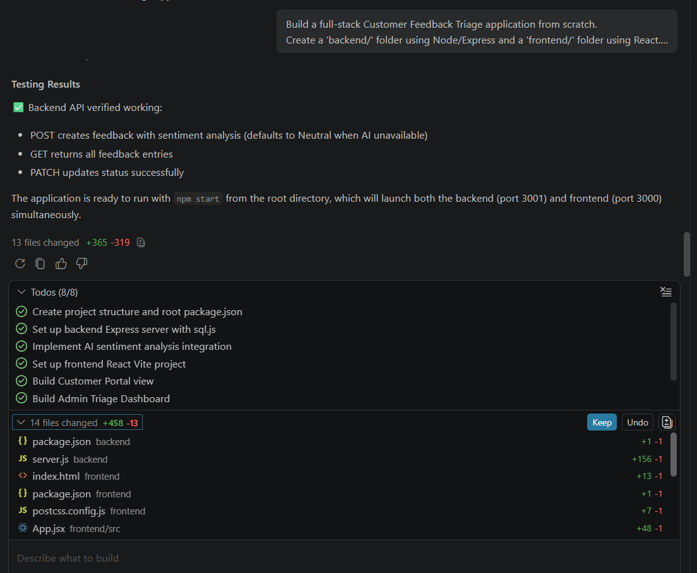
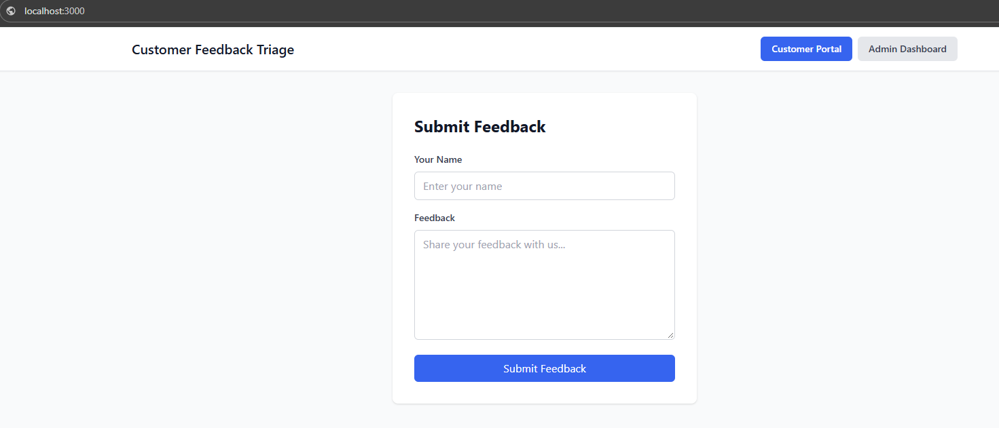
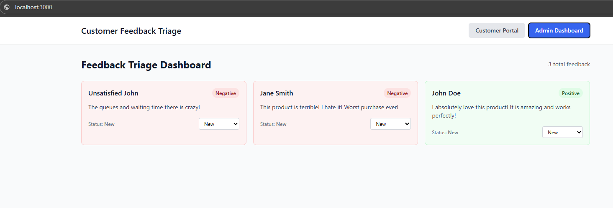

# Using OpenVINO Model Server with GitHub Copilot in VS Code {#ovms_demos_copilot_integration}

## Intro

GitHub Copilot in Visual Studio Code can talk to **any** OpenAI-compatible endpoint through its
[custom endpoint model](https://code.visualstudio.com/docs/agent-customization/language-models#_add-a-custom-endpoint-model)
feature. This demo shows how to serve a local model with OpenVINO Model Server (OVMS) and use it as
the backing model for Copilot Chat / Agent mode - keeping your code and prompts on your own hardware.

In the walkthrough below we let Copilot Agent build a small full-stack application end to end, backed
by a model of your choice from the [Suggested models](#suggested-models) table running on OVMS.

## Requirements

- Visual Studio Code with GitHub Copilot enabled
- An OVMS endpoint serving a chat-completions model with tool-calling support. Either deploy one
  yourself (see [Deploy OVMS](#1-deploy-ovms)), or if someone else already has one running for you,
  skip straight to [Configure VS Code](#2-configure-vs-code) - you'll only need its endpoint URL and
  served model name.
- For self-hosting: Linux with Docker and an Intel GPU
- Memory requirements depend on the chosen model (see table below)

## Suggested models

| Model | HF Link | Notes |
|---|---|---|
| `OpenVINO/Qwen3.8-27B-int8-ov` | [link](https://huggingface.co/OpenVINO/Qwen3.8-27B-int8-ov) | Vision-capable (VLM); general purpose chat/agent model |
| `OpenVINO/Qwen3.6-35B-A3B-int4-ov` | [link](https://huggingface.co/OpenVINO/Qwen3.6-35B-A3B-int4-ov) | Vision-capable (VLM); general purpose chat/agent model |
| `OpenVINO/Muse-Glimmer-30B-int4-ov` | [link](https://huggingface.co/OpenVINO/Muse-Glimmer-30B-int4-ov) | Vision-capable (VLM); general purpose chat/agent model; used and tested in the walkthrough below |
| `OpenVINO/gpt-oss-20b-int4-ov` | [link](https://huggingface.co/OpenVINO/gpt-oss-20b-int4-ov) | General purpose chat/agent model |
| `OpenVINO/Qwen3-Coder-Next` | **To be published soon** | Big coding model; available only on iGPU with minimum 64GB of RAM |
| `OpenVINO/Qwen3.5-9B-int4-ov` | [link](https://huggingface.co/OpenVINO/Qwen3.5-9B-int4-ov) | Smaller model, use when RAM/VRAM is limited or for quick, low-latency edits; not recommended for harder coding tasks |

The walkthrough below was tested with `Muse-Glimmer-30B-int4-ov` on a discrete Intel Arc B70 GPU; the
other models are suggested but not verified with this specific demo.

> **Note:** Any OpenAI chat-completions model served by OVMS will work with the VS Code steps below -
> just adjust the model id/name accordingly.

## 1. Deploy OVMS

> **Already have an endpoint?** If OVMS has already been deployed and served for you (for example on a
> shared inference machine), skip this section and go straight to [Configure VS Code](#2-configure-vs-code).
> You only need the endpoint URL and the served model name.

Deploy the model with Docker on a Linux host with an Intel GPU. The command below exposes the REST
API on port `8000`, matching the URL used later in VS Code (`http://localhost:8000`). Only
`--source_model` needs to change to deploy a different model from the [Suggested models](#suggested-models)
table:

```bash
mkdir -p ${HOME}/models/cache
export GPU_ARGS=$(if ls /dev/dri/render* >/dev/null 2>&1; then echo "--device /dev/dri --group-add $(stat -c '%g' /dev/dri/render* | head -n1)"; fi)
docker run -d ${GPU_ARGS} -u $(id -u):$(id -g) --rm \
    -p 8000:8000 -v ${HOME}/models:/models:rw \
    openvino/model_server:latest-gpu \
    --rest_port 8000 --model_repository_path /models --cache_dir /models/cache \
    --source_model OpenVINO/Muse-Glimmer-30B-int4-ov
```

> **Note:** The first launch downloads the model into `${HOME}/models` and compiles it for the GPU,
> which can take a while depending on your connection and hardware. Subsequent starts reuse the
> downloaded model and the compiled-model cache in `${HOME}/models/cache`, and are ready in a few seconds.

Verify the model is being served:

```bash
curl http://localhost:8000/v1/models
```

## 2. Configure VS Code

Add the OVMS endpoint as a custom model in Copilot's language model picker.

1. In the Copilot Chat view, open the model picker and click **Manage Models...**.
2. Click **Add Models**.
3. Choose **Custom Endpoint**.
4. Enter a **group name** that identifies the endpoint, e.g. `OVMS on B70`
   (here `B70` refers to the Intel Arc GPU running OVMS).
5. Leave the **API key** empty, or set one if OVMS is configured to require it (must match on both sides).
6. Select the **API type** - this demo uses **chat completions**.
7. Fill in the model details in the generated configuration:
   - **name** - display name shown in VS Code, e.g. `OVMS Muse-Glimmer-30B-int4`
   - **id** - the model name as deployed in OVMS (`--source_model`), here `OpenVINO/Muse-Glimmer-30B-int4-ov`
   - **url** - the OVMS endpoint URL, here `http://localhost:8000`



> See VS Code's [model configuration reference](https://code.visualstudio.com/docs/agent-customization/language-models#_model-configuration-reference)
> for the full list of available fields (including `toolCalling` and `vision`).

> **Note:** The **id** must exactly match the model name served by OVMS (the `--model_name` value, or
> the `--source_model` string if `--model_name` is omitted). `toolCalling` and `vision` are enabled
> because `Muse-Glimmer-30B-int4-ov` supports both.

## 3. Use the model

1. Start a new Copilot Chat / Agent session and select your model (e.g. `OVMS Muse-Glimmer-30B-int4`)
   from the model picker.



2. Enter your prompt.
3. When Copilot asks for permission to edit files or run commands, click **Allow**, then wait for the
   model to finish.

### Example prompt

This prompt is adapted from Intel's
[Coding Agentic Workflow](https://github.com/intel-samples/agentic-demos/tree/main/CodingAgenticWorkflow)
sample. It references two reference UI mock-up images that guide the generated interface:

- [feedback-input.png](https://github.com/intel-samples/agentic-demos/blob/main/CodingAgenticWorkflow/assets/feedback-input.png)
- [admin-dashboard-ui.png](https://github.com/intel-samples/agentic-demos/blob/main/CodingAgenticWorkflow/assets/admin-dashboard-ui.png)

> **Note:** Download the images and paste them directly into the Copilot Chat input (as image attachments)
> alongside the prompt below.

```text
Build a full-stack Customer Feedback Triage application from scratch.
Create a 'backend/' folder using Node/Express and a 'frontend/' folder using React.

Follow these exact architectural requirements:

1. Backend Architecture & Local AI Integration:
- Set up an Express server with a local SQLite database.
- Create a 'feedback' table with fields: id, customer_name, feedback_text, sentiment (Positive/Negative/Neutral), and status (New/In Progress/Resolved).
- When a new feedback entry is posted via the API, the backend must make an asynchronous HTTP POST fetch request to my existing local OpenAI-compatible API endpoint running at http://ov-arls-43.sclab.intel.com:10000 (e.g., http://ov-arls-43.sclab.intel.com:10000/v1/chat/completions).
- Pass a strict system prompt to the model instructing it to analyze the feedback text and return ONLY one of three words: "Positive", "Negative", or "Neutral" (no conversational text, punctuation, explanation, or markdown formatting). Please use a token completion size of 1000.
- Implement robust try/catch error handling around this AI fetch call. If the local AI server is busy, times out, or fails, the backend must gracefully default the sentiment field to "Neutral" and successfully save the record anyway without crashing.

2. API Endpoints:
- Build POST /api/feedback to save new entries (triggering the local AI sentiment analysis).
- Build GET /api/feedback to retrieve all entries.
- Build PATCH /api/feedback/:id to update a ticket's status field.

3. Frontend Architecture (Separated Views for Privacy):
- Use Tailwind CSS for styling and create a simple, intuitive conditional state or view toggle at the top of the screen to switch between two completely separate interfaces:
  - View 1 (Customer Portal): A clean, minimal public-facing form to submit feedback. To protect user privacy, absolutely no historical feedback, metrics, or other users' information should be visible here.
  - View 2 (Admin Triage Dashboard): A private workspace displaying a responsive Tailwind grid list of all submitted feedback cards. Color-code the cards dynamically based on their sentiment (e.g., subtle Red for Negative, Green for Positive, Gray for Neutral) and include buttons to update their triage status.

4. Auto-Run Script:
- Create a root-level package.json script using 'concurrently' so both the frontend Vite dev server and backend Express server boot up seamlessly with a single 'npm start' command.

5. Please test the backend API.

Reference implementation images are attached.

Notes:
- Execute this incrementally. Read your own compiler errors, run the installation commands, create the files, and let me know when it's fully operational.
- Please use the attached user interface design for creating the user interface.
- Please use sql.js instead of better-sqlite3.
- Please use the `@tailwindcss/postcss` package.
```

## Results

Copilot Agent, backed by the local OVMS model, generated a complete full-stack application:

VS Code showing the completed agent run:



The generated Customer Portal (feedback submission form):



The generated Admin Triage Dashboard:


