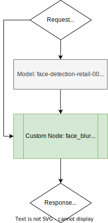
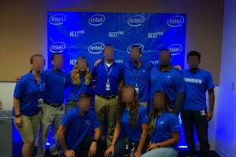

# Face Blur Pipeline Demo with OVMS {#ovms_demo_face_blur_pipeline}

This document demonstrates how to create pipelines using object detection models from OpenVINO Model Zoo in order to blur the image. As an example, we will use [face-detection-retail-0004](https://github.com/openvinotoolkit/open_model_zoo/blob/2022.1.0/models/intel/face-detection-retail-0004/README.md) to detect multiple faces on the image. Then, for each detected face we will blur it using [face_blur](https://github.com/openvinotoolkit/model_server/blob/releases/2022/1/src/custom_nodes/face_blur) example custom node.

## Pipeline Configuration Graph

Below is depicted graph implementing face blur pipeline execution.



It include the following Nodes:
- Model `face-detection-retail-0004` - deep learning model which takes user image as input. Its output contain information about faces coordinates and confidence levels.
- Custom node `face_blur` - it includes C++ implementation of image blurring. By analysing the output it produces image blurred in spots detected by object detection model based on the configurable score level threshold. Custom node also resizes it to the target resolution. All operations on the images employ OpenCV libraries which are preinstalled in the OVMS. Learn more about the [face_blur custom node](https://github.com/openvinotoolkit/model_server/blob/releases/2022/1/src/custom_nodes/face_blur).
- Response - image blurred in spots detected by object detection model.

## Prepare workspace to run the demo

To successfully deploy face blur pipeline you need to have a workspace that contains:
- [face-detection-retail-0004](https://github.com/openvinotoolkit/open_model_zoo/blob/2022.1.0/models/intel/face-detection-retail-0004/README.md)
- Custom node for image blurring
- Configuration file

Clone the repository and enter face_blur directory
```bash
git clone https://github.com/openvinotoolkit/model_server.git
cd model_server/demos/face_blur/python
```

You can prepare the workspace that contains all the above by just running

```bash
make
```

### Final directory structure

Once the `make` procedure is finished, you should have `workspace` directory ready with the following content.
```bash
workspace
├── config.json
├── face-detection-retail-0004
│   └── 1
│       ├── face-detection-retail-0004.bin
│       └── face-detection-retail-0004.xml
└── lib
    └── libcustom_node_face_blur.so
```

## Deploying OVMS

Deploy OVMS with face blur pipeline using the following command:

```bash
docker run -p 9000:9000 -d -v ${PWD}/workspace:/workspace openvino/model_server --config_path /workspace/config.json --port 9000
```

## Requesting the Service

Install python dependencies:
```bash
pip3 install -r requirements.txt
``` 

Now you can create a directory for blurred image and run the client:
```bash
mkdir results
```

```bash
python face_blur.py --grpc_port 9000 --image_input_path ../../common/static/images/people/people1.jpeg --blurred_image_save_path ./results --image_width 600 --image_height 400 --image_layout NHWC
```

Exemplary result of running the demo:


