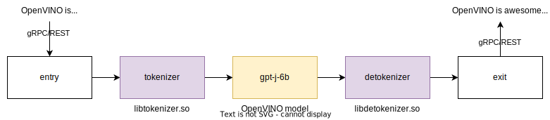

# GPT-J Causal Language Modeling Demo {#ovms_demo_gptj_causal_lm}

### Introduction
This demo illustrates usage of GPT-like models in OpenVINO™ Model Server. GPT-J 6B model used in this example can be found at [huggingface](https://huggingface.co/EleutherAI/gpt-j-6B) (~25GB). Steps below automate download and conversion steps to be able to load it using OpenVINO™. Example python client provided at the end of the document requests Model Server for the next word of the sentence until `EOS` (end of sequence) token is received. 


### Download the model

Prepare the environment:
```bash
git clone https://github.com/openvinotoolkit/model_server.git
cd model_server/demos/gptj_causal_lm/python
virtualenv .venv
source .venv/bin/activate
pip install -r requirements.txt
```

Download the GPT-J-6b model from huggingface and save to disk in pytorch format using script below.  
> NOTE: First download might take a while since the model is ~25GB. Subsequent script runs will use the model from cache located in `~/.cache/huggingface` directory.
```bash
python3 download_model.py
```
The script downloads the model using `transformers` pip library, loads into the memory using `pytorch` backend and saves into disk in pytorch format.  
> NOTE: Loading the model into CPU device takes ~48GB of RAM. Read more in the [model specification](https://huggingface.co/docs/transformers/v4.15.0/model_doc/gptj#overview).

### Convert the model
The model needs to be converted to ONNX format in order to load in OVMS:
```bash
chmod +x convert_model.sh && ./convert_model.sh
```
The model will reside in `onnx/1` directory.

The script should provide result confirming successful model conversion:
```bash
Validating ONNX model...
        -[✓] ONNX model output names match reference model ({'logits'})
        - Validating ONNX Model output "logits":
                -[✓] (3, 9, 50400) matches (3, 9, 50400)
                -[✓] all values close (atol: 0.0001)
All good, model saved at: onnx/1/model.onnx
```

### Start OVMS with prepared GPT-J-6b model

```bash
docker run -d --rm -p 9000:9000 -v $(pwd)/onnx:/model:ro openvino/model_server \
    --port 9000 \
    --model_name gpt-j-6b \
    --model_path /model \
    --plugin_config '{"PERFORMANCE_HINT":"LATENCY","NUM_STREAMS":1}'
```

### Interactive OVMS demo

Run `app.py` script to run interactive demo predicting the next word in a loop until end of sentence token is encountered.

```bash
python3 app.py --url localhost:9000 --model_name gpt-j-6b --input "Neurons are fascinating"
```

Output:
```bash
Neurons are fascinating cells that are able to communicate with each other and with other cells in the body. Neurons are the cells that make up the nervous system, which is responsible for the control of all body functions. Neurons are also responsible for the transmission of information from one part of the body to another.
Number of iterations: 62
First latency: 0.37613916397094727s
Last latency: 1.100903034210205s
```

## Validating the accuracy
### Run the OVMS simple client script
The script will display raw outputs for example input.
```bash
python3 infer_ovms.py --url localhost:9000 --model_name gpt-j-6b
```

Desired output:
```bash
[[[ 8.407803   7.2024884  5.114844  ... -6.691438  -6.7890754 -6.6537027]
  [ 6.97011    9.89741    8.216569  ... -3.891536  -3.6937592 -3.6568289]
  [ 8.199201  10.721757   8.502647  ... -6.340912  -6.247861  -6.1362333]
  [ 6.5459595 10.398776  11.310042  ... -5.9843545 -5.806437  -6.0776973]
  [ 8.934336  13.137416   8.568134  ... -6.835008  -6.7942514 -6.6916494]
  [ 5.1626735  6.062623   1.7213026 ... -7.789153  -7.568969  -7.6591196]]]
predicted word:  a
```

### Run the inference with pytorch
We run the inference with pytorch to compare the result:
```bash
python3 infer_torch.py
```

Output:
```bash
tensor([[[ 8.4078,  7.2025,  5.1148,  ..., -6.6914, -6.7891, -6.6537],
         [ 6.9701,  9.8974,  8.2166,  ..., -3.8915, -3.6938, -3.6568],
         [ 8.1992, 10.7218,  8.5026,  ..., -6.3409, -6.2479, -6.1362],
         [ 6.5460, 10.3988, 11.3100,  ..., -5.9844, -5.8064, -6.0777],
         [ 8.9343, 13.1374,  8.5681,  ..., -6.8350, -6.7943, -6.6916],
         [ 5.1627,  6.0626,  1.7213,  ..., -7.7891, -7.5690, -7.6591]]],
       grad_fn=<ViewBackward0>)
predicted word:  a
```

# Pipeline mode with server side tokenization and detokenization

This variant offloads tokenization and detokenization step from client to the server. OVMS can convert string proto to `2D U8` tensor and pass the data to tokenization custom node. This way we generate tokens for `gpt-j-6b` model automatically and get the response as text instead of probability vector.



## Prepare environment

Use `make` command to prepare custom node libraries, blingfire tokenization models and configuration file.

```bash
make
```

Workspace should look as follows:

```bash
tree workspace 
workspace
├── config.json
├── lib
│   ├── libdetokenizer.so
│   └── libtokenizer.so
└── tokenizers
    ├── gpt2.bin
    └── gpt2.i2w

2 directories, 5 files
```

Start OVMS with prepared workspace:

```bash
docker run -d --rm -p 9000:9000 \
    -v $(pwd)/onnx:/onnx:ro \
    -v $(pwd)/workspace:/workspace:ro \
    openvino/model_server \
    --port 9000 \
    --config_path /workspace/config.json
```

Install Tensorflow Serving API package:
```bash
pip install --upgrade pip
pip install tensorflow-serving-api==2.11.0
```

Run example client:

```bash
python3 dag_client.py --url localhost:9000 --model_name my_gpt_pipeline --input "Neurons are fascinating"

0.5515012741088867 Neurons are fascinating cells that are responsible for the transmission of information from one brain region to another. They are also responsible for the production of hormones and neurotransmitters that are responsible for the regulation of mood, sleep, appetite, and sexual function.
```
