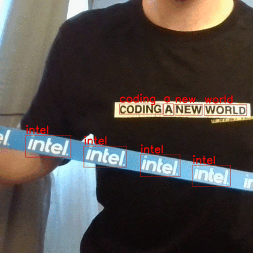

# Horizontal Text Detection in Real-Time {#ovms_demo_horizontal_text_detection}
This demo presents a use case with a client written in python which captures camera frames and performs text spotting analysis via gRPC requests to OVMS. The client visualizes the results as a boxes depicted on the original image frames using OpenCV in real-time.
The client can work efficiently also over slow internet connection with long latency thanks to image data compression and parallel execution for multiple frames.


### Download horizontal text detection model from OpenVINO Model Zoo

```bash
curl -L --create-dir https://storage.openvinotoolkit.org/repositories/open_model_zoo/2022.1/models_bin/2/horizontal-text-detection-0001/FP32/horizontal-text-detection-0001.bin -o horizontal-text-detection-0001/1/horizontal-text-detection-0001.bin https://storage.openvinotoolkit.org/repositories/open_model_zoo/2022.1/models_bin/2/horizontal-text-detection-0001/FP32/horizontal-text-detection-0001.xml -o horizontal-text-detection-0001/1/horizontal-text-detection-0001.xml
```

```bash
tree horizontal-text-detection-0001
horizontal-text-detection-0001
└── 1
    ├── horizontal-text-detection-0001.bin
    └── horizontal-text-detection-0001.xml
```

### Start the OVMS container:
```bash
docker run -d -u $(id -u):$(id -g) -v $(pwd)/horizontal-text-detection-0001:/model -p 9000:9000 openvino/model_server:latest \
--model_path /model --model_name text --port 9000 --layout NHWC:NCHW
```

### Run the client

Clone the repository and enter horizontal_text_detection directory
```bash
git clone https://github.com/openvinotoolkit/model_server.git
cd model_server/demos/horizontal_text_detection/python
```

Install required packages:
```bash
pip3 install -r requirements.txt
```

Start the client
```bash
python3 horizontal_text_detection.py --grpc_address localhost --grpc_port 9000
```
You can also change the camera ID:
```bash
python3 horizontal_text_detection.py --grpc_address localhost --grpc_port 9000 --video_source 0
```
Or choose to work with video file as well:
```bash
python3 horizontal_text_detection.py --grpc_address localhost --grpc_port 9000 --video_source ~/video.mp4
```
Example output:
```bash
Initializing requesting thread index: 0
Initializing requesting thread index: 1
Initializing requesting thread index: 2
Initializing requesting thread index: 3
Launching requesting thread index: 0
Launching requesting thread index: 1
Launching requesting thread index: 2
Launching requesting thread index: 3
ThreadID:   0; Current FPS:    31.25; Average FPS:    25.64; Average latency:   140.98ms
ThreadID:   1; Current FPS:    31.23; Average FPS:    25.67; Average latency:   136.36ms
ThreadID:   2; Current FPS:    29.41; Average FPS:    25.70; Average latency:   130.88ms
ThreadID:   3; Current FPS:    30.30; Average FPS:    25.73; Average latency:   135.65ms
...
```

> **NOTE**: Video source is cropped to 704x704 resolution to match model input size.

## Recognize Detected Text with OCR Pipeline
Optical Character Recognition (OCR) pipeline based on [horizontal text detection](https://github.com/openvinotoolkit/open_model_zoo/blob/releases/2023/0/models/intel/horizontal-text-detection-0001/README.md) model, [text recognition](https://github.com/openvinotoolkit/open_model_zoo/tree/2022.1.0/models/intel/text-recognition-0014)
combined with a custom node implementation can be used with the same python script used before. OCR pipeline provides location of detected text boxes on the image and additionally recognized text for each box.



### Prepare workspace to run the demo

To successfully deploy OCR pipeline you need to have a workspace that contains:
- [horizontal text detection](https://github.com/openvinotoolkit/open_model_zoo/blob/releases/2022/1/models/intel/horizontal-text-detection-0001/README.md) and [text recognition](https://github.com/openvinotoolkit/open_model_zoo/tree/2022.1.0/models/intel/text-recognition-0014) models
- Custom node for image processing
- Configuration file

Clone the repository and enter horizontal_text_detection directory
```bash
git clone https://github.com/openvinotoolkit/model_server.git
cd model_server/demos/horizontal_text_detection/python
```

You can prepare the workspace that contains all the above by just running `make` command.
Since custom node used in this demo is included in OpenVINO Model Server image you can either use the custom node from the image, or build one.

If you just want to quickly run this demo and use already compiled custom node, run:

```bash
make
```

#### Directory structure (without custom node)

Once the `make` procedure is finished, you should have `workspace` directory ready with the following content.

```bash
workspace/
├── config.json
├── horizontal-text-detection-0001
│   └── 1
│       ├── horizontal-text-detection-0001.bin
│       └── horizontal-text-detection-0001.xml
└── text-recognition-0014
    └── 1
        ├── text-recognition-0014.bin
        └── text-recognition-0014.xml

```

If you modified the custom node or for some other reason, you want to have it compiled and then attached to the container, run:

```bash
make BUILD_CUSTOM_NODE=true BASE_OS=ubuntu
```

#### Directory structure (with custom node)

Once the `make` procedure is finished, you should have `workspace` directory ready with the following content.

```bash
workspace/
├── config.json
├── horizontal-text-detection-0001
│   └── 1
│       ├── horizontal-text-detection-0001.bin
│       └── horizontal-text-detection-0001.xml
├── lib
│   └── libcustom_node_horizontal_ocr.so
└── text-recognition-0014
    └── 1
        ├── text-recognition-0014.bin
        └── text-recognition-0014.xml

```
## Deploying OVMS

Deploy OVMS with faces analysis pipeline using the following command:

```bash
docker run -p 9000:9000 -d -v ${PWD}/workspace:/workspace openvino/model_server --config_path /workspace/config.json --port 9000
```

### Sending Request to the Server

Install python dependencies:
```bash
pip3 install -r requirements.txt
```

Start the client
```bash
python3 horizontal_text_detection.py --grpc_address localhost --grpc_port 9000 --use_case ocr
```
You can also change the camera ID:
```bash
python3 horizontal_text_detection.py --grpc_address localhost --grpc_port 9000 --use_case ocr --video_source 0
```
Or choose to work with video file as well:
```bash
python3 horizontal_text_detection.py --grpc_address localhost --grpc_port 9000 --use_case ocr --video_source ~/video.mp4
```
Example output:
```bash
Initializing requesting thread index: 0
Initializing requesting thread index: 1
Initializing requesting thread index: 2
Initializing requesting thread index: 3
Launching requesting thread index: 0
Launching requesting thread index: 1
Launching requesting thread index: 2
Launching requesting thread index: 3
ThreadID:   0; Current FPS:    31.25; Average FPS:    25.64; Average latency:   140.98ms
ThreadID:   1; Current FPS:    31.23; Average FPS:    25.67; Average latency:   136.36ms
ThreadID:   2; Current FPS:    29.41; Average FPS:    25.70; Average latency:   130.88ms
ThreadID:   3; Current FPS:    30.30; Average FPS:    25.73; Average latency:   135.65ms
...
```

## RTSP Client

Build docker image containing rtsp client along with its dependencies
The rtsp client app needs to have access to RTSP stream to read from and write to.

Example rtsp server [mediamtx](https://github.com/bluenviron/mediamtx)

```bash
docker run --rm -d -p 8080:8554 -e RTSP_PROTOCOLS=tcp bluenviron/mediamtx:latest
```

Then write to the server using ffmpeg, example using video or camera

```bash
ffmpeg -stream_loop -1 -i ./video.mp4 -f rtsp -rtsp_transport tcp rtsp://localhost:8080/channel1
```


```
ffmpeg -f dshow -i video="HP HD Camera" -f rtsp -rtsp_transport tcp rtsp://localhost:8080/channel1
```

Build the docker image with the python client for video stream reading an remote analysis:
```bash
docker build ../../common/stream_client/ -t rtsp_client
```

### Start the client

- Command

```bash
docker run -v $(pwd):/workspace rtsp_client --help
usage: client.py [-h] [--grpc_address GRPC_ADDRESS]
                 [--input_stream INPUT_STREAM] [--output_stream OUTPUT_STREAM]
                 [--model_name MODEL_NAME] [--width WIDTH] [--height HEIGHT]
                 [--input_name INPUT_NAME] [--verbose] [--benchmark]
                 [--limit_stream_duration LIMIT_STREAM_DURATION]
                 [--limit_frames LIMIT_FRAMES]

options:
  -h, --help            show this help message and exit
  --grpc_address GRPC_ADDRESS
                        Specify url to grpc service
  --input_stream INPUT_STREAM
                        Url of input rtsp stream
  --output_stream OUTPUT_STREAM
                        Url of output rtsp stream
  --model_name MODEL_NAME
                        Name of the model
  --width WIDTH         Width of model's input image
  --height HEIGHT       Height of model's input image
  --input_name INPUT_NAME
                        Name of the model's input
  --verbose             Should client dump debug information
  --benchmark           Should client collect processing times
  --limit_stream_duration LIMIT_STREAM_DURATION
                        Limit how long client should run
  --limit_frames LIMIT_FRAMES
                        Limit how many frames should be processed
```

- Usage example

```bash
docker run --network="host" -v $(pwd):/workspace rtsp_client --grpc_address localhost:9000 --input_stream 'rtsp://localhost:8080/channel1' --output_stream 'rtsp://localhost:8080/channel2'
```

Then read rtsp stream using ffplay

```bash
ffplay -pixel_format yuv420p -video_size 704x704 -rtsp_transport tcp rtsp://localhost:8080/channel2
```


One might as well use prerecorded video and schedule it for inference.
Replace horizontal_text.mp4 with your video file.

```bash
docker run --network="host" -v $(pwd):/workspace rtsp_client --grpc_address localhost:9000 --input_stream 'workspace/horizontal_text.mp4' --output_stream 'workspace/output.mp4'
```
