# Image Generation with OpenAI API {#ovms_demos_image_generation}

This demo shows how to deploy image generation models (Stable Diffusion/Stable Diffusion 3/Stable Diffusion XL/FLUX) to create and edit images with the OpenVINO Model Server.
Image generation pipelines are exposed via [OpenAI API](https://platform.openai.com/docs/api-reference/images/create) `images/generations` and `images/edits` endpoints.

Supported workloads:
- **Text-to-image** — generate an image from a text prompt (`/v3/images/generations`)
- **Image-to-image** — transform an existing image guided by a prompt (`/v3/images/edits`)
- **Inpainting** — repaint a masked region of an image (`/v3/images/edits` with `mask` field)
- **Outpainting** — extend an image beyond its original borders (`/v3/images/edits` with `mask` field and larger canvas)

Check [supported models](https://openvinotoolkit.github.io/openvino.genai/docs/supported-models/#image-generation-models).

> **Note:** Please note that FLUX models are not supported on NPU.

> **Note:** This demo was tested on Intel® Xeon®, Intel® Core®, Intel® Arc™ A770, Intel® Arc™ B580 on Ubuntu 22/24, RedHat 9 and Windows 11.

## Prerequisites

**RAM/vRAM** Select model size and precision according to your hardware capabilities (RAM/vRAM). Request resolution plays significant role in memory consumption, so the higher resolution you request, the more RAM/vRAM is required.

**Model preparation** (one of the below):
- preconfigured models from HuggingFaces directly in OpenVINO IR format, list of Intel uploaded models available [here](https://huggingface.co/collections/OpenVINO/image-generation-67697d9952fb1eee4a252aa8))
- or Python 3.9+ with pip and HuggingFace account to download, convert and quantize manually using [Export Models Tool](../common/export_models/README.md)

**Model Server deployment**: Installed Docker Engine or OVMS binary package according to the [baremetal deployment guide](../../docs/deploying_server_baremetal.md)

**Client**:  Python for using OpenAI client package and Pillow to save image or simply cURL


## Option 1. Downloading the models directly via OVMS

> **NOTE:** Model downloading feature is described in depth in separate documentation page: [Pulling HuggingFaces Models](../../docs/pull_hf_models.md).

This command pulls the `OpenVINO/stable-diffusion-v1-5-int8-ov` quantized model directly from HuggingFaces and starts the serving. If the model already exists locally, it will skip the downloading and immediately start the serving.

> **NOTE:** Optionally, to only download the model and omit the serving part, use `--pull` parameter.

### CPU

::::{tab-set}
:::{tab-item} Docker (Linux)
:sync: docker
Start docker container:
```bash
mkdir -p ${HOME}/models

docker run -d --rm --user $(id -u):$(id -g) -p 8000:8000 -v ${HOME}/models:/models:rw \
  -e http_proxy=$http_proxy -e https_proxy=$https_proxy -e no_proxy=$no_proxy \
  openvino/model_server:latest \
    --rest_port 8000 \
    --model_repository_path /models \
    --task image_generation \
    --source_model OpenVINO/stable-diffusion-v1-5-int8-ov
```
:::

:::{tab-item} Bare metal (Windows)
:sync: bare-metal

Assuming you have unpacked model server package, make sure to:

- **On Windows**: run `setupvars` script
- **On Linux**: set `LD_LIBRARY_PATH` and `PATH` environment variables

as mentioned in [deployment guide](../../docs/deploying_server_baremetal.md), in every new shell that will start OpenVINO Model Server.


```bat
if not exist c:\models mkdir c:\models

ovms --rest_port 8000 ^
  --model_repository_path c:\models ^
  --task image_generation ^
  --source_model OpenVINO/stable-diffusion-v1-5-int8-ov
```
:::

::::

### GPU

::::{tab-set}
:::{tab-item} Docker (Linux)
:sync: docker
In case you want to use Intel GPU device to run the generation, add extra docker parameters `--device /dev/dri --group-add=$(stat -c "%g" /dev/dri/render* | head -n 1)` to `docker run` command, use the docker image with GPU support. Export the models with precision matching the GPU capacity and adjust pipeline configuration.
It can be applied using the commands below:
```bash
mkdir -p ${HOME}/models

docker run -d --rm -p 8000:8000 -v ${HOME}/models:/models:rw \
  --user $(id -u):$(id -g) --device /dev/dri --group-add=$(stat -c "%g" /dev/dri/render* | head -n 1) \
  -e http_proxy=$http_proxy -e https_proxy=$https_proxy -e no_proxy=$no_proxy \
  openvino/model_server:latest-gpu \
    --rest_port 8000 \
    --model_repository_path /models \
    --task image_generation \
    --source_model OpenVINO/stable-diffusion-v1-5-int8-ov \
    --target_device GPU
```
:::

:::{tab-item} Bare metal (Windows)
:sync: bare-metal

If you run on GPU make sure to have appropriate drivers installed, so the device is accessible for the model server.

```bat
if not exist c:\models mkdir c:\models

ovms --rest_port 8000 ^
  --model_repository_path c:\models ^
  --task image_generation ^
  --source_model OpenVINO/stable-diffusion-v1-5-int8-ov ^
  --target_device GPU
```
:::

::::


### NPU or mixed device

Image generation endpoints consist of 3 models: vae encoder, denoising and vae decoder. It is possible to select device for each step separately. In this example, we will use NPU for text encoding and denoising, and GPU for vae decoder. This is useful when the model is too large to fit into NPU memory, but the NPU can still be used for the first two steps.

::::{tab-set}
:::{tab-item} Docker (Linux)
:sync: docker
In case you want to use Intel NPU device to run the generation, add extra docker parameters `--device /dev/accel --group-add=$(stat -c "%g" /dev/dri/render* | head -n 1)` to `docker run` command, use the docker image with NPU support. Export the models with precision matching the NPU capacity and adjust pipeline configuration.
In this specific case, we also need to use `--device /dev/dri`, because we also use GPU.

> **NOTE:** The NPU device requires the pipeline to be reshaped to static shape, this is why the `--resolution` parameter is used to define the input resolution.

> **NOTE:** In case the model loading phase takes too long, consider caching the model with `--cache_dir` parameter, as seen in example below.

It can be applied using the commands below:
```bash
mkdir -p ${HOME}/models
mkdir -p ${HOME}/cache

docker run -d --rm -p 8000:8000 \
  -v ${HOME}/models:/models:rw \
  -v ${HOME}/cache:/cache:rw \
  --user $(id -u):$(id -g) --device /dev/accel --device /dev/dri --group-add=$(stat -c "%g" /dev/dri/render* | head -n 1) \
  -e http_proxy=$http_proxy -e https_proxy=$https_proxy -e no_proxy=$no_proxy \
  openvino/model_server:latest-gpu \
    --rest_port 8000 \
    --model_repository_path /models \
    --task image_generation \
    --source_model OpenVINO/stable-diffusion-v1-5-int8-ov \
    --target_device 'NPU NPU NPU' \
    --resolution 512x512 \
    --cache_dir /cache
```
:::

:::{tab-item} Bare metal (Windows)
:sync: bare-metal


```bat
if not exist c:\models mkdir c:\models
if not exist c:\cache mkdir c:\cache

ovms --rest_port 8000 ^
  --model_repository_path c:\models ^
  --task image_generation ^
  --source_model OpenVINO/stable-diffusion-v1-5-int8-ov ^
  --target_device "NPU NPU NPU" ^
  --resolution 512x512 ^
  --cache_dir c:\cache
```
:::

::::


### SDXL model deployment

To deploy an SDXL model (higher quality, 1024×1024 native resolution), use a different `--source_model`:

::::{tab-set}
:::{tab-item} Docker (Linux) — GPU
:sync: docker

Start docker container:
```bash
mkdir -p ${HOME}/models

docker run -d --rm -p 8000:8000 -v ${HOME}/models:/models:rw \
  --user $(id -u):$(id -g) --device /dev/dri --group-add=$(stat -c "%g" /dev/dri/render* | head -n 1) \
  -e http_proxy=$http_proxy -e https_proxy=$https_proxy -e no_proxy=$no_proxy \
  openvino/model_server:latest-gpu \
    --rest_port 8000 \
    --model_repository_path /models \
    --task image_generation \
    --source_model OpenVINO/stable-diffusion-xl-base-1.0-int8-ov \
    --target_device GPU
```
:::

:::{tab-item} Bare metal (Windows)
:sync: bare-metal

```bat
if not exist c:\models mkdir c:\models

ovms --rest_port 8000 ^
  --model_repository_path c:\models ^
  --task image_generation ^
  --source_model OpenVINO/stable-diffusion-xl-base-1.0-int8-ov ^
  --target_device GPU
```
:::

::::

> **NOTE:** SDXL models require more RAM/vRAM than SD 1.5. Use `--resolution 1024x1024` when deploying on NPU.


## Option 2. Serving a pre-downloaded model

If you already have a model on disk (downloaded via Option 1 with `--pull`, or via `huggingface-cli`, or converted with [Export Models Tool](../common/export_models/README.md)), you can start the server pointing directly to the model directory using `--model_name` and `--model_path`:

::::{tab-set}
:::{tab-item} Docker (Linux)
:sync: docker

```bash
docker run -d --rm -p 8000:8000 -v ${HOME}/models:/models:rw \
  openvino/model_server:latest \
    --rest_port 8000 \
    --model_name sd15 \
    --model_path /models/OpenVINO/stable-diffusion-v1-5-int8-ov
```
:::

:::{tab-item} Bare metal (Windows)
:sync: bare-metal

```bat
ovms --rest_port 8000 ^
  --model_name sd15 ^
  --model_path c:\models\OpenVINO\stable-diffusion-v1-5-int8-ov
```
:::

::::

> **NOTE:** The model directory must contain a valid `graph.pbtxt` file. This file is auto-generated when using `--pull` or `--source_model`. If you downloaded the model manually (e.g., via `huggingface-cli`), you can generate it by running `ovms --pull` with the same `--model_repository_path` and `--source_model` parameters, or create it manually — see [Image Generation calculator reference](../../docs/image_generation/reference.md) for all available options.


## Readiness Check

Wait for the model to load. You can check the status with a simple command:
```console
curl http://localhost:8000/v3/models
```

```json
{
  "object": "list",
  "data": [
    {
      "id": "OpenVINO/stable-diffusion-v1-5-int8-ov",
      "object": "model",
      "created": 0,
      "owned_by": "OVMS"
    }
  ]
}
```

## Request Generation

A single servable exposes the following endpoints:
- **Text-to-image**: `images/generations` — JSON body with `prompt`
- **Image-to-image**: `images/edits` — multipart form with `image` + `prompt` (no mask)
- **Inpainting**: `images/edits` — multipart form with `image` + `mask` + `prompt`
- **Outpainting**: `images/edits` — multipart form with `image` + `mask` + `prompt` (image placed on larger canvas, mask marks the area to fill)

> **Note:** Inpainting/outpainting requests are processed sequentially — concurrent requests will be queued.

> **Note:** Dedicated inpainting models (e.g. `stable-diffusion-v1-5/stable-diffusion-inpainting`) only support the `images/edits` endpoint — they cannot be used for text-to-image generation via `images/generations`. General-purpose models (e.g. SDXL) support both endpoints. Check [supported models](https://openvinotoolkit.github.io/openvino.genai/docs/supported-models/#image-generation-models).

All requests are processed in unary format, with no streaming capabilities.

### Requesting images/generations API using cURL 

Linux
```bash
curl http://localhost:8000/v3/images/generations \
  -H "Content-Type: application/json" \
  -d '{
    "model": "OpenVINO/stable-diffusion-v1-5-int8-ov",
    "prompt": "Three astronauts on the moon, cold color palette, muted colors, detailed, 8k",
    "rng_seed": 409,
    "num_inference_steps": 50,
    "size": "512x512"
  }'| jq -r '.data[0].b64_json' | base64 --decode > generate_output.png
```

Windows Powershell
```powershell
$response = Invoke-WebRequest -Uri "http://localhost:8000/v3/images/generations" `
    -Method POST `
    -Headers @{ "Content-Type" = "application/json" } `
    -Body '{"model": "OpenVINO/stable-diffusion-v1-5-int8-ov", "prompt": "Three astronauts on the moon, cold color palette, muted colors, detailed, 8k", "rng_seed": 409, "num_inference_steps": 50, "size": "512x512"}'

$base64 = ($response.Content | ConvertFrom-Json).data[0].b64_json

[IO.File]::WriteAllBytes('generate_output.png', [Convert]::FromBase64String($base64))
```

Windows Command Prompt
```bat
curl http://localhost:8000/v3/images/generations ^
  -H "Content-Type: application/json" ^
  -d "{\"model\": \"OpenVINO/stable-diffusion-v1-5-int8-ov\", \"prompt\": \"Three astronauts on the moon, cold color palette, muted colors, detailed, 8k\", \"rng_seed\": 409, \"num_inference_steps\": 50, \"size\": \"512x512\"}"
```


Expected Response
```json
{
  "data": [
    {
      "b64_json": "..."
    }
  ]
}
```

The commands will have the generated image saved in generate_output.png.

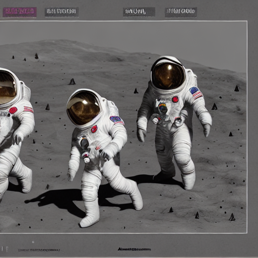


### Requesting image generation with OpenAI Python package

The image generation/edit endpoints are compatible with OpenAI client:

Install the client library:
```console
pip3 install openai pillow
```

```python
from openai import OpenAI
import base64
from io import BytesIO
from PIL import Image

client = OpenAI(
    base_url="http://localhost:8000/v3",
    api_key="unused"
)

response = client.images.generate(
            model="OpenVINO/stable-diffusion-v1-5-int8-ov",
            prompt="Three astronauts on the moon, cold color palette, muted colors, detailed, 8k",
            extra_body={
                "rng_seed": 409,
                "size": "512x512",
                "num_inference_steps": 50
            }
        )
base64_image = response.data[0].b64_json

image_data = base64.b64decode(base64_image)
image = Image.open(BytesIO(image_data))
image.save('generate_output.png')
```

### Requesting image edit with OpenAI Python package

Example changing the previously generated image to: `Three astronauts in the jungle, vibrant color palette, live colors, detailed, 8k`:

```python
from openai import OpenAI
import base64
from io import BytesIO
from PIL import Image

client = OpenAI(
    base_url="http://localhost:8000/v3",
    api_key="unused"
)

response = client.images.edit(
            model="OpenVINO/stable-diffusion-v1-5-int8-ov",
            image=open("generate_output.png", "rb"),
            prompt="Three astronauts in the jungle, vibrant color palette, live colors, detailed, 8k",
            extra_body={
                "rng_seed": 409,
                "size": "512x512",
                "num_inference_steps": 50,
                "strength": 0.67
            }
        )
base64_image = response.data[0].b64_json

image_data = base64.b64decode(base64_image)
image = Image.open(BytesIO(image_data))
image.save('edit_output.png')
```

Output file (`edit_output.png`):  
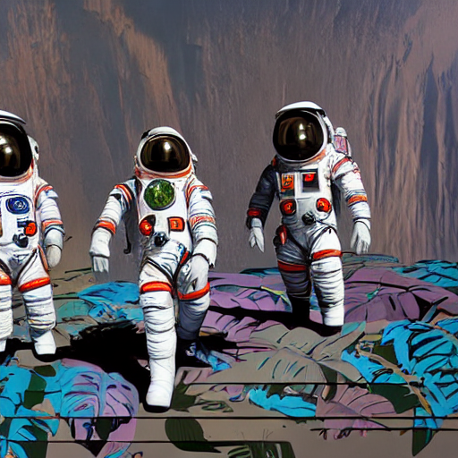

### Requesting inpainting with cURL

Inpainting replaces a masked region in an image based on the prompt. The `mask` is a black-and-white image where white pixels mark the area to repaint.

Download sample images:
```console
curl -O https://raw.githubusercontent.com/openvinotoolkit/model_server/main/demos/image_generation/cat.png
curl -O https://raw.githubusercontent.com/openvinotoolkit/model_server/main/demos/image_generation/cat_mask.png
```

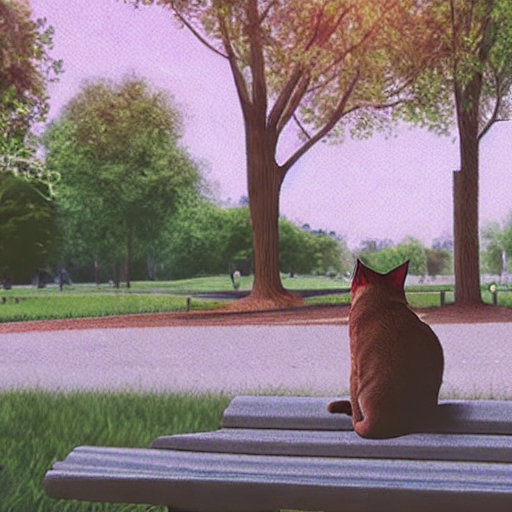 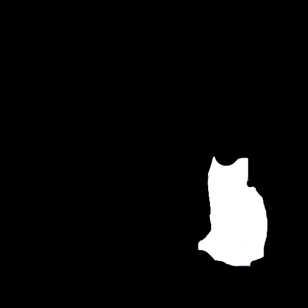

::::{tab-set}
:::{tab-item} Linux
:sync: linux
```bash
curl http://localhost:8000/v3/images/edits \
  -F "model=OpenVINO/stable-diffusion-v1-5-int8-ov" \
  -F "prompt=a golden retriever dog sitting on a bench in a sunny park" \
  -F "image=@cat.png" \
  -F "mask=@cat_mask.png" \
  -F "num_inference_steps=50" \
  -F "size=512x512" | jq -r '.data[0].b64_json' | base64 --decode > inpaint_output.png
```
:::

:::{tab-item} Windows Command Prompt
:sync: windows
```bat
curl http://localhost:8000/v3/images/edits ^
  -F "model=OpenVINO/stable-diffusion-v1-5-int8-ov" ^
  -F "prompt=a golden retriever dog sitting on a bench in a sunny park" ^
  -F "image=@cat.png" ^
  -F "mask=@cat_mask.png" ^
  -F "num_inference_steps=50" ^
  -F "size=512x512"
```
:::

::::

Expected output (`inpaint_output.png`):

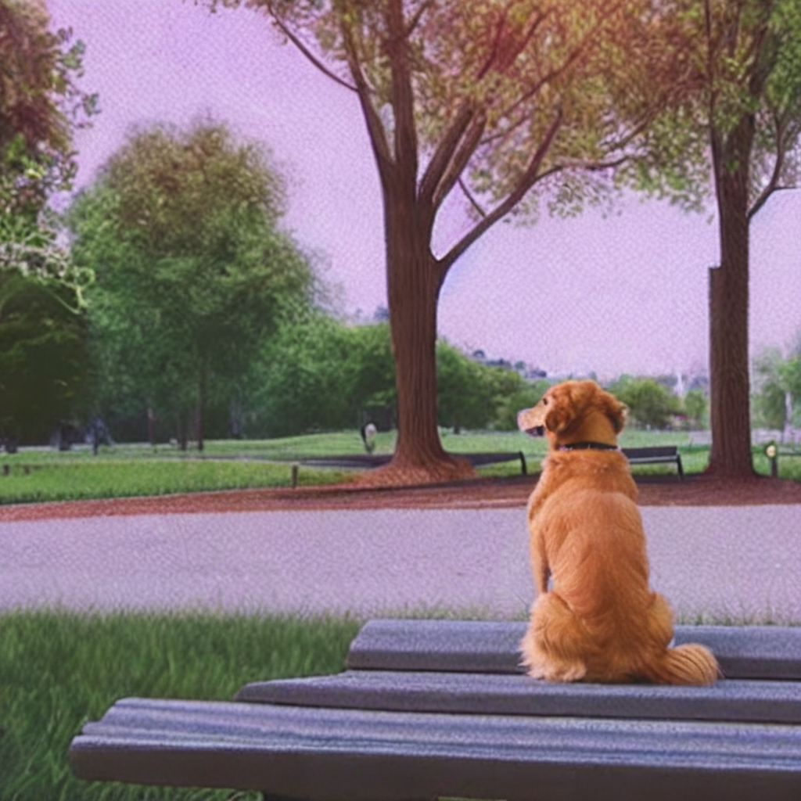

### Requesting inpainting with OpenAI Python package

```python
from openai import OpenAI
import base64
from io import BytesIO
from PIL import Image

client = OpenAI(
    base_url="http://localhost:8000/v3",
    api_key="unused"
)

response = client.images.edit(
            model="OpenVINO/stable-diffusion-v1-5-int8-ov",
            image=open("cat.png", "rb"),
            mask=open("cat_mask.png", "rb"),
            prompt="a golden retriever dog sitting on a bench in a sunny park",
            extra_body={
                "num_inference_steps": 50,
                "size": "512x512"
            }
        )
base64_image = response.data[0].b64_json

image_data = base64.b64decode(base64_image)
image = Image.open(BytesIO(image_data))
image.save('inpaint_output.png')
```

### Requesting outpainting with cURL

Outpainting extends an image beyond its original borders. Prepare two images:
- **outpaint_input.png** — the original image centered on a larger canvas (e.g. 768×768) with black borders
- **outpaint_mask.png** — white where the new content should be generated (the borders), black where the original image is

Download sample images:
```console
curl -O https://raw.githubusercontent.com/openvinotoolkit/model_server/main/demos/image_generation/outpaint_input.png
curl -O https://raw.githubusercontent.com/openvinotoolkit/model_server/main/demos/image_generation/outpaint_mask.png
```

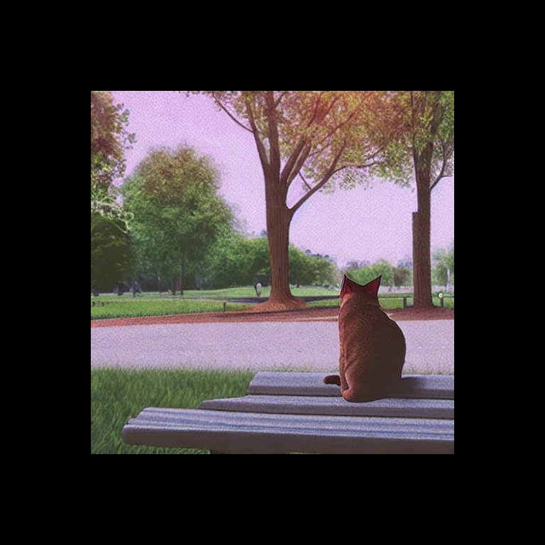 

::::{tab-set}
:::{tab-item} Linux
:sync: linux
```bash
curl http://localhost:8000/v3/images/edits \
  -F "model=OpenVINO/stable-diffusion-v1-5-int8-ov" \
  -F "prompt=a cat sitting on a bench in a park" \
  -F "image=@outpaint_input.png" \
  -F "mask=@outpaint_mask.png" \
  -F "num_inference_steps=50" \
  -F "size=768x768" | jq -r '.data[0].b64_json' | base64 --decode > outpaint_output.png
```
:::

:::{tab-item} Windows Command Prompt
:sync: windows
```bat
curl http://localhost:8000/v3/images/edits ^
  -F "model=OpenVINO/stable-diffusion-v1-5-int8-ov" ^
  -F "prompt=a cat sitting on a bench in a park" ^
  -F "image=@outpaint_input.png" ^
  -F "mask=@outpaint_mask.png" ^
  -F "num_inference_steps=50" ^
  -F "size=768x768"
```
:::

::::

Expected output (`outpaint_output.png`):

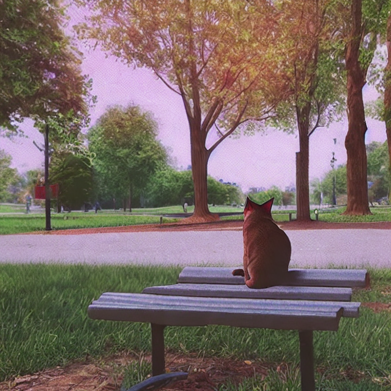

### Requesting outpainting with OpenAI Python package

```python
from openai import OpenAI
import base64
from io import BytesIO
from PIL import Image

client = OpenAI(
    base_url="http://localhost:8000/v3",
    api_key="unused"
)

response = client.images.edit(
            model="OpenVINO/stable-diffusion-v1-5-int8-ov",
            image=open("outpaint_input.png", "rb"),
            mask=open("outpaint_mask.png", "rb"),
            prompt="a cat sitting on a bench in a park",
            extra_body={
                "num_inference_steps": 50,
                "size": "768x768"
            }
        )
base64_image = response.data[0].b64_json

image_data = base64.b64decode(base64_image)
image = Image.open(BytesIO(image_data))
image.save('outpaint_output.png')
```

### Using dedicated inpainting models

For best inpainting/outpainting quality, use a dedicated inpainting model. These models have a 9-channel UNet specifically trained for masked generation.

Example models for inpainting:
- `OpenVINO/dreamshaper-8-inpainting-int8-ov` — SD 1.5 based, 512×512 native resolution
- `OpenVINO/stable-diffusion-xl-base-1.0-int8-ov` — SDXL based, 1024×1024 native resolution (supports all endpoints including inpainting)

For the full list see [supported image generation models](https://openvinotoolkit.github.io/openvino.genai/docs/supported-models/#image-generation-models).

> **Note:** Dedicated inpainting models only expose the `images/edits` endpoint (with mask). Text-to-image and image-to-image requests will return an error indicating the pipeline is not available for this model. Base models (e.g. `stable-diffusion-v1-5/stable-diffusion-v1-5`) support all endpoints including inpainting.

::::{tab-set}
:::{tab-item} Docker (Linux) — GPU
:sync: docker-gpu
```bash
mkdir -p ${HOME}/models

docker run -d --rm -p 8000:8000 -v ${HOME}/models:/models:rw \
  --user $(id -u):$(id -g) --device /dev/dri --group-add=$(stat -c "%g" /dev/dri/render* | head -n 1) \
  -e http_proxy=$http_proxy -e https_proxy=$https_proxy -e no_proxy=$no_proxy \
  openvino/model_server:latest-gpu \
    --rest_port 8000 \
    --model_repository_path /models \
    --task image_generation \
    --source_model OpenVINO/dreamshaper-8-inpainting-int8-ov \
    --target_device GPU
```
:::

:::{tab-item} Bare metal (Windows)
:sync: bare-metal
```bat
if not exist c:\models mkdir c:\models

ovms --rest_port 8000 ^
  --model_repository_path c:\models ^
  --task image_generation ^
  --source_model OpenVINO/dreamshaper-8-inpainting-int8-ov ^
  --target_device GPU
```
:::

::::


### Strength influence on final image

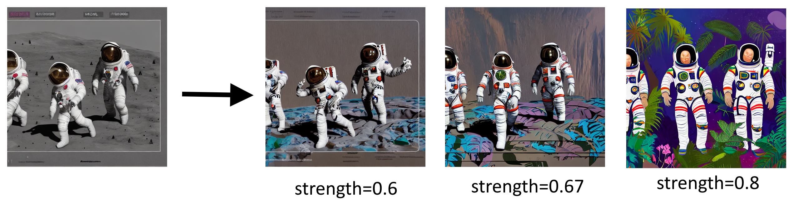

Please follow [OpenVINO notebook](https://github.com/openvinotoolkit/openvino_notebooks/blob/latest/notebooks/image-to-image-genai/image-to-image-genai.ipynb) to understand how other parameters affect editing.

## Multi-LoRA Image Generation

This section demonstrates how to serve multiple LoRA adapters with a single SDXL base model, enabling per-request style selection. This replicates the [Multi LoRA Image Generation notebook](https://github.com/openvinotoolkit/openvino_notebooks/blob/latest/notebooks/multilora-image-generation/multilora-image-generation.ipynb) but using OVMS for serving.

### Start Server with Multiple LoRA Adapters

The following command starts OVMS with Stable Diffusion XL and 5 LoRA adapters for different artistic styles:

::::{tab-set}
:::{tab-item} Docker (Linux)
:sync: docker
```bash
mkdir -p models

docker run -d --rm --user $(id -u):$(id -g) -p 8000:8000 -v $(pwd)/models:/models/:rw \
  -e http_proxy=$http_proxy -e https_proxy=$https_proxy -e no_proxy=$no_proxy \
  openvino/model_server:latest \
    --rest_port 8000 \
    --model_repository_path /models/ \
    --task image_generation \
    --source_model OpenVINO/stable-diffusion-xl-base-1.0-int8-ov \
    --source_loras "xray=DoctorDiffusion/doctor-diffusion-s-xray-xl-lora@DD-xray-v1.safetensors,thepoint=alvdansen/the-point@araminta_k_the_point.safetensors,ukiyo=KappaNeuro/ukiyo-e-art@Ukiyo-e Art.safetensors,vector=DoctorDiffusion/doctor-diffusion-s-controllable-vector-art-xl-lora@DD-vector-v2.safetensors,chalk=Norod78/sdxl-chalkboarddrawing-lora@SDXL_ChalkBoardDrawing_LoRA_r8.safetensors"
```
:::

:::{tab-item} Bare metal (Windows)
:sync: bare-metal
```bat
mkdir models

ovms --rest_port 8000 ^
  --model_repository_path ./models/ ^
  --task image_generation ^
  --source_model OpenVINO/stable-diffusion-xl-base-1.0-int8-ov ^
  --source_loras "xray=DoctorDiffusion/doctor-diffusion-s-xray-xl-lora@DD-xray-v1.safetensors,thepoint=alvdansen/the-point@araminta_k_the_point.safetensors,ukiyo=KappaNeuro/ukiyo-e-art@Ukiyo-e Art.safetensors,vector=DoctorDiffusion/doctor-diffusion-s-controllable-vector-art-xl-lora@DD-vector-v2.safetensors,chalk=Norod78/sdxl-chalkboarddrawing-lora@SDXL_ChalkBoardDrawing_LoRA_r8.safetensors"
```
:::

::::

The registered adapters and their recommended use:

| Alias | Repository | Style | Recommended Alpha | Prompt Template |
|-------|-----------|-------|-------------------|-----------------|
| `xray` | DoctorDiffusion/doctor-diffusion-s-xray-xl-lora | X-Ray style | 1.0 | `xray <subject>` |
| `thepoint` | alvdansen/the-point | Artistic illustration | 1.0 | `<subject>` |
| `ukiyo` | KappaNeuro/ukiyo-e-art | Ukiyo-e Japanese art | 1.0 | `an illustration of <subject> in Ukiyo-e Art style` |
| `vector` | DoctorDiffusion/doctor-diffusion-s-controllable-vector-art-xl-lora | Vector art | 1.0 | `vector <subject>` |
| `chalk` | Norod78/sdxl-chalkboarddrawing-lora | Chalkboard drawing | 1.0 | `A colorful chalkboard drawing of <subject>` |

### Generate Images with Different Styles

Use the adapter alias as the `model` field to select which adapter to apply per request. The adapter is activated via **model name routing** — when the `model` field matches a registered LoRA alias, that adapter is automatically applied.

**X-Ray style:**
```bash
curl http://localhost:8000/v3/images/generations \
  -H "Content-Type: application/json" \
  -d '{
    "model": "xray",
    "prompt": "xray a cute cat in sunglasses",
    "num_inference_steps": 40,
    "guidance_scale": 7.5,
    "size": "1024x1024"
  }' | jq -r '.data[0].b64_json' | base64 --decode > xray_cat.png
```

**Ukiyo-e Japanese art:**
```bash
curl http://localhost:8000/v3/images/generations \
  -H "Content-Type: application/json" \
  -d '{
    "model": "ukiyo",
    "prompt": "an illustration of a cute cat in sunglasses in Ukiyo-e Art style",
    "num_inference_steps": 40,
    "guidance_scale": 7.5,
    "size": "1024x1024"
  }' | jq -r '.data[0].b64_json' | base64 --decode > ukiyo_cat.png
```

**Vector art:**
```bash
curl http://localhost:8000/v3/images/generations \
  -H "Content-Type: application/json" \
  -d '{
    "model": "vector",
    "prompt": "vector a cute cat in sunglasses",
    "num_inference_steps": 40,
    "guidance_scale": 7.5,
    "size": "1024x1024"
  }' | jq -r '.data[0].b64_json' | base64 --decode > vector_cat.png
```

**Chalkboard drawing:**
```bash
curl http://localhost:8000/v3/images/generations \
  -H "Content-Type: application/json" \
  -d '{
    "model": "chalk",
    "prompt": "A colorful chalkboard drawing of a cute cat in sunglasses",
    "num_inference_steps": 40,
    "guidance_scale": 7.5,
    "size": "1024x1024"
  }' | jq -r '.data[0].b64_json' | base64 --decode > chalk_cat.png
```

Expected outputs:

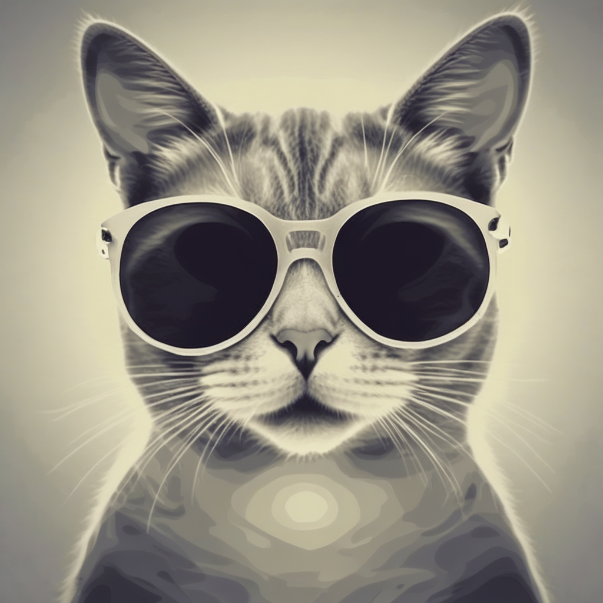 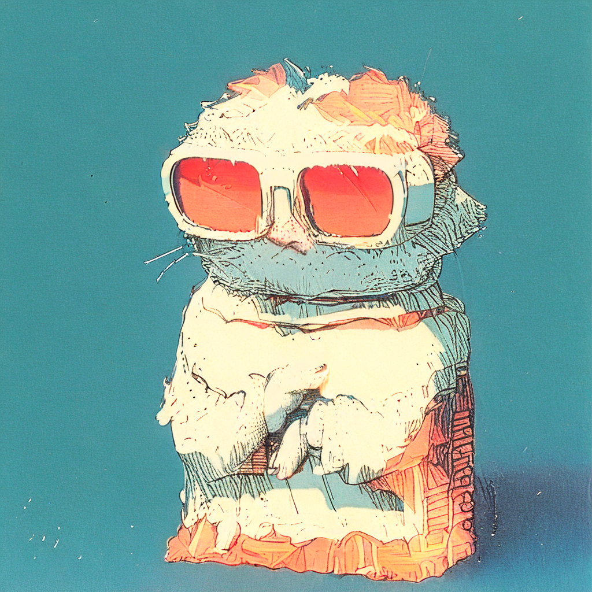 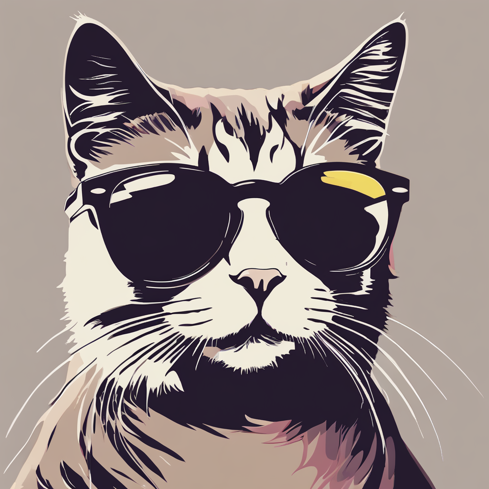 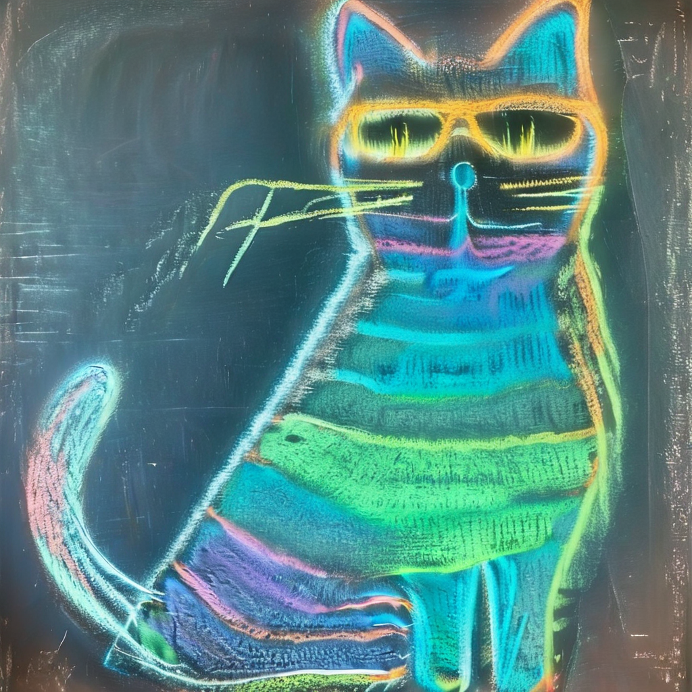

Optionally override the adapter alpha using `lora_alphas`:
```bash
curl http://localhost:8000/v3/images/generations \
  -H "Content-Type: application/json" \
  -d '{
    "model": "xray",
    "prompt": "xray a cute cat in sunglasses",
    "lora_alphas": {"xray": 0.5},
    "num_inference_steps": 40,
    "guidance_scale": 7.5,
    "size": "1024x1024"
  }' | jq -r '.data[0].b64_json' | base64 --decode > xray_cat_half_alpha.png
```
### Using OpenAI Python Client with LoRA

```python
from openai import OpenAI
import base64
from io import BytesIO
from PIL import Image

client = OpenAI(
    base_url="http://localhost:8000/v3",
    api_key="unused"
)

# Define LoRA styles — the adapter alias is used as the model name
styles = {
    "xray": {"prompt": "xray {subject}"},
    "thepoint": {"prompt": "{subject}"},
    "ukiyo": {"prompt": "an illustration of {subject} in Ukiyo-e Art style"},
    "vector": {"prompt": "vector {subject}"},
    "chalk": {"prompt": "A colorful chalkboard drawing of {subject}"},
}

subject = "a cute cat in sunglasses"

for style_name, style_config in styles.items():
    prompt = style_config["prompt"].format(subject=subject)
    response = client.images.generate(
        model=style_name,  # adapter alias activates the LoRA
        prompt=prompt,
        extra_body={
            "num_inference_steps": 40,
            "guidance_scale": 7.5,
            "size": "1024x1024",
        }
    )
    image_data = base64.b64decode(response.data[0].b64_json)
    image = Image.open(BytesIO(image_data))
    image.save(f'{style_name}_cat.png')
    print(f"Saved {style_name}_cat.png")
```

### Blending Multiple Adapters

To blend multiple adapters, define a **composite adapter** at startup using the `@alias:alpha` syntax:

```bash
--source_loras="xray=...,ukiyo=...,blend=@xray:0.5+@ukiyo:0.4"
```

Then use the composite alias as the model name:
```python
response = client.images.generate(
    model="blend",  # activates both xray and ukiyo
    prompt="a cute cat in sunglasses",
    extra_body={
        "num_inference_steps": 40,
        "guidance_scale": 7.5,
        "size": "1024x1024",
    }
)
```

You can override individual component alphas at request time:
```python
response = client.images.generate(
    model="blend",
    prompt="a cute cat in sunglasses",
    extra_body={
        "lora_alphas": {"xray": 0.8, "ukiyo": 0.2},
        "num_inference_steps": 40,
        "guidance_scale": 7.5,
        "size": "1024x1024",
    }
)
```

> **Note:** For more details on LoRA adapter configuration, see the [Image Generation reference documentation](../../docs/image_generation/reference.md#lora-adapters).

## References
- [Image Generation API](../../docs/model_server_rest_api_image_generation.md)
- [Image Edit API](../../docs/model_server_rest_api_image_edit.md)
- [Writing client code](../../docs/clients_genai.md)
- [Image Generation/Edit calculator reference](../../docs/image_generation/reference.md)
- [Supported models](https://openvinotoolkit.github.io/openvino.genai/docs/supported-models/#image-generation-models)
