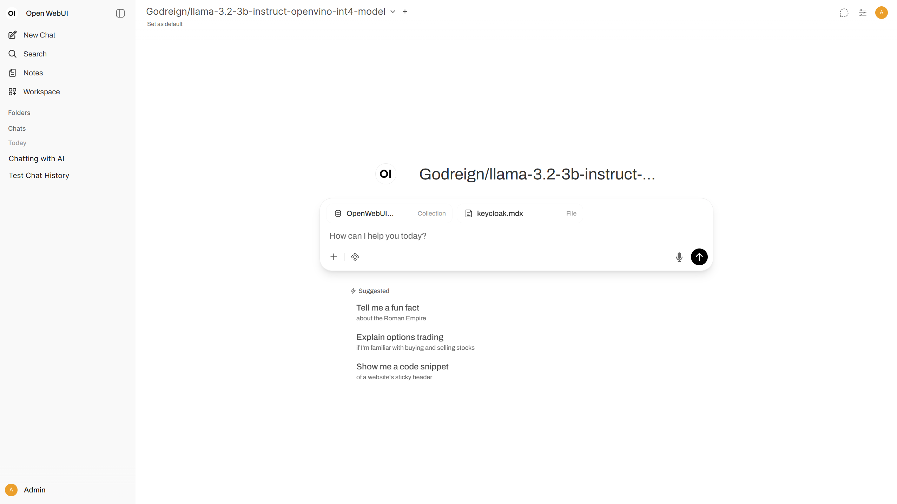
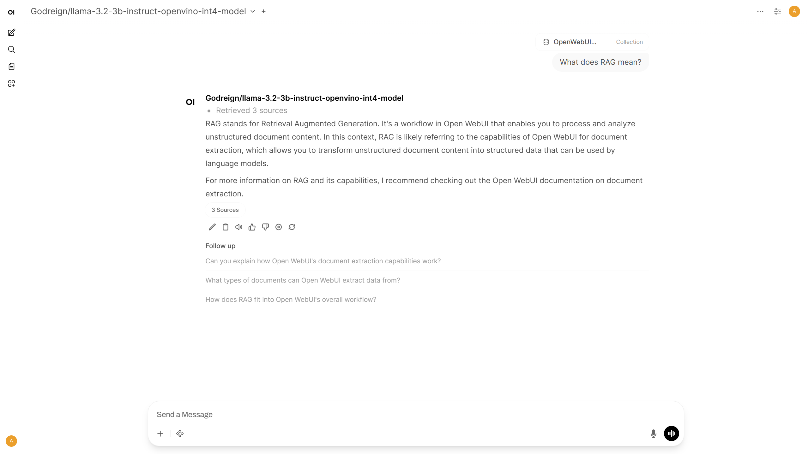
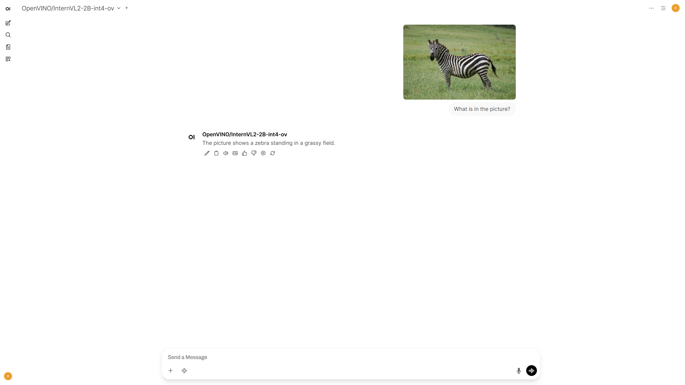
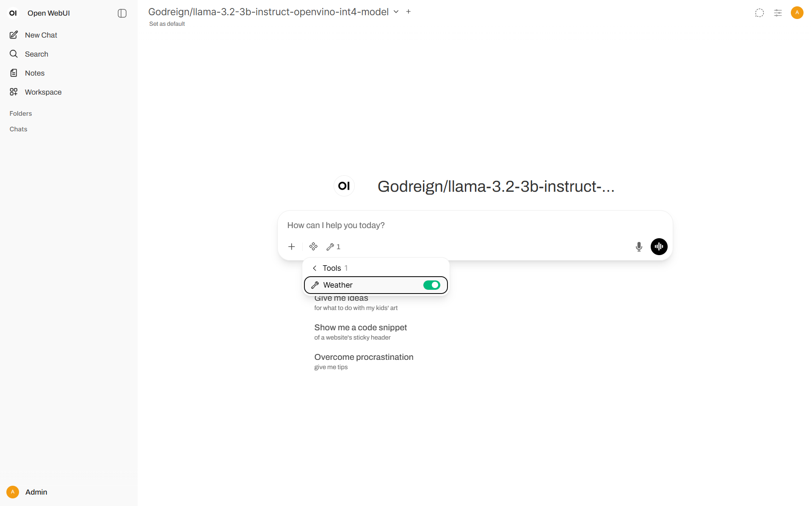

# Demonstrating integration of Open WebUI with OpenVINO Model Server {#ovms_demos_integration_with_open_webui}

## Description

[Open WebUI](https://github.com/open-webui/open-webui) is a very popular component that provides a user interface for generative models. It supports use cases related to text generation, RAG, image generation, and many more. It also supports integration with remote execution services compatible with standard APIs like OpenAI for chat completion and image generation.  

The goal of this demo is to integrate Open WebUI with [OpenVINO Model Server](https://github.com/openvinotoolkit/model_server). It includes instructions for deploying the server with a set of models and configuring Open WebUI to delegate generation to the serving endpoints.

---

## Setup

### Prerequisites

In this demo, OpenVINO Model Server is deployed on Linux with CPU using Docker and Open WebUI is installed via Python pip. Requirements to follow this demo:

* [Docker Engine](https://docs.docker.com/engine/) installed
* Host with x86_64 architecture
* Linux, macOS, or Windows
* Python 3.11 with pip 
* HuggingFace account to download models

There are other options to fulfill the prerequisites like [OpenVINO Model Server deployment on baremetal Linux or Windows](https://docs.openvino.ai/2025/model-server/ovms_docs_deploying_server_baremetal.html) and [Open WebUI installation with Docker](https://docs.openwebui.com/#quick-start-with-docker-). The steps in this demo can be reused across different options, and the reference for each step cover both deployments.

This demo was tested on CPU but most of the models could be also run on Intel accelerators like GPU and NPU.

## Step 1: Pull model and start the OVMS sever
::::{tab-set}
:::{tab-item} Windows
:sync: Windows
```bat
mkdir models
ovms.exe --pull --source_model Godreign/llama-3.2-3b-instruct-openvino-int4-model --model_repository_path models --task text_generation
ovms.exe --add_to_config --config_path  models\config.json --model_path Godreign\llama-3.2-3b-instruct-openvino-int4-model --model_name Godreign/llama-3.2-3b-instruct-openvino-int4-model
ovms.exe --rest_port 8000 --config_path models\config.json
```
:::
:::{tab-item} Linux (using Docker)
:sync: Linux
```bash
mkdir models
docker run --rm -u $(id -u):$(id -g) -v $PWD/models:/models openvino/model_server:weekly --pull --source_model Godreign/llama-3.2-3b-instruct-openvino-int4-model --model_repository_path /models --task text_generation
docker run --rm -u $(id -u):$(id -g) -v $PWD/models:/models openvino/model_server:weekly --add_to_config --config_path  /models/config.json --model_path Godreign/llama-3.2-3b-instruct-openvino-int4-model --model_name Godreign/llama-3.2-3b-instruct-openvino-int4-model
docker run -d -u $(id -u):$(id -g) -v $PWD/models:/models -p 8000:8000 openvino/model_server:weekly --rest_port 8000 --config_path /models/config.json
```
:::
::::

Here is the basic call to check if it works:

```console
curl http://localhost:8000/v3/chat/completions -H "Content-Type: application/json" -d "{\"model\":\"Godreign/llama-3.2-3b-instruct-openvino-int4-model\",\"messages\":[{\"role\":\"system\",\"content\":\"You are a helpful assistant.\"},{\"role\":\"user\",\"content\":\"Say this is a test\"}]}"
```

## Step 2: Install and start OpenWebUI

Install Open WebUI:

```bash
pip install --no-cache-dir open-webui
```

Running Open WebUI:

```console
open-webui serve
```

Go to [http://localhost:8080](http://localhost:8080) and create admin account to get started


### Reference
[https://docs.openvino.ai/2025/model-server/ovms_demos_continuous_batching.html](https://docs.openvino.ai/2025/model-server/ovms_demos_continuous_batching.html#model-preparation)

[https://docs.openwebui.com](https://docs.openwebui.com/#installation-with-pip)

---

## Chat

### Step 1: Connections Setting

1. Go to **Admin Panel** → **Settings** → **Connections** ([http://localhost:8080/admin/settings/connections](http://localhost:8080/admin/settings/connections))
2. Click **+Add Connection** under **OpenAI API**
   * URL: `http://localhost:8000/v3`
   * Model IDs: put `Godreign/llama-3.2-3b-instruct-openvino-int4-model` and click **+** to add the model, or leave empty to include all models
3. Click **Save**


### Step 2: Start Chatting

Click **New Chat** and select the model to start chatting


### (optional) Step 3: Set request parameters

There are multiple configurable parameters in OVMS, all of them for `/v3/chat/completions` endpoint are accessible in [chat api documentation](https://github.com/openvinotoolkit/model_server/blob/releases/2025/4/docs/model_server_rest_api_chat.md#request).

To configure them in *OpenWebUI* with an example of turning off reasoning:
1. Go to **Admin Panel** -> **Settings** -> **Models** ([http://localhost:8080/admin/settings/models](http://localhost:8080/admin/settings/models))
2. Click on desired model, unfold **Advanced Params**.
3. Click **+ Add Custom Parameter**.
4. Change parameter name to `chat_template_kwargs` and content to `{"enable_thinking": false}`.


### Reference
[https://docs.openwebui.com/getting-started/quick-start/starting-with-openai-compatible](https://docs.openwebui.com/getting-started/quick-start/starting-with-openai-compatible/#step-2-connect-your-server-to-open-webui)

---

## RAG

### Step 1: Model Preparation

In addition to text generation, endpoints for embedding and reranking in Retrieval Augmented Generation can also be deployed with OpenVINO Model Server. In this demo, the embedding model is [OpenVINO/Qwen3-Embedding-0.6B-fp16-ov](https://huggingface.co/OpenVINO/Qwen3-Embedding-0.6B-fp16-ov) and the the reranking model is [OpenVINO/Qwen3-Reranker-0.6B-seq-cls-fp16-ov](https://huggingface.co/OpenVINO/Qwen3-Reranker-0.6B-seq-cls-fp16-ov). Run the export script to download and quantize the models:

::::{tab-set}
:::{tab-item} Windows
:sync: Windows
```bat
ovms.exe --pull --source_model OpenVINO/Qwen3-Embedding-0.6B-fp16-ov --model_repository_path models --task embeddings
ovms.exe --add_to_config --config_path models\config.json --model_path OpenVINO\Qwen3-Embedding-0.6B-fp16-ov --model_name OpenVINO/Qwen3-Embedding-0.6B-fp16-ov
ovms.exe --pull --source_model OpenVINO/Qwen3-Reranker-0.6B-seq-cls-fp16-ov --model_repository_path models --task rerank
ovms.exe --add_to_config --config_path models\config.json --model_path OpenVINO\Qwen3-Reranker-0.6B-seq-cls-fp16-ov --model_name OpenVINO/Qwen3-Reranker-0.6B-seq-cls-fp16-ov
```
:::
:::{tab-item} Linux (using Docker)
:sync: Linux
```bash
docker run --rm -u $(id -u):$(id -g) -v $PWD/models:/models openvino/model_server:weekly --pull --source_model OpenVINO/Qwen3-Embedding-0.6B-fp16-ov --model_repository_path models --task embeddings
docker run --rm -u $(id -u):$(id -g) -v $PWD/models:/models openvino/model_server:weekly --add_to_config --config_path /models/config.json  --model_path OpenVINO/Qwen3-Embedding-0.6B-fp16-ov --model_name OpenVINO/Qwen3-Embedding-0.6B-fp16-ov
docker run --rm -u $(id -u):$(id -g) -v $PWD/models:/models openvino/model_server:weekly --pull --source_model OpenVINO/Qwen3-Reranker-0.6B-seq-cls-fp16-ov --model_repository_path models --task rerank
docker run --rm -u $(id -u):$(id -g) -v $PWD/models:/models openvino/model_server:weekly --add_to_config --config_path /models/config.json  --model_path OpenVINO/Qwen3-Reranker-0.6B-seq-cls-fp16-ov --model_name OpenVINO/Qwen3-Reranker-0.6B-seq-cls-fp16-ov
```
:::
::::

Keep the model server running or restart it. Here are the basic calls to check if they work:
```console
curl http://localhost:8000/v3/embeddings -H "Content-Type: application/json" -d "{\"model\":\"OpenVINO/Qwen3-Embedding-0.6B-fp16-ov\",\"input\":\"hello world\"}"
curl http://localhost:8000/v3/rerank -H "Content-Type: application/json" -d "{\"model\":\"OpenVINO/Qwen3-Reranker-0.6B-seq-cls-fp16-ov\",\"query\":\"welcome\",\"documents\":[\"good morning\",\"farewell\"]}"
```

### Step 2: Documents Setting

1. Go to **Admin Panel** → **Settings** → **Documents** ([http://localhost:8080/admin/settings/documents](http://localhost:8080/admin/settings/documents))
2. Select **OpenAI** for **Embedding Model Engine**
   * URL: `http://localhost:8000/v3`
   * Set Engine type to `OpenAI` 
   * Embedding Model: `OpenVINO/Qwen3-Embedding-0.6B-fp16-ov`
   * Put anything in API key
3. Enable **Hybrid Search**
4. Select **External** for **Reranking Engine**
   * URL: `http://localhost:8000/v3/rerank`
   * Set Engine type to `External`
   * Reranking Model: `OpenVINO/Qwen3-Reranker-0.6B-seq-cls-fp16-ov`
5. Click **Save**


### Step 3: Knowledge Base

1. Prepare the Documentation
   
   The documentation used in this demo is [https://github.com/open-webui/docs/archive/refs/heads/main.zip](https://github.com/open-webui/docs/archive/refs/heads/main.zip). Download and extract it to get the folder.

2. Go to **Workspace** → **Knowledge** → **+ New Knowledge** ([http://localhost:8080/workspace/knowledge/create](http://localhost:8080/workspace/knowledge/create))
3. Name and describe the knowledge base
4. Click **Create Knowledge**
5. Click **+Add Content** → **Upload directory**, then select the extracted folder. This will upload all files with suitable extensions.


### Step 4: Chat with RAG

1. Click **New Chat**. Enter `#` symbol
2. Select documents that appear above the chat box for retrieval. Document icons will appear above **Send a Message**.



3. Enter a query and send



### Step 5: RAG-enabled Model

1. Go to **Workspace** → **Models** → **+ New Model** ([http://localhost:8080/workspace/models/create](http://localhost:8080/workspace/models/create))
2. Configure the Model:
   * Name the model
   * Select a base model from the list
   * Click **Select Knowledge** and select a knowledge base for retrieval
3. Click **Save & Create**
   


4. Click the created model and start chatting


### Reference

[https://docs.openvino.ai/2025/model-server/ovms_demos_continuous_batching_rag.html](https://docs.openvino.ai/2025/model-server/ovms_demos_continuous_batching_rag.html#export-models-from-huggingface-hub-including-conversion-to-openvino-format-using-the-python-script)

[https://docs.openwebui.com/tutorials/tips/rag-tutorial](https://docs.openwebui.com/tutorials/tips/rag-tutorial/#setup)

---

## Image Generation

### Step 1: Model Preparation

The image generation model used in this demo is [OpenVINO/FLUX.1-schnell-int4-ov](https://huggingface.co/OpenVINO/FLUX.1-schnell-int4-ov). Run the ovms with --pull parameter to download and quantize the model:

::::{tab-set}
:::{tab-item} Windows
:sync: Windows
```bat
ovms.exe --pull --source_model OpenVINO/FLUX.1-schnell-int4-ov --model_repository_path models --model_name OpenVINO/FLUX.1-schnell-int4-ov --task image_generation --default_num_inference_steps 3
ovms.exe --add_to_config --config_path models\config.json --model_path OpenVINO\FLUX.1-schnell-int4-ov --model_name OpenVINO/FLUX.1-schnell-int4-ov
```
:::
:::{tab-item} Linux (using Docker)
:sync: Linux
```bash
docker run --rm -u $(id -u):$(id -g) -v $PWD/models:/models openvino/model_server:weekly --pull --source_model OpenVINO/FLUX.1-schnell-int4-ov --model_repository_path models --model_name OpenVINO/FLUX.1-schnell-int4-ov --task image_generation --default_num_inference_steps 3
docker run --rm -u $(id -u):$(id -g) -v $PWD/models:/models openvino/model_server:weekly  --add_to_config --config_path /models/config.json  --model_path OpenVINO/FLUX.1-schnell-int4-ov --model_name OpenVINO/FLUX.1-schnell-int4-ov
```
:::
::::

Keep the model server running or restart it. Here is the basic call to check if it works:

```console
curl http://localhost:8000/v3/images/generations -H "Content-Type: application/json" -d "{\"model\":\"OpenVINO/FLUX.1-schnell-int4-ov\",\"prompt\":\"anime\",\"num_inference_steps\":1,\"size\":\"256x256\",\"response_format\":\"b64_json\"}"
```

### Step 2: Image Generation Setting

1. Go to **Admin Panel** → **Settings** → **Images** ([http://localhost:8080/admin/settings/images](http://localhost:8080/admin/settings/images))
2. Configure **OpenAI API**:
   * URL: `http://localhost:8000/v3`
   * Put anything in API key
3. Enable **Image Generation (Experimental)**
   * Set Default Model: `OpenVINO/FLUX.1-schnell-int4-ov`
   * Set Image Size. Must be in WxH format, example: `256x256`
4. Click **Save**


### Step 3: Generate Image

Method 1:
1. Expand `Integrations` menu
2. Toggle the **Image** switch to on
3. Enter a query and send


Method 2:
1. Send a query, with or without the **Image** switch on
2. After the response has finished generating, it can be edited to a prompt
3. Click the **Picture icon** to generate an image


### Reference
[https://docs.openvino.ai/2025/model-server/ovms_demos_image_generation.html](https://docs.openvino.ai/2025/model-server/ovms_demos_image_generation.html#export-model-for-cpu)

[https://docs.openwebui.com/features/image-generation-and-editing](https://docs.openwebui.com/features/image-generation-and-editing/openai)

---
## VLM

### Step 1: Model Preparation

The vision language model used in this demo is [OpenVINO/InternVL2-2B-int4-ov](https://huggingface.co/OpenVINO/InternVL2-2B-int4-ov). Run the ovms with --pull parameter to download and quantize the model:

::::{tab-set}
:::{tab-item} Windows
:sync: Windows
```bat
ovms.exe --pull --source_model OpenVINO/InternVL2-2B-int4-ov --model_repository_path models --model_name OpenVINO/InternVL2-2B-int4-ov --task text_generation
ovms.exe --add_to_config --config_path models\config.json --model_path OpenVINO\InternVL2-2B-int4-ov --model_name OpenVINO/InternVL2-2B-int4-ov
```
:::
:::{tab-item} Linux (using Docker)
:sync: Linux
```bash
docker run --rm -u $(id -u):$(id -g) -v $PWD/models:/models openvino/model_server:weekly --pull --source_model OpenVINO/InternVL2-2B-int4-ov --model_repository_path models --model_name OpenVINO/InternVL2-2B-int4-ov --task text_generation
docker run --rm -u $(id -u):$(id -g) -v $PWD/models:/models openvino/model_server:weekly --add_to_config --config_path /models/config.json  --model_path OpenVINO/InternVL2-2B-int4-ov --model_name OpenVINO/InternVL2-2B-int4-ov
```
:::
::::

Keep the model server running or restart it. Here is the basic call to check if it works:

```console
curl http://localhost:8000/v3/chat/completions  -H "Content-Type: application/json" -d "{ \"model\": \"OpenVINO/InternVL2-2B-int4-ov\", \"messages\":[{\"role\": \"user\", \"content\": [{\"type\": \"text\", \"text\": \"what is in the picture?\"},{\"type\": \"image_url\", \"image_url\": {\"url\": \"http://raw.githubusercontent.com/openvinotoolkit/model_server/refs/heads/releases/2025/4/demos/common/static/images/zebra.jpeg\"}}]}], \"max_completion_tokens\": 100}"
```

### Step 2: Chat with VLM

1. Start a **New Chat** with model set to `OpenVINO/InternVL2-2B-int4-ov`
2. Click **+More** to upload images, by capturing the screen or uploading files. The image used in this demo is [http://raw.githubusercontent.com/openvinotoolkit/model_server/refs/heads/releases/2025/4/demos/common/static/images/zebra.jpeg](http://raw.githubusercontent.com/openvinotoolkit/model_server/refs/heads/releases/2025/4/demos/common/static/images/zebra.jpeg).


3. Enter a query and send



### Reference
[https://docs.openvino.ai/2025/model-server/ovms_demos_continuous_batching_vlm.html](https://docs.openvino.ai/2025/model-server/ovms_demos_continuous_batching_vlm.html#model-preparation)

---

## AI agent with Tools

### Step 1: Start Tool Server

Start a OpenAPI tool server available in the [openapi-servers repo](https://github.com/open-webui/openapi-servers). The server used in this demo is [https://github.com/open-webui/openapi-servers/tree/main/servers/weather](https://github.com/open-webui/openapi-servers/tree/main/servers/weather). Run it locally at `http://localhost:9000`:

```console
pip install mcpo
pip install mcp_weather_server
mcpo --port 9000 -- python -m mcp_weather_server
```

### Step 2: Tools Setting

1. Go to **Admin Panel** → **Settings** → **External Tools** 
2. Click **+Add Connection**
   * URL: `http://localhost:9000`
   * Name the tool
3. Click **Save**


### Step 3: Chat with AI Agent

1. Click **+More** and toggle on the tool
   


2. Enter a query and send


### Reference
[https://docs.openwebui.com/features/plugin/tools/openapi-servers/open-webui](https://docs.openwebui.com/features/plugin/tools/openapi-servers/open-webui#step-2-connect-tool-server-in-open-webui)


## Audio

> **Note:** To ensure audio features work correctly, download [FFmpeg](https://ffmpeg.org/download.html) and add its executable directory to your system's `PATH` environment variable.

### Step 1: Models Preparation

Start by downloading `export_models.py` script and run it to download and quantize the model for speech generation:
```console 
curl https://raw.githubusercontent.com/openvinotoolkit/model_server/refs/heads/releases/2025/4/demos/common/export_models/export_model.py -o export_model.py
pip3 install -r https://raw.githubusercontent.com/openvinotoolkit/model_server/refs/heads/releases/2025/4/demos/common/export_models/requirements.txt
python export_model.py text2speech --source_model microsoft/speecht5_tts --weight-format fp32 --model_name microsoft/speecht5_tts --config_file_path models/config.json --model_repository_path models --vocoder microsoft/speecht5_hifigan
```

Next, download and add to config model for transcription:

::::{tab-set}
:::{tab-item} Windows
:sync: Windows
```bat
ovms.exe --pull --source_model OpenVINO/whisper-base-fp16-ov --model_repository_path models --task speech2text
ovms.exe --add_to_config --config_path  models\config.json --model_path OpenVINO\whisper-base-fp16-ov --model_name OpenVINO/whisper-base-fp16-ov
```
:::
:::{tab-item} Linux (using Docker)
:sync: Linux
```bash
docker run --rm -u $(id -u):$(id -g) -v $PWD/models:/models openvino/model_server:weekly --pull --source_model OpenVINO/whisper-base-fp16-ov --model_repository_path /models --task speech2text
docker run --rm -u $(id -u):$(id -g) -v $PWD/models:/models openvino/model_server:weekly --add_to_config --config_path /models/config.json --model_path OpenVINO/whisper-base-fp16-ov --model_name OpenVINO/whisper-base-fp16-ov
```
:::
:::: 

### Step 2: Audio Settings

1. Go to **Admin Panel** → **Settings** → **Audio** 
2. Select **OpenAI** for both engines
   * URL: `http://localhost:8000/v3`
   * Set Engine type to `OpenAI` 
   * STT Model: `OpenVINO/whisper-base-fp16-ov`
   * TTS Model: `microsoft/speecht5_tts`
   * Put anything in API key
3. Click **Save**


### Step 3: Chat with AI Agent

1. Click **Voice mode** icon.
2. Start talking.


### Reference
[https://docs.openwebui.com/features/#%EF%B8%8F-audio-voice--accessibility](https://docs.openwebui.com/features/#%EF%B8%8F-audio-voice--accessibility)