# DeepAgents Code Integration Demo {#ovms_demos_integration_with_deepagents_code}

## Description

This demo shows how to run [DeepAgents Code](https://github.com/langchain-ai/deepagents) (`dcode`) with OpenVINO Model Server (OVMS) using OpenAI-compatible endpoints.

The flow covers model setup, dcode setup, MCP server creation, subagent-based validation, and a simple tool-use verification.

## What you will build

By the end of this demo you will have:
- OVMS serving two OpenVINO models over an OpenAI-compatible endpoint: one for the main agent and one for the `mcp-tester` subagent (see `.deepagents/agents/mcp-tester/AGENTS.md`).
- A Python MCP stdio server (`mcp_server/time_mcp_server.py`) generated by dcode using the bundled `python-mcp-sdk-skill` skill and extended with a `date` tool via `/goal`.
- A subagent-based validation flow where `mcp-tester` verifies static structure and runtime behavior of the MCP server.
- A working end-to-end tool call in which the main agent uses the new MCP tool to answer a real prompt.

---

## Setup

### Prerequisites

Requirements:
- Linux
- Python 3.12+
- Docker

### Step 1: Prepare model directory

```bash
mkdir -p ${HOME}/models
export GPU_ARGS=$(if ls /dev/dri/render* >/dev/null 2>&1; then echo "--device /dev/dri --group-add $(stat -c '%g' /dev/dri/render* | head -n1)"; fi)
```

### Step 2: Pull and register models

If OVMS is already running with the required models, you can skip this step.

```bash
docker run --rm ${GPU_ARGS} -u $(id -u):$(id -g) \
  -e "http_proxy=$http_proxy" -e "https_proxy=$https_proxy" -e "no_proxy=${no_proxy}" \
  -v ${HOME}/models:/models openvino/model_server:weekly \
  --pull --source_model OpenVINO/Qwen3.8-27B-int4-ov --task text_generation --model_repository_path /models

docker run --rm ${GPU_ARGS} -u $(id -u):$(id -g) \
  -e "http_proxy=$http_proxy" -e "https_proxy=$https_proxy" -e "no_proxy=${no_proxy}" \
  -v ${HOME}/models:/models openvino/model_server:weekly \
  --pull --source_model OpenVINO/Qwen3-8B-int8-ov --task text_generation --model_repository_path /models

docker run --rm -u $(id -u):$(id -g) -v ${HOME}/models:/models openvino/model_server:weekly \
  --add_to_config --config_path /models/config.json \
  --model_path OpenVINO/Qwen3.8-27B-int4-ov --model_name OpenVINO/Qwen3.8-27B-int4-ov

docker run --rm -u $(id -u):$(id -g) -v ${HOME}/models:/models openvino/model_server:weekly \
  --add_to_config --config_path /models/config.json \
  --model_path OpenVINO/Qwen3-8B-int8-ov --model_name OpenVINO/Qwen3-8B-int8-ov
```

### Step 3: Start OVMS

```bash
docker run -d ${GPU_ARGS} -u $(id -u):$(id -g) \
  -v ${HOME}/models:/models -p 8000:8000 openvino/model_server:latest-gpu \
  --rest_port 8000 --config_path /models/config.json --log_path /models/ovms-log.txt
```

Readiness checks:

```console
curl -f http://localhost:8000/v1/models
```

```console
curl http://localhost:8000/v3/chat/completions \
  -H "Content-Type: application/json" \
  -d '{"model":"OpenVINO/Qwen3.8-27B-int4-ov","messages":[{"role":"user","content":"ping"}]}'
```

### Step 4: Configure dcode environment

Use the same shell where dcode will be started:

```bash
export OPENAI_API_KEY=not_used
export OPENAI_BASE_URL=http://localhost:8000/v1
export DEEPAGENTS_CODE_PRICES_AUTO_UPDATE=0
```

- **`DEEPAGENTS_CODE_PRICES_AUTO_UPDATE=0`**: avoids external pricing refresh.

### Step 5: Install dependencies

```bash
python -m venv .env
source .env/bin/activate
cd demos/integration_with_deepagents_code
python -m pip install --upgrade pip
python -m pip install deepagents-code mcp
```

### Step 6: Start dcode

dcode uses git to track file state and diffs it applies during the session. If the demo directory is not already inside a git repository, initialize one once:

```bash
git init
```

If you cloned the `model_server` repository, this step can be skipped — the surrounding repo already provides a git working tree. To keep the demo isolated from the model_server repo, copy the demo folder elsewhere before running `git init`.

Run deepagents code with limited set of tools:

```bash
dcode --model openai:OpenVINO/Qwen3.8-27B-int4-ov \
  --allow-fs-tools read_file,write_file,grep,ls,execute \
  -S python,python3,timeout,cat,grep,ls \
  --no-interpreter \
  --trust-project-mcp
```

Parameter notes:
- `--allow-fs-tools`: controls exposed local tools. `execute` is needed for runtime checks.
- `-S ...`: shell allow-list for `execute` command safety.
- `--no-interpreter`: disables js_eval middleware.
- `--trust-project-mcp`: auto-trusts project MCP configuration.

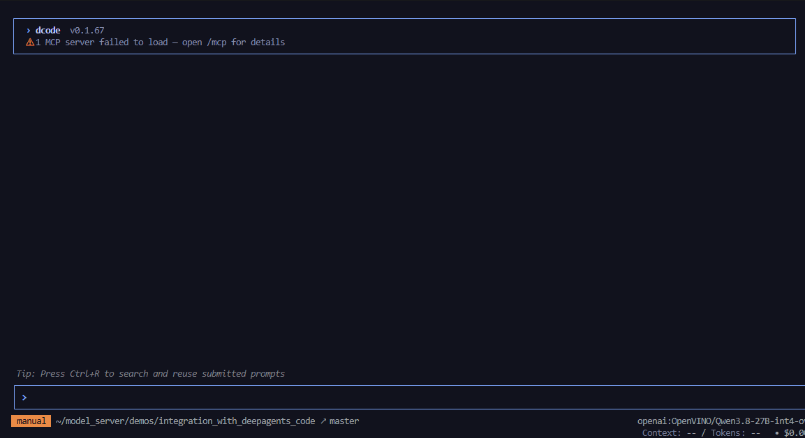

---

## Demo flow

### Step 1: Ask agent to summarize demo

Start with a broad, low-risk prompt so the agent explores the working directory, loads project files into its context and confirms that OVMS is reachable. This also warms up prefix caching on the server for later turns.

```text
Summarize demo in current directory.
```

First response can be slower because initial dcode context is large. Later turns are typically faster due to prefix caching.

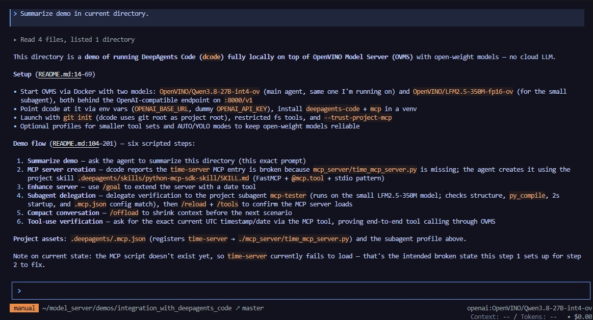

### Step 2: Create MCP server file

The project ships with a preconfigured MCP client entry in `.deepagents/.mcp.json`, but the actual server script does not exist yet. dcode surfaces this as a tool-loading error — a good signal that the agent is aware of the MCP configuration.

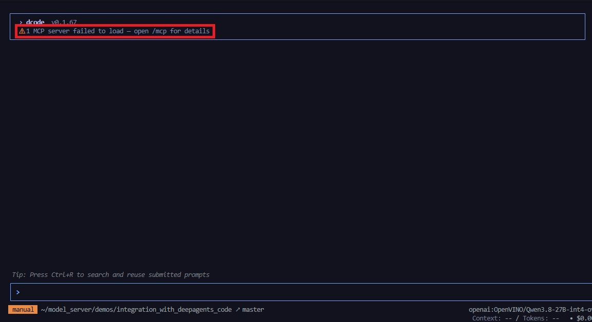

The MCP server script is missing. Ask the agent to create it using the project skill located at `.deepagents/skills/python-mcp-sdk-skill/SKILL.md`. Invoking a skill with `/skill:<name>` gives the agent a focused, tested recipe instead of relying on generic knowledge:

```bash
/skill:python-mcp-sdk-skill implement a Python MCP stdio server at mcp_server/time_mcp_server.py that provides current UTC time using the Python MCP SDK.
```

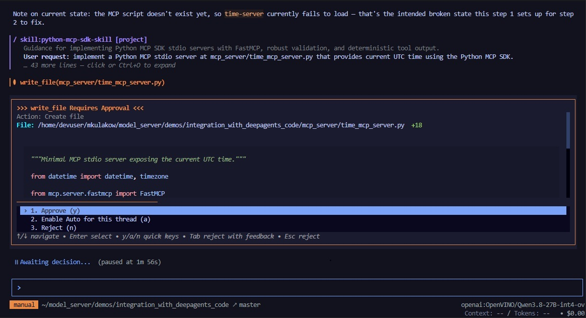

### Step 3: Extend MCP server with date tool

Use `/goal` to switch the agent into goal mode: it will propose acceptance criteria, iterate on the implementation and self-grade the result against those criteria. This is a good fit for incremental changes on top of an existing file.

```bash
/goal Extend mcp_server/time_mcp_server.py with date tool.
```

First the agent negotiates acceptance criteria for the change:

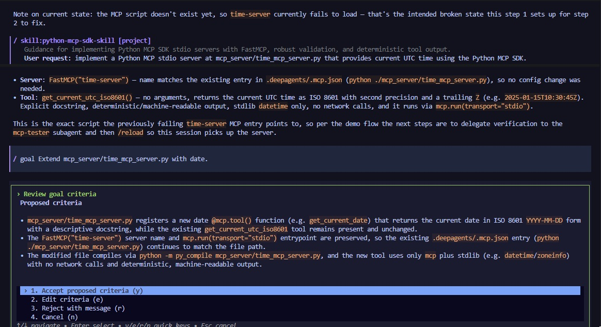

Then it works towards those criteria:

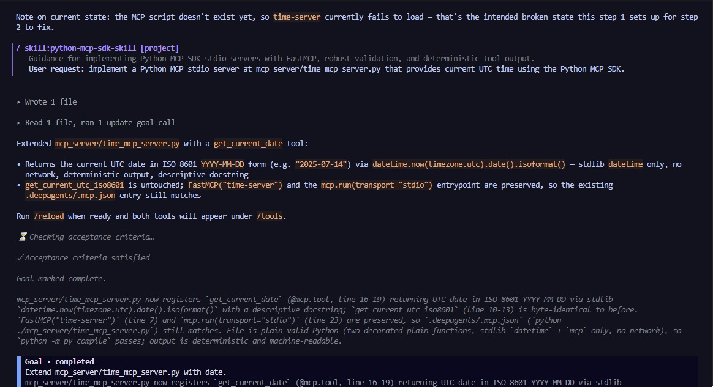

And finally grades its own output:

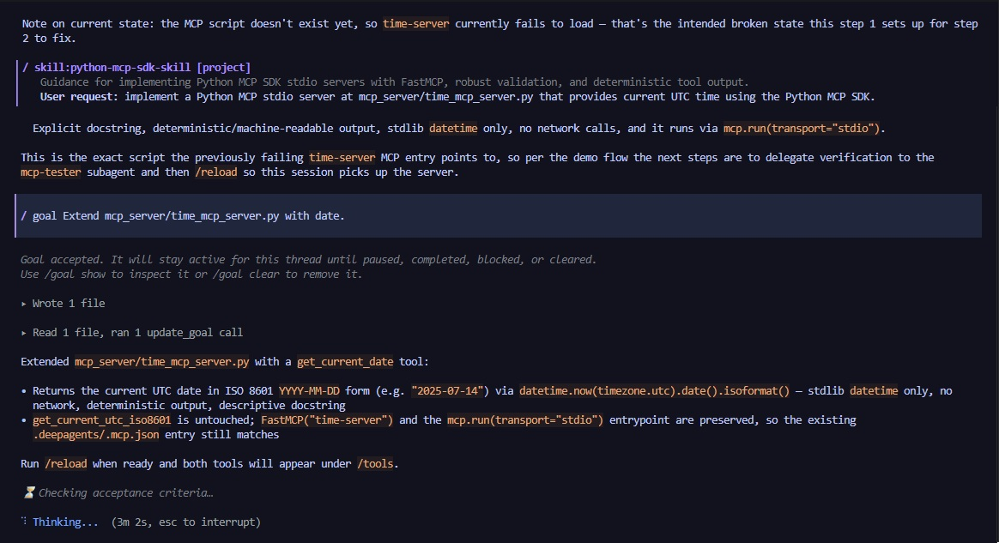

Once the goal is satisfied, clear it so subsequent prompts run in normal mode:

```bash
/goal clear
```

### Step 4: Delegate validation to subagent

Instead of running tests in the main context, delegate validation to a dedicated subagent. This keeps the main conversation focused and uses a smaller model (`OpenVINO/Qwen3-8B-int4-ov`) for a cheaper verification pass. The subagent definition lives in:

- `.deepagents/agents/mcp-tester/AGENTS.md`

`mcp-tester` verifies static structure and runtime behavior of the MCP server and returns a concise `PASS`/`FAIL` verdict.

Prompt:

```text
Delegate to subagent mcp-tester:
Test mcp_server/time_mcp_server.py
```

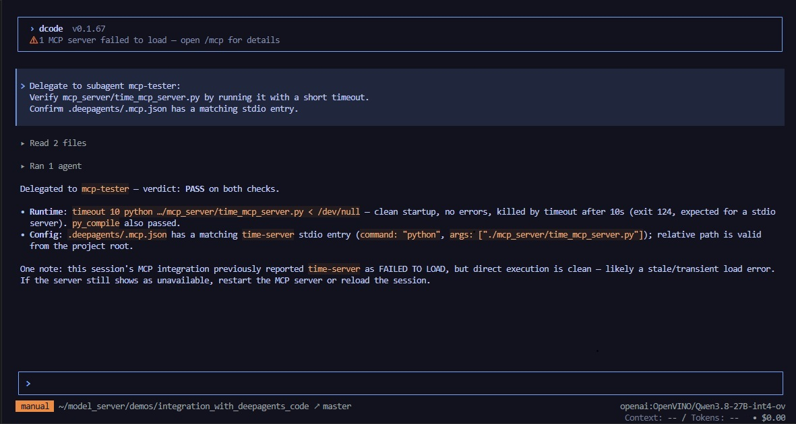

If tester returns `FAIL`, main agent can proceed with fixes. If tester returns `PASS`, continue below.

### Step 5: Reload tools in current session

The MCP server is now on disk, but the current dcode session was started before it existed, so its tools are not yet registered. Use `/tools` to inspect the currently loaded tool list, then `/reload` to re-scan the MCP configuration without restarting dcode.

```bash
/tools
```

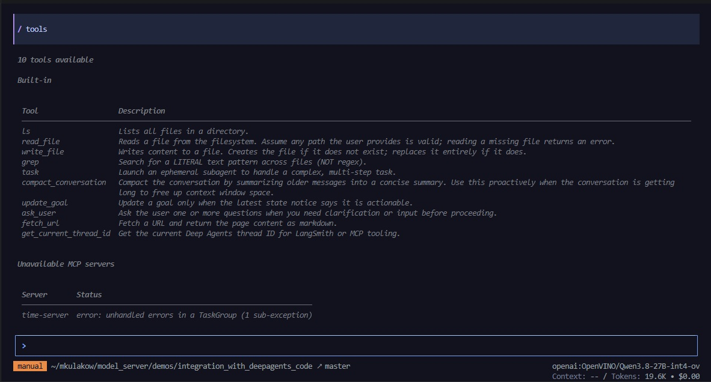

```bash
/reload
/tools
```
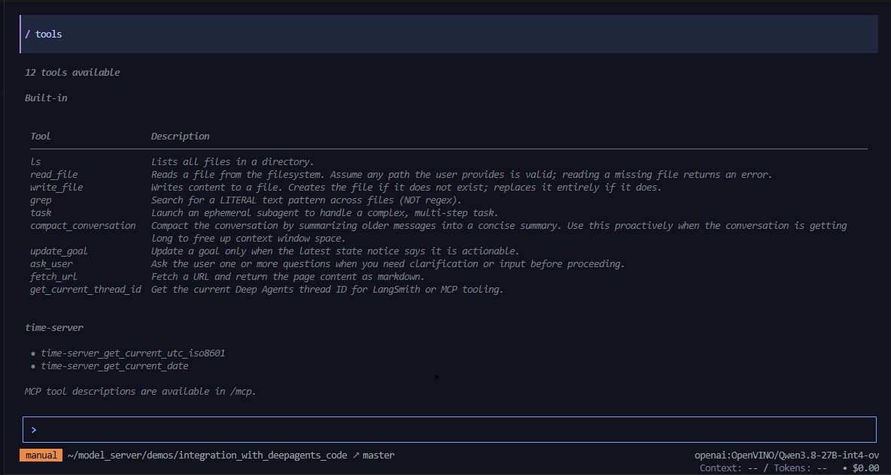

### Step 6: Verify tool use

With the MCP tools now registered, issue a prompt that can only be answered correctly by calling the freshly created server. If the agent invokes the MCP tool and reports the real UTC time and date, the end-to-end integration is working.

```text
Give me the exact current UTC timestamp down to the current second allong with current date.
```

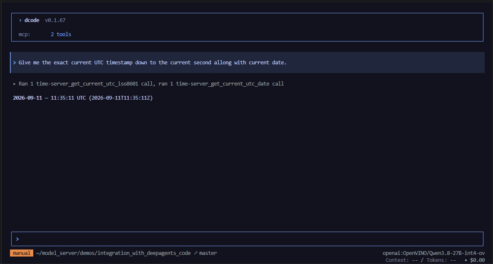

---

## Tips

### Smaller tool surface

For open-weight models, reducing tool surface can improve reliability.

Non-MCP tasks:

```bash
dcode --model openai:OpenVINO/Qwen3.8-27B-int4-ov \
  --interpreter-tools safe \
  --allow-fs-tools read_file,list_dir,grep_search,file_search \
  --no-mcp
```

MCP tasks:

```bash
dcode --model openai:OpenVINO/Qwen3.8-27B-int4-ov \
  --interpreter-tools safe \
  --allow-fs-tools read_file,list_dir,grep_search,file_search
```

If a task fails because a required tool is unavailable, restart dcode with a broader tool set.

### Agent autonomy configuration

DeepAgents Code can be run in two useful operating modes depending on how much autonomy you want from the agent:

- `auto` mode: allows the agent to decide when to use tools, execute commands, and continue with the next step with minimal prompting. This is the most convenient setup for a guided demo flow.
- `yolo` mode: gives the agent broader autonomy and fewer guardrails, which can speed up iteration on complex tasks but is less conservative and may trigger more exploratory or risky behavior.

### Compacting conversation

With `/offload` command the agent can reduce its context by dropping messages that are not relevant anymore.

```bash
/offload
```
