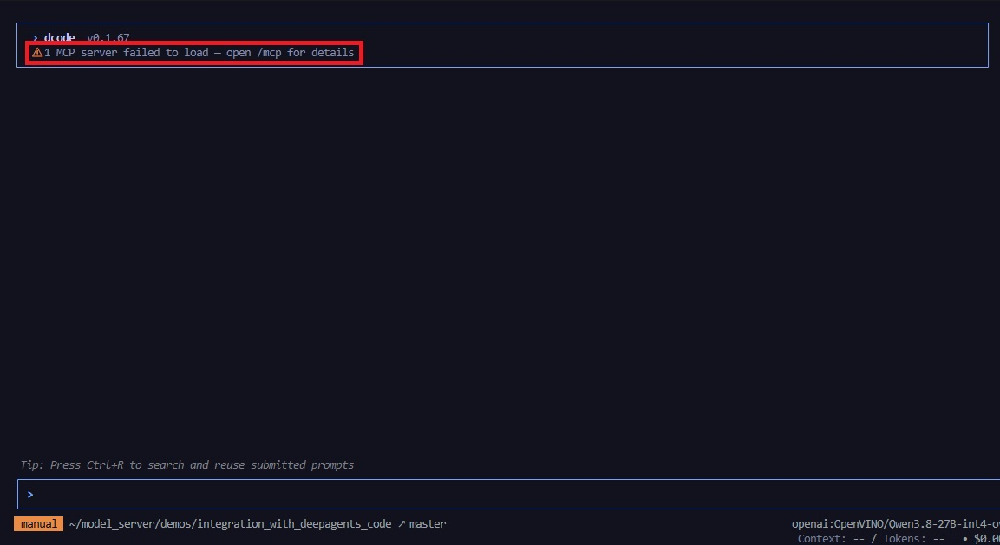

# DeepAgents Code Integration Demo {#ovms_demos_integration_with_deepagents_code}

## Description

This demo shows how to run [DeepAgents Code](https://github.com/langchain-ai/deepagents) (`dcode`) with OpenVINO Model Server (OVMS) using OpenAI-compatible endpoints.

The flow covers model setup, dcode setup, MCP server creation, subagent-based validation, and a simple tool-use verification.

## What you will build

By the end of this demo you will have:
- OVMS serving an OpenVINO model over an OpenAI-compatible endpoint, used by both the main agent and the `mcp-tester` subagent (see `.deepagents/agents/mcp-tester/AGENTS.md`).
- A Python MCP stdio server (`mcp_server/time_mcp_server.py`) generated by dcode using the bundled `python-mcp-sdk-skill` skill and extended with a `date` tool via an acceptance-criteria loop (`/goal` interactively or `--rubric` headlessly).
- A subagent-based validation flow where `mcp-tester` verifies static structure and runtime behavior of the MCP server.
- A working end-to-end tool call in which the main agent uses the new MCP tool to answer a real prompt.

---

## Setup

### Prerequisites

Requirements:
- Linux or Windows
- Python 3.12+
- Docker (Docker Engine on Linux, Docker Desktop on Windows)

### Step 1: Prepare model directory

::::{tab-set}
:::{tab-item} Linux
:sync: Linux
```bash
mkdir -p ${HOME}/models
export GPU_ARGS=$(if ls /dev/dri/render* >/dev/null 2>&1; then echo "--device /dev/dri --group-add $(stat -c '%g' /dev/dri/render* | head -n1)"; fi)
```
:::
:::{tab-item} Windows
:sync: Windows
```powershell
New-Item -ItemType Directory -Force -Path "$env:USERPROFILE\models" | Out-Null
$env:MODELS_DIR = "$env:USERPROFILE\models"
```
:::
::::

### Step 2: Start OVMS

The model is auto-pulled on first start if it is not already present in the model repository.

::::{tab-set}
:::{tab-item} Linux
:sync: Linux
```bash
docker run -d ${GPU_ARGS} -u $(id -u):$(id -g) \
  -e "http_proxy=$http_proxy" -e "https_proxy=$https_proxy" -e "no_proxy=${no_proxy}" \
  -v ${HOME}/models:/models -p 8000:8000 openvino/model_server:latest-gpu \
  --rest_port 8000 --model_repository_path /models \
  --source_model OpenVINO/Qwen3.8-27B-int4-ov --task text_generation \
  --log_path /models/ovms-log.txt
```
:::
:::{tab-item} Windows
:sync: Windows
```powershell
docker run -d -v ${env:MODELS_DIR}:/models -p 8000:8000 openvino/model_server:latest `
  --rest_port 8000 --model_repository_path /models `
  --source_model OpenVINO/Qwen3.8-27B-int4-ov --task text_generation `
  --log_path /models/ovms-log.txt
```
:::
::::

Readiness checks:

```console
curl -f http://localhost:8000/v1/models
```

```console
curl http://localhost:8000/v1/chat/completions \
  -H "Content-Type: application/json" \
  -d '{"model":"OpenVINO/Qwen3.8-27B-int4-ov","messages":[{"role":"user","content":"ping"}]}'
```

### Step 3: Configure dcode environment

Use the same shell where dcode will be started:

::::{tab-set}
:::{tab-item} Linux
:sync: Linux
```bash
export OPENAI_API_KEY=not_used
export OPENAI_BASE_URL=http://localhost:8000/v1
export DEEPAGENTS_CODE_PRICES_AUTO_UPDATE=0
```
:::
:::{tab-item} Windows
:sync: Windows
```powershell
$env:OPENAI_API_KEY = "not_used"
$env:OPENAI_BASE_URL = "http://localhost:8000/v1"
$env:DEEPAGENTS_CODE_PRICES_AUTO_UPDATE = "0"
```
:::
::::

- **`DEEPAGENTS_CODE_PRICES_AUTO_UPDATE=0`**: avoids external pricing refresh.

### Step 4: Install dependencies

::::{tab-set}
:::{tab-item} Linux
:sync: Linux
```bash
python -m venv .env
source .env/bin/activate
cd demos/integration_with_deepagents_code
python -m pip install --upgrade pip
python -m pip install deepagents-code mcp
```
:::
:::{tab-item} Windows
:sync: Windows
```powershell
python -m venv .env
.\.env\Scripts\Activate.ps1
cd demos\integration_with_deepagents_code
python -m pip install --upgrade pip
python -m pip install deepagents-code mcp colorama
```

`colorama` is required by the console renderer on Windows.
:::
::::

> On Windows, use a short relative working directory such as `demo` or `dcode-demo`; dcode may reject absolute paths with `Error: Windows absolute paths are not supported`.

### Step 5: Start dcode

Set the default model once so subsequent dcode invocations don't have to repeat `--model` (persisted to `~/.deepagents/config.toml`):

```bash
dcode --default-model openai:OpenVINO/Qwen3.8-27B-int4-ov
```

dcode uses git to track file state and diffs it applies during the session. Initialize a repository if one is not already present:

```bash
git rev-parse --git-dir >/dev/null 2>&1 || git init
```

The check makes the command a no-op inside an existing working tree, including the `model_server` clone. To keep the demo state isolated from the model_server repo, copy the demo folder elsewhere first.

Run deepagents code with a limited set of tools:

```text
dcode --allow-fs-tools read_file,write_file,grep,ls,execute -S python,python3,timeout,cat,grep,ls --no-interpreter --trust-project-mcp
```

Parameter notes:
- `--allow-fs-tools`: controls exposed local tools. `execute` is needed for runtime checks.
- `-S ...`: shell allow-list for `execute` command safety.
- `--no-interpreter`: disables js_eval middleware.
- `--trust-project-mcp`: auto-trusts project MCP configuration.


---

## Demo flow

Every demo step below shows the interactive prompt or slash command to type into the dcode TUI. Most steps are followed by a `dcode -n ...` (headless) equivalent that runs a single task and exits. The headless block is what an automated test or CI job would execute; `--quiet` limits stdout to the agent's final response so it is safe to pipe or capture.

### Step 1: Ask agent to summarize demo

Start with a broad, low-risk prompt so the agent explores the working directory, loads project files into its context and confirms that OVMS is reachable. This also warms up prefix caching on the server for later turns.

```text
Summarize demo in current directory.
```

First response can be slower because initial dcode context is large. Later turns are typically faster due to prefix caching.


Headless:

```bash
dcode -n "Summarize demo in current directory." --allow-fs-tools read_file,grep,ls --no-mcp --no-interpreter --quiet
```

### Step 2: Create MCP server file

The project ships with a preconfigured MCP client entry in `.deepagents/.mcp.json`, but the actual server script does not exist yet. dcode surfaces this as a tool-loading error — a good signal that the agent is aware of the MCP configuration.



The MCP server script is missing. Ask the agent to create it using the project skill located at `.deepagents/skills/python-mcp-sdk-skill/SKILL.md`. Invoking a skill with `/skill:<name>` gives the agent a focused, tested recipe instead of relying on generic knowledge:

```text
/skill:python-mcp-sdk-skill implement a Python MCP stdio server at mcp_server/time_mcp_server.py that provides current UTC time using the Python MCP SDK.
```


Headless:

```bash
dcode -n "Implement a Python MCP stdio server at mcp_server/time_mcp_server.py that provides current UTC time using the Python MCP SDK." --skill python-mcp-sdk-skill --allow-fs-tools read_file,write_file,grep,ls,execute -S python,python3,timeout,cat,grep,ls --no-mcp --no-interpreter --quiet
```

### Step 3: Extend MCP server with date tool

Use `/goal` to switch the agent into goal mode: it will propose acceptance criteria, iterate on the implementation and self-grade the result against those criteria. This is a good fit for incremental changes on top of an existing file. Headless mode replaces the interactive acceptance-criteria negotiation with a preset rubric passed to `--rubric`.

```text
/goal Extend mcp_server/time_mcp_server.py with date tool.
```

First the agent negotiates acceptance criteria for the change:


Then it works towards those criteria:


And finally grades its own output:


Headless:

```bash
dcode -n "Extend mcp_server/time_mcp_server.py with a date tool." --rubric "mcp_server/time_mcp_server.py defines a new @mcp.tool returning the current UTC date as an ISO string; the existing time tool still works; python -m py_compile mcp_server/time_mcp_server.py succeeds." --allow-fs-tools read_file,write_file,grep,ls,execute -S python,python3,timeout,cat,grep,ls --no-mcp --no-interpreter --quiet
```

Once the goal is satisfied, clear it so subsequent prompts run in normal mode:

```text
/goal clear
```

### Step 4: Delegate validation to subagent

Instead of running tests in the main context, delegate validation to a dedicated subagent. This keeps the main conversation focused. The subagent definition lives in:

- `.deepagents/agents/mcp-tester/AGENTS.md`

`mcp-tester` verifies static structure and runtime behavior of the MCP server and returns a concise `PASS`/`FAIL` verdict.

Prompt:

```text
Delegate to subagent mcp-tester:
Test mcp_server/time_mcp_server.py
```


Headless:

```bash
dcode -n "Delegate to subagent mcp-tester: Test mcp_server/time_mcp_server.py" --allow-fs-tools read_file,grep,ls,execute -S python,python3,timeout,cat,grep,ls --no-mcp --no-interpreter --quiet
```

If tester returns `FAIL`, main agent can proceed with fixes. If tester returns `PASS`, continue below.

### Step 5: Reload tools in current session

The MCP server is now on disk, but the current dcode session was started before it existed, so its tools are not yet registered. Use `/tools` to inspect the currently loaded tool list, then `/reload` to re-scan the MCP configuration without restarting dcode.

```text
/tools
```


```text
/reload
/tools
```


### Step 6: Verify tool use

With the MCP tools now registered, issue a prompt that can only be answered correctly by calling the freshly created server. If the agent invokes the MCP tool and reports the real UTC time and date, the end-to-end integration is working.

```text
Give me the exact current UTC timestamp down to the current second along with current date.
```


MCP loading is left on for the headless block (no `--no-mcp` flag) so the tool built in Steps 2 and 3 is available.

Headless:

```bash
dcode -n "Give me the exact current UTC timestamp down to the current second along with current date." --allow-fs-tools read_file,grep,ls,execute -S python,python3,timeout,cat,grep,ls --trust-project-mcp --no-interpreter --quiet
```

---

## Tips

### Smaller tool surface

By default, if `--allow-fs-tools` is not set, dcode enables the built-in filesystem tools. For open-weight models, reducing the tool surface can improve reliability and make the agent more predictable.

Non-MCP tasks:

```text
dcode --interpreter-tools safe --allow-fs-tools read_file,grep,glob,ls --no-mcp
```

MCP tasks:

```text
dcode --interpreter-tools safe --allow-fs-tools read_file,grep,glob,ls,execute
```

If a task fails because a required tool is unavailable, restart dcode with a broader tool set.

### Approval modes

dcode supports several approval modes (Manual, Auto, YOLO) that trade off safety for autonomy. See the [official dcode documentation](https://docs.langchain.com/deepagents-code) for details on each mode and how to enable them.

### Compacting conversation

With `/offload` command the agent can reduce its context by dropping messages that are not relevant anymore.

```text
/offload
```
