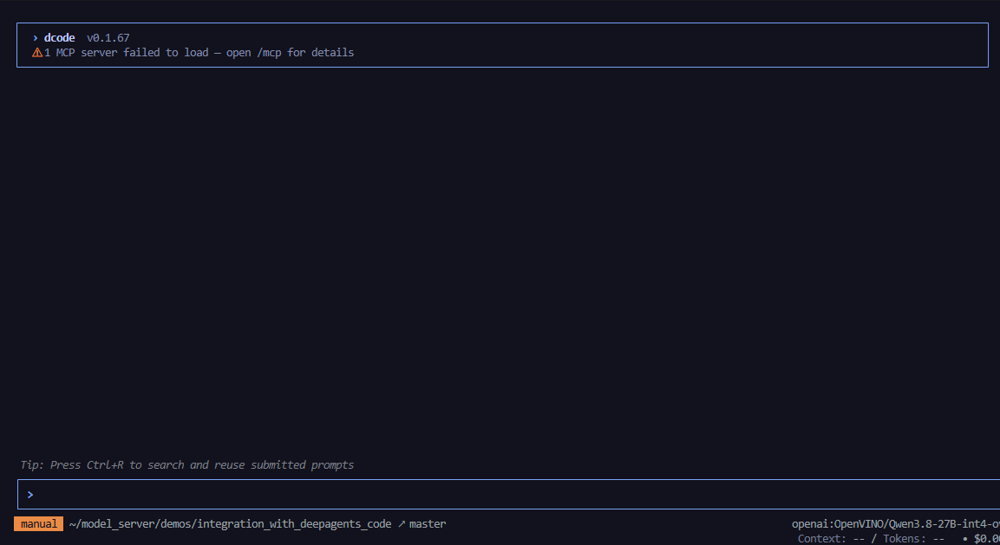
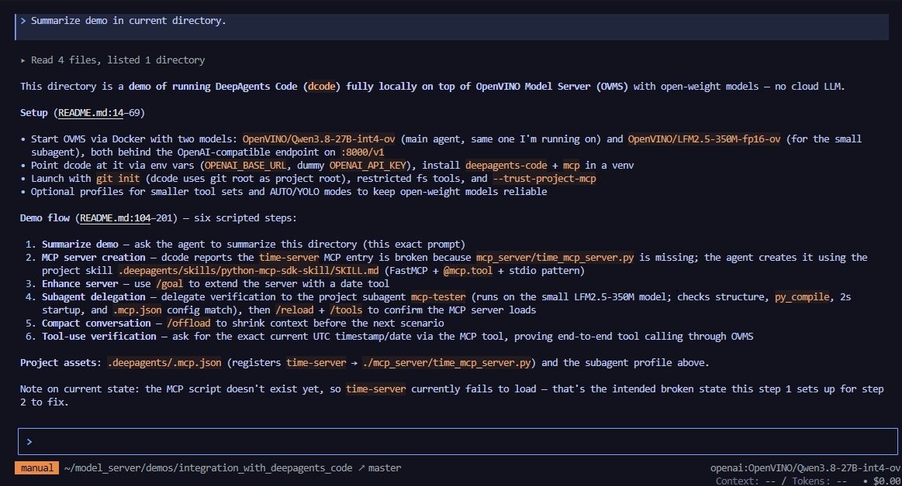
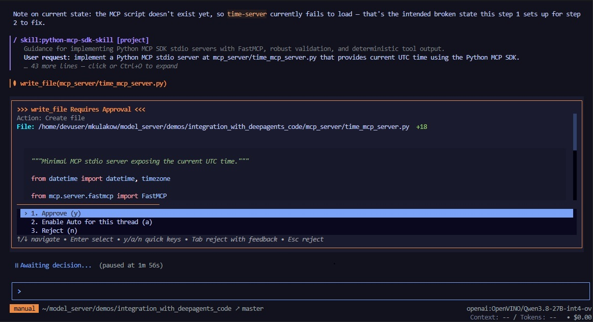
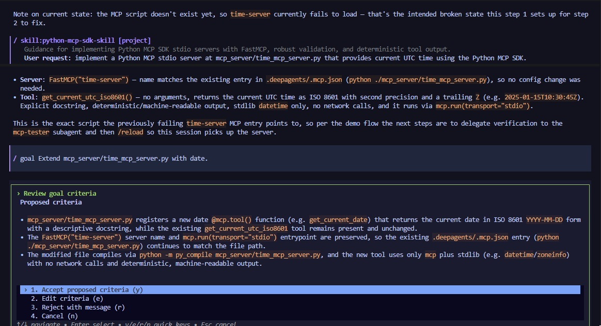
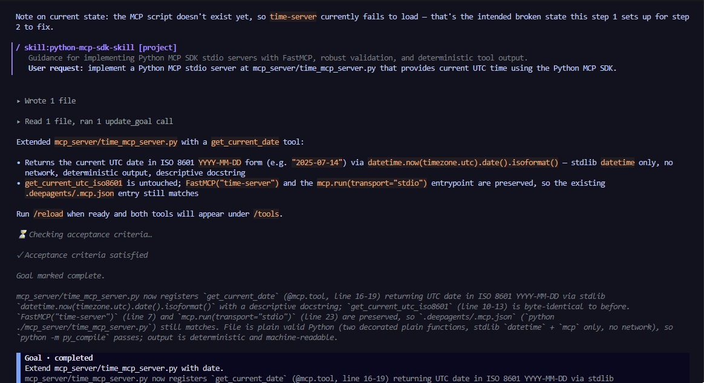
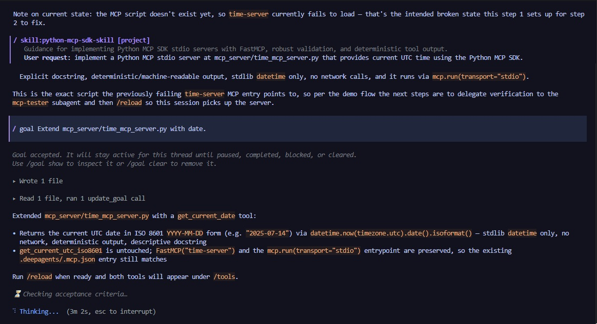
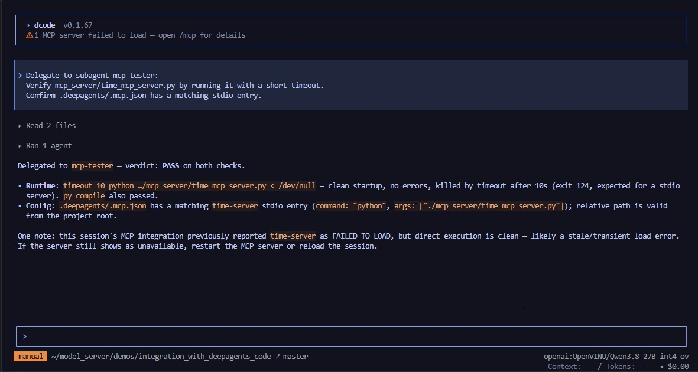
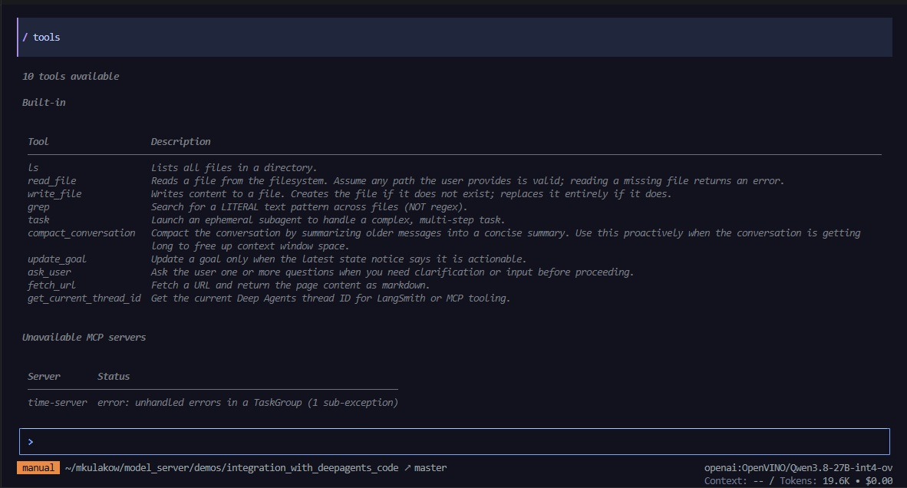
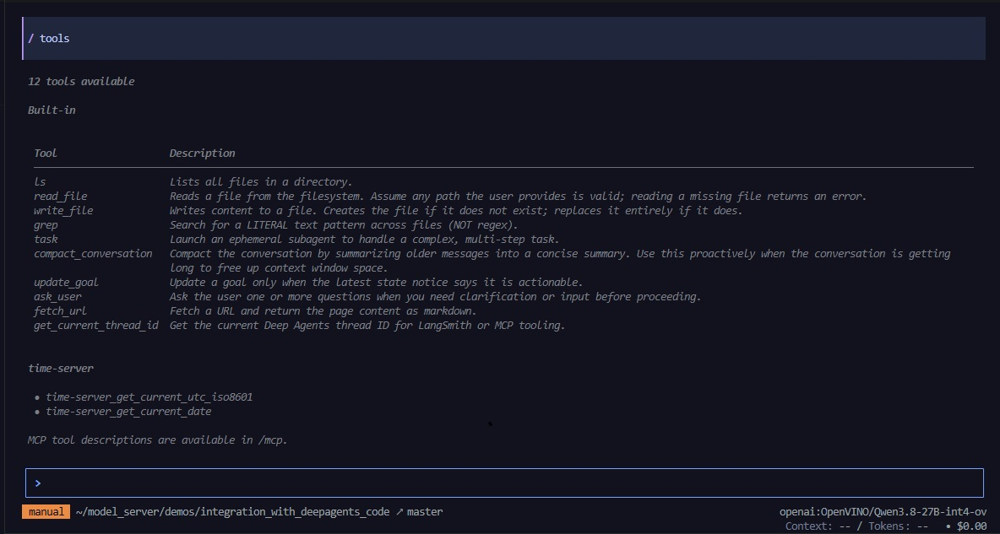
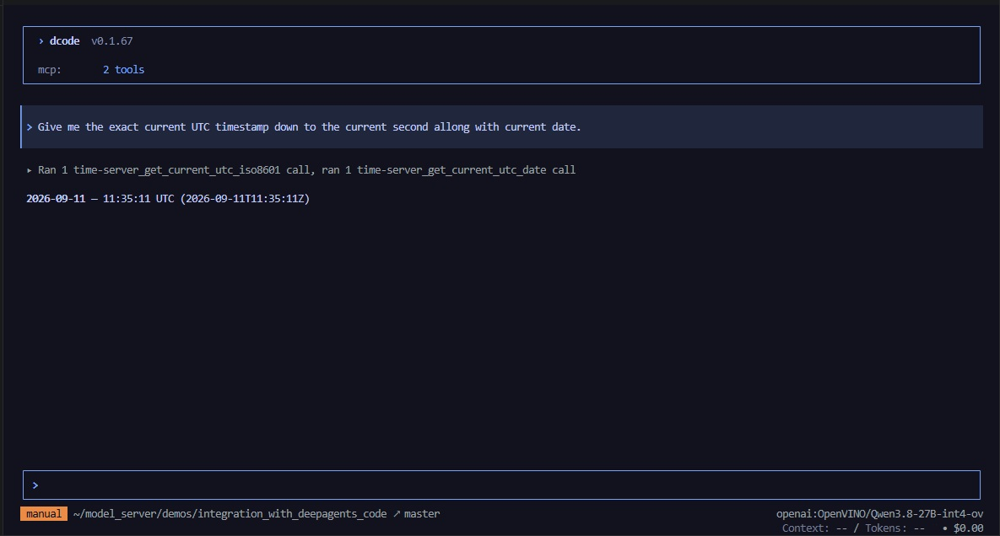

# DeepAgents Code Integration Demo {#ovms_demos_integration_with_deepagents_code}

## Description

This demo presents [OpenVINO Model Server (OVMS)](https://github.com/openvinotoolkit/model_server) integration with [DeepAgents Code](https://github.com/langchain-ai/deepagents) (`dcode`), an open coding agent. You run a model on OVMS, point `dcode` at it with a single environment variable, and then use the agent to build and call a custom MCP tool — all served locally, with no cloud model and no provider lock-in.

### How it fits together

```text
frontend (dcode)  ──OpenAI API──▶  OVMS  ──▶  OpenVINO model (GPU / CPU / NPU)
```

- **OVMS** runs the model locally and exposes `http://localhost:8000/v1` (OpenAI-compatible).
- **dcode** is configured with `OPENAI_BASE_URL` pointing at that endpoint — that single line is the whole integration.
- On top of that connection you add an **MCP tool**, validate it with a **subagent**, and call it end to end.

## Setup

### Prerequisites

This demo deploys OpenVINO Model Server with a Docker container (Linux) or the native `ovms.exe` (Windows), and installs `dcode` via Python pip.

Requirements:
* Intel x86_64 host, Linux or Windows
* [Docker Engine](https://docs.docker.com/engine/) on Linux
* Python 3.12+ with pip
* HuggingFace access to `OpenVINO/Qwen3.8-27B-int4-ov` (auto-downloaded on first OVMS start)

This demo was tested on an Intel host with 32 GB RAM and GPU VRAM extended via Intel Graphics Software. Smaller-memory systems may also work; if you hit memory limits, switch to a smaller model from the [preconfigured OpenVINO models](https://huggingface.co/OpenVINO) catalog.

### Step 1: Start OVMS

The model is auto-pulled on first start if it is not already present in the model repository.

::::{tab-set}
:::{tab-item} Linux
:sync: Linux
```bash
mkdir -p ${HOME}/models
export GPU_ARGS=$(if ls /dev/dri/render* >/dev/null 2>&1; then echo "--device /dev/dri --group-add $(stat -c '%g' /dev/dri/render* | head -n1)"; fi)
docker run -d ${GPU_ARGS} -u $(id -u):$(id -g) \
  -v ${HOME}/models:/models -p 8000:8000 openvino/model_server:latest-gpu \
  --rest_port 8000 --model_repository_path /models \
  --source_model OpenVINO/Qwen3.8-27B-int4-ov
```
:::
:::{tab-item} Windows
:sync: Windows
```bat
mkdir c:\models
ovms.exe --source_model OpenVINO/Qwen3.8-27B-int4-ov --model_repository_path c:\models --model_name OpenVINO/Qwen3.8-27B-int4-ov --rest_port 8000
```
:::
::::

Readiness checks:

```console
curl -f http://localhost:8000/v1/models
```


### Step 2: Install dependencies

::::{tab-set}
:::{tab-item} Linux
:sync: Linux
```bash
python -m pip install --upgrade pip
python -m pip install 'deepagents-code==0.1.70' 'mcp<2'
```
:::
:::{tab-item} Windows
:sync: Windows
```bat
python -m pip install --upgrade pip
python -m pip install "deepagents-code==0.1.70" "mcp<2" colorama
```

`colorama` is required by the console renderer on Windows.
:::
::::

> On Windows, use a short relative working directory such as `demo` or `dcode-demo`; dcode may reject absolute paths with `Error: Windows absolute paths are not supported`.

### Step 3: Clone OVMS repository and enter demo directory

If you do not already have the OVMS repository checked out locally, clone it and change into the demo directory.

::::{tab-set}
:::{tab-item} Linux
:sync: Linux
```bash
git clone https://github.com/openvinotoolkit/model_server.git
cd model_server/demos/integration_with_deepagents_code
```
:::
:::{tab-item} Windows
:sync: Windows
```bat
git clone https://github.com/openvinotoolkit/model_server.git
cd model_server\demos\integration_with_deepagents_code
```
:::
::::

If you already have the repository checked out, just change into `demos/integration_with_deepagents_code`.

### Step 4: Prepare dcode configuration

The only line that actually connects `dcode` to OVMS is `OPENAI_BASE_URL=http://localhost:8000/v1` — everything else below is dcode convenience configuration. Set the default model once so subsequent dcode invocations don't have to repeat `--model` (persisted to `~/.deepagents/config.toml`):

::::{tab-set}
:::{tab-item} Linux
:sync: Linux
```bash
export OPENAI_API_KEY=not_used
export OPENAI_BASE_URL=http://localhost:8000/v1
export TAVILY_API_KEY=not_used
export DEEPAGENTS_CODE_PRICES_AUTO_UPDATE=0
export DEMO_DIR="$PWD"
dcode --default-model openai:OpenVINO/Qwen3.8-27B-int4-ov
```
:::
:::{tab-item} Windows
:sync: Windows
```bat
set OPENAI_API_KEY=not_used
set OPENAI_BASE_URL=http://localhost:8000/v1
set TAVILY_API_KEY=not_used
set DEEPAGENTS_CODE_PRICES_AUTO_UPDATE=0
set DEMO_DIR=%CD%
dcode --default-model openai:OpenVINO/Qwen3.8-27B-int4-ov
```
:::
::::

- **`OPENAI_BASE_URL`**: points dcode at the OVMS endpoint. 
- **`OPENAI_API_KEY=not_used`**: OVMS does not require a key for local serving, but the OpenAI client library expects the variable to be set.
- **`TAVILY_API_KEY=not_used`**: silences the web-search key warning; the demo never invokes web search, so the placeholder is inert.
- **`DEEPAGENTS_CODE_PRICES_AUTO_UPDATE=0`**: avoids external pricing refresh.
- **`DEMO_DIR`**: expanded inside [`.deepagents/.mcp.json`](https://github.com/openvinotoolkit/model_server/blob/main/demos/integration_with_deepagents_code/.deepagents/.mcp.json) so the MCP server script is located reliably.

dcode uses git to track file state and pins its project root (and its skill / MCP / subagent discovery) at the closest `.git` directory. Initialize a repository *inside the demo folder* so dcode scopes to it, even when the folder itself lives inside another checkout (like the `model_server` clone):

```console
git init
```

The check keeps re-runs idempotent while still creating a fresh nested repo the first time.

---

## Demo flow

Start `dcode` session and follow the steps below in order.

### Step 1: Start dcode

Launch dcode with a locked-down tool surface.

Run deepagents code with a limited set of tools:

```text
dcode --allow-fs-tools read_file,write_file,grep,ls,execute -S python,python3,timeout,cat,grep,ls --no-interpreter --trust-project-mcp
```

Parameter notes:
- `--allow-fs-tools`: controls exposed local tools. `execute` is needed for runtime checks.
- `-S ...`: shell allow-list for `execute` command safety.
- `--no-interpreter`: disables js_eval middleware.
- `--trust-project-mcp`: auto-trusts project MCP configuration.



### Step 2: Ask agent to summarize demo

Start with a broad, low-risk prompt so the agent explores the working directory, loads project files into its context and confirms that OVMS is reachable. This also warms up prefix caching on the server for later turns.

```text
Summarize demo in current directory.
```

First response can be slower because initial dcode context is large. Later turns are typically faster due to prefix caching.



### Step 3: Create MCP server

The project ships with a preconfigured MCP client entry in [`.deepagents/.mcp.json`](https://github.com/openvinotoolkit/model_server/blob/main/demos/integration_with_deepagents_code/.deepagents/.mcp.json), but the actual server script does not exist yet. In interactive mode, dcode surfaces this as a tool-loading error — a good signal that the agent is aware of the MCP configuration. Ask the agent to create the script using the project skill located at [`.deepagents/skills/python-mcp-sdk-skill/SKILL.md`](https://github.com/openvinotoolkit/model_server/blob/main/demos/integration_with_deepagents_code/.deepagents/skills/python-mcp-sdk-skill/SKILL.md). Invoking a skill with `/skill:<name>` gives the agent a focused, tested recipe instead of relying on generic knowledge:

```text
/skill:python-mcp-sdk-skill implement a Python MCP stdio server at mcp_server/time_mcp_server.py that provides current UTC time using the Python MCP SDK.
```



### Step 4: Extend MCP server with date tool

Use `/goal` to switch the agent into goal mode: it will propose acceptance criteria, iterate on the implementation and self-grade the result against those criteria. This is a good fit for incremental changes on top of an existing file.

```text
/goal Extend mcp_server/time_mcp_server.py with date tool.
```

First the agent negotiates acceptance criteria for the change:



Then it works towards those criteria:



And finally grades its own output:



Once the goal is satisfied, clear it so subsequent prompts run in normal mode:

```text
/goal clear
```

### Step 5: Validate MCP server with subagent

Instead of running tests in the main context, delegate validation to a dedicated subagent. This keeps the main conversation focused. The subagent definition lives in:

- [`.deepagents/agents/mcp-tester/AGENTS.md`](https://github.com/openvinotoolkit/model_server/blob/main/demos/integration_with_deepagents_code/.deepagents/agents/mcp-tester/AGENTS.md)

`mcp-tester` verifies static structure and runtime behavior of the MCP server and returns a concise `PASS`/`FAIL` verdict.

```text
Delegate to subagent mcp-tester:
Test mcp_server/time_mcp_server.py
```



If tester returns `FAIL`, main agent can proceed with fixes. If tester returns `PASS`, continue below.

### Step 6: Reload MCP tools

The MCP server is now on disk, but the current dcode session was started before it existed, so its tools are not yet registered. Use `/tools` to inspect the currently loaded tool list, then `/reload` to re-scan the MCP configuration without restarting dcode.

```text
/tools
```



```text
/reload
/tools
```



### Step 7: Verify end-to-end tool call

With the MCP tools now registered, issue a prompt that can only be answered correctly by calling the freshly created server. If the agent invokes the MCP tool and reports the real UTC time and date, the end-to-end integration is working.

```text
Give me the exact current UTC timestamp down to the current second along with current date.
```



## Headless flow

Use these one-shot commands for automation or quick verification. In this mode, each `dcode -n ...` invocation starts a fresh session and exits after producing a final response. The expected outputs below are illustrative — exact wording and values vary by model and run.

### Step 1: Summarize demo

```console
dcode -n "Summarize demo in current directory." --allow-fs-tools read_file,grep,ls --no-mcp --no-interpreter --quiet
```

<details>
<summary>Expected output</summary>

```text
## Demo Summary: DeepAgents Code Integration with OpenVINO Model Server

This demo (`integration_with_deepagents_code`) showcases how to integrate [DeepAgents Code](https://github.com/langchain-ai/deepagents) (`dcode`) with [OpenVINO Model Server (OVMS)](https://github.com/openvinotoolkit/model_server) using OpenAI-compatible endpoints.

### Architecture

- **OVMS** serves an OpenVINO model (`OpenVINO/Qwen3.8-27B-int4-ov`) via a Docker container on port `8000`
- **dcode** connects to OVMS via `OPENAI_BASE_URL=http://localhost:8000/v1`
- An **MCP stdio server** (`mcp_server/time_mcp_server.py`) provides `time` and `date` tools to agents
- A **subagent** (`mcp-tester`) validates the MCP server's structure and runtime behavior

### Demo Flow (6 Steps)

| Step | Description |
|------|-------------|
| 1 | Ask agent to summarize the demo (exploration + OVMS reachability check) |
| 2 | Agent creates the MCP server using `python-mcp-sdk-skill` |
| 3 | Agent extends the server with a `date` tool (via `/goal` acceptance-criteria loop) |
| 4 | Subagent `mcp-tester` validates the server statically and at runtime |
| 5 | Reload MCP tools in the current session (`/reload`) |
| 6 | End-to-end tool use — agent calls `time` + `date` MCP tools to answer a real prompt |

### Key Components

- **Config**: `.deepagents/.mcp.json` declares the `time-server` MCP endpoint
- **Agent**: `.deepagents/agents/mcp-tester/` defines the validation subagent
- **Skill**: `.deepagents/skills/python-mcp-sdk-skill/` provides the MCP server scaffolding recipe
- **Screenshots**: `screenshots/` contains visual reference images for each step

### Use Cases

- **Interactive**: Type prompts into the dcode TUI for hands-on learning
- **Headless**: Run `dcode -n "..." --quiet` for CI/automation scripts
```

</details>

### Step 2: Create MCP server

```console
dcode -n "Implement a Python MCP stdio server at mcp_server/time_mcp_server.py that provides current UTC time using the Python MCP SDK." --skill python-mcp-sdk-skill --allow-fs-tools read_file,write_file,grep,ls,execute -S python,python3,timeout,cat,grep,ls --no-mcp --no-interpreter --quiet
```

<details>
<summary>Expected output</summary>

```text
Created `mcp_server/time_mcp_server.py` with:

- `get_current_utc_iso8601()` tool returning the current UTC time as an ISO 8601 string with trailing `Z`.
- No third-party dependencies beyond `mcp`.
- No network calls. Deterministic, machine-readable output.
```

</details>

### Step 3: Extend MCP server with date tool

```console
dcode -n "Extend mcp_server/time_mcp_server.py with a date tool." --rubric "mcp_server/time_mcp_server.py defines a new @mcp.tool returning the current UTC date as an ISO string; the existing time tool still works; python -m py_compile mcp_server/time_mcp_server.py succeeds." --allow-fs-tools read_file,write_file,grep,ls,execute -S python,python3,timeout,cat,grep,ls --no-mcp --no-interpreter --quiet
```

<details>
<summary>Expected output</summary>

```text
Done. Added `get_current_utc_date()` tool to `time_mcp_server.py`. It returns the current UTC date as an ISO 8601 string (`YYYY-MM-DD`). Compiles cleanly.⏳ Checking acceptance criteria…
✓ Acceptance criteria satisfied
```

</details>

### Step 4: Validate MCP server with subagent

```console
dcode -n "Delegate to subagent mcp-tester: Test mcp_server/time_mcp_server.py" --allow-fs-tools read_file,grep,ls,execute -S python,python3,timeout,cat,grep,ls --no-mcp --no-interpreter --quiet
```

<details>
<summary>Expected output</summary>

```text
**time_mcp_server.py — MCP Test Results: All PASSED ✅**

| Check | Result |
|---|---|
| Script Structure | ✅ FastMCP, 2 tools, `mcp.run(transport="stdio")` |
| py_compile | ✅ Compiles cleanly (Python 3.12) |
| Startup Timeout | ✅ Exits cleanly (no TTY in sandbox) |
| MCP Config Match | ✅ `.deepagents/.mcp.json` references the correct server |
```

</details>

### Step 5: Verify end-to-end tool call

```console
dcode -n "Give me the exact current UTC timestamp down to the current second along with current date." --allow-fs-tools read_file,grep,ls,execute -S python,python3,timeout,cat,grep,ls --trust-project-mcp --no-interpreter --quiet
```

<details>
<summary>Expected output</summary>

```text
Current UTC timestamp: `2026-09-30T14:00:12.508579Z`

Current UTC date: `2026-09-30`

Full datetime: **Tuesday, September 30, 2026 at 14:00:12 UTC**
```

</details>

If the agent instead returns *"This MCP action requires approval, but the current headless runtime has no approval UI"*, the tools in `mcp_server/time_mcp_server.py` are missing MCP `ToolAnnotations`. dcode's headless guard rejects any MCP tool whose metadata does not have `readOnlyHint=True` and `destructiveHint=False`. The `python-mcp-sdk-skill` used in Step 3 emits these annotations for read-only tools; if you edited the server by hand, re-run Step 3 or add the annotations manually.

---

## Tips

### Smaller tool surface

By default, if `--allow-fs-tools` is not set, dcode enables the built-in filesystem tools. For open-weight models, reducing the tool surface can improve reliability and make the agent more predictable.

Non-MCP tasks:

```text
dcode --interpreter-tools safe --allow-fs-tools read_file,grep,glob,ls --no-mcp
```

MCP tasks:

```text
dcode --interpreter-tools safe --allow-fs-tools read_file,grep,glob,ls,execute
```

If a task fails because a required tool is unavailable, restart dcode with a broader tool set.

### Approval modes

dcode supports several approval modes (Manual, Auto, YOLO) that trade off safety for autonomy. See the [official dcode documentation](https://docs.langchain.com/deepagents-code) for details on each mode and how to enable them.

### Compacting conversation

With `/offload` command the agent can reduce its context by dropping messages that are not relevant anymore.

```text
/offload
```
