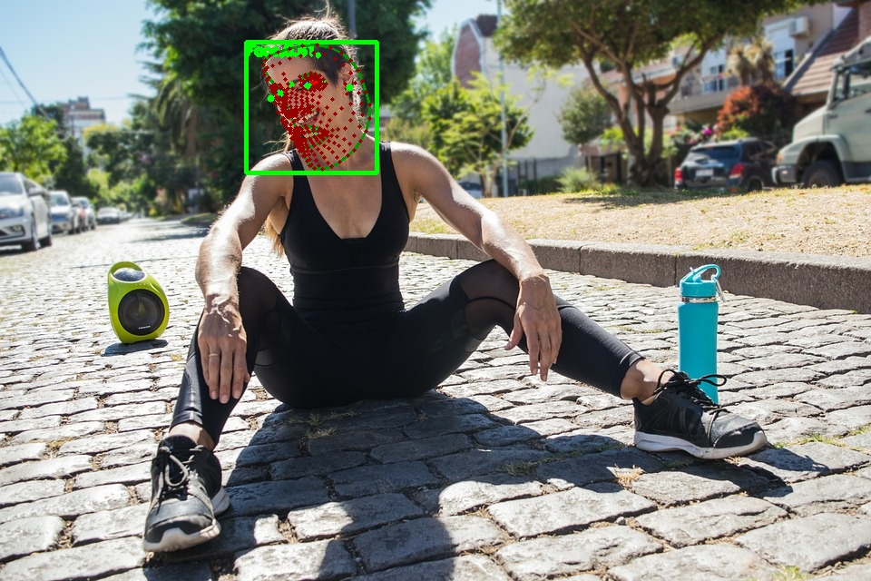

# MediaPipe Holistic Demo {#ovms_docs_demo_mediapipe_holistic}

This guide shows how to implement [MediaPipe](../../../docs/mediapipe.md) graph using OVMS.

Example usage of graph that accepts Mediapipe::ImageFrame as a input:

The demo is based on the [upstream Mediapipe holistic demo](https://github.com/google/mediapipe/blob/master/docs/solutions/holistic.md)
and [Mediapipe Iris demo](https://github.com/google/mediapipe/blob/master/docs/solutions/iris.md)

## Prepare the server deployment

Clone the repository and enter mediapipe object_detection directory
```bash
git clone https://github.com/openvinotoolkit/model_server.git
cd model_server/demos/mediapipe/holistic_tracking

./prepare_server.sh

```

The models setup should look like this
```bash
ovms
├── config_holistic.json
├── face_detection_short_range
│   └── 1
│       └── face_detection_short_range.tflite
├── face_landmark
│   └── 1
│       └── face_landmark.tflite
├── hand_landmark_full
│   └── 1
│       └── hand_landmark_full.tflite
├── hand_recrop
│   └── 1
│       └── hand_recrop.tflite
├── holistic_tracking.pbtxt
├── iris_landmark
│   └── 1
│       └── iris_landmark.tflite
├── iris_tracking.pbtxt
├── palm_detection_full
│   └── 1
│       └── palm_detection_full.tflite
├── pose_detection
│   └── 1
│       └── pose_detection.tflite
└── pose_landmark_full
    └── 1
        └── pose_landmark_full.tflite


```

### Pull the Latest Model Server Image
Pull the latest version of OpenVINO&trade; Model Server from Docker Hub :
```Bash
docker pull openvino/model_server:latest

```

## Run OpenVINO Model Server
```bash
docker run -d -v $PWD/mediapipe:/mediapipe -v $PWD/ovms:/models -p 9000:9000 openvino/model_server:latest --config_path /models/config_holistic.json --port 9000
```

## Run client application for holistic tracking - default demo
```bash
pip install -r requirements.txt
# download a sample image for analysis
curl -kL -o girl.jpeg https://cdn.pixabay.com/photo/2019/03/12/20/39/girl-4051811_960_720.jpg
echo "girl.jpeg" > input_images.txt
# launch the client
python mediapipe_holistic_tracking.py --grpc_port 9000 --images_list input_images.txt
Running demo application.
Start processing:
        Graph name: holisticTracking
(640, 960, 3)
Iteration 0; Processing time: 131.45 ms; speed 7.61 fps
Results saved to :image_0.jpg
```
## Output image


## Run client application for iris tracking
In a similar way can be executed the iris image analysis:

```bash
python mediapipe_holistic_tracking.py --graph_name irisTracking --images_list input_images.txt --grpc_port 9000
Running demo application.
Start processing:
        Graph name: irisTracking
(640, 960, 3)
Iteration 0; Processing time: 77.03 ms; speed 12.98 fps
Results saved to :image_0.jpg
```

## Output image



## RTSP Client
Mediapipe graph can be used for remote analysis of individual images but the client can use it for a complete video stream processing.
Below is an example how to run a client reading encoded rtsp video stream.


Build docker image containing rtsp client along with its dependencies
The rtsp client app needs to have access to RTSP stream to read from and write to.

Example rtsp server [mediamtx](https://github.com/bluenviron/mediamtx)

Then write to the server using ffmpeg, example using camera

```bash
ffmpeg -f dshow -i video="HP HD Camera" -f rtsp -rtsp_transport tcp rtsp://localhost:8080/channel1
```

Build the docker image with the python client for video stream reading an remote analysis:
```bash
docker build ../../common/stream_client/ -t rtsp_client
```

### Start the client

- Command

```bash
docker run -v $(pwd):/workspace rtsp_client --help
usage: rtsp_client.py [-h] [--grpc_address GRPC_ADDRESS]
                      [--input_stream INPUT_STREAM]
                      [--output_stream OUTPUT_STREAM]
                      [--model_name MODEL_NAME] [--verbose VERBOSE]
                      [--input_name INPUT_NAME]

options:
  -h, --help            show this help message and exit
  --grpc_address GRPC_ADDRESS
                        Specify url to grpc service
  --input_stream INPUT_STREAM
                        Url of input rtsp stream
  --output_stream OUTPUT_STREAM
                        Url of output rtsp stream
  --model_name MODEL_NAME
                        Name of the model
  --verbose VERBOSE     Should client dump debug information
  --input_name INPUT_NAME
                        Name of the model's input
```

- Usage example

### Inference using RTSP stream

```bash
docker run -v $(pwd):/workspace rtsp_client --grpc_address localhost:9000 --input_stream 'rtsp://localhost:8080/channel1' --output_stream 'rtsp://localhost:8080/channel2'
```

Then read rtsp stream using ffplay

```bash
ffplay -pix_fmt yuv420p -video_size 704x704 -rtsp_transport tcp rtsp://localhost:8080/channel2
```

### Inference using prerecorded video

One might as well use prerecorded video and schedule it for inference.
Replace horizontal_text.mp4 with your video file.

```bash
docker run -v $(pwd):/workspace rtsp_client --grpc_address localhost:9000 --input_stream 'workspace/video.mp4' --output_stream 'workspace/output.mp4'
```
