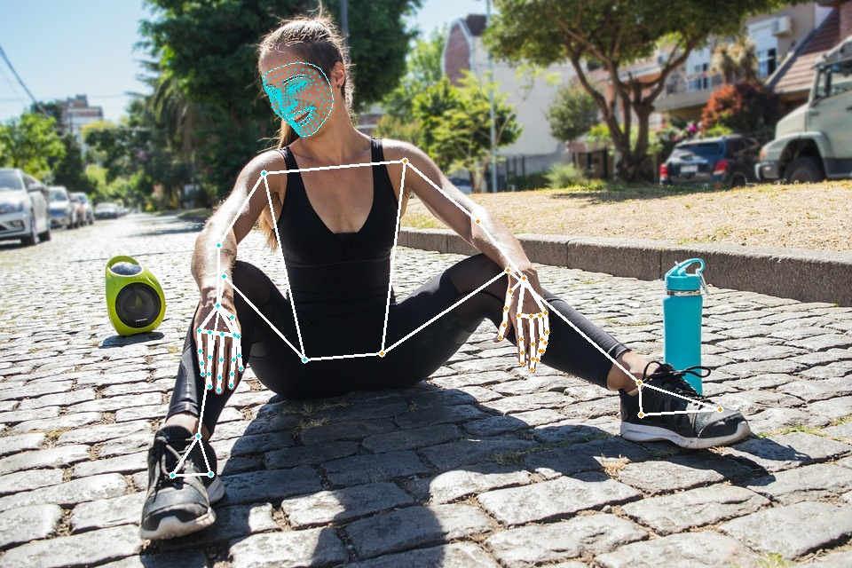

# MediaPipe Holistic Demo {#ovms_docs_demo_mediapipe_holistic}

This guide shows how to implement [MediaPipe](../../../docs/mediapipe.md) graph using OVMS.

Example usage of graph that accepts Mediapipe::ImageFrame as a input:

The demo is based on the [upstream Mediapipe holistic demo](https://github.com/google/mediapipe/blob/master/docs/solutions/holistic.md).

## Prerequisites

**Model preparation**: Python 3.9 or higher with pip 

**Model Server deployment**: Installed Docker Engine or OVMS binary package according to the [baremetal deployment guide](../../../docs/deploying_server_baremetal.md)

## Prepare models

Clone the repository and enter mediapipe holistic_tracking directory
```console
git clone https://github.com/openvinotoolkit/model_server.git
cd model_server/demos/mediapipe/holistic_tracking

# copy a text file for hand landmark module
curl --create-dirs https://raw.githubusercontent.com/openvinotoolkit/mediapipe/v2023.3/mediapipe/modules/hand_landmark/handedness.txt -o mediapipe/modules/hand_landmark/handedness.txt 

# download the models
curl https://storage.googleapis.com/mediapipe-assets/face_detection_short_range.tflite -o face_detection_short_range/1/face_detection_short_range.tflite --create-dirs
curl https://storage.googleapis.com/mediapipe-assets/face_landmark.tflite -o face_landmark/1/face_landmark.tflite --create-dirs
curl https://storage.googleapis.com/mediapipe-assets/hand_landmark_full.tflite -o hand_landmark_full/1/hand_landmark_full.tflite --create-dirs
curl https://storage.googleapis.com/mediapipe-assets/hand_recrop.tflite -o hand_recrop/1/hand_recrop.tflite --create-dirs
curl https://storage.googleapis.com/mediapipe-assets/iris_landmark.tflite -o iris_landmark/1/iris_landmark.tflite --create-dirs
curl https://storage.googleapis.com/mediapipe-assets/palm_detection_full.tflite -o palm_detection_full/1/palm_detection_full.tflite --create-dirs
curl https://storage.googleapis.com/mediapipe-assets/pose_detection.tflite -o pose_detection/1/pose_detection.tflite --create-dirs
curl https://storage.googleapis.com/mediapipe-assets/pose_landmark_full.tflite -o pose_landmark_full/1/pose_landmark_full.tflite --create-dirs

```

The models setup should look like this
```bash
├── config_holistic.json
├── face_detection_short_range
│   └── 1
│       └── face_detection_short_range.tflite
├── face_landmark
│   └── 1
│       └── face_landmark.tflite
├── hand_landmark_full
│   └── 1
│       └── hand_landmark_full.tflite
├── hand_recrop
│   └── 1
│       └── hand_recrop.tflite
├── holistic_tracking.pbtxt
├── iris_landmark
│   └── 1
│       └── iris_landmark.tflite
├── mediapipe
│   └── modules
│       └── hand_landmark
│           └── handedness.txt
├── mediapipe_holistic_tracking.py
├── palm_detection_full
│   └── 1
│       └── palm_detection_full.tflite
├── pose_detection
│   └── 1
│       └── pose_detection.tflite
├── pose_landmark_full
│   └── 1
│       └── pose_landmark_full.tflite
├── README.md
└── requirements.txt
```
## Server Deployment
:::{dropdown} **Deploying with Docker**
### Pull the Latest Model Server Image
Pull the latest version of OpenVINO&trade; Model Server from Docker Hub:
```bash
docker pull openvino/model_server:latest

```
```bash
chmod -R 755 .
docker run -d -v $PWD/mediapipe:/mediapipe -v $PWD:/models -p 9000:9000 openvino/model_server:latest --config_path /models/config_holistic.json --port 9000
```
:::
:::{dropdown} **Deploying on Bare Metal**
Assuming you have unpacked model server package, make sure to:

- **On Windows**: run `setupvars` script
- **On Linux**: set `LD_LIBRARY_PATH` and `PATH` environment variables

as mentioned in [deployment guide](../../../docs/deploying_server_baremetal.md), in every new shell that will start OpenVINO Model Server.
```bat
cd demos\mediapipe\holistic_tracking
ovms --config_path config_holistic.json --port 9000
```
:::
## Run client application for holistic tracking - default demo
```console
pip install -r requirements.txt
# download a sample image for analysis
curl -kL -o girl.jpeg https://cdn.pixabay.com/photo/2019/03/12/20/39/girl-4051811_960_720.jpg
echo girl.jpeg>input_images.txt
# launch the client
python mediapipe_holistic_tracking.py --grpc_port 9000 --images_list input_images.txt
Running demo application.
Start processing:
        Graph name: holisticTracking
(640, 960, 3)
Iteration 0; Processing time: 131.45 ms; speed 7.61 fps
Results saved to :image_0.jpg
```
## Output image


## Real time stream analysis

For demo featuring real time stream application see [real_time_stream_analysis](https://github.com/openvinotoolkit/model_server/tree/main/demos/real_time_stream_analysis/python)

