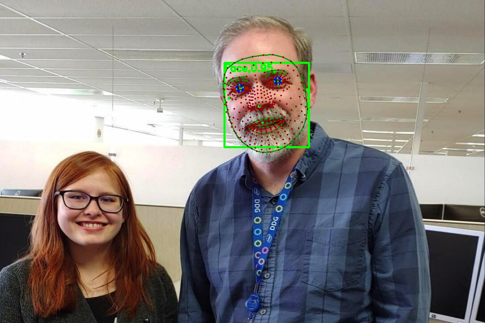

# MediaPipe Iris Demo {#ovms_docs_demo_mediapipe_iris}

This guide shows how to implement [MediaPipe](../../../docs/mediapipe.md) graph using OVMS.

Example usage of graph that accepts Mediapipe::ImageFrame as a input:

The demo is based on the [Mediapipe Iris demo](https://github.com/google/mediapipe/blob/master/docs/solutions/iris.md)

## Prerequisites

**Model preparation**: Python 3.9 or higher with pip 

**Model Server deployment**: Installed Docker Engine or OVMS binary package according to the [baremetal deployment guide](../../../docs/deploying_server_baremetal.md)

## Prepare models

Clone the repository and enter mediapipe object_detection directory
```console
git clone https://github.com/openvinotoolkit/model_server.git
cd model_server/demos/mediapipe/iris_tracking

curl https://storage.googleapis.com/mediapipe-assets/face_detection_short_range.tflite -o face_detection_short_range/1/face_detection_short_range.tflite --create-dirs
curl https://storage.googleapis.com/mediapipe-assets/face_landmark.tflite -o face_landmark/1/face_landmark.tflite --create-dirs
curl https://storage.googleapis.com/mediapipe-assets/iris_landmark.tflite -o iris_landmark/1/iris_landmark.tflite --create-dirs

```
## Server Deployment
:::{dropdown} **Deploying with Docker**
Pull the latest version of OpenVINO&trade; Model Server from Docker Hub:
```Bash
docker pull openvino/model_server:latest

```
```bash
docker run -d -v $PWD/mediapipe:/mediapipe -v $PWD:/models -p 9000:9000 openvino/model_server:latest --config_path /models/config_iris.json --port 9000
```
:::
:::{dropdown} **Deploying on Bare Metal**
Assuming you have unpacked model server package, make sure to:

- **On Windows**: run `setupvars` script
- **On Linux**: set `LD_LIBRARY_PATH` and `PATH` environment variables

as mentioned in [deployment guide](../../../docs/deploying_server_baremetal.md), in every new shell that will start OpenVINO Model Server.
```bat
ovms --config_path config_iris.json --port 9000
```
:::
## Run client application for iris tracking
```console
pip install -r requirements.txt
# download a sample image for analysis
wget https://raw.githubusercontent.com/openvinotoolkit/model_server/main/demos/common/static/images/people/people2.jpeg
echo people2.jpeg>input_images.txt
# launch the client
python mediapipe_iris_tracking.py --grpc_port 9000 --images_list input_images.txt
Running demo application.
Start processing:
        Graph name: irisTracking
(800, 1200, 3)
Iteration 0; Processing time: 44.73 ms; speed 22.36 fps
Results saved to :image_0.jpg
```
## Output image

