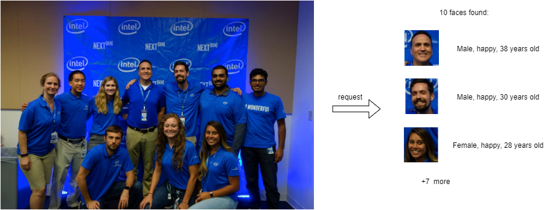

# Multi Faces Analysis Pipeline Demo {#ovms_demo_multi_faces_analysis_pipeline}


This document demonstrates how to create complex pipelines using object detection and object recognition models from OpenVINO Model Zoo. As an example, we will use [face-detection-retail-0004](https://github.com/openvinotoolkit/open_model_zoo/blob/2022.1.0/models/intel/face-detection-retail-0004/README.md) to detect multiple faces on the image. Then, for each detected face we will crop it using [model_zoo_intel_object_detection](https://github.com/openvinotoolkit/model_server/tree/releases/2022/1/src/custom_nodes/model_zoo_intel_object_detection) example custom node. Finally, each image face image will be forwarded to [age-gender-recognition-retail-0013](https://github.com/openvinotoolkit/open_model_zoo/blob/2022.1.0/models/intel/age-gender-recognition-retail-0013/README.md) and [emotion-recognition-retail-0003](https://github.com/openvinotoolkit/open_model_zoo/blob/2022.1.0/models/intel/emotions-recognition-retail-0003/README.md) models.



Using such a pipeline, a single request to OVMS can perform a complex set of operations to determine all faces and their properties.

### See also

For simpler use case with single face analysis see [single_face_analysis_pipeline](../../single_face_analysis_pipeline/python/README.md) demo.

## Pipeline Configuration Graph

Below is depicted graph implementing faces analysis pipeline execution. 


It includes the following Nodes:
- Model `face-detection` - deep learning model which takes user image as input. Its outputs contain information about face coordinates and confidence levels.
- Custom node `model_zoo_intel_object_detection` - it includes C++ implementation of common object detection models results processing. By analysing the output it produces cropped face images based on the configurable score level threshold. Custom node also resizes them to the target resolution and combines into a single output of a dynamic batch size. The output batch size is determined by the number of detected
boxes according to the configured criteria. All operations on the images employ OpenCV libraries which are preinstalled in the OVMS. Learn more about the [model_zoo_intel_object_detection custom node](https://github.com/openvinotoolkit/model_server/tree/releases/2022/1/src/custom_nodes/model_zoo_intel_object_detection).
- demultiplexer - outputs from the custom node model_zoo_intel_object_detection have variable batch size. In order to match it with the sequential recognition models, data is split into individual images with each batch size equal to 1.
Such smaller requests can be submitted for inference in parallel to the next Model Nodes. Learn more about the [demultiplexing](../../../docs/demultiplexing.md).
- Model `age-gender-recognition` - this model recognizes age and gender on given face image
- Model `emotion-recognition` - this model outputs emotion probability for emotions: neutral, happy, sad, surprised and angry
- Response - the output of the whole pipeline combines the recognized face images with their metadata: coordinates, age, gender, emotions and detection confidence level. 

## Prepare workspace to run the demo

To successfully deploy face analysis pipeline you need to have a workspace that contains:
- [face-detection-retail-0004](https://github.com/openvinotoolkit/open_model_zoo/blob/2022.1.0/models/intel/face-detection-retail-0004/README.md), 
[age-gender-recognition-retail-0013](https://github.com/openvinotoolkit/open_model_zoo/blob/2022.1.0/models/intel/age-gender-recognition-retail-0013/README.md) and
[emotion-recognition-retail-0003](https://github.com/openvinotoolkit/open_model_zoo/blob/2022.1.0/models/intel/emotions-recognition-retail-0003/README.md) models
- Custom node for image processing
- Configuration file

Clone the repository and enter multi_faces_analysis_pipeline directory
```bash
git clone https://github.com/openvinotoolkit/model_server.git
cd model_server/demos/multi_faces_analysis_pipeline/python
```

You can prepare the workspace that contains all the above by just running

```bash
make
```

### Final directory structure

Once the `make` procedure is finished, you should have `workspace` directory ready with the following content.
```bash
workspace
├── age-gender-recognition-retail-0013
│   └── 1
│       ├── age-gender-recognition-retail-0013.bin
│       └── age-gender-recognition-retail-0013.xml
├── config.json
├── emotion-recognition-retail-0003
│   └── 1
│       ├── emotions-recognition-retail-0003.bin
│       └── emotions-recognition-retail-0003.xml
├── face-detection-retail-0004
│   └── 1
│       ├── face-detection-retail-0004.bin
│       └── face-detection-retail-0004.xml
└── lib
    └── libcustom_node_model_zoo_intel_object_detection.so
```

## Deploying OVMS

Deploy OVMS with faces analysis pipeline using the following command:

```bash
docker run -p 9000:9000 -d -v ${PWD}/workspace:/workspace openvino/model_server --config_path /workspace/config.json --port 9000
```

## Requesting the Service

Exemplary client [multi_faces_analysis_pipeline.py](multi_faces_analysis_pipeline.py) can be used to request pipeline deployed in previous step.

```bash
pip3 install -r requirements.txt
``` 

Now you can create a directory for text images and run the client:
```bash
mkdir results
```
```bash
python3 multi_faces_analysis_pipeline.py --pipeline_name find_face_images --grpc_port 9000 --image_input_path ../../common/static/images/people/people1.jpeg --face_images_output_name face_images --face_images_save_path ./results --image_width 600 --image_height 400 --input_image_layout NHWC
Output: name[emotions]
    numpy => shape[(10, 1, 5, 1, 1)] data[float32]
Output: name[ages]
    numpy => shape[(10, 1, 1, 1, 1)] data[float32]
Output: name[confidence_levels]
    numpy => shape[(10, 1, 1)] data[float32]
Output: name[genders]
    numpy => shape[(10, 1, 2, 1, 1)] data[float32]
Output: name[face_images]
    numpy => shape[(10, 1, 64, 64, 3)] data[float32]
Output: name[face_coordinates]
    numpy => shape[(10, 1, 4)] data[float32]

Found 10 faces:
Age: 36 ; Gender: male ; Emotion: happy ; Original image coordinate: [0.5524015  0.30247137 0.5912314  0.39167264]
Age: 24 ; Gender: male ; Emotion: neutral ; Original image coordinate: [0.33651015 0.6238419  0.38452235 0.7109271 ]
Age: 22 ; Gender: male ; Emotion: happy ; Original image coordinate: [0.2273316  0.34603435 0.26951137 0.44243896]
Age: 46 ; Gender: male ; Emotion: happy ; Original image coordinate: [0.44218776 0.29372302 0.48234263 0.37782392]
Age: 41 ; Gender: female ; Emotion: happy ; Original image coordinate: [0.51707435 0.5602793  0.56729674 0.65029866]
Age: 26 ; Gender: male ; Emotion: happy ; Original image coordinate: [0.798531   0.35693872 0.8411773  0.42878723]
Age: 26 ; Gender: female ; Emotion: happy ; Original image coordinate: [0.6506455  0.5917437  0.69963944 0.6924231 ]
Age: 30 ; Gender: male ; Emotion: happy ; Original image coordinate: [0.67255247 0.3240037  0.72031224 0.4141158 ]
Age: 22 ; Gender: female ; Emotion: happy ; Original image coordinate: [0.13879135 0.36219013 0.18784639 0.4526276 ]
Age: 22 ; Gender: female ; Emotion: happy ; Original image coordinate: [0.33016038 0.37727404 0.36954236 0.44583446]
```

With additional parameter `--face_images_save_path` the client script saves all detected text images to jpeg files into directory path to confirm
if the image was analyzed correctly.
