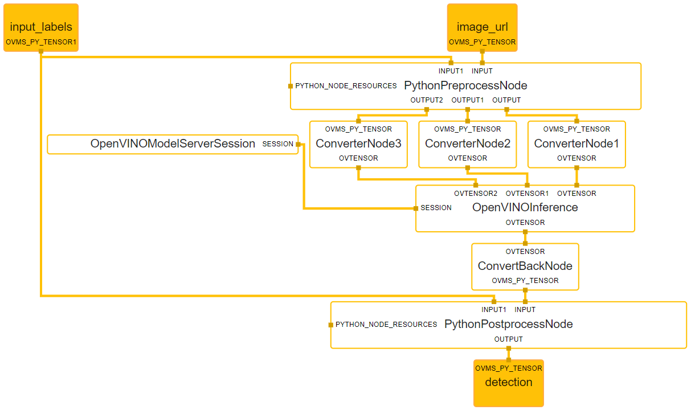

# CLIP demo with python node {#ovms_demo_clip}

Python node execution with Openvino Model Server inference example.
The client sends request with image_url and input_labels into the CLIP model to get the detection name based on the highest probability from CLIP model. The preprocess python script node is executed first in graph and prepares inputs vector based on user inputs sent from client. Then inputs are used to get similarity matrix from inference. After that postprocess python script node is executed and calcualtes the most probable name from the input labels and sends it back to the user.

Demo is based on this [CLIP notebook](https://github.com/openvinotoolkit/openvino_notebooks/blob/main/notebooks/228-clip-zero-shot-image-classification/228-clip-zero-shot-convert.ipynb)

CLIP (Contrastive Language-Image Pre-Training) is a neural network trained on various (image, text) pairs. It can be instructed in natural language to predict the most relevant text snippet, given an image, without directly optimizing for the task. CLIP uses a ViT like transformer to get visual features and a causal language model to get the text features. The text and visual features are then projected into a latent space with identical dimensions. The dot product between the projected image and text features is then used as a similarity score.

The graph below depictures the data flow in the node execution.



## Build image

From the root of the repository run:

```bash
git clone https://github.com/openvinotoolkit/model_server.git
cd model_server
make python_image
```

## Install client requirements

```bash
pip3 install -r requirements.txt 
```

## Download and convert model

```bash
pip3 install -r download_model_requirements.txt 
```

```bash
python3 download_model.py
```

## Deploy OpenVINO Model Server with the Python calculator
Prerequisites:
-  image of OVMS with Python support and Optimum installed

Mount the `./servable` which contains:
- `postprocess.py` and `preprocess.py` - python scripts which are required for execution and use [CLIP](https://github.com/openvinotoolkit/openvino_notebooks/blob/main/notebooks/228-clip-zero-shot-image-classification/228-clip-zero-shot-convert.ipynb)
- `config.json` - which defines which servables should be loaded
- `graph.pbtxt` - which defines MediaPipe graph containing python calculators

```bash
cd demos/python_demos/clip
docker run -it --rm -p 9000:9000 -v ${PWD}/servable:/workspace -v ${PWD}/model:/model/ openvino/model_server:py --config_path /workspace/config.json --port 9000
```

## Requesting detection name

Run the client script
```bash
python3 client.py --url localhost:9000
```

Expected output:
```bash
Using image_url:
https://storage.openvinotoolkit.org/repositories/openvino_notebooks/data/data/image/coco.jpg

Using input_labels:
['cat', 'dog', 'wolf', 'tiger', 'man', 'horse', 'frog', 'tree', 'house', 'computer']

Detection:
dog

```
