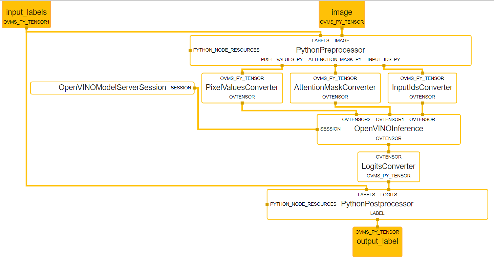

# CLIP image classification {#ovms_demo_clip_image_classification}

Image classification demo using multi-modal CLIP model for inference and [Python code](https://docs.openvino.ai/nightly/openvino-workflow/model-server/ovms_docs_python_support_reference.html) for pre and postprocessing.
The client sends request with an image and input labels to the graph and receives the label with the highest probability. The preprocessing python node is executed first and prepares inputs vector based on user inputs from the request. Then inputs are used to get similarity matrix from inference on the CLIP model. After that postprocessing python node is executed and extracts the label with highest score among the input labels and sends it back to the user.

Demo is based on this [CLIP notebook](https://github.com/openvinotoolkit/openvino_notebooks/blob/main/notebooks/228-clip-zero-shot-image-classification/228-clip-zero-shot-classification.ipynb)


The picture below shows the execution flow in the graph.



## Build image

```bash
git clone https://github.com/openvinotoolkit/model_server.git
cd model_server
make python_image
```

## Install client requirements

```bash
cd demos/python_demos/clip_image_classification/
virtualenv .venv
. .venv/bin/activate
pip3 install -r requirements.txt
```

## Download and convert model

```bash
pip3 install -r download_model_requirements.txt
```

```bash
python3 download_model.py
```

## Deploy OpenVINO Model Server with the CLIP graph
Prerequisites:
-  image of OVMS with Python support and Optimum installed

Mount the `./servable` which contains:
- `postprocess.py` and `preprocess.py` - python scripts which are required for execution and use of [CLIP](https://github.com/openvinotoolkit/openvino_notebooks/blob/main/notebooks/228-clip-zero-shot-image-classification/228-clip-zero-shot-classification.ipynb) model
- `config.json` - which defines which servables should be loaded
- `graph.pbtxt` - which defines MediaPipe graph containing python nodes

```bash
docker run -d --rm -p 9000:9000 -p 8000:8000 -v ${PWD}/servable:/workspace -v ${PWD}/model:/model/ openvino/model_server:py --config_path /workspace/config.json --port 9000 --rest_port 8000
```

## Requesting detection name with grpc request

Run the grpc client script
```bash
python3 grpc_client.py --url localhost:9000
```

Expected output:
```bash
Server Ready: True
Using image_url:
https://storage.openvinotoolkit.org/repositories/openvino_notebooks/data/data/image/coco.jpg

Using input_labels:
['cat', 'dog', 'wolf', 'tiger', 'man', 'horse', 'frog', 'tree', 'house', 'computer']

Iteration 0
Detection:
dog

processing time for all iterations
average time: 90.00 ms; average speed: 11.11 fps
median time: 90.00 ms; median speed: 11.11 fps
max time: 90.00 ms; min speed: 11.11 fps
min time: 90.00 ms; max speed: 11.11 fps
time percentile 90: 90.00 ms; speed percentile 90: 11.11 fps
time percentile 50: 90.00 ms; speed percentile 50: 11.11 fps
time standard deviation: 0.00
time variance: 0.00
```

## Requesting detection name with rest request

Run the rest client script
```bash
python3 rest_client.py --url localhost:8000
```

Expected output:
```bash
Using image_url:
https://storage.openvinotoolkit.org/repositories/openvino_notebooks/data/data/image/coco.jpg

Using input_labels:
['cat', 'dog', 'wolf', 'tiger', 'man', 'horse', 'frog', 'tree', 'house', 'computer']

Iteration 0
Detection:
dog


processing time for all iterations
average time: 93.00 ms; average speed: 10.75 fps
median time: 93.00 ms; median speed: 10.75 fps
max time: 93.00 ms; min speed: 10.75 fps
min time: 93.00 ms; max speed: 10.75 fps
time percentile 90: 93.00 ms; speed percentile 90: 10.75 fps
time percentile 50: 93.00 ms; speed percentile 50: 10.75 fps
time standard deviation: 0.00
time variance: 0.00
```
