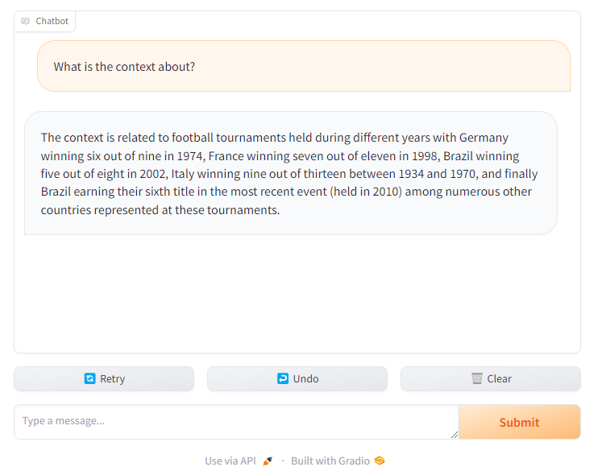
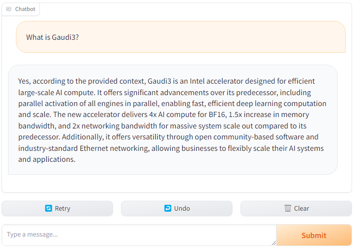

# LLM-powered RAG chatbot serving via Python Calculator in MediaPipe Graph {#ovms_demo_python_rag_chatbot}

This demo shows how to take advantage of OpenVINO Model Server to generate content remotely with LLM models based on attached documents.
The demo explains how to serve MediaPipe Graph with Python node that implements demo logic using Python libraries like Hugging Face Optimum with OpenVINO Runtime as execution engine and LangChain Retrieval QA pipeline that wraps entire processing.

Using the gRPC streaming interactive approach allows the user to read the response as they are getting generated.

This demo presents the use case with [tiny-llama-1b-chat](https://huggingface.co/TinyLlama/TinyLlama-1.1B-Chat-v0.1) model but the included python scripts are prepared for several other LLM models. Those are:
- tiny-llama-1b-chat
- llama-2-chat-7b
- notus-7b-v1

In this demo the model can be set by:
```bash
export SELECTED_MODEL=tiny-llama-1b-chat
```

## Requirements
A Linux host with Docker engine installed and sufficient available RAM to load the model and optionally equipped with an Intel GPU card. This demo was tested on a host with Intel® Xeon® Gold 6430 and an Intel® Data Center GPU Flex 170. 
Running the demo with smaller models like `tiny-llama-1b-chat` requires approximately 4GB of available RAM.

## Build image

Building the image with all required python dependencies is required. Follow the commands to build the model server with RedHat UBI image:

```bash
git clone https://github.com/openvinotoolkit/model_server.git
cd model_server
make python_image BASE_OS=redhat OVMS_CPP_DOCKER_IMAGE=registry.connect.redhat.com/intel/openvino-model-server OVMS_CPP_IMAGE_TAG=2024.1
```
It will create an image called `registry.connect.redhat.com/intel/openvino-model-server:py`

You can also build Ubuntu 22.04 image:
```
make python_image BASE_OS=ubuntu OVMS_CPP_DOCKER_IMAGE=openvino/model_server OVMS_CPP_IMAGE_TAG=2024.1
```
It will create an image called `openvino/model_server:py`

## OpenVINO Model Server deployment with online models pulling from Hugging Face Hub

In this demo, OpenVINO Model Server has an option to pull the required models from Hugging Face Hub.
It's a simple deployment option because it doesn't require models preparation which have to be attached to the container. Just the demo scripts and configation files are required in the container at startup.

What needs to be prepared is a list of documents, which should give context of RAG analysis. It is provided in a format of text file containing URLs of the documents sources:

```bash
echo "https://gist.githubusercontent.com/ryanloney/42b8ebe29f95ebd4382ee0b2bb50bea2/raw/cfbb679fefb6babec675c7806254a5fff29a5e6b/aipc.txt" > demos/python_demos/rag_chatbot/servable_stream/docs.txt
```
Now the model server can be started:
```bash
docker run -d -v ${PWD}/demos/python_demos/rag_chatbot/servable_stream:/config -p 9000:9000 -p 8000:8000 \
-e SELECTED_MODEL=${SELECTED_MODEL} \
registry.connect.redhat.com/intel/openvino-model-server:py --config_path /config/config.json --port 9000 --rest_port 8000
```
> **NOTE** The model loading time for the sequential attempts can be improved by mounting the Hugging Faces cache in the docker command:
`-v ${HOME}/.cache:/hf-cache -e HF_HOME=/hf-cache/huggingface`.
> **NOTE** For model llama-2-chat-7b, which require authorization in Hugging Faces hub, it might be needed to pass also HF_TOKEN environment variable.
`-e HF_TOKEN=<token>`.


Wait for the models to be loaded. It can be verified in the container logs or using the REST API:
```bash
curl -i http://localhost:8000/v2/models/python_model/ready
HTTP/1.1 200 OK
Content-Type: application/json
Date: Wed, 17 Apr 2024 12:27:27 GMT
Content-Length: 0
```

## OpenVINO Model Server deployment with locally attached models
Models can be downloaded, compressed and prepared in advance for the container. It makes the initialization faster and can be deployed in an offline environment.


### Download LLM model

Download the model using `download_model.py` script:

```bash
cd demos/python_demos/rag_chatbot
pip install -r requirements.txt

python download_model.py --help
INFO:nncf:NNCF initialized successfully. Supported frameworks detected: torch, onnx, openvino
usage: download_model.py [-h] --model {tiny-llama-1b-chat,llama-2-chat-7b,notus-7b-v1}

Script to download LLM model based on https://github.com/openvinotoolkit/openvino_notebooks/blob/main/notebooks/254-llm-chatbot

options:
  -h, --help            show this help message and exit
  --model {tiny-llama-1b-chat,llama-2-chat-7b,notus-7b-v1}
                        Select the LLM model out of supported list

python download_model.py --model ${SELECTED_MODEL}

```
The model will appear in `../servable_stream/tiny-llama-1b-chat` directory.

> **NOTE** Llama model requires license agreement, therefore it is required agree and log in to HuggingFace account via `huggingface-cli` before loading the model. [Read more](https://huggingface.co/docs/huggingface_hub/guides/cli) how to.

### Weight Compression - optional

[Weight Compression](https://docs.openvino.ai/canonical/weight_compression.html) may be applied on the original model. Applying 8-bit or 4-bit weight compression reduces the model size and memory requirements while speeding up execution by running calculations on lower precision layers.

```bash
python compress_model.py --help
INFO:nncf:NNCF initialized successfully. Supported frameworks detected: torch, onnx, openvino
usage: compress_model.py [-h] --model {tiny-llama-1b-chat,llama-2-chat-7b,notus-7b-v1}

Script to compress LLM model based on https://github.com/openvinotoolkit/openvino_notebooks/blob/main/notebooks/254-llm-chatbot

options:
  -h, --help            show this help message and exit
  --model {tiny-llama-1b-chat,llama-2-chat-7b,notus-7b-v1}
                        Select the LLM model out of supported list

python compress_model.py --model ${SELECTED_MODEL}


```
Running this script will create new directories with compressed versions of the model with FP16, INT8 and INT4 precisions.
The compressed models can be used in place of the original as they have compatible inputs and outputs.

```bash
du -sh ./servable_stream/tiny*
4.2G    ./servable_stream/tiny-llama-1b-chat
2.1G    ./servable_stream/tiny-llama-1b-chat_FP16
702M    ./servable_stream/tiny-llama-1b-chat_INT4_compressed_weights
1.1G    ./servable_stream/tiny-llama-1b-chat_INT8_compressed_weights
```

> **NOTE** Applying quantization to model weights may impact the model accuracy. Please test and verify that the results are of acceptable quality for your use case.

> **NOTE** On target devices that natively support FP16 precision (i.e. GPU), OpenVINO automatically adjusts the precision from FP32 to FP16. This improves the performance and typically does not impact accuracy. Original precision can be enforced with `ov_config` key:
`{"INFERENCE_PRECISION_HINT": "f32"}`.

### Download embedding model

Download the model using `download_embedding_model.py` script:

```bash
python download_embedding_model.py --model all-mpnet-base-v2

```
The model will appear in `./servable_stream/all-mpnet-base-v2` directory.


### Deploy OpenVINO Model Server

Mount the servable directory which contains:
- python scripts which are required for execution and use [Hugging Face](https://huggingface.co/) utilities with [optimum-intel](https://github.com/huggingface/optimum-intel) acceleration.
- `config.json` - which defines which servables should be loaded
- `graph.pbtxt` - which defines MediaPipe graph containing python node
- LLM and embedding models

```bash
docker run -d --rm -p 9000:9000 -p 8000:8000 -v ${PWD}/servable_stream:/workspace \
-e SELECTED_MODEL=${SELECTED_MODEL} -e LLM_MODEL_DIR=${SELECTED_MODEL} \
registry.connect.redhat.com/intel/openvino-model-server:py --config_path /workspace/config.json --port 9000 --rest_port 8000
```

You may deploy the compressed model(s) by simply changing the model path mounted to the container. For example, to deploy the 8-bit weight compressed model:
```bash
docker run -d --rm -p 9000:9000 -p 8000:8000 -v ${PWD}/servable_stream:/workspace \
-e SELECTED_MODEL=${SELECTED_MODEL} -e LLM_MODEL_DIR=${SELECTED_MODEL}_INT8_compressed_weights \
registry.connect.redhat.com/intel/openvino-model-server:py --config_path /workspace/config.json --port 9000 --rest_port 8000
```
> **NOTE** Check the Docker container logs to confirm that the model is loaded before sending requests from a client. Depending on the model and hardware it might take a few seconds or several minutes.

> **Note** If order to run the inference load on Intel GPU instead of CPU, just pass the extra parameters to the docker run `--device /dev/dri --group-add=$(stat -c "%g" /dev/dri/render*)`.

```
docker run -d --rm -p 9000:9000 -p 8000:8000 -v ${PWD}/servable_stream:/workspace \
--device /dev/dri --group-add=$(stat -c "%g" /dev/dri/render*) \
-e SELECTED_MODEL=${SELECTED_MODEL} -e LLM_MODEL_DIR=${SELECTED_MODEL}_INT8_compressed_weights -e DEVICE=gpu \
registry.connect.redhat.com/intel/openvino-model-server:py --config_path /workspace/config.json --port 9000 --rest_port 8000
```
It will pass the GPU device to the container and set the correct group security context.


## Run gradio client with gRPC streaming

Install gradio and dependencies:
```bash
pip install -r client_requirements.txt
```
Start the gradio web server:
```bash
python3 app.py --web_url localhost:9001 --ovms_url localhost:9000


```

Visit the website localhost:9001



## Changing the scope of documents for analysis

Started container is not only responding to the queries related to initial documents. It is also monitoring the file with the list of documents.
Thanks to that, it is possible to change the scope of documents without restarting the container or even reloading the model. All that is needed is updating docs.txt with the list of URLs pointing to the documents.

```bash
echo https://gist.githubusercontent.com/dtrawins/2956a7a77aa6732b52b8ae6eab0be205/raw/e05f2ab8fea9c8631ac5f20b8dd640074ae429c7/genai.txt > servable_stream/docs.txt
```

When a file modification is detected, documents will be downloaded and indexed from scratch. 

After few moments, new queries can be sent with the new context.



