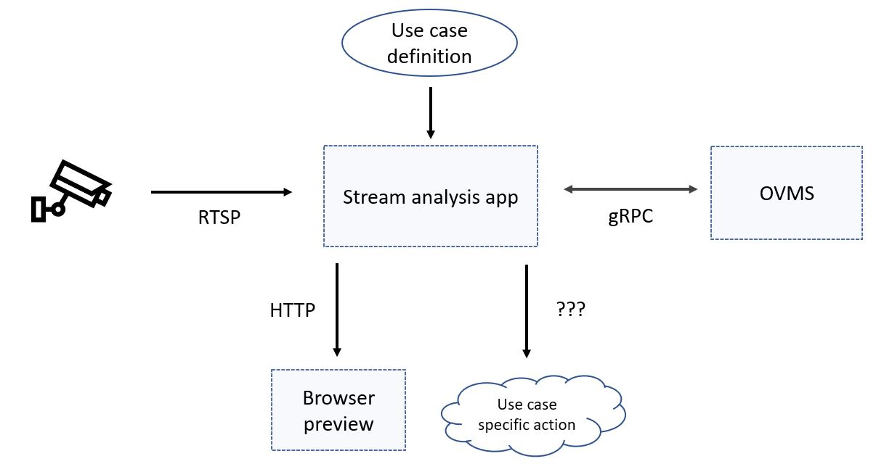

# Real Time Stream Analysis Demo {#ovms_demo_real_time_stream_analysis}
## Overview

For object classification, detection and segmentation we use CV (Computer Vision) models that take visual data on the input and return predictions like classification results, bounding boxes parameters etc. By visual data we often mean video stream generated in real time by different kinds of cameras. 

In this demo you'll see how to analyze RTSP (Real Time Streaming Protocol) stream using OpenVINO Model Server for inference.



The stream analysis app is started with `real_time_stream_analysis.py` script. It reads frames from the provided stream URL, runs pre and post processing and requests inference on specified model served by OVMS.

Specific use case actions are defined in use case implementation - some notifications could be sent to another service if object of interest has been detected etc.

As part of postprocessing, inference results can be visualized. The demo can optionally start Flask server that will host inference preview as defined for the use case. 


## Prerequisites

In order to make this demo work you need to:
- use Python 3.6+
- have access to live RTSP stream
- have access to OpenVINO Model Server with your model of choice deployed
- have a use case implementation

The stream analysis app needs to have access to RTSP stream to read from and OVMS to run inference on. Apart from that you need use case implementation that defines pre and postprocessing. Some exemplary use cases are available in [use cases catalog](https://github.com/openvinotoolkit/model_server/blob/releases/2022/1/demos/real_time_stream_analysis/python/use_cases).

## Start the real time stream analysis

### Select use case

To select pre and post processing routines that will be run on video stream you need to make a small modification in [real_time_stream_analysis.py](https://github.com/openvinotoolkit/model_server/blob/releases/2022/1/demos/real_time_stream_analysis/python/real_time_stream_analysis.py) script.

While creating IOProcessor instance, you have to provide a class that implements [use case interface](https://github.com/openvinotoolkit/model_server/blob/releases/2022/1/demos/real_time_stream_analysis/python/use_cases/use_case.py) and runs routines specific to your use case. 
Simply change the first argument to the use case you want in the IOProcessor constructor in [this one line](https://github.com/openvinotoolkit/model_server/blob/releases/2022/1/demos/real_time_stream_analysis/python/real_time_stream_analysis.py#L78):

`
io_processor = IOProcessor(<use_case_class>, visualizer_frames_queue)
`

The use case class must first be imported. Exemplary use cases can be imported from `use_cases` module like:

`
from use_cases import PersonVehicleBikeDetection
`

> **NOTE**: You can use your custom use cases the same way. Implement use case interface and add it to use_cases catalog. For simpler imports from the main script consider adding you class in use_cases package [init file](https://github.com/openvinotoolkit/model_server/blob/releases/2022/1/demos/real_time_stream_analysis/python/use_cases/__init__.py) 

### Run the app

Clone the repository and enter real_time_stream_analysis directory
```bash
git clone https://github.com/openvinotoolkit/model_server.git
cd model_server/demos/real_time_stream_analysis/python
```
Install required packages:
```bash
pip3 install -r requirements.txt
```

Once you adjusted the main script to your use case, got RTSP source and OVMS up and running, you can launch the stream analysis app.

```bash
python3 real_time_stream_analysis.py -h
usage: real_time_stream_analysis.py [-h] --stream_url STREAM_URL --ovms_url
                                    OVMS_URL --model_name MODEL_NAME
                                    [--model_version MODEL_VERSION]
                                    [--visualizer_port VISUALIZER_PORT]
                                    [--binary_input]
                                    [--inference_executors INFERENCE_EXECUTORS]
                                    [--buffer_size BUFFER_SIZE]
                                    [--log_level LOG_LEVEL]

Client for real time video stream analysis

optional arguments:
  -h, --help            show this help message and exit
  --stream_url STREAM_URL
                        URL to the video stream. Example:
                        rtsp://localhost:8888/stream
  --ovms_url OVMS_URL   Address of OVMS gRPC endpoint. Example: localhost:9000
  --model_name MODEL_NAME
                        Name of the target model
  --model_version MODEL_VERSION
                        Version of the target model. Default: latest available
  --visualizer_port VISUALIZER_PORT
                        Port of the inference results visualizer web service. If
                        not specified, visualizer will not be launched
  --binary_input        Convert frames to binary format before sending them to
                        OVMS. Default: False
  --inference_executors INFERENCE_EXECUTORS
                        Number of inference executor threads. Default: 4
  --buffer_size BUFFER_SIZE
                        Number of frames the have been received from the
                        stream and are awaiting inference or visualization.
                        When buffer is full, frames are dropped. Default: 100
  --log_level LOG_LEVEL
                        Logging level - available values: INFO, DEBUG, ERROR.
                        Default: INFO
```

### Minimal example

__Exemplary command:__

```bash
python3 real_time_stream_analysis.py --stream_url rtsp://localhost:8554/mystream --ovms_url localhost:9000 --model_name person-vehicle-bike-detection
```

__Console output:__

```bash
2022-07-25 10:49:46,216 - stream_reader - INFO - Initializing Stream Reader for stream: rtsp://localhost:8001/mystream ...
2022-07-25 10:49:49,639 - stream_reader - INFO - Stream Reader initialized successfully
2022-07-25 10:49:49,640 - inference_manager - INFO - OVMS Endpoint spec - ovms_url: localhost:9001; model_name: person-vehicle-bike-detection; model_version: latest
2022-07-25 10:49:49,640 - inference_manager - INFO - Input buffer capacity set to: 100 frames
2022-07-25 10:49:49,640 - inference_manager - INFO - Number of Inference Executors: 4
2022-07-25 10:49:49,655 - io_processor - INFO - Initializing IO Processor
2022-07-25 10:49:49,655 - io_processor - INFO - IO Processor initialized successfully
2022-07-25 10:49:49,656 - stream_analyzer - INFO - Starting Stream Analyzer
2022-07-25 10:49:49,656 - inference_manager - INFO - Initializing Inference Manager...
2022-07-25 10:49:49,656 - inference_manager - INFO - Starting Inference Executors...
2022-07-25 10:49:49,668 - inference_manager - INFO - Starting inference pipeline thread
2022-07-25 10:49:49,670 - inference_manager - INFO - Starting inference executors monitoring thread
2022-07-25 10:49:49,680 - inference_manager - INFO - Inference Manager initialized successfully
2022-07-25 10:49:52,806 - stream_analyzer - INFO - For 100 received frames - FPS: 22; Frames dropped: 0;
2022-07-25 10:49:56,973 - stream_analyzer - INFO - For 100 received frames - FPS: 23; Frames dropped: 0;
2022-07-25 10:50:01,142 - stream_analyzer - INFO - For 100 received frames - FPS: 23; Frames dropped: 0;
2022-07-25 10:50:05,307 - stream_analyzer - INFO - For 100 received frames - FPS: 24; Frames dropped: 0;
2022-07-25 10:50:09,470 - stream_analyzer - INFO - For 100 received frames - FPS: 24; Frames dropped: 0;
```

### Running with visualizer

Streaming analysis app can run with live browser preview that helps to quickly estimate model accuracy. It's done by starting tiny Flask server that displays visualized inference results on HTTP endpoint. 
To be able to use visualizer, use case must `return True` on [supports_visualization](https://github.com/openvinotoolkit/model_server/blob/releases/2022/1/demos/real_time_stream_analysis/python/use_cases/use_case.py#L23) call and implement [visualize method](https://github.com/openvinotoolkit/model_server/blob/releases/2022/1/demos/real_time_stream_analysis/python/use_cases/use_case.py#L29).

Enabling visualizer is done by providing `--visualizer_port` parameter that specifies on which port the HTTP Server will display inference results. If not provided or set to 0, visualizer will not start.

__Exemplary command:__

```bash
python3 real_time_stream_analysis.py --stream_url rtsp://localhost:8554/mystream --ovms_url localhost:9000 --model_name person-vehicle-bike-detection --visualizer_port 5000
```

__Console output:__

```bash
2022-07-25 10:50:50,401 - stream_reader - INFO - Initializing Stream Reader for stream: rtsp://localhost:8001/mystream ...
2022-07-25 10:50:52,318 - stream_reader - INFO - Stream Reader initialized successfully
2022-07-25 10:50:52,319 - inference_manager - INFO - OVMS Endpoint spec - ovms_url: localhost:9001; model_name: person-vehicle-bike-detection; model_version: latest
2022-07-25 10:50:52,319 - inference_manager - INFO - Input buffer capacity set to: 100 frames
2022-07-25 10:50:52,319 - inference_manager - INFO - Number of Inference Executors: 4
2022-07-25 10:50:52,339 - http_visualizer - INFO - Visualizer frames buffer capacity set to 100 frames
2022-07-25 10:50:52,340 - io_processor - INFO - Initializing IO Processor
2022-07-25 10:50:52,340 - io_processor - INFO - IO Processor initialized successfully
2022-07-25 10:50:52,340 - stream_analyzer - INFO - Starting Stream Analyzer
2022-07-25 10:50:52,340 - inference_manager - INFO - Initializing Inference Manager...
2022-07-25 10:50:52,340 - inference_manager - INFO - Starting Inference Executors...
2022-07-25 10:50:52,351 - inference_manager - INFO - Starting inference pipeline thread
2022-07-25 10:50:52,352 - inference_manager - INFO - Starting inference executors monitoring thread
2022-07-25 10:50:52,360 - inference_manager - INFO - Inference Manager initialized successfully
2022-07-25 10:50:52,360 - http_visualizer - INFO - Starting Flask web server...
 * Running on http://localhost:5000
2022-07-25 10:50:55,239 - stream_analyzer - INFO - For 100 received frames - FPS: 24; Frames dropped: 0;
2022-07-25 10:50:59,413 - stream_analyzer - INFO - For 100 received frames - FPS: 23; Frames dropped: 0;
2022-07-25 10:51:03,571 - stream_analyzer - INFO - For 100 received frames - FPS: 24; Frames dropped: 0;
2022-07-25 10:51:07,919 - stream_analyzer - INFO - For 100 received frames - FPS: 22; Frames dropped: 0;
2022-07-25 10:51:12,086 - stream_analyzer - INFO - For 100 received frames - FPS: 23; Frames dropped: 0;
```

__Browser preview:__


> **NOTE**: Visualizer does not use efficient streaming techniques to display results. It's main goal is to help during development and provide simple solution for quick health/accuracy checks.

## Performance considerations

In this section let's review three parameters: `--inference_executors`, `--binary_input` and `--buffer_size`. They are relevant in terms of performance and resource usage. 

### `--inference_executors`

This parameter specifies the amount of threads that will separately interact with OpenVINO Model Server. Single inference executor handles one video frame at a time as it sends request to the model server and awaits response, therefore it's blocked until prediction results are ready. This way OpenVINO Model Server will process only one frame at a time.

When using for example multiple CPU streams, OpenVINO can effectively infer multiple frames in parallel. To make use of that while using OpenVINO Model Server you need to send multiple requests in parallel to feed the model server with enough amount of frames to gain best performance.

Streaming analysis app can create multiple threads that send requests with video frames in parallel. Number of such threads is specified by `inference_executors` parameter. Make sure to set this number to the value that will make application capable of sending as many frames per second as model can process. Especially if you use multiple streams in your model configuration.

### `--binary_input`

OpenVINO Model Server can receive video frames either in an array format or in binary encoded format. When data in array format is received, model server can read and pass it as-is to the OpenVINO engine. When data in binary encoded format is received, model server needs to convert it to array format first.

Using binary input feature puts conversion burden on the model server, but the amount of data exchanged between the client and server is smaller. This can have a particularly big impact for models with large input. 

Depending on the location of stream analysis app and the model server in your deployment, you may consider setting `binary_input` flag and make the application send binary encoded data to OpenVINO Model Server. Consider that when your model has large input, the stream speed is really fast or the network between stream analysis app and model server is a bottleneck.


### `--buffer_size`

This parameter does not have a direct impact on inference performance, but is important in terms of the resources used by the whole application. Stream analysis app uses internal queues to buffer input frames as well as receiving the results and displaying them via visualizer.

All this data is kept in application memory. The `buffer_size` parameter allows you to set the maximum amount of frames kept in application internal buffers. Depending on the available memory and a single frame size you may want to adjust this parameter not to consume too much, or even run out of memory.


## Deploy with Helm

In [deploy catalog](https://github.com/openvinotoolkit/model_server/blob/releases/2022/1/demos/real_time_stream_analysis/python/deploy) you can find set of helm charts that simplify application deployment. 
Steps for deployment are following:
1. Build Docker image with the application using provided [Dockerfile](https://github.com/openvinotoolkit/model_server/blob/releases/2022/1/demos/real_time_stream_analysis/python/Dockerfile)
```bash
docker build . -t real-time-stream-analysis:latest
```

2. Put the image in a repository accessible from your cluster
3. Deploy with helm
```
helm install rt-stream-analyzer ./deploy --set stream_url=rtsp://localhost:8554/mystream,ovms_url=localhost:9000,model_name=person-vehicle-bike-detection,visualizer_service.port=5000
```

To learn about all available parameters check out [values.yaml](https://github.com/openvinotoolkit/model_server/blob/releases/2022/1/demos/real_time_stream_analysis/python/deploy/values.yaml)
