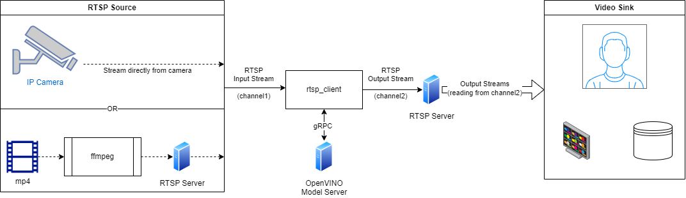

# Real Time Stream Analysis Demo {#ovms_demo_real_time_stream_analysis}
## Overview

This demo demonstrates how to write an application running AI analysis using OpenVINO Model Server.
In the video analysis we can deal with various form of the source content. Here, you will see how to
take the source of the video from a local USB camera, saved encoded video file and an encoded video stream.

The client application is expected to read the video source and send for the analysis every frame to the OpenVINO Model Server via gRPC connection. The analysis can be fully delegated to the model server endpoint with the
complete processing pipeline arranged via a [MediaPipe graph](../../../docs/mediapipe.md) or [DAG](../../../docs/dag_scheduler.md). The remote analysis can be also reduced just to inference execution but in such case the video frame preprocessing and the postprocessing of the results must be implemented on the client side.

In this demo, reading the video content from a local USB camera and encoded video file is straightforward using OpenCV library. The use case with encoded network stream might require more explanation.
We will present using RTSP stream transferred by the server component and encoded using FFMPEG utility.

Below is depicted such a configuration:


All the client scenarios mentioned below can read the input content from mentioned 3 sources and also send the results to 3 destinations: local screen, encoded video file or RTSP output stream.

In the demo will be used two gRPC communication patterns which might be advantageous depending on the scenario.

- gRPC streaming - recommended for MediaPipe graphs especially for stateful analysis
- gRPC unary calls - recommended for inference only on DAG graphs


## Requirements
- on the client side it could be Windows, Mac or Linux. FFMPEG should be preinstalled in order to follow the scenario with RTSP client. Python3.7+ is needed.
- the server can be deployed on Linux, MacOS (only with CPU execution on x86_64 arch) or on Windows operating system  (including inside WSL).
- images sent over gRPC are not encoded, so there should be good network connectivity between the client and the server. At least 100Mb/s for real-time video analysis at high rate.

## gRPC streaming with MediaPipe graphs

gRPC stream connection is allowed for served [MediaPipe graphs](../../../docs/mediapipe.md). It allows sending asynchronous calls to the endpoint all linked in a single session context. Responses are sent back via a stream and processed in the callback function.
The helper class [StreamClient](https://github.com/openvinotoolkit/model_server/blob/releases/2025/0/demos/common/stream_client/stream_client.py) provides a mechanism for flow control and tracking the sequence of the requests and responses. In the StreamClient initialization the streaming mode is set via the parameter `streaming_api=True`.

Using the streaming API has the following advantages:
- good performance thanks to asynchronous calls and sharing the graph execution for multiple calls
- support for stateful pipelines like object tracking when the response is dependent on the sequence of requests


### Preparing the model server for gRPC streaming with a Holistic graph

The [holistic graph](https://github.com/openvinotoolkit/model_server/blob/releases/2025/0/demos/mediapipe/holistic_tracking/holistic_tracking.pbtxt) is expecting and IMAGE object on the input and returns an IMAGE on the output.
As such it doesn't require any preprocessing and postprocessing. In this demo the returned stream will be just visualized or sent to the target sink.

The model server with the holistic use case can be deployed using steps from [this](../../mediapipe/holistic_tracking/README.md#server-deployment) article.

[Check more info about this use case](../../mediapipe/holistic_tracking/README.md)

> **Note** All the graphs with an image on input and output can be applied here without any changes on the client application.


### Start the client with real time stream analysis

Prepare the python environment by installing required dependencies:
```console
cd ../../real_time_stream_analysis/python/
pip install -r ../../common/stream_client/requirements.txt
```
For the use case with RTSP client, install also FFMPEG component on the host.

Alternatively build a docker image with the client with the following command:
```bash
docker build ../../common/stream_client/ -t rtsp_client
```

Client parameters:
```console
python3 client.py --help
usage: client.py [-h] [--grpc_address GRPC_ADDRESS]
                      [--input_stream INPUT_STREAM]
                      [--output_stream OUTPUT_STREAM]
                      [--model_name MODEL_NAME] [--input_name INPUT_NAME]
                      [--verbose] [--benchmark]
                      [--limit_stream_duration LIMIT_STREAM_DURATION]
                      [--limit_frames LIMIT_FRAMES]

options:
  -h, --help            show this help message and exit
  --grpc_address GRPC_ADDRESS
                        Specify url to grpc service
  --input_stream INPUT_STREAM
                        Url of input rtsp stream
  --output_stream OUTPUT_STREAM
                        Url of output rtsp stream
  --model_name MODEL_NAME
                        Name of the model
  --input_name INPUT_NAME
                        Name of the model's input
  --verbose             Should client dump debug information
  --benchmark           Should client collect processing times
  --limit_stream_duration LIMIT_STREAM_DURATION
                        Limit how long client should run
  --limit_frames LIMIT_FRAMES
                        Limit how many frames should be processed
```


#### Reading from the local camera and visualization on the screen

```
python3 client.py --grpc_address localhost:9000 --input_stream 0 --output_stream screen
```

The parameter `--input_stream 0 ` indicates the camera ID `0`.


#### Reading from the encoded video file and saving results to a file

```console
curl -L "https://www.pexels.com/download/video/3044127/?fps=24.0&h=1080&w=1920" -o video.mp4 
python3 client.py --grpc_address localhost:9000 --input_stream 'video.mp4' --output_stream 'output.mp4'
```


#### Inference using RTSP stream

The rtsp client app needs to have access to RTSP stream to read from and write to. Below are the steps to simulate such stream with the video.mp4 and the content source.

Example rtsp server [mediamtx](https://github.com/bluenviron/mediamtx) using docker image.

```bash
docker run --rm -d -p 8554:8554 -e RTSP_PROTOCOLS=tcp bluenviron/mediamtx:latest
```

or, download and extract a standalone binary from the [mediamtx release page](https://github.com/bluenviron/mediamtx/releases/) that corresponds to your operating system and architecture 
alternatively you can install it for windows using `winget`.

```bat
winget install mediamtx --silent --accept-source-agreements
```

and start the server.


```bat
mediamtx 
```

Then write to the server using ffmpeg, example using video or camera

```console
ffmpeg -stream_loop -1 -i ./video.mp4 -f rtsp -rtsp_transport tcp rtsp://localhost:8554/channel1
```

```
ffmpeg -f dshow -i video="HP HD Camera" -f rtsp -rtsp_transport tcp rtsp://localhost:8080/channel1
```

While the RTSP stream is active, run the client to read it and send the output stream
```console
python3 client.py --grpc_address localhost:9000 --input_stream 'rtsp://localhost:8554/channel1' --output_stream 'rtsp://localhost:8554/channel2'
```

The results can be examined with ffplay utility which reads and display the altered content.

```console
ffplay -pixel_format yuv420p -video_size 704x704 -rtsp_transport tcp rtsp://localhost:8554/channel2
```


## Using gRPC unary calls

The helper class `StreamClient` supports using unary gRPC calls. In that case it should be initialized with a parameter `streaming_api=False`.
It sends the frames to the model server asynchronously but each of them is stateless and each request can be processed independently.
The key advantage of that mode is easier load balancing and scalability, because each request could be routed to a different instance of the model server or a different compute node.

Such use case with the unary calls with a horizontal text analysis can be followed based on [this document](../../horizontal_text_detection/python/README.md).


> **Note** Depending on the output format, there might be needed a custom postprocessing function implementation.
