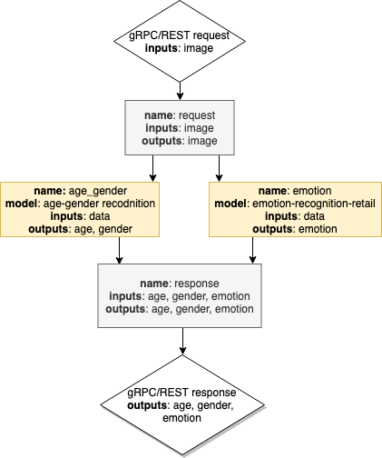

# Single Face Analysis Pipeline Demo {#ovms_demo_single_face_analysis_pipeline}

This document presents a models ensemble as an example of [DAG Scheduler](../../../docs/dag_scheduler.md) implementation.
It describes how to combine several models to perform multiple inference operations with a single prediction call.
When you need to execute several predictions on the same data, you can create a pipeline, which combines the results from several models.



## Prepare workspace to run the demo

In this example the following models are used:

[age-gender-recognition-retail-0013](https://github.com/openvinotoolkit/open_model_zoo/blob/2022.1.0/models/intel/age-gender-recognition-retail-0013/README.md)

[emotions-recognition-retail-0003](https://github.com/openvinotoolkit/open_model_zoo/blob/2022.1.0/models/intel/emotions-recognition-retail-0003/README.md)

Clone the repository and enter single_face_analysis_pipeline directory
```bash
git clone https://github.com/openvinotoolkit/model_server.git
cd model_server/demos/single_face_analysis_pipeline/python
```

You can prepare the workspace that contains all the above by just running

```bash
make
```

### Final directory structure

Once the `make` procedure is finished, you should have `workspace` directory ready with the following content.
```bash
workspace/
├── age-gender-recognition-retail-0013
│   └── 1
│       ├── age-gender-recognition-retail-0013.bin
│       └── age-gender-recognition-retail-0013.xml
├── config.json
└── emotions-recognition-retail-0003
    └── 1
        ├── emotions-recognition-retail-0003.bin
        └── emotions-recognition-retail-0003.xml
```

## Deploying OVMS

Deploy OVMS with single face analysis pipeline using the following command:

```bash
docker run -p 9000:9000 -d -v ${PWD}/workspace:/workspace openvino/model_server --config_path /workspace/config.json --port 9000
```

## Requesting the Service

Exemplary client [single_face_analysis_pipeline.py](https://github.com/openvinotoolkit/model_server/blob/releases/2022/1/demos/single_face_analysis_pipeline/python/single_face_analysis_pipeline.py) can be used to request pipeline deployed in previous step.

```bash
pip3 install -r requirements.txt
``` 

Now you can create directory for text images and run the client:

```bash
python single_face_analysis_pipeline.py --image_path ../../common/static/images/faces/face1.jpg --grpc_port 9000
Age results: [[[21.099792]]]
Gender results: Female: 0.9483401 ; Male: 0.051659837
Emotion results: Natural: 0.02335789 ; Happy: 0.9449672 ; Sad: 0.001236845 ; Surprise: 0.028111042 ; Angry: 0.0023269346
```

### Next step

For more advanced use case with extracting and analysing multiple faces on the same image see [multi_faces_analysis_pipeline](../../multi_faces_analysis_pipeline/python/README.md) demo.