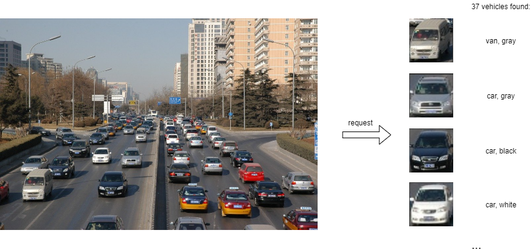
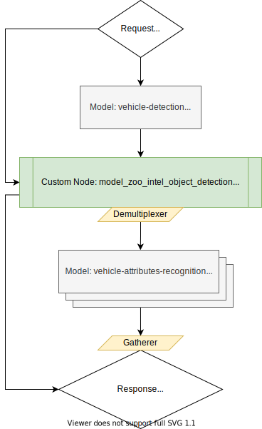

# Vehicle Analysis Pipeline Demo {#ovms_demo_vehicle_analysis_pipeline}
This document demonstrates how to create complex pipelines using object detection and object recognition models from OpenVINO Model Zoo. As an example, we will use [vehicle-detection-0202](https://github.com/openvinotoolkit/open_model_zoo/blob/2022.1.0/models/intel/vehicle-detection-0202/README.md) to detect multiple vehicles on the image. Then, for each detected vehicle we will crop it using [model_zoo_intel_object_detection](https://github.com/openvinotoolkit/model_server/tree/releases/2022/1/src/custom_nodes/model_zoo_intel_object_detection) example custom node. Finally, each vehicle image will be forwarded to [vehicle-attributes-recognition-barrier-0042](https://github.com/openvinotoolkit/open_model_zoo/blob/2022.1.0/models/intel/vehicle-attributes-recognition-barrier-0042/README.md) model.



Using such pipeline, a single request to OVMS can perform a complex set of operations to determine all vehicles and their properties.

## Pipeline Configuration Graph

Below is depicted graph implementing vehicles analysis pipeline execution. 



It includes the following Nodes:
- Model `vehicle_detection` - deep learning model which takes user image as input. Its outputs contain information about vehicle coordinates and confidence levels.
- Custom node `model_zoo_intel_object_detection` - it includes C++ implementation of common object detection models results processing. By analysing the output it produces cropped vehicle images based on the configurable score level threshold. Custom node also resizes them to the target resolution and combines into a single output of a dynamic batch size. The output batch size is determined by the number of detected
boxes according to the configured criteria. All operations on the images employ OpenCV libraries which are preinstalled in the OVMS. Learn more about the [model_zoo_intel_object_detection custom node](https://github.com/openvinotoolkit/model_server/tree/releases/2022/1/src/custom_nodes/model_zoo_intel_object_detection).
- demultiplexer - outputs from the custom node model_zoo_intel_object_detection have variable batch size. In order to match it with the sequential recognition models, data is split into individual images with each batch size equal to 1.
Such smaller requests can be submitted for inference in parallel to the next Model Nodes. Learn more about the [demultiplexing](../../../docs/demultiplexing.md).
- Model `vehicle_attributes_recognition` - this model recognizes type and color for given vehicle image
- Response - the output of the whole pipeline combines the recognized vehicle images with their metadata: coordinates, type, color, and detection confidence level. 

## Prepare workspace to run the demo

To successfully deploy face analysis pipeline you need to have a workspace that contains:
- Deep learning models for inference
- Custom node for image processing
- Configuration file

Clone the repository and enter vehicle_analysis_pipeline directory
```bash
git clone https://github.com/openvinotoolkit/model_server.git
cd model_server/demos/vehicle_analysis_pipeline/python
```

You can prepare the workspace that contains all the above by just running

```bash
make
```

### Final directory structure

Once the `make` procedure is finished, you should have `workspace` directory ready with the following content.
```bash
workspace
├── config.json
├── lib
│   └── libcustom_node_model_zoo_intel_object_detection.so
├── vehicle-attributes-recognition-barrier-0042
│   └── 1
│       ├── vehicle-attributes-recognition-barrier-0042.bin
│       └── vehicle-attributes-recognition-barrier-0042.xml
└── vehicle-detection-0202
    └── 1
        ├── vehicle-detection-0202.bin
        └── vehicle-detection-0202.xml
```

## Deploying OVMS

Deploy OVMS with vehicles analysis pipeline using the following command:

```bash
docker run -p 9000:9000 -d -v ${PWD}/workspace:/workspace openvino/model_server --config_path /workspace/config.json --port 9000
```

## Requesting the Service

Install python dependencies:
```bash
pip3 install -r requirements.txt
``` 

Now you can create a directory for text images and run the client:
```bash
mkdir results
```
```bash
python3 vehicles_analysis_pipeline.py --pipeline_name multiple_vehicle_recognition --grpc_port 9000 --image_input_path ../../common/static/images/cars/road1.jpg --vehicle_images_output_name vehicle_images --vehicle_images_save_path ./results --image_width 512 --image_height 512 --input_image_layout NHWC
Output: name[types]
    numpy => shape[(37, 1, 4)] data[float32]
Output: name[vehicle_coordinates]
    numpy => shape[(37, 1, 4)] data[float32]
Output: name[colors]
    numpy => shape[(37, 1, 7)] data[float32]
Output: name[confidence_levels]
    numpy => shape[(37, 1, 1)] data[float32]
Output: name[vehicle_images]
    numpy => shape[(37, 1, 72, 72, 3)] data[float32]

Found 37 vehicles:
0 Type: van Color: gray
1 Type: car Color: gray
2 Type: car Color: black
3 Type: car Color: white
4 Type: car Color: black
5 Type: truck Color: red
6 Type: truck Color: gray
7 Type: car Color: white
8 Type: car Color: blue
9 Type: car Color: red
10 Type: car Color: yellow
11 Type: car Color: gray
12 Type: van Color: gray
13 Type: car Color: gray
14 Type: car Color: red
15 Type: truck Color: gray
16 Type: truck Color: red
17 Type: car Color: red
18 Type: car Color: gray
19 Type: car Color: black
20 Type: truck Color: gray
21 Type: car Color: red
22 Type: truck Color: blue
23 Type: truck Color: red
24 Type: car Color: gray
25 Type: truck Color: red
26 Type: car Color: black
27 Type: truck Color: gray
28 Type: truck Color: blue
29 Type: truck Color: gray
30 Type: car Color: gray
31 Type: car Color: white
32 Type: car Color: yellow
33 Type: car Color: red
34 Type: truck Color: gray
35 Type: truck Color: gray
36 Type: car Color: red
```

With additional parameter `--vehicle_images_save_path`, the client script saves all detected vehicle images to jpeg files into directory path to confirm
if the image was analyzed correctly.
