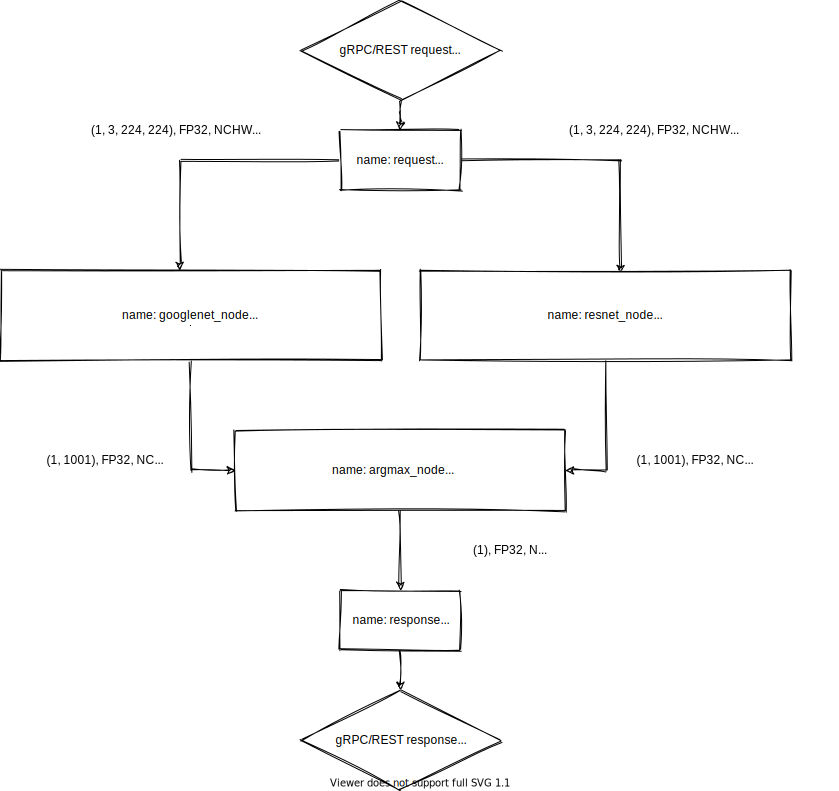

# Model Ensemble Scheduler in OpenVINO&trade; Model Server

## Introduction
OpenVINO&trade; Model Server provides possibility to create pipeline of models for execution in a single client request. Pipeline is a directed acyclic graph with different kinds of nodes which define how to process predict request. By using ensemble scheduler there is no need to return intermediate results of every inference to the client. This allows avoiding the network overhead by minimizing the number of requests sent to model server. Each model output can be mapped to another model input. Since intermediate results are kept in server's RAM these can be reused by subsequent inferences which reduces overall latency.

This guide gives information about following :

* <a href="#node-type">Node Types</a>
    * Pre-defined Node Types
    * Other Node Types
* <a href="#example">Example Use Case</a>
    1. Prepare the models
    2. Define required models and pipeline
    3. Start model server
    4. Requesting the service
    5. Analyze pipeline execution in server logs


## Node Types <a name="node-type"></a>
### Pre-defined Node Types
There are two special kinds of nodes - Request and Response node. Both of them are predefined and included in every pipeline definition you create:
*  Request node
    - This node defines which inputs are required to be sent via gRPC/REST request for pipeline usage. You can refer to it by node name: `request`.
* Response node
    - This node defines which outputs will be fetched from final pipeline state and packed into gRPC/REST response. You cannot refer to it in your pipeline since it is pipeline final stage. To define final outputs fill `outputs` field. 

> **NOTE:** Read <a href="#define-models">below</a> for example pipeline configuration.

### Other node types
Internal pipeline nodes are created by user. Currently there is only one node type that a user can create:
* DL model
    - This node contains underlying OpenVINO&trade; model and performs inference on selected target device. This can be defined in configuration file. Each model input needs to be mapped to some node's `data_item` - be it input from gRPC/REST request or another `DL model` output. Results of this node's inference may be mapped to another node's input or `response` node meaning it will be exposed in gRPC/REST response. 

## Example use case<a name="example"></a>

- Let's consider you develop an application to perform image classification. There are many different models that can be used for this task. The goal is to combine results from inferences executed on two different models and calculate argmax to pick most probable classification label. 
- For this task, select two models: [googlenet-v2](https://docs.openvinotoolkit.org/latest/omz_models_public_googlenet_v2_tf_googlenet_v2_tf.html) and [resnet-50](https://docs.openvinotoolkit.org/latest/omz_models_public_resnet_50_tf_resnet_50_tf.html). Additionally, create own model **argmax** to combine and select top result. The aim is to perform this task on the server side with no intermediate results passed over the network. Server should take care of feeding inputs/outputs in subsequent models. Both - googlenet and resnet predictions should run in parallel. 
- Diagram for this pipeline would look like this: 



### Step 1: Prepare the models
1. Follow the commands below sequentially, to download and use the models from [open model zoo](https://github.com/openvinotoolkit/open_model_zoo):
```
~$ mkdir models

~$ docker run -u $(id -u):$(id -g) -v ~/models:/models openvino/ubuntu18_dev:latest deployment_tools/open_model_zoo/tools/downloader/downloader.py --name googlenet-v2-tf --output_dir /models

~$ docker run -u $(id -u):$(id -g) -v ~/models:/models openvino/ubuntu18_dev:latest deployment_tools/open_model_zoo/tools/downloader/downloader.py --name resnet-50-tf --output_dir /models
```
> **NOTE**: Run commands below in <a href="#point-2">Point 2</a> and <a href="#point-3">Point 3</a> from the git repository root folder

2. Use python script located in this repository. Since it uses tensorflow to create models in _saved model_ format, hence tensorflow pip package is required.<a name="point-2"></a>

```
~$ virtualenv -p python3 .tf_env
~$ source .tf_env/bin/activate
~$ pip3 install tensorflow==1.15
```
3. Prepare argmax model with `(1, 1001)` input shapes to match output of googlenet and resnet output shapes. Generated model will sum inputs and calculate the index with the highest value. The model output will indicate the most likely predicted class from the ImageNet* dataset. <a name="point-3"></a>
```
~$ python3 tests/models/argmax_sum.py --input_size 1001 --export_dir models/public/argmax/saved_model
```

4. Execute following commands to convert models to IR format and [prepare models repository](./PreparingModelsRepository.md):
```
~$ docker run -u $(id -u):$(id -g) -v ~/models:/models:rw openvino/ubuntu18_dev:latest deployment_tools/open_model_zoo/tools/downloader/converter.py --name googlenet-v2-tf --download_dir /models --output_dir /models --precisions FP32

~$ docker run -u $(id -u):$(id -g) -v ~/models:/models:rw openvino/ubuntu18_dev:latest deployment_tools/open_model_zoo/tools/downloader/converter.py --name resnet-50-tf --download_dir /models --output_dir /models --precisions FP32

~$ docker run -u $(id -u):$(id -g) -v ~/models:/models:rw openvino/ubuntu18_dev:latest deployment_tools/model_optimizer/mo_tf.py --input input1,input2 --input_shape [1,1001],[1,1001] --saved_model_dir /models/tf_argmax --output_dir /models/public/argmax/1

~$ mv ~/models/public/googlenet-v2-tf/FP32 ~/models/public/googlenet-v2-tf/1 && mv ~/models/public/resnet-50-tf/FP32 ~/models/public/resnet-50-tf/1

~$ tree models/public
models/public
├── argmax
│   ├── 1
│   │   ├── saved_model.bin
│   │   ├── saved_model.mapping
│   │   └── saved_model.xml
│   └── saved_model
│       ├── saved_model.pb
│       └── variables
├── googlenet-v2-tf
│   ├── 1
│   │   ├── googlenet-v2-tf.bin
│   │   ├── googlenet-v2-tf.mapping
│   │   └── googlenet-v2-tf.xml
│   └── inception_v2.frozen.pb
└── resnet-50-tf
    ├── 1
    │   ├── resnet-50-tf.bin
    │   ├── resnet-50-tf.mapping
    │   └── resnet-50-tf.xml
    └── resnet_v1-50.pb
```

### Step 2: Define required models and pipeline <a name="define-models"></a>
Pipelines need to be defined in configuration file to use them. The same configuration file is used to define served models and served pipelines.

1. Execute the following command and copy the content in config.json as given below
```
~$ cat models/config.json 
{
    "model_config_list": [
        {
            "config": {
                "name": "googlenet",
                "base_path": "/models/public/googlenet-v2-tf"
            }
        },
        {
            "config": {
                "name": "resnet",
                "base_path": "/models/public/resnet-50-tf"
            }
        },
        {
            "config": {
                "name": "argmax",
                "base_path": "/models/public/argmax"
            }
        }
    ],
    "pipeline_config_list": [
        {
            "name": "image_classification_pipeline",
            "inputs": ["image"],
            "nodes": [
                {
                    "name": "googlenet_node",
                    "model_name": "googlenet",
                    "type": "DL model",
                    "inputs": [
                        {"input": {"node_name": "request",
                                   "data_item": "image"}}
                    ], 
                    "outputs": [
                        {"data_item": "InceptionV2/Predictions/Softmax",
                         "alias": "probability"}
                    ] 
                },
                {
                    "name": "resnet_node",
                    "model_name": "resnet",
                    "type": "DL model",
                    "inputs": [
                        {"map/TensorArrayStack/TensorArrayGatherV3": {"node_name": "request",
                                                                      "data_item": "image"}}
                    ], 
                    "outputs": [
                        {"data_item": "softmax_tensor",
                         "alias": "probability"}
                    ] 
                },
                {
                    "name": "argmax_node",
                    "model_name": "argmax",
                    "type": "DL model",
                    "inputs": [
                        {"input1": {"node_name": "googlenet_node",
                                    "data_item": "probability"}},
                        {"input2": {"node_name": "resnet_node",
                                    "data_item": "probability"}}
                    ], 
                    "outputs": [
                        {"data_item": "argmax/Squeeze",
                         "alias": "most_probable_label"}
                    ] 
                }
            ],
            "outputs": [
                {"label": {"node_name": "argmax_node",
                           "data_item": "most_probable_label"}}
            ]
        }
    ]
}
```
In `model_config_list` section, three models are defined as usual. We can refer to them by name in pipeline definition but we can also request single inference on them separately. The same inference gRPC and REST API is used to request models and pipelines. OpenVINO&trade; Model Server will first try to search for model with requested name. If not found, it will try to find pipeline.

- Pipeline configuration options explained

|Option|Type|Description|Required|
|:---|:---|:---|:---|
|`"name"`|string|Pipeline identifier related to name field specified in gRPC/REST request|&check;|
|`"inputs"`|array|Defines input names required to be present in gRPC/REST request|&check;|
|`"outputs"`|array|Defines outputs (data items) to be retrieved from intermediate results (nodes) after pipeline execution completed for final gRPC/REST response to the client|&check;|
|`"nodes"`|array|Declares nodes used in pipeline and its connections|&check;|

- Node options explained

|Option|Type|Description|Required|
|:---|:---|:---|:---|
|`"name"`|string|Node name so you can refer to it from other nodes|&check;|
|`"model_name"`|string|You can specify underlying model (needs to be defined in `model_config_list`), available only for `DL model` nodes|required for `DL model` nodes|
|`"version"`|integer|You can specify model version for inference, available only for `DL model` nodes||
|`"type"`|string|Node kind, currently there is only `DL model` kind available|&check;|
|`"inputs"`|array|Defines list of input/output mappings between this and dependency nodes, **IMPORTANT**: Please note that output shape, precision and layout of previous node/request needs to match input of current node's model|&check;|
|`"node_name"`|string|Defines which node we refer to|&check;|
|`"data_item"`|string|Defines which resource of node we point to|&check;|
|`"outputs"`|array|Defines model output name alias mapping - you can rename model output names for easier use in subsequent nodes|&check;|
|`"data_item"`|string|Is the name of resource exposed by node - for `DL model` nodes it means model output|&check;|
|`"alias"`|string|Is a name assigned to data item, makes it easier to refer to results of this node in subsequent nodes|&check;|

### Step 3: Start model server

1. Run command to start model server
```
~$ docker run --rm -v ~/models/:/models:ro -p 9100:9100 -p 8100:8100 openvino/model_server:latest --config_path /models/config.json --port 9100 --rest_port 8100
```

### Step 4: Requesting the service

Input images can be sent to the service requesting resource name `image_classification_pipeline`. There is example client to do exactly that. 

1. Check accurracy of the pipeline by running the client:
```
~$ cd model_server
~/model_server$ make venv
~/model_server$ . .venv/bin/activate && cd example_client
(.venv) ~/model_server/example_client$ python3 grpc_serving_client.py --pipeline_name image_classification_pipeline --images_numpy_path imgs.npy \
    --labels_numpy_path lbs.npy --grpc_port 9100 --input_name image --output_name label --transpose_input False --iterations 10
Image data range: 0.0 : 255.0
Start processing:
        Model name: image_classification_pipeline
        Iterations: 10
        Images numpy path: imgs.npy
        Images in shape: (10, 3, 224, 224)

Iteration 1; Processing time: 50.42 ms; speed 19.83 fps
imagenet top results in a single batch:
         0 airliner 404 ; Correct match.
Iteration 2; Processing time: 45.15 ms; speed 22.15 fps
imagenet top results in a single batch:
         0 Arctic fox, white fox, Alopex lagopus 279 ; Correct match.
Iteration 3; Processing time: 65.82 ms; speed 15.19 fps
imagenet top results in a single batch:
         0 bee 309 ; Correct match.
Iteration 4; Processing time: 52.14 ms; speed 19.18 fps
imagenet top results in a single batch:
         0 golden retriever 207 ; Correct match.
Iteration 5; Processing time: 49.96 ms; speed 20.02 fps
imagenet top results in a single batch:
         0 gorilla, Gorilla gorilla 366 ; Correct match.
Iteration 6; Processing time: 43.82 ms; speed 22.82 fps
imagenet top results in a single batch:
         0 magnetic compass 635 ; Correct match.
Iteration 7; Processing time: 46.74 ms; speed 21.40 fps
imagenet top results in a single batch:
         0 peacock 84 ; Correct match.
Iteration 8; Processing time: 73.30 ms; speed 13.64 fps
imagenet top results in a single batch:
         0 pelican 144 ; Correct match.
Iteration 9; Processing time: 48.10 ms; speed 20.79 fps
imagenet top results in a single batch:
         0 snail 113 ; Correct match.
Iteration 10; Processing time: 48.32 ms; speed 20.69 fps
imagenet top results in a single batch:
         0 zebra 340 ; Correct match.

processing time for all iterations
average time: 51.90 ms; average speed: 19.27 fps
median time: 48.50 ms; median speed: 20.62 fps
max time: 73.00 ms; min speed: 13.70 fps
min time: 43.00 ms; max speed: 23.26 fps
time percentile 90: 65.80 ms; speed percentile 90: 15.20 fps
time percentile 50: 48.50 ms; speed percentile 50: 20.62 fps
time standard deviation: 9.06
time variance: 82.09
Classification accuracy: 100.00
```

### Step 5: Analyze pipeline execution in server logs

By analyzing logs and timestamps it is seen that googlenet and resnet model inferences were started in parallel. About 50 miliseconds later, just after all inputs became ready - argmax node has started its job.
```
[2020-09-04 12:46:18.795] [serving] [info] [prediction_service_utils.cpp:59] Requesting model:image_classification_pipeline; version:0.
[2020-09-04 12:46:18.795] [serving] [info] [prediction_service.cpp:82] Requested model: image_classification_pipeline does not exist. Searching for pipeline with that name...
[2020-09-04 12:46:18.795] [serving] [info] [prediction_service_utils.cpp:84] Requesting pipeline: image_classification_pipeline;
[2020-09-04 12:46:18.795] [serving] [info] [pipeline.cpp:70] Started execution of pipeline: image_classification_pipeline
[2020-09-04 12:46:18.795] [serving] [info] [prediction_service_utils.cpp:59] Requesting model:googlenet; version:0.
[2020-09-04 12:46:18.795] [serving] [info] [prediction_service_utils.cpp:59] Requesting model:resnet; version:0.
[2020-09-04 12:46:18.849] [serving] [info] [prediction_service_utils.cpp:59] Requesting model:argmax; version:0.
```

## Disclaimers
<details>

<summary>
Model Ensemble feature is still in preview. Expand to know more.
</summary>

- More kind of nodes are planned to be added in the future
- Models with dynamic batch size or shape cannot be referenced in pipeline
- Input/Output shapes for subsequent node models need to exactly match each other
- There is no automatic conversion between input/output model precisions or layouts
- Pipeline definitions are defined once at program start-up and cannot be modified at runtime
- REST requests with no named format (JSON body with one unnamed input) are not supported

</details>

## See Also

- [Optimization of Performance](./PerformanceInformation.md) .