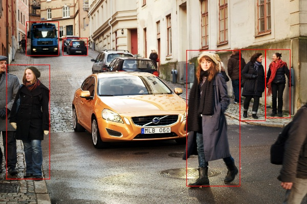

# Example of Face Detection with OpenVINO&trade; Model Server<a name="facedetection"></a>

This page guides you through an example script to run face detection inference with OpenVINO&trade; Model Server.


- The script [face_detection.py](../example_client/face_detection.py) runs face detection inference requests for all the images
saved in `image_input_dir` directory. 

- The script can adjust the input image size and change the batch size in the request. It demonstrates how to use
the functionality of dynamic shape in OpenVINO Model Server and how to process the output from the server. To know more about batch_size and shape parameters refer to (link)

- The example relies on the model [face_detection_0004](https://docs.openvinotoolkit.org/2018_R5/_docs_Retail_object_detection_face_sqnet10modif_ssd_0004_caffe_desc_face_detection_retail_0004.html).

### Running the Script

```bash
python face_detection.py --help
usage: face_detection.py [-h] [--input_images_dir INPUT_IMAGES_DIR]
                         [--output_dir OUTPUT_DIR] [--batch_size BATCH_SIZE]
                         [--width WIDTH] [--height HEIGHT]
                         [--grpc_address GRPC_ADDRESS] [--grpc_port GRPC_PORT] [--model_name]

optional arguments:
  -h, --help            show this help message and exit
  --input_images_dir INPUT_IMAGES_DIR
                        Directory with input images
  --output_dir OUTPUT_DIR
                        Directory for staring images with detection results
  --batch_size BATCH_SIZE
                        how many images should be grouped in one batch
  --width WIDTH         how the input image width should be resized in pixels
  --height HEIGHT       how the input height should be resized in pixels
  --grpc_address GRPC_ADDRESS
                        Specify url to grpc service. default:localhost
  --grpc_port GRPC_PORT
                        Specify port to grpc service. default: 9000
  --model_name MODEL_NAME
                        Specify the model name 
```

### Usage example

Start the OVMS service locally:

```bash
mkdir -p model

cd model

curl --create-dirs https://download.01.org/opencv/2020/openvinotoolkit/2020.2/open_model_zoo/models_bin/3/face-detection-retail-0004/FP32/face-detection-retail-0004.xml https://download.01.org/opencv/2020/openvinotoolkit/2020.2/open_model_zoo/models_bin/3/face-detection-retail-0004/FP32/face-detection-retail-0004.bin -o model/face-detection-retail-0004.xml -o model/face-detection-retail-0004.bin


docker run -d -v `pwd`/model:/models -e LOG_LEVEL=DEBUG -p 9000:9000 ie-serving-py:latest \
/ie-serving-py/start_server.sh ie_serving model --model_path /models --model_name face-detection --port 9000  --shape auto
```

#### Run the client:
```bash
cd example_client
virtualenv .venv
. .venv/bin/activate
pip install -r client_requirements.txt
mkdir results

python face_detection.py --batch_size 1 --width 300 --height 300

python face_detection.py --batch_size 4 --width 600 --height 400 --input_images_dir images/people --output_dir results
```

### Output of the Script

- The script will visualize the inference results on the images saved in the directory `output_dir`. Saved images have the following naming convention:

<#iteration>_<#image_in_batch>.jpeg

# Running Person-Vehicle-Detection with Example Script<a name="persondetection"></a>

The Face Detection Example script can be a reference script to run various other Detection models. Run through the following steps to use Person-Vehicle OpenVINO&trade; Model with OpenVINO&trade; Model Server


### Download the model from OpenVINO&trade; Model Zoo.

- A variety of OpenVINO&trade; Models in IR format are present in OpenVINO&trade; Model Zoo. You can also convert your own model using to IR format (.xml and .bin format). 
- Refer to this link to convert your own model- [Model Optimizer](https://software.intel.com/en-us/articles/OpenVINO-ModelOptimizer)

Create a **model** folder andd download Person-Vehicle-Detection Model:


```bash
mkdir model 

cd model

curl --create-dirs https://download.01.org/opencv/2020/openvinotoolkit/2020.2/open_model_zoo/models_bin/3/person-vehicle-bike-detection-crossroad-0078/FP32/person-vehicle-bike-detection-crossroad-0078.bin https://download.01.org/opencv/2020/openvinotoolkit/2020.2/open_model_zoo/models_bin/3/person-vehicle-bike-detection-crossroad-0078/FP32/person-vehicle-bike-detection-crossroad-0078.xml -o person-vehicle-bike-detection-crossroad-0078.bin -o person-vehicle-bike-detection-crossroad-0078.xml

```

### Prepare Model Repository

Refer this link to place your downloaded or converted in a repository to mount it to the OpenVINO&trade; Model Server- [Preparation of Models](./PreparingModelsRepository.md)

### Run the OpenVINO&trade; Model Server Docker Container

Run the OpenVINO&trade; Model Server with the downloaded models. Adjust the shape and batch_size parameter according to the requirement of model. Refer this guide to know more about the parameters.

- Run following command on your terminal 

```bash

 docker run -d -v $(pwd)/model:/models/person-detection/1 -e LOG_LEVEL=DEBUG -p 9000:9000 ovms:latest --model_path /models/person-detection --model_name person-detection --port 9000  --shape auto

```


Check if the container is running with :

```bash
docker ps
```
If the container is not running , check out the [troubleshooting guide](./Troubleshooting.md)


### Run the example script

Run the face detection example script - [FaceDetection.py](../example_client/face_detection.py). Make changes to the output shape as required by the model you are running. Refer to the API reference Guide to obtain the input and output shape of the model - [gRPC reference guide](./ModelServerGRPCAPI.md) and [REST API reference guide ](./ModelServerRESTAPI.md).

Run the example script in terminal :

```bash 
   python face_detection.py --batch_size 1 --width 600 --height 400 --input_images_dir images --output_dir results --model_name person-detection

```


Note : Add the `model_name` parameter and pass the model name you have used while running the docker image.

### Output of the Script

- The image with inference is stored in results folder. The inference bounding boxes are drawn around people and vehicles present in the image 


