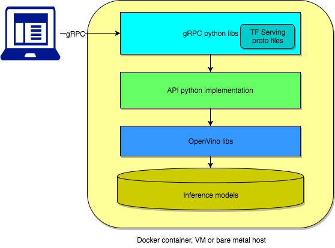

# Architecture Concept

OpenVINO&trade; model server is a Python* implementation of gRPC and RESTful API interfaces defined by Tensorflow serving.
In the backend it uses _Inference Engine libraries_ from OpenVINO&trade; toolkit, which speeds up the execution on CPU,
and enables it on FPGA and Movidius devices. 

gRPC code skeleton is created based on proto-buffer API definition and generated by protoc tool. 
In line with the API definition, data serialization is implemented using Tensorflow libraries. 
Request handling is then implemented via set of python classes managing AI models in Intermediate Representation 
format and Inference Engine component which executes the graphs operations.

**Figure 1: Docker Container (VM or Bare Metal Host)**

OpenVINO&trade; model server requires the models to be present in the local file system or they could be hosted 
remotely on object storage services. Both Google Cloud Storage and S3 compatible storage are supported. 

OpenVINO&trade; model server can be hosted on a bare metal server, virtual machine or inside a docker container. 
It is also suitable for landing in Kubernetes environment. 

The only two exposed network interfaces are gRPC and RESTful API, which currently _does not_ include authorization, 
authentication, or data encryption. Those functions are expected to be implemented outside of the model server 
(for example via Kubernetes* ingress or nginx forwarding proxy). 
Alternatively, they could be added to gRPC interface inside the OpenVINO&trade; Model Server but for now this is out of scope.
