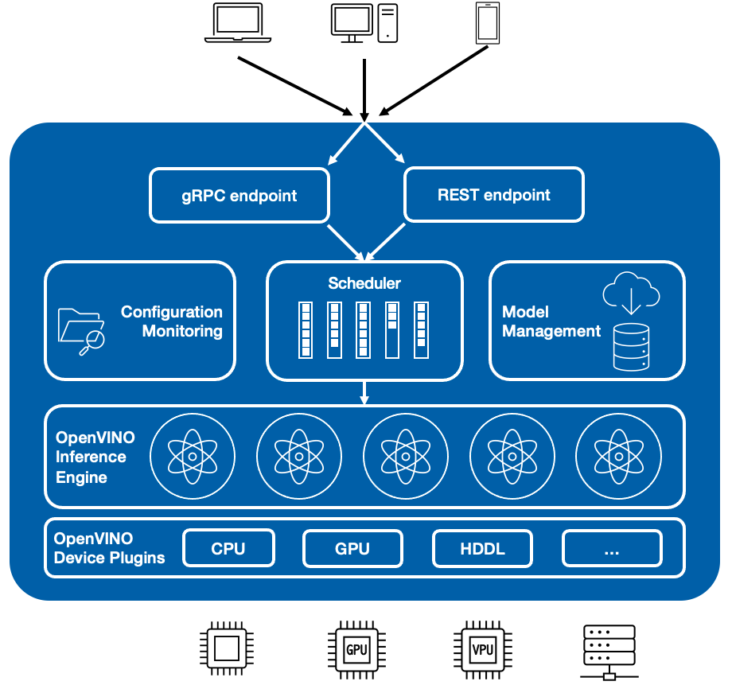

# Architecture {#ovms_docs_architecture}

- OpenVINO&trade; Model Server provides a C++ implementation of the gRPC and RESTful API interfaces compatible with [Tensorflow Serving](https://www.tensorflow.org/tfx/guide/serving).

- In the backend, OpenVINO&trade; Model Server uses [OpenVINO&trade; Runtime](https://docs.openvino.ai/2022.1/index.html) libraries from OpenVINO&trade; toolkit. This speeds up execution on the CPU and enables it on AI accelerators, like [Neural Compute Stick 2](https://software.intel.com/content/www/us/en/main/hardware/neural-compute-stick.html), iGPU(Integrated Graphics Processing Unit), and [HDDL](https://docs.openvino.ai/2022.1/openvino_docs_install_guides_installing_openvino_ivad_vpu.html).

- API requests in gRPC code backbone are created based on [TensorFlow Serving Core Framework](https://www.tensorflow.org/tfx/guide/serving) with tuned implementation of request handling.

- Services are designed via a set of C++ classes managing AI models in the Intermediate Representation format. [OpenVINO&trade; Runtime](https://docs.openvino.ai/2022.1/index.html) executes the model's operations.

<b>Figure 1: Docker Container (VM or Bare Metal Host)</b>

- The models used by OpenVINO Model Server need to be stored locally or hosted remotely by object storage services. Storage compatible with 
Google Cloud Storage (GCS), Amazon S3, or Azure Blob Storage is supported. For more details, refer to [Preparing the Model Repository](./models_repository.md).  
- OpenVINO&trade; Model Server is suitable for landing in the Kubernetes environment. It can be also hosted on a bare metal server, virtual machine, or inside a docker container.

- The only two exposed network interfaces are [gRPC](./model_server_grpc_api.md) and [RESTful API](./model_server_rest_api.md). 
They _do not_ include authorization, authentication, or data encryption. There is, however,
a [documented method](https://github.com/openvinotoolkit/model_server/tree/releases/2022/1/extras/nginx-mtls-auth) for including NGINX reverse proxy with mTLS traffic termination.
