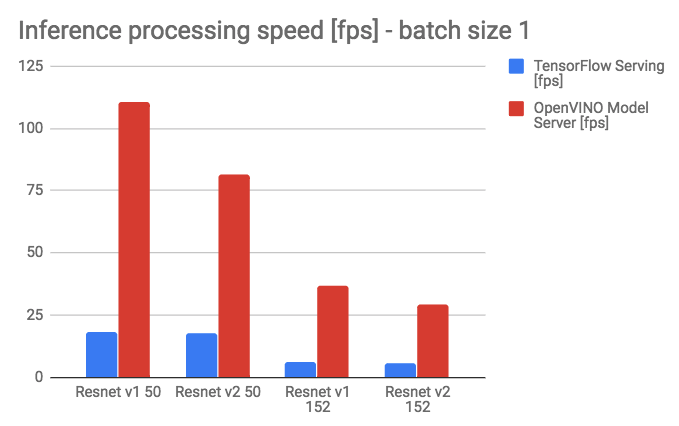

# Performance Results

Below are compared results captured from gRPC client run against a docker container using TensorFlow Serving* image
from dockerhub `tensorflow/serving:1.10.1` and the docker image built according to the recipe from: 
`https://github.com/NervanaSystems/OpenVINO-model-server` with OpenVINO toolkit version 2018.3. 

In the experiments there were applied standard models from
 [TensorFlow-Slim image classification models library](https://github.com/tensorflow/models/tree/master/research/slim), 
specifically resnet_v1_50, resnet_v2_50, resnet_v1_152 and resnet_v2_152.

|  | TensorFlow Serving [fps] | OpenVINO Model Server [fps] |
| ------------- | :-------------: | :-------------: |
| Resnet v1 50 | 18.5 | 110.62 |
| Resnet v2 50 | 17.92 | 81.7 |
| Resnet v1 152 | 6.33 | 37.05 |
| Resnet v2 152 | 5.76 | 29.44 |

During the tests was used a physical server hosting the docker containers without the capacity limits with 2 CPUs
 `Intel(R) Xeon(R) Platinum 8180` on board.

Complete hardware spec is described in a [hw_spec.pdf](hw_spec.pdf) file.

The results above show that OpenVINO Model Server can provide even five times the performance gain over the default 
`tensorflow/serving:1.10.1` docker image using the same CPU and identical client code.