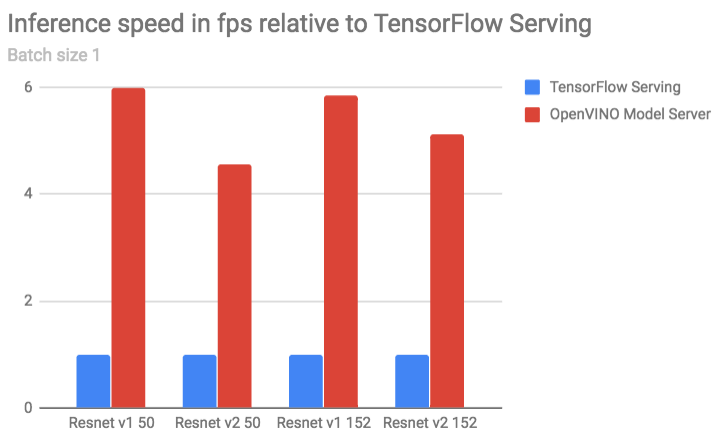
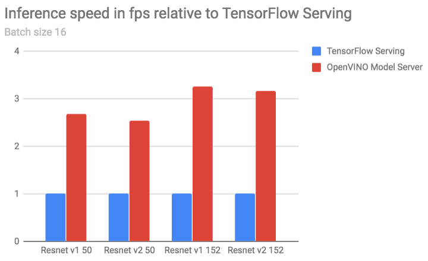
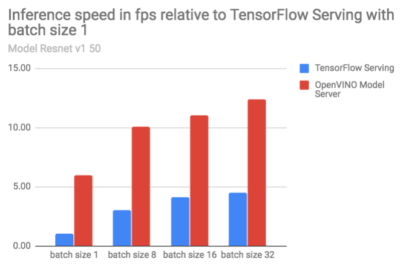

# Performance Results

Below are compared results captured from gRPC client run against a Docker container using TensorFlow Serving* image
from dockerhub `tensorflow/serving:1.10.1` and the docker image built according to the recipe from: 
`https://github.com/NervanaSystems/OpenVINO-model-server` with OpenVINO toolkit version 2018.3. 

In the experiments there were applied standard models from:
 [TensorFlow-Slim image classification models library](https://github.com/tensorflow/models/tree/master/research/slim), 
specifically resnet_v1_50, resnet_v2_50, resnet_v1_152 and resnet_v2_152.

**Figure 1: Performance Results with Batch Size 1 (higher value is the better)**

**Table 1. OpenVINO Model Server gain over TensorFlow Serving with batch size 1**

| Model | Performance gain |
|  :---: |  :---: |
| Resnet v1 50 | 598% |
| Resnet v2 50 | 456% |
| Resnet v1 152 | 585% |
| Resnet v2 152 | 511% |

**Figure 2: Performance Results with Batch Size 16 (higher value is the better)**

**Table 2. OpenVINO Model Server gain over TensorFlow Serving with batch size 16**

| Model | Performance gain |
|  :---: |  :---: |
| Resnet v1 50 | 267% |
| Resnet v2 50 | 254% |
| Resnet v1 152 | 325% |
| Resnet v2 152 | 316% |

**Figure 3: Performance Results for model Resnet v1 50 depending on batch size (higher value is the better)**

**Table 3. OpenVINO Model Server and TensorFlow Serving relative to the TensorFlow Serving performance with batch size 1**

|  | TensorFlow Serving | OpenVINO Model Server |
|  :---: |  :---: | :---: |
| batch size 1 | 100% | 595% |
| batch size 8 | 304% | 1006% |
| batch size 16 | 413% | 1103% |
| batch size 32 | 451% | 1238% |

During the tests a physical server was used hosting the Docker containers without the capacity limits with two CPUs
 `Intel(R) Xeon(R) Platinum 8180` on board.

**Note:** The complete hardware specification is described in a [hw_spec.pdf](hw_spec.pdf) file.

The results above, show that OpenVINO Model Server can provide even five times the performance gain over the default 
`tensorflow/serving:1.10.1` docker image using the same CPU and identical client code.
