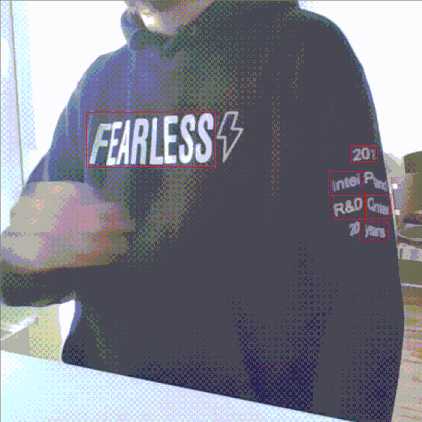
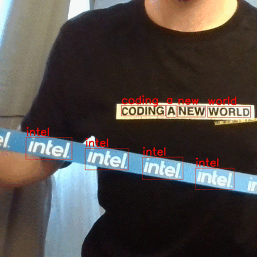

# Processing frames from camera

## Horizontal text detection in real-time
This demo presents a use case with a client written in python which captures camera frames and performs text spotting analysis via gRPC requests to OVMS. The client visualizes the results as a boxes depicted on the original image frames using OpenCV in real-time.
The client can work efficiently also over slow internet connection with long latency thanks to image data compression and parallel execution for multiple frames.



### Download horizontal text detection model from OpenVINO Model Zoo

```bash
curl -L --create-dir https://storage.openvinotoolkit.org/repositories/open_model_zoo/2021.4/models_bin/3/horizontal-text-detection-0001/FP32/horizontal-text-detection-0001.bin -o horizontal-text-detection/1/model.bin https://storage.openvinotoolkit.org/repositories/open_model_zoo/2021.4/models_bin/3/horizontal-text-detection-0001/FP32/horizontal-text-detection-0001.xml -o horizontal-text-detection/1/model.xml
```

```bash
tree horizontal-text-detection/
horizontal-text-detection
└── 1
    ├── model.bin
    └── model.xml
```

### Start the OVMS container:
```bash
docker run -d -u $(id -u):$(id -g) -v $(pwd)/horizontal-text-detection:/model -p 9001:9001 openvino/model_server:latest \
--model_path /model --model_name text --port 9001 --layout NHWC
```

### Run the client
In the context of [example_client](../example_client) directory, run the following commands.

Install python libraries:
```bash
pip3 install -r client_requirements.txt
```

Start the client
```bash
python3 camera_client.py --grpc_address [hostname] --grpc_port 9001

Initializing requesting thread index: 0
Initializing requesting thread index: 1
Initializing requesting thread index: 2
Initializing requesting thread index: 3
Launching requesting thread index: 0
Launching requesting thread index: 1
Launching requesting thread index: 2
Launching requesting thread index: 3
ThreadID:   0; Current FPS:    31.25; Average FPS:    25.64; Average latency:   140.98ms
ThreadID:   1; Current FPS:    31.23; Average FPS:    25.67; Average latency:   136.36ms
ThreadID:   2; Current FPS:    29.41; Average FPS:    25.70; Average latency:   130.88ms
ThreadID:   3; Current FPS:    30.30; Average FPS:    25.73; Average latency:   135.65ms
...
```

You can also change the camera ID:
```
python3 camera_client.py --grpc_address [hostname] --grpc_port 9001 --video_source 0
```
Or choose to work with video file as well:
```
python3 camera_client.py --grpc_address [hostname] --grpc_port 9001 --video_source ~/video.mp4
```

> **NOTE**: Video source is cropped to 704x704 resolution to match model input size.

## Camera frames processing using OCR pipeline
Optical Character Recognition (OCR) pipeline based on [horizontal text detection](https://docs.openvino.ai/latest/omz_models_model_horizontal_text_detection_0001.html) model, [text recognition](https://github.com/openvinotoolkit/open_model_zoo/tree/master/models/intel/text-recognition-0014) 
combined with a custom node implementation can be used with this client. Using such pipeline each processed frame containes detected boxes and additionaly recognized texts.



> **NOTE**: In the next steps we assume that horizontal text detection model is already downloaded.

### Download text recognition model from OpenVINO Model Zoo
```bash
curl -L --create-dir https://storage.openvinotoolkit.org/repositories/open_model_zoo/2021.4/models_bin/3/text-recognition-0014/FP32/text-recognition-0014.bin -o text-recognition/1/model.bin https://storage.openvinotoolkit.org/repositories/open_model_zoo/2021.4/models_bin/3/text-recognition-0014/FP32/text-recognition-0014.xml -o text-recognition/1/model.xml
```

```bash
tree horizontal-text-detection/
text-recognition
└── 1
    ├── model.bin
    └── model.xml
```

### Building the Custom Node "horizontal_ocr" Library
Custom nodes are loaded into OVMS as dynamic library implementing OVMS API from custom_node_interface.h. It can use OpenCV libraries included in OVMS or it could use other thirdparty components.

The custom node horizontal_ocr can be built inside a docker container via the following procedure:
- go to the custom node source code folder [src/custom_nodes/horizontal_ocr](../src/custom_nodes/horizontal_ocr)
- run `make` command

This command will export the compiled library in `./lib` folder.
Copy this `lib` folder to the same location with `horizontal-text-detection` and `text-recognition`.

### OVMS Configuration File

The configuration file for running the camera client with OCR pipeline is stored in [config.json](../src/custom_nodes/horizontal_ocr/config.json)
Copy this file along with the model files and the custom node library like presented below:
```bash
OCR
├── config.json
├── text-recognition
│   └── 1
│       ├── model.bin
│       └── model.xml
├── horizontal-text-detection
│   └── 1
│       ├── model.bin
│       └── model.xml
└── lib
    └── libcustom_node_horizontal_ocr.so
```

### Deploying OVMS
Deploy OVMS with OCR pipeline using the following command:
```bash
chmod -R 755 OCR/
docker run -p 9001:9001 -d -v ${PWD}/OCR:/OCR openvino/model_server --config_path /OCR/config.json --port 9001
```

### Sending Request to the Server
In the context of [example_client](../example_client) directory, run the following commands.

Install python libraries:
```bash
pip3 install -r client_requirements.txt
```

Start the client
```bash
python3 camera_client.py --grpc_address [hostname] --grpc_port 9001 --use_case ocr

Initializing requesting thread index: 0
Initializing requesting thread index: 1
Initializing requesting thread index: 2
Initializing requesting thread index: 3
Launching requesting thread index: 0
Launching requesting thread index: 1
Launching requesting thread index: 2
Launching requesting thread index: 3
ThreadID:   0; Current FPS:    31.25; Average FPS:    25.64; Average latency:   140.98ms
ThreadID:   1; Current FPS:    31.23; Average FPS:    25.67; Average latency:   136.36ms
ThreadID:   2; Current FPS:    29.41; Average FPS:    25.70; Average latency:   130.88ms
ThreadID:   3; Current FPS:    30.30; Average FPS:    25.73; Average latency:   135.65ms
...
```

