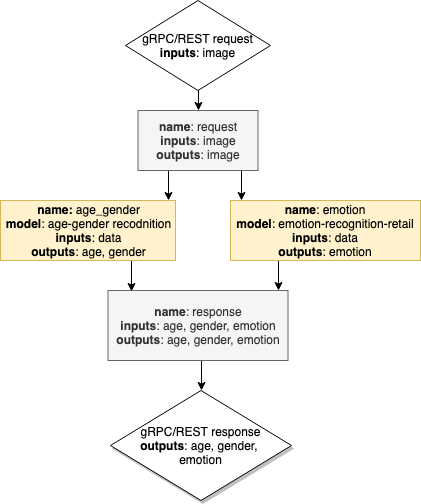

## DAG Scheduler combining results from two models

This document presents a models ensemble as an example of [DAG Scheduler](dag_scheduler.md) implementation.
It describes how to combine several models to perform multiple inference operations with a single prediction call.
When you need to execute several predictions on the same data, you can create a pipeline, which combines the results from several models.

)

### Step 1: Prepare the models

In this example the following models are used:

[age-gender-recognition-retail-0013](https://github.com/openvinotoolkit/open_model_zoo/blob/master/models/intel/age-gender-recognition-retail-0013/description/age-gender-recognition-retail-0013.md)

[emotions-recognition-retail-0003](https://github.com/openvinotoolkit/open_model_zoo/blob/master/models/intel/emotions-recognition-retail-0003/description/emotions-recognition-retail-0003.md)

```bash
curl --create-dirs https://download.01.org/opencv/2021/openvinotoolkit/2021.1/open_model_zoo/models_bin/1/age-gender-recognition-retail-0013/FP32/age-gender-recognition-retail-0013.bin https://download.01.org/opencv/2021/openvinotoolkit/2021.1/open_model_zoo/models_bin/1/age-gender-recognition-retail-0013/FP32/age-gender-recognition-retail-0013.xml -o models/age-gender-recognition-retail-0013/1/age-gender-recognition-retail-0013.bin -o models/age-gender-recognition/1/age-gender-recognition-retail-0013.xml
curl --create-dirs https://download.01.org/opencv/2021/openvinotoolkit/2021.1/open_model_zoo/models_bin/1/emotions-recognition-retail-0003/FP32/emotions-recognition-retail-0003.bin https://download.01.org/opencv/2021/openvinotoolkit/2021.1/open_model_zoo/models_bin/1/emotions-recognition-retail-0003/FP32/emotions-recognition-retail-0003.xml -o models/emotions-recognition-retail-0003/1/emotions-recognition-retail-0003.bin -o models/emotions-recognition/1/emotions-recognition-retail-0003.xml

```

### OVMS configuration

```json
{
    "model_config_list": [
        {
            "config": {
                "name": "emotions-recognition",
                "base_path": "/models/emotions-recognition-retail-0003"
            }
        },
        {
            "config": {
                "name": "age-gender-recognition",
                "base_path": "/models/age-gender-recognition-retail-0013"
            }
        }
    ],
    "pipeline_config_list": [
        {
            "name": "combined-recognition",
            "inputs": ["image"],
            "nodes": [
                {
                    "name": "emotions",
                    "model_name": "emotions-recognition",
                    "type": "DL model",
                    "inputs": [
                        {"data": {"node_name": "request",
                                   "data_item": "image"}}
                    ], 
                    "outputs": [
                        {"data_item": "prob_emotion",
                         "alias": "emotion"}
                    ] 
                },
                {
                    "name": "age-gender",
                    "model_name": "age-gender-recognition",
                    "type": "DL model",
                    "inputs": [
                        {"data": {"node_name": "request",
                                  "data_item": "image"}}
                    ], 
                    "outputs": [
                        {"data_item": "age_conv3",
                         "alias": "age"},
                        {"data_item": "prob",
                         "alias": "gender"}
                    ] 
                }
            ],
            "outputs": [
                {"age": {"node_name": "age-gender",
                           "data_item": "age"}},
                {"gender": {"node_name": "age-gender",
                           "data_item": "gender"}},
                {"emotion": {"node_name": "emotions",
                           "data_item": "emotion"}}
            ]
        }
    ]
}
```

### Starting docker container
```bash
docker run -d -p 9000:9000 -v ${PWD}/models:/models -v ${PWD}/config.json:/config.json openvino/model_server --config_path /config.json --port 9000
```

### Using the client 

Get the sample image:
```
wget https://github.com/openvinotoolkit/open_model_zoo/raw/master/models/intel/age-gender-recognition-retail-0013/description/age-gender-recognition-retail-0001.jpg
```

Use the following code snippet to submit a request via gRPC to the serving and display the response:

```python
import cv2
from tensorflow import make_tensor_proto, make_ndarray
import grpc
from tensorflow_serving.apis import predict_pb2
from tensorflow_serving.apis import prediction_service_pb2_grpc

def getJpeg(path, size):

    img = cv2.imread(path, cv2.IMREAD_COLOR)
    # retrieved array has BGR format and 0-255 normalization
    img = cv2.resize(img, (size, size))
    img = img.astype('float32')
    img = img.transpose(2,0,1).reshape(1,3,size,size)
    return img

my_image = getJpeg('age-gender-recognition-retail-0001.jpg',64)

channel = grpc.insecure_channel("localhost:9000")
stub = prediction_service_pb2_grpc.PredictionServiceStub(channel)
request = predict_pb2.PredictRequest()
request.model_spec.name = "combined-recognition"
request.inputs["image"].CopyFrom(make_tensor_proto(my_image, shape=(my_image.shape)))
result = stub.Predict(request, 10.0)
age_results = make_ndarray(result.outputs["age"])
gender_results = make_ndarray(result.outputs["gender"])
emotion_results = make_ndarray(result.outputs["emotion"])

print("Age results:", age_results[0]*100)
print("Gender results: Famale-", gender_results[0,0,0,0], "; Male-", gender_results[0,1,0,0] )
print("Emotion results: Natural-", emotion_results[0,0,0,0], "; Happy-", emotion_results[0,1,0,0], "; Sad-", emotion_results[0,2,0,0], "; Surprise-", emotion_results[0,3,0,0], "; Angry-", emotion_results[0,4,0,0] )
```

Make sure there are installed python dependencies from [client_requirements.txt](../example_client/client_requirements.txt)

```bash
python combined_model_client.py
Age results: [[[21.099794]]]
Gender results: Famale- 0.9483401 ; Male- 0.051659893
Emotion results: Natural- 0.0233579 ; Happy- 0.9449672 ; Sad- 0.0012368461 ; Surprise- 0.028111037 ; Angry- 0.0023269344
```