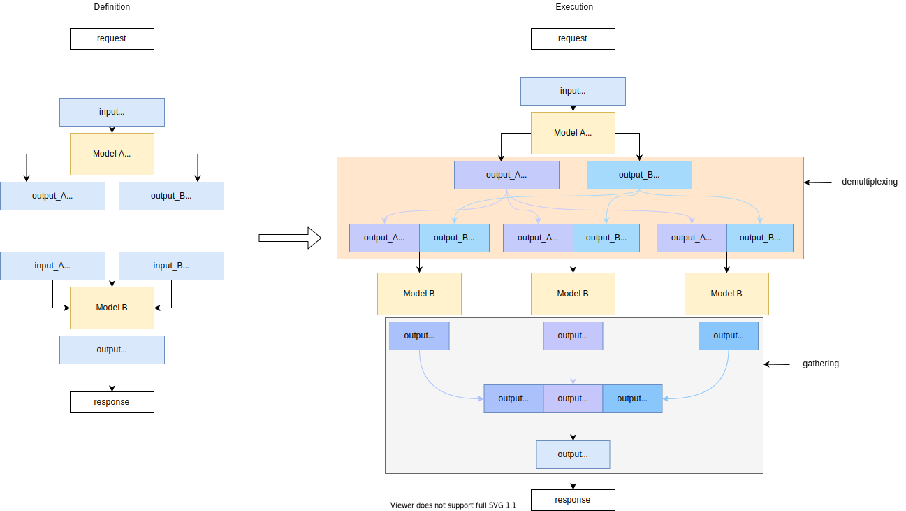
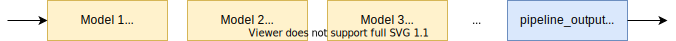
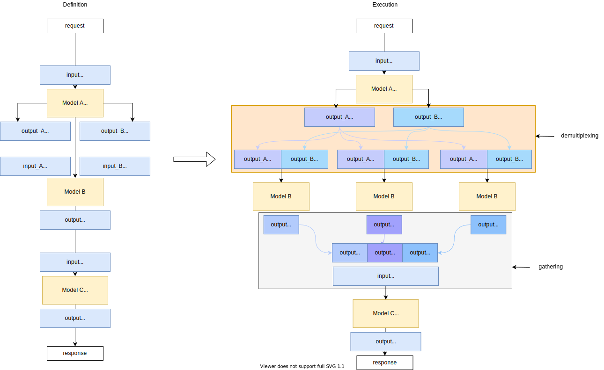
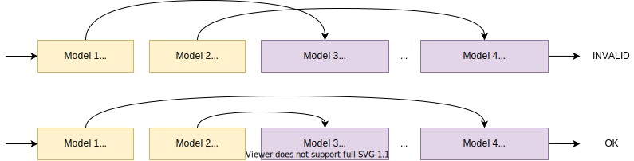
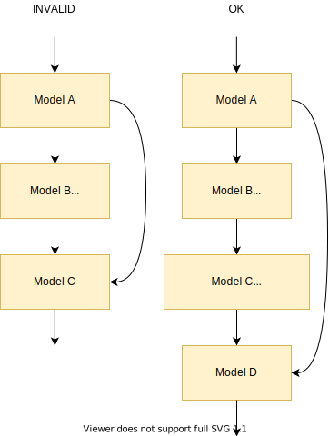

# Demultiplexing in DAG {#ovms_docs_demultiplexing}

## Pipeline Branching
Directed Acyclic Graph (DAG) Scheduler enables creating pipelines with optional parameter `demultiply_count: N` which makes it possible for any node to slice outputs into `N` separate sub-outputs and branch pipeline execution into `N` sub-pipelines. Nodes that follow will be executed by event loop `N` times independently from each other and results gathered and packed into one output just before sending a response. Additionally, `gather_from_node: <node_name>` parameter can be used to specify gathering at any point in the Directed Acyclic Graph. The `demultiply_count` node parameter value must match the first dimension of all node outputs. All node outputs must have at least 2 dimensions.

## Basic demultiplexer example and metadata explanation
This example contains 2 consecutive models:
- Model A accepts one input named `input` with shape `(1,224,224)`, layout `NHW` and floating-point precision (later referred as `(1,224,224) FP32`) and produces 2 outputs: `output_A (3,1,100,100) FP32` and `output_B (3,1,40,130) FP32`. Since this model is configured as demultiplexer, the first dimension is very important - it must be equal to `demultiply_count` parameter specified in config.json configuration file (in this case it has to be equal to 3). This allows scheduler to split all outputs into smaller chunks (so-called `demultiplexing` in the diagram below) and spawn new pipeline branches.
- Model B accepts 2 inputs: `input_A (1,100,100) FP32` and `input_B (1,40,130) FP32`. Please note how metadata must be matched with previous model output after demultiplication (with first dimension removed after slicing). Since in most cases it is not possible to match metadata, OpenVINO&trade; Model Server allows creating custom nodes to perform output postprocessing ([custom node development](./custom_node_development.md)). This model produces one output: `output (1,50) FP32`.

This example has no `gather_from_node` parameter specified in config.json configuration file. This means gathering (shown in the diagram below) will be done automatically by `response` node at the end of the event loop processing. Gathering - packing all results from pipeline branches appends new dimension to output shape at the beginning of dimension list. 



Example configuration file with one demultiplexer (remove everything after arrows in lines containing those):
```
{
    "model_config_list": [
        {"config": {
            "name": "Model_A",
            "base_path": "/models/model_a"
        }},
        {"config": {
            "name": "Model_B",
            "base_path": "/models/model_b"
        }}
    ],
    "pipeline_config_list": [
        {
            "name": "my_pipeline_with_demultiplexer",
            "inputs": ["pipeline_input_name"],
            "nodes": [
                {
                    "name": "Model_A_node",
                    "model_name": "Model_A",
                    "type": "DL model",
                    "demultiply_count": 3,  <------------------ this parameter specifies how many branches should be spawned
                    "inputs": [
                        {"input": {"node_name": "request",
                                   "data_item": "pipeline_input_name"}}
                    ], 
                    "outputs": [
                        {"data_item": "output_A",
                         "alias": "output_A"},
                        {"data_item": "output_B",
                         "alias": "output_B"}
                    ]
                },
                {
                    "name": "Model_B_node",
                    "model_name": "Model_B",
                    "type": "DL model",
                    "inputs": [
                        {"input_A": {"node_name": "Model_A_node",
                                     "data_item": "output_A"}},
                        {"input_B": {"node_name": "Model_A_node",
                                     "data_item": "output_B"}}
                    ], 
                    "outputs": [
                        {"data_item": "output",
                         "alias": "output"}
                    ]
                }
            ],
            "outputs": [
                {"pipeline_output_name": {"node_name": "Model_B_node",
                                          "data_item": "output"}}
            ]
        }
    ]
}
```

## Dynamic demultiply_count parameter
There might be use cases where one custom node library is used to produce an unpredictable number of a batch. To achieve it, `demultiply_count` can be set to `-1`. This indicates that the pipeline supports any number of batch returned by custom node: `(X,N,C,H,W,...)` - where `X` is dynamic `demultiply_count`. OpenVINO&trade; Model Server is capable of interpreting such dynamic batch and is able to split outputs into a dynamic number of the pipeline branches. When using dynamic `demultiply_count` parameters, only one demultiplexer can exist in the pipeline. Important to note - in release 2021.3, when batch 0 is returned, the pipeline stops its execution and ABORTED status is returned. This may be changed in future releases.

## Multiple demultiplexers
Directed Acyclic Graph Scheduler is not limited to a single demultiplexer node in one pipeline definition. Each demultiplexer node that is not referenced by `gather_from_node` parameter will be automatically gathered in `response` node - meaning each demultiplexer adds one new dimension equal to `demultiply_count` into all  pipeline outputs shape. This must be taken into account when interpreting response data in client applications.



## Configurable gathering step

OpenVINO&trade; Model Server provides ability to gather results from demultiplexers before any pipeline node execution and is not limited to gathering in `response` node. This operation does not append new dimension into pipeline output shape. This appends new dimension into gathering node inputs. To gather from any demultiplexer in pipeline, specify node name with `gather_from_node: <node_name>` parameter. The uses of this functionality is when pipeline shall collect responses from all branches and decide upon gathered result. This could be decision node for next branching (demultiplexing). This allows creating complex pipelines without a need to send intermediate results to the client.
As real example, one could create pipeline with face detection model detecting `N` faces and setup emotion recognition model for each detected face. Next, by setting up gather node, scheduler can collect `N` emotion results, we may trigger next pipeline steps depending of dominant emotion of people included in the original image.

Example pipeline with `gather_from_node` specified before Model C execution:



Example configuration file for pipeline with `gather_from_node` specified before Model C execution:
```
{
    "model_config_list": [
        {"config": {
            "name": "Model_A",
            "base_path": "/models/model_a"
        }},
        {"config": {
            "name": "Model_B",
            "base_path": "/models/model_b"
        }}
    ],
    "pipeline_config_list": [
        {
            "name": "my_pipeline_with_demultiplexer",
            "inputs": ["pipeline_input_name"],
            "nodes": [
                {
                    "name": "Model_A_node",
                    "model_name": "Model_A",
                    "type": "DL model",
                    "demultiply_count": 3,  <----------------- this parameter specifies how many branches should be spawned
                    "inputs": [
                        {"input": {"node_name": "request",
                                   "data_item": "pipeline_input_name"}}
                    ], 
                    "outputs": [
                        {"data_item": "output_A",
                         "alias": "output_A"},
                        {"data_item": "output_B",
                         "alias": "output_B"}
                    ]
                },
                {
                    "name": "Model_B_node",
                    "model_name": "Model_B",
                    "type": "DL model",
                    "inputs": [
                        {"input_A": {"node_name": "Model_A_node",
                                     "data_item": "output_A"}},
                        {"input_B": {"node_name": "Model_A_node",
                                     "data_item": "output_B"}}
                    ], 
                    "outputs": [
                        {"data_item": "output",
                         "alias": "output"}
                    ]
                },
                {
                    "name": "Model_C_node",
                    "model_name": "Model_C",
                    "type": "DL model",
                    "gather_from_node": "Model_A_node",  <----------------- this parameter specifies which node to gather from (must be demultiplexer and in LIFO order)
                    "inputs": [
                        {"input": {"node_name": "Model_B_node",
                                     "data_item": "output"}}
                    ], 
                    "outputs": [
                        {"data_item": "output",
                         "alias": "output"}
                    ]
                }
            ],
            "outputs": [
                {"pipeline_output_name": {"node_name": "Model_C_node",
                                          "data_item": "output"}}
            ]
        }
    ]
}
```

## Dynamic batch handling with demultiplexing

Demultiplexing feature enables handling requests with dynamic batch size without a model reloading.
It is recommended for workloads with an arbitrary batch size in sequential requests.
You can use the dynamic batching feature via requests demultiplexing by configuring a pipeline including a single model and an extra field 'demultiply_count: -1'.
To leverage this feature, input data requires an additional, first dimension, representing the batch size. It should be added to the original model shape with batch size 1.
The response will include combined predictions from the split batch. That also adds an extra first dimension to the model output.

In the case of the ResNet-50 model with shape (1,3,224,224) and N images, the inputs and outputs will be as presented below:

Input: (N,1,3,224,224)
Output: (N,1,1001)

Because of this additional dimension, demultiplexing implementation is generic and can support any input and output data layout.

Exemplary usage of this feature is available in [dynamic batch size guide](./dynamic_bs_demultiplexer.md).

*Note:* You can use additional parameters in model config ('nireq' and 'NUM_STREAMS') to fine-tune your performance for dynamic batch. 'NUM_STREAMS' allows for multiple parallel
inferences processing in OpenVINO&trade; which may increase throughput at the cost of latency of predict requests. 'nireq' specifies how many inference requests can be prepared.

*Note:* In case you are using a different device for inference than CPU you have check that device plugin configuration parameters.

## Pipeline configuration rules
There are several rules for possible configurations in regards to demultiplexing and gathering:

- You can gather only from nodes with `demultiply_count` specified (demultiplexer nodes).
- When pipeline with dynamic `demultiply_count` encounters 0 results execution is stopped and gRPC/REST response returns specific error with such information.
- For pipelines with dynamic `demultiply_count` only 1 demultiplexer node is allowed.
- When pipeline contains at least one demultiplexer, only gathering nodes are allowed with input batch larger than 1.
- Demultiplexer nodes and gathering nodes should be in LIFO order. Meaning you need to gather nodes starting from closest demultiplexer going upstream in defined directed acyclic graph.



- Node inputs must be coming from the same level of nested demultiplexing. To reduce demultiplexing levels you can gather results at any stage using `gather_from_node` parameter.


