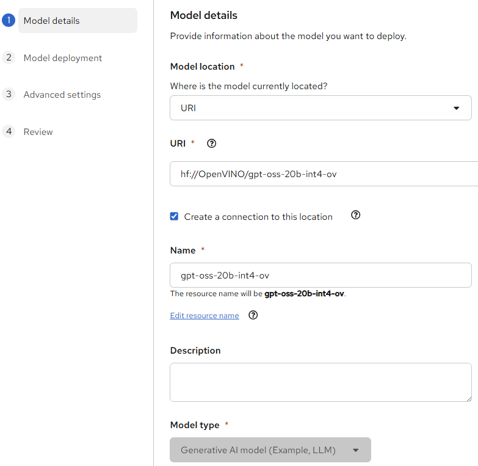
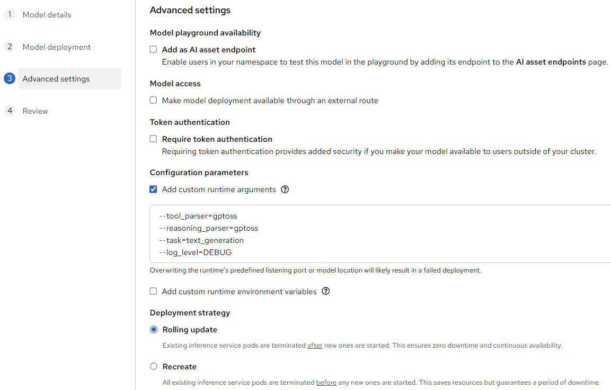
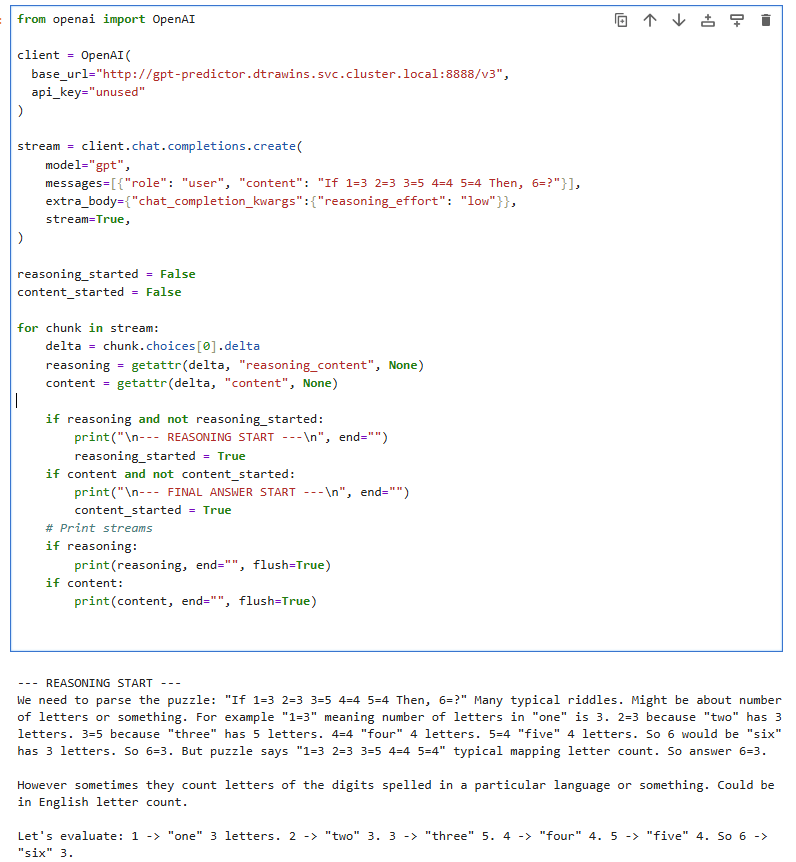

## Deploying Model Server in Kubernetes {#ovms_docs_deploying_server_kubernetes}

The recommended deployment method in Kubernetes is via Kserve operator for Kubernetes and OpenShift.

## ServingRuntime configuration:

```
curl https://raw.githubusercontent.com/openvinotoolkit/model_server/refs/heads/releases/2026/2/extras/kserve/kserve-openvino.yaml -O
sed -i 's/openvino\/model_server:replace/openvino\/model_server:latest-gpu/' kserve-openvino.yaml
kubectl apply -f kserve-openvino.yaml
```
Note: Alternatively use the official image tag `2026.2` to deploy smaller image with support for CPU only or `2026.2-gpu` with support for GPU and CPU.

## Deploying inference service with a generative model from HuggingFace

Below is an example of the InferenceService resource. Change the args and resource to fit your needs.
```
apiVersion: serving.kserve.io/v1beta1
kind: InferenceService
metadata:
  name: qwen3-8b-int4-ov
spec:
  predictor:
    model:
      runtime: kserve-openvino
      storageUri: "hf://OpenVINO/Qwen3-8B-int4-ov"
      modelFormat:
        name: huggingface
      args:
        - --task=text_generation
        - --tool_parser=hermes3
        - --reasoning_parser=qwen3 
        - --target_device=CPU
        - --log_level=DEBUG
      resources:
        requests:
          cpu: "16"
          memory: "8G"
        limits:
          cpu: "16"
          memory: "8G"
```

## Deploying a model from cloud storage

```
kind: InferenceService
metadata:
  name: openvino-model
spec:
  predictor:
    serviceAccountName: sa
    model:
      runtime: kserve-openvino
      modelFormat:
        name: openvino
      storageUri: "s3://bucket_name/model"
```
Note that using s3 or minio bucket requires configuring credentials like described in [KServer documentation](https://kserve.github.io/archive/0.15/modelserving/storage/s3/s3/)


## OpenShift AI deployment

OVMS can be used in RedHat OpenShift AI environment to run classic models or generative pipelines. 


The latest version can be enabled in Settings > Model resources and operations > Serving runtimes. Add new runtime with [spec](../extras/openshift_AI/ServingRuntime.yaml)

In first step specify the source models. Below is an example from Hugging Face


After configuring the resources for the model, specify runtime parameters for a specific model:


When the model is running, it can be used in the Workbenches like presented below:



## Deprecation notice about OpenVINO operator

The dedicated [operator for OpenVINO](https://operatorhub.io/operator/ovms-operator) is now deprecated. KServe operator can now support all OVMS use cases including generative models. It provides wider set of features and configuration options. Because KServe is commonly used for other serving runtimes, it gives easier transition and transparent migration.

## Additional Resources

- [Preparing Model Repository](models_repository.md)
- [Using Cloud Storage](using_cloud_storage.md)
- [Troubleshooting](troubleshooting.md)
- [Model server parameters](parameters.md)
