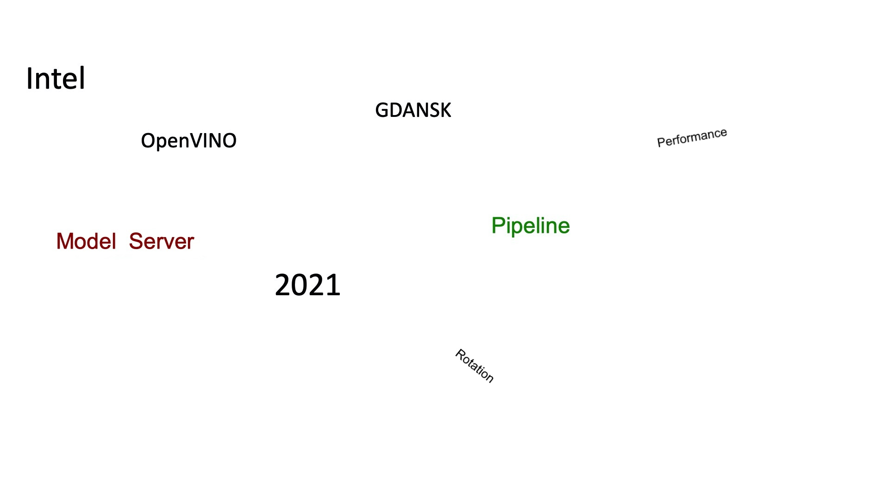
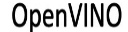
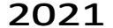

#  Optical Character Recognition with Directed Acyclic Graph

This document demonstrate how to create and use an Optical Character Recognition (OCR) pipeline based on [east-resnet50](https://github.com/argman/EAST) text detection model,
[CRNN](https://github.com/MaybeShewill-CV/CRNN_Tensorflow) text recognition combined with a custom node implementation.

Using such pipeline, a single request to OVMS can perform a complex set of operations with a response containing
recognized characters for all detected text boxes. 

## OCR Graph

Below is depicted the graph implementing a complete OCR pipelines. 


It includes the following Nodes:
- Model east-resnet50 - inference execution which takes the user image as input. It returns two outputs including information about all detected boxes, their location and scores.
- Custom node east_ocr - it includes C++ implementation of east-resnet50 model results processing. It analyses the detected boxes coordinates, filters the results
based on the configurable score level threshold and and applies non-max suppression algorithm to remove overlaping boxes. Finally the custom node east-ocr crops all detected boxes
from the original image, resize them to the target resolution and combines into a single output of a dynamic batch size. The output batch size is determined by the number of detected
boxes according to the configured criteria. All operations on the images employ OpenCV libraries which are preinstalled in the OVMS. Learn more about the [east_ocr custom node](../src/custom_nodes/east_ocr)
- demultiplexer - output from the Custom node east_ocr have variable batch size. In order to match it with the sequential text detection model, the data is split into individuial images with batch size 1 each.
Such smaller requests can be submitted for inference in parallel to the next Model Node. Learn more about the [demultiplexing](./demultiplexer.md)
- Model crnn - this model recognizes characters included in the input image. 
- Response - the output of the whole pipeline combines the recognized `image_texts` with their metadata. 
The metadata are the `text_coordinates` and the `confidence_level` outputs.

## Preparing the Models

### East-resnet50 model

The original pretrained model for east-resnet50 topology is stored on https://github.com/argman/EAST in TensorFlow checkpoint format.

Clone github repository:
```bash
git clone https://github.com/argman/EAST 
cd EAST 
```
Download and unzip the file east_icdar2015_resnet_v1_50_rbox.zip to EAST folder with the github repository.
```bash
unzip ./east_icdar2015_resnet_v1_50_rbox.zip
```
Inside the EAST folder add a file `freeze_east_model.py` with the following content:
```python
from tensorflow.python.framework import graph_util
import tensorflow as tf
import model

def export_model(input_checkpoint, output_graph):
    with tf.get_default_graph().as_default():
        input_images = tf.placeholder(tf.float32, shape=[None, None, None, 3], name='input_images')
        global_step = tf.get_variable('global_step', [], initializer=tf.constant_initializer(0), trainable=False)
        f_score, f_geometry = model.model(input_images, is_training=False)
    graph = tf.get_default_graph()
    input_graph_def = graph.as_graph_def()

    init_op = tf.global_variables_initializer()
    saver = tf.train.Saver()
    with tf.Session() as sess:
        sess.run(init_op)
        saver.restore(sess, input_checkpoint)
        output_graph_def = graph_util.convert_variables_to_constants(sess=sess, input_graph_def=input_graph_def, output_node_names=['feature_fusion/concat_3','feature_fusion/Conv_7/Sigmoid'])
        with tf.gfile.GFile(output_graph, "wb") as f:
            f.write(output_graph_def.SerializeToString())

export_model('./east_icdar2015_resnet_v1_50_rbox/model.ckpt-49491',"./model.pb")
```
Freeze the model in checkpoint format and save it in proto buffer format in `model.pb`:

```bash
docker run -u $(id -u):$(id -g) -v ${PWD}/:/EAST:rw -w /EAST openvino/ubuntu18_dev:2021.3 python3 freeze_east_model.py
```

Convert the TensorFlow frozen model to Intermediate Representation format using the model_optimizer tool:
```bash
docker run -u $(id -u):$(id -g) -v ${PWD}/:/EAST:rw openvino/ubuntu18_dev:2021.3 deployment_tools/model_optimizer/mo.py \
--framework=tf --input_shape=[1,1024,1920,3] --input=input_images --output=feature_fusion/Conv_7/Sigmoid,feature_fusion/concat_3  \
--input_model /EAST/model.pb --output_dir /EAST/IR/1/
```
It will create model files in `${PWD}/IR/1/` folder.
```bash
model.bin
model.mapping
model.xml
```
Converted east-reasnet50 model will have the following interface:
- Input name: `input_images` ; shape: `[1 3 1024 1920]` ; precision: `FP32`, layout: `NCHW`
- Output name: `feature_fusion/Conv_7/Sigmoid` ; shape: `[1 1 256 480]` ; precision: `FP32`
- Output name: `feature_fusion/concat_3` ; shape: `[1 5 256 480]` ; precision: `FP32`

### CRNN model
In this pipeline example is used from from https://github.com/MaybeShewill-CV/CRNN_Tensorflow. It includes TensorFlow
model in a checkpoint format. You can get the pretrained model and convert it to IR format using the procedure below:

```bash
git clone https://github.com/MaybeShewill-CV/CRNN_Tensorflow
cd CRNN_Tensorflow
git checkout 64f1f1867bffaacfeacc7a80eebf5834a5726122
export PYTHONPATH="${PYTHONPATH}:${PWD}"
```
Open the tools/demo_shadownet.py script. After saver.restore(sess=sess, save_path=weights_path) line, add the following code:
```python
from tensorflow.python.framework import graph_io
frozen = tf.graph_util.convert_variables_to_constants(sess, sess.graph_def, ['shadow/LSTMLayers/transpose_time_major'])
graph_io.write_graph(frozen, '.', 'frozen_graph.pb', as_text=False)
```
It will save the frozen graph of the model during the demo execution.

Install the following python dependencies in your python virtual environment:
```
virtualenv .venv ; source .venv/bin/activate
pip install tensorflow==1.15.0 opencv-python matplotlib easydict
```
> NOTE: If you encounter errors installing `tensorflow==1.15.0`, downgrade python.

Run the demo code via 
```bash
python3 tools/demo_shadownet.py --image_path data/test_images/test_01.jpg --weights_path model/shadownet/shadownet_2017-10-17-11-47-46.ckpt-199999
```
Convert the frozen TensorFlow graph to OpenVINO format:
```
docker run -u $(id -u):$(id -g) -v ${PWD}/:/CRNN_Tensorflow:rw openvino/ubuntu18_dev:2021.3 deployment_tools/model_optimizer/mo_tf.py \
--input_model /CRNN_Tensorflow/frozen_graph.pb \
--output_dir /CRNN_Tensorflow/IR/1/
```
It will export the optimized CRNN model to `${PWD}/IR/1` folder.

Converted CRNN model will have the following interface:
- Input name: `input`;  shape: `[1 3 32 100]` ; precision: `FP32`, layout: `NCHW`
- Output name: `shadow/LSTMLayers/transpose_time_major` ; shape: `[25 1 37]` ; precision: `FP32`

## Building the Custom Node "east_ocr" Library 

Custom nodes are loaded into OVMS as dynamic library implementing OVMS API from [custom_node_interface.h](../src/custom_node_interface.h).
It can use OpenCV libraries included in OVMS or it could use other thirdparty components.

The custom node east_ocr can be built inside a docker container via the following procedure:
- go to the custom node source code folder [src/custom_nodes/east_ocr](../src/custom_nodes/east_ocr)
- run `make` command

This command will export the compiled library in `./lib` folder.
Copy this `lib` folder to the same location with `CRNN_Tensorflow` and `east_icdar2015_resnet_v1_50_rbox`.

## OVMS Configuration File

The configuration file for running the OCR demo is stored in [config.json](../src/custom_nodes/east_ocr/config.json)
Copy this file along with the model files and the custom node library like presented below:
```bash
OCR
├── config.json
├── crnn_tf
│   └── 1
│       ├── frozen_graph.bin
│       └── frozen_graph.xml
├── east_fp32
│   └── 1
│       ├── model.bin
│       └── model.xml
└── lib
    └── libcustom_node_east_ocr.so
```

## Deploying OVMS

Deploy OVMS with OCR demo pipeline using the following command:

```bash
docker run -p 9000:9000 -d -v ${PWD}/OCR:/OCR openvino/model_server --config_path /OCR/config.json --port 9000
```

## Requesting the Service

Exemplary client [easr_orc_client.py](../example_client/east_ocr_client.py) can be used to request pipeline deployed in previous step.

From the context of [example_client](../example_client) folder install python3 requirements:
```bash
pip install -r client_requirements.txt
``` 

Now you can create directory for text images and run the client:
```bash
mkdir results
```
```bash
python east_ocr_client.py --grpc_port 9000 --image_input_path ../src/custom_nodes/east_ocr/demo_images/input.jpg --pipeline_name detect_text_images --text_images_save_path ./results/ --image_layout NHWC
Output: name[text_coordinates]
    numpy => shape[(9, 1, 4)] data[int32]
Output: name[texts]
    numpy => shape[(9, 25, 1, 37)] data[float32]
periormancd
gdansk
server
model
openvino
pipeline
2o21
intel
rotationn
Output: name[confidence_levels]
    numpy => shape[(9, 1, 1)] data[float32]
Output: name[text_images]
    numpy => shape[(9, 1, 3, 32, 100)] data[float32]
```

With additional parameter `--text_images_save_path` the client script saves all detected text images to jpeg files into directory path to confirm
if the image was analyzed correctly.

| |
| --- |
| Exemplary input image |


The custom node generates the following text images retrieved from the original input to CRNN model:
| #| Image | CRNN Recognition | Decoded Word |                     
| --- | --- | --- | --- |
| text 0 || pp___er_ior_m__a_n_c____d | periormancd |
| text 1 || g______d___a_nn__ss_____k | gdansk |
| text 2 || s______ee__r_v___e_____rr | server |
| text 3 || mm_______o___dd___e_____l | model |
| text 4 || o_____p_ee_n_vv_inn_____o | openvino |
| text 5 || pp____iipp__elliin______e | pipeline |
| text 6 || 2_______o_____2_________1 | 2o21 |
| text 7 || ii____nn____tt___e_____ll | intel |
| text 8 || rr____o_ttaa_tiio__n____n | rotationn |

## Accurracy
Please note that it is possible to swap the models included in DAG with your own to adjust pipeline accuracy for various scenarios and datasets.

## Images from camera
You can also use exemplary camera client with model server configured in this page. Refer to: [camera client example](camera_example.md).
