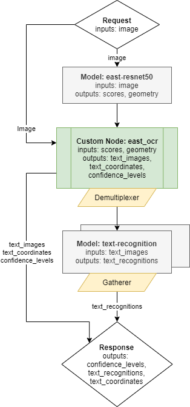

#  Optical Character Recognition with Directed Acyclic Graph

This document demonstrate how to create and use an Optical Character Recognition (OCR) pipeline based on [east-resnet50](https://github.com/argman/EAST) text detection model,
[CRNN](https://github.com/MaybeShewill-CV/CRNN_Tensorflow) text recognition combined with a custom node implementation.

Using such pipeline, a single request to OVMS can perform a complex set of operations with a response containing
recognized characters for all detected text boxes. 

## OCR Graph

Below is depicted the graph implementing a complete OCR pipelines. 



It includes the following Nodes:
- Model east-resent50 - inference execution which takes the user image as input. It returns two outputs including information about all detected boxes, their location and scores.
- Custom node east_ocr - it includes C++ implementation of east-resnet50 model results interpretation. It analyses the detected boxes coordinates, filters the results
based on the configurable score level threshold and and applies non-max suppression algorithm to remove overlaping boxes. Finally the custom node east-ocr crops all detected boxes
from the original image, resize them to the target resolution and combines into a single output of a dynamic batch size. The output batch size is determined by the number of detected
boxes according to the configured criteria. All operations on the images employ OpenCV libraries which are preinstalled in the OVMS. Learn more about the [east_ocr custom model](TBD)
- demuliplexer - output from the Custom node east_ocr have variable batch size. In order to match it with the sequential text detection model, the data is split into individuial images with batch size 1 each.
Such smaller requests can be submitted for inference in parallel to the next Model Node
- Model crnn - this model recognize the characters included in the input image in the grayscale. 
- Response - the output of the whole pipeline combines the recognized `image_texts` with their metadata. 
The metadata are the `text_coordinates` and the `confidence_level` outputs.

## Preparing the Models

### East-resnet50 model

The original pretrained model for east-resent50 topology is stored on https://github.com/argman/EAST in TensorFlow checkpoint format.
Download and unzip the fle east_icdar2015_resnet_v1_50_rbox.zip to folder.
```bash
unzip ./east_icdar2015_resnet_v1_50_rbox.zip
```
Convert the TensorFlow Model to Intermediate Representation format using the model_optimizer tool. It can be done
using a public docker image with OpenVINO toolkit:
```bash
docker run -u $(id -u):$(id -g) -v ${PWD}/east_icdar2015_resnet_v1_50_rbox:/model:rw openvino/ubuntu18_dev:latest deployment_tools/model_optimizer/mo_tf.py \
--input_meta_graph /model/model.ckpt-49491.meta --input_shape [1,1024,1920,3] --input split:0 --output model_0/feature_fusion/Conv_7/Sigmoid,model_0/feature_fusion/concat_3 \
--output_dir /model/IR/1/
```
It will create model files in `${PWD}/east_icdar2015_resnet_v1_50_rbox/IR/1/` folder.
```bash
model.ckpt-49491.bin
model.ckpt-49491.xml
```
Converted east-reasnet50 model will have the following interface:
- Input name: `split/placeholder_out_port_0` ; shape: `[1 3 1024 1920]` ; precision: `FP32`, layout: `NCHW`
- Output name: `model_0/feature_fusion/Conv_7/Sigmoid` ; shape: `[1 1 256 480]` ; precision: `FP32`
- Output name: `model_0/feature_fusion/concat_3` ; shape: `[1 5 256 480]` ; precision: `FP32`

### CRNN model
In this pipeline example is used from from https://github.com/MaybeShewill-CV/CRNN_Tensorflow. It includes TensorFlow
model in a checkpoint format. You can get the pretrained model and convert it to IR format using the procedure below:

```bash
git clone https://github.com/MaybeShewill-CV/CRNN_Tensorflow
cd CRNN_Tensorflow
git checkout 64f1f1867bffaacfeacc7a80eebf5834a5726122
export PYTHONPATH="${PYTHONPATH}:${PWD}"
```
Open the tools/demo_shadownet.py script. After saver.restore(sess=sess, save_path=weights_path) line, add the following code:
```python
from tensorflow.python.framework import graph_io
frozen = tf.graph_util.convert_variables_to_constants(sess, sess.graph_def, ['shadow/LSTMLayers/transpose_time_major'])
graph_io.write_graph(frozen, '.', 'frozen_graph.pb', as_text=False)
```
It will save the frozen graph of the model during the demo execution.

Install the following python dependencies in your python virtual environment:
```
virtualenv . .venv ; source .venv/bin/activate
pip install tensorflow==1.15.0 opencv-python matplotlib easydict
```
Run the demo code via 
```bash
python3 tools/demo_shadownet.py --image_path data/test_images/test_01.jpg --weights_path model/shadownet/shadownet_2017-10-17-11-47-46.ckpt-199999
```
Convert the frozen TensorFlow graph to OpenVINO format:
```
docker run -u $(id -u):$(id -g) -v ${PWD}/:/CRNN_Tensorflow:rw openvino/ubuntu18_dev:latest deployment_tools/model_optimizer/mo_tf.py \
--input_model /CRNN_Tensorflow/frozen_graph.pb \
--output_dir /CRNN_Tensorflow/IR/1/
```
It will export the optimized CRNN model to `CRNN_Tensorflow/IR/1/` folder.

Converted CRNN model will have the following interface:
- Input name: `input`;  shape: `[1 3 32 100]` ; precision: `FP32`, layout: `NCHW`
- Output name: `shadow/LSTMLayers/transpose_time_major` ; shape: `[25 1 37]` ; precision: `FP32`

## Building the Custom Node "east_ocr" Library 

Custom node in OVMS are attached as external dynamic library inplementing OVMS API from [custom_node_interface.h](../src/custom_node_interface.h).
It can use OpenCV libraries included in OVMS or it could use other thirdparty components.

The custom node east_ocr can be built inside a docker container via the following procedure:
- go to the custom node source code folder [src/custom_nodes/east_ocr](../src/custom_nodes/east_ocr)
- run `make` command

This command will export the compiled library in `./lib` folder.
Copy this `lib` folder to the same location with `CRNN_Tensorflow` and `east_icdar2015_resnet_v1_50_rbox`.


## OVMS Configuration File


## Deploying OVMS


## Requesting the Service


