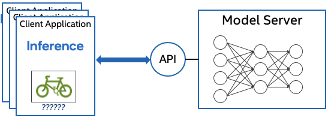

# OpenVINO&trade; Model Server {#ovms_what_is_openvino_model_server}

@sphinxdirective

.. toctree::
   :maxdepth: 1
   :hidden:

   ovms_docs_quick_start_guide
   ovms_docs_architecture
   ovms_docs_models_repository
   ovms_docs_starting_server
   ovms_docs_server_api
   ovms_docs_clients
   ovms_docs_dag
   ovms_docs_binary_input
   ovms_docs_model_cache
   ovms_sample_cpu_extension
   ovms_docs_dynamic_input
   ovms_docs_stateful_models
   ovms_docs_custom_loader
   ovms_docs_performance_tuning
   ovms_docs_kubernetes
   ovms_docs_demos
   ovms_docs_troubleshooting

@endsphinxdirective

OpenVINO&trade; Model Server (OVMS) is a high-performance system for serving machine learning models. It is based on C++ for high scalability 
and optimized for Intel solutions, so that you can take advantage of all the power of the Intel® Xeon® processor or Intel’s AI accelerators 
and expose it over a network interface. OVMS uses the same architecture and API as [TensorFlow Serving](https://github.com/tensorflow/serving), 
while applying OpenVINO for inference execution. Inference service is provided via gRPC or REST API, making it easy to deploy new algorithms and AI experiments.

Model repositories may reside on a locally accessible file system (e.g. NFS), as well as online storage compatible with 
Google Cloud Storage (GCS), Amazon S3, or Azure Blob Storage. 

Read [release notes](https://github.com/openvinotoolkit/model_server/releases) to find out what’s new.

Review the [Architecture concept](architecture.md) document for more details.

Key features: 
- support for multiple frameworks, such as Caffe, TensorFlow, MXNet, PaddlePaddle and ONNX
- online deployment of new [model versions](model_version_policy.md)
- [configuration updates in runtime](online_config_changes.md)
- support for AI accelerators, such as 
[Intel Movidius Myriad VPUs](https://docs.openvino.ai/2022.1/openvino_docs_OV_UG_supported_plugins_MYRIAD.html), 
[GPU](https://docs.openvino.ai/2022.1/openvino_docs_OV_UG_supported_plugins_GPU.html), and 
[HDDL](https://docs.openvino.ai/2022.1/openvino_docs_OV_UG_supported_plugins_HDDL.html) 
- works with [Bare Metal Hosts](host.md) as well as [Docker containers](docker_container.md) 
- [model reshaping](shape_batch_size_and_layout.md) in runtime
- [directed Acyclic Graph Scheduler](dag_scheduler.md) - connecting multiple models to deploy complex processing solutions and reducing data transfer overhead
- [custom nodes in DAG pipelines](custom_node_development.md) - allowing model inference and data transformations to be implemented with a custom node C/C++ dynamic library
- [serving stateful models](stateful_models.md) - models that operate on sequences of data and maintain their state between inference requests
- [binary format of the input data](binary_input.md) - data can be sent in JPEG or PNG formats to reduce traffic and offload the client applications
- [model caching](model_cache.md) - cache the models on first load and re-use models from cache on subsequent loads

**Note:** OVMS has been tested on RedHat, CentOS, and Ubuntu. The latest publicly released docker images are based on Ubuntu and UBI.
They are stored in:
- [Dockerhub](https://hub.docker.com/r/openvino/model_server)
- [RedHat Ecosystem Catalog](https://catalog.redhat.com/software/containers/intel/openvino-model-server/607833052937385fc98515de)

## Run OpenVINO Model Server

A demonstration on how to use OpenVINO Model Server can be found in [our quick-start guide](ovms_quickstart.md). 
For more information on using Model Server in various scenarios you can check the following guides:

* [Model repository configuration](models_repository.md)

* [Using a docker container](docker_container.md)

* [Landing on bare metal or virtual machine](host.md)

* [Performance tuning](performance_tuning.md)

* [Directed Acyclic Graph Scheduler](dag_scheduler.md)

* [Custom nodes development](custom_node_development.md)

* [Serving stateful models](stateful_models.md)

* [Deploy using a Kubernetes Helm Chart](../deploy/README.md)

* [Deployment using Kubernetes Operator](https://operatorhub.io/operator/ovms-operator)

* [Using binary input data](binary_input.md)

## References

* [OpenVINO&trade;](https://software.intel.com/en-us/openvino-toolkit)

* [TensorFlow Serving](https://github.com/tensorflow/serving)

* [gRPC](https://grpc.io/)

* [RESTful API](https://restfulapi.net/)

* [Benchmarking results](https://docs.openvino.ai/2022.1/openvino_docs_performance_benchmarks_ovms.html)

* [Speed and Scale AI Inference Operations Across Multiple Architectures](https://techdecoded.intel.io/essentials/speed-and-scale-ai-inference-operations-across-multiple-architectures/?elq_cid=3646480_ts1607680426276&erpm_id=6470692_ts1607680426276) - webinar recording

* [What is new in OpenVINO Model Server C++](https://www.intel.com/content/www/us/en/artificial-intelligence/posts/whats-new-openvino-model-server.html)

* [Capital Health Improves Stroke Care with AI](https://www.intel.co.uk/content/www/uk/en/customer-spotlight/stories/capital-health-ai-customer-story.html) - use case example

## Contact

If you have a question, a feature request, or a bug report, feel free to submit a Github issue.

---
\* Other names and brands may be claimed as the property of others.
