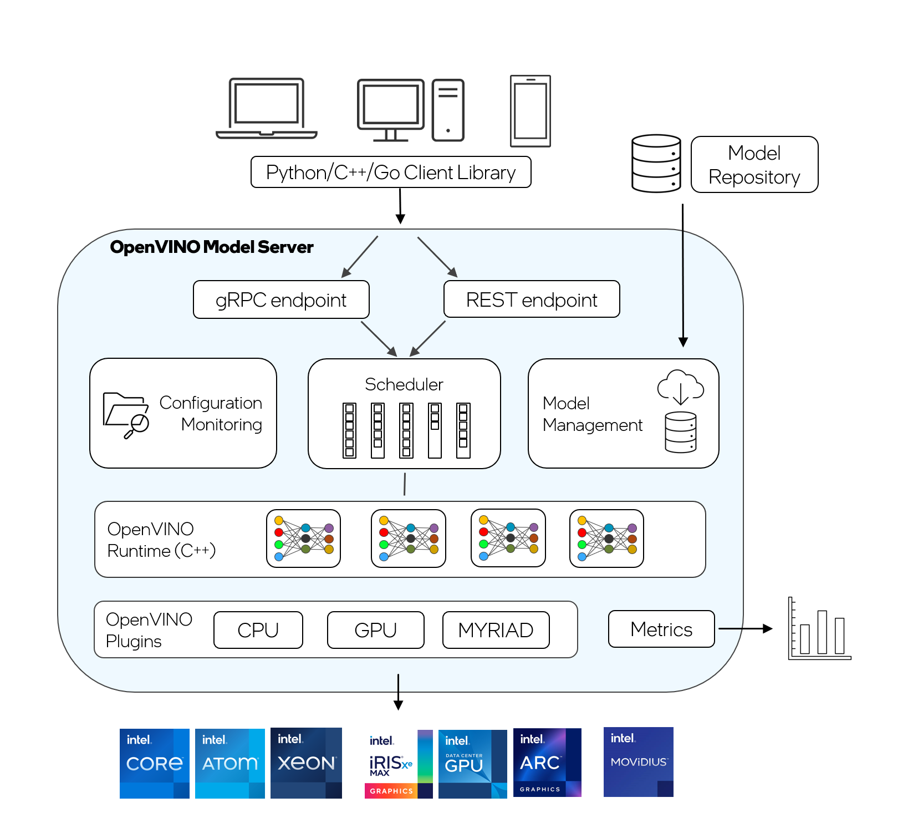

# OpenVINO&trade; Model Server {#ovms_what_is_openvino_model_server}

@sphinxdirective

.. toctree::
   :maxdepth: 1
   :hidden:

   ovms_docs_quick_start_guide
   ovms_docs_starting_server
   ovms_docs_server_app
   ovms_docs_dag
   ovms_docs_stateful_models
   ovms_docs_binary_input
   ovms_docs_performance_tuning
   ovms_docs_advanced
   ovms_docs_demos
   ovms_docs_troubleshooting

@endsphinxdirective

OpenVINO&trade; Model Server (OVMS) is a high-performance system for serving machine learning models. It is based on C++ for high scalability and optimized for Intel solutions, so that you can take advantage of all the power of the Intel® Xeon® processor or Intel’s AI accelerators and expose it over a network interface.

OpenVINO&trade; Model Server uses the same architecture and API as [TensorFlow Serving](https://github.com/tensorflow/serving) and [KServe](https://github.com/kserve/kserve), while applying OpenVINO for inference execution. Inference service is provided via [gRPC](https://grpc.io/) or [RESTful API](https://restfulapi.net/), making it easy to deploy new algorithms and AI experiments. Learn how to serve machine learning models in production with OpenVINO Model Server in the [quick-start guide](ovms_quickstart.md). 

## Model Serving

Generally, a model server is a web server that hosts deep learning models and makes them accessible to software components over standart network protocols. Functionally it works similarly to a web server: you send a request and receive a response. Just like a web server, the model can be accessed across devices as long as they are connected via a common network. 

The key advantage of a model server is its ability to process several client requests simultaneously. This means that a model server is the best option if numerous applications are using the same model to run inference. The model uses less device memory because the same server is serving multiple client requests simultaneously. The memory footprint roughly remains the same as that of a single model. As a result, a user can create a lightweight client for edge or cloud deployments with only the necessary functions to perform API calls. 

## OpenVINO Model Server Key Features: 

- support for multiple frameworks, such as Caffe, TensorFlow, MXNet, PaddlePaddle and ONNX
- online deployment of new [model versions](model_version_policy.md)
- [configuration updates in runtime](online_config_changes.md)
- support for AI accelerators, such as 
[Intel Movidius Myriad VPUs](https://docs.openvino.ai/2022.2/openvino_docs_OV_UG_supported_plugins_MYRIAD.html), 
[GPU](https://docs.openvino.ai/2022.2/openvino_docs_OV_UG_supported_plugins_GPU.html), and 
[HDDL](https://docs.openvino.ai/2022.2/openvino_docs_OV_UG_supported_plugins_HDDL.html) 
- [model reshaping](shape_batch_size_and_layout.md) in runtime for high-throughput and low-latency
- [directed Acyclic Graph Scheduler](dag_scheduler.md) - connecting multiple models to deploy complex processing solutions and reducing data transfer overhead
- [custom nodes in DAG pipelines](custom_node_development.md) - allowing model inference and data transformations to be implemented with a custom node C/C++ dynamic library
- [serving stateful models](stateful_models.md) - models that operate on sequences of data and maintain their state between inference requests
- [binary format of the input data](binary_input.md) - data can be sent in JPEG or PNG formats to reduce traffic and offload the client applications
- [model caching](model_cache.md) - cache the models on first load and re-use models from cache on subsequent loads
- [metrics](metrics.md) - metrics compatible with Prometheus standard

The models used by OpenVINO Model Server need to be stored locally (for example, NFS) or hosted remotely by object storage services. Storage compatible with Google Cloud Storage (GCS), Amazon S3, or Azure Blob Storage is supported. 
For more details, refer to [Preparing Model Storage](./models_repository.md) documentation.  

OpenVINO&trade; Model Server works with [Bare Metal Hosts](host.md) as well as [Docker containers](docker_container.md). It is also suitable for landing in the [Kubernetes environment](../deploy/README.md).

## Run OpenVINO Model Server

A demonstration on how to use OpenVINO Model Server can be found in the [quick-start guide](ovms_quickstart.md). 

For more information on using Model Server in various scenarios, check the following guides:

* [Model repository configuration](models_repository.md)

* [Using a docker container](docker_container.md)

* [Landing on bare metal or virtual machine](host.md)

* [Performance tuning](performance_tuning.md)

* [Directed Acyclic Graph Scheduler](dag_scheduler.md)

* [Custom nodes development](custom_node_development.md)

* [Serving stateful models](stateful_models.md)

* [Deploy using a Kubernetes Helm Chart](../deploy/README.md)

* [Deployment using Kubernetes Operator](https://operatorhub.io/operator/ovms-operator)

* [Using binary input data](binary_input.md)

## See Also

* [Benchmarking results](https://docs.openvino.ai/2022.1/openvino_docs_performance_benchmarks_ovms.html) - see high performance gains on several public neural networks on multiple Intel® CPUs, GPUs and VPUs 

* [Speed and Scale AI Inference Operations Across Multiple Architectures](https://techdecoded.intel.io/essentials/speed-and-scale-ai-inference-operations-across-multiple-architectures/?elq_cid=3646480_ts1607680426276&erpm_id=6470692_ts1607680426276) - watch OVMS demo recording

* [Simplified Deployments with OpenVINO™ Model Server and TensorFlow Serving](https://community.intel.com/t5/Blogs/Tech-Innovation/Artificial-Intelligence-AI/Simplified-Deployments-with-OpenVINO-Model-Server-and-TensorFlow/post/1353218) - learn how to perform inference on JPEG images using the gRPC API in OpenVINO Model Server

* [Inference Scaling with OpenVINO™ Model Server in Kubernetes and OpenShift Clusters](https://www.intel.com/content/www/us/en/developer/articles/technical/deploy-openvino-in-openshift-and-kubernetes.html) - scale inferencing with OpenVINO in Kubernetes and OpenShift using OpenVINO Model Server

* [Capital Health Improves Stroke Care with AI](https://www.intel.co.uk/content/www/uk/en/customer-spotlight/stories/capital-health-ai-customer-story.html) - use case example

* [Release Notes](https://github.com/openvinotoolkit/model_server/releases) - find out what’s new in the latest OpenVINO Model Server Release

## Contact OpenVINO Model Server Team

If you have a question, a feature request, or a bug report, feel free to submit a [Github issue](https://github.com/openvinotoolkit/model_server).

**Note**: OVMS has been tested on RedHat, CentOS, and Ubuntu. The latest publicly released docker images are based on Ubuntu and UBI.
They are stored in:
- [Dockerhub](https://hub.docker.com/r/openvino/model_server)
- [RedHat Ecosystem Catalog](https://catalog.redhat.com/software/containers/intel/openvino-model-server/607833052937385fc98515de)