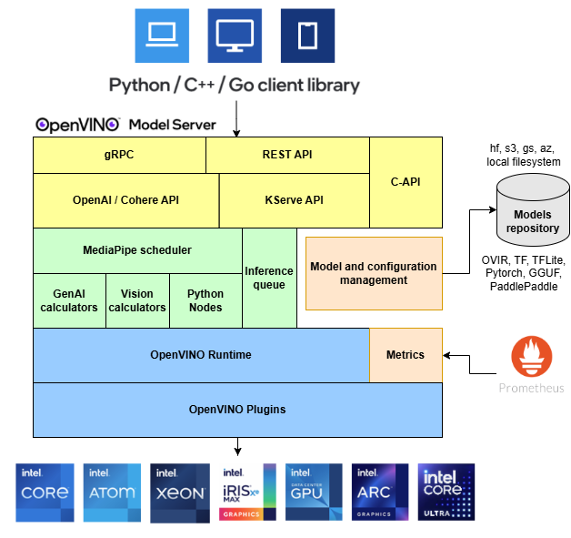

# OpenVINO&trade; Model Server {#ovms_what_is_openvino_model_server}

```{toctree}
---
maxdepth: 1
hidden:
---

ovms_docs_quick_start_guide
ovms_docs_llm_quickstart
ovms_docs_models_repository
ovms_docs_deploying_server
ovms_docs_server_app
ovms_docs_features
ovms_docs_performance_tuning
ovms_docs_demos
ovms_docs_troubleshooting
```

**High-performance model serving for Generative AI and classic deep learning — powered by [OpenVINO](https://github.com/openvinotoolkit/openvino) and optimized for Intel hardware.**

---

## What is OVMS?

OpenVINO Model Server (OVMS) is a production-grade, C++ inference server that exposes ML models over standard network APIs. It serves both **Generative AI**, **Agentic** workloads (LLMs, VLMs, image generation, audio) and **classic deep learning** models (object detection, classification, OCR, and more).

- **OpenAI-compatible API** for text generation, embeddings, image generation, and audio
- **KServe** APIs for classic model inference
- **Runs anywhere** — Docker, bare metal, Kubernetes/OpenShift, Windows
- **Intel-optimized** — CPU, GPU, NPU acceleration via OpenVINO



---

## Quick Start

### Serve an LLM with OpenAI-compatible API

**On Linux (Docker):**
```bash
# Model is downloaded automatically from HuggingFace
docker run --rm -p 8000:8000 \
  openvino/model_server:latest \
  --source_model OpenVINO/Qwen3-4B-int4-ov \
  --model_repository_path /tmp/models \
  --rest_port 8000
```
> For GPU acceleration, use the `latest-gpu` image tag and pass `--device /dev/dri --group-add $(stat -c '%g' /dev/dri/render* | head -n1)` to expose the Intel GPU device.

**On Windows (binary package):**
```bat
mkdir c:\models
ovms.exe --source_model OpenVINO/Qwen3-4B-int4-ov --model_repository_path c:\models --rest_port 8000
```

**Query the model:**

```console
pip install openai
```

```python
from openai import OpenAI

client = OpenAI(base_url="http://localhost:8000/v1", api_key="unused")
stream = client.chat.completions.create(
    model="OpenVINO/Qwen3-4B-int4-ov",
    messages=[{"role": "user", "content": "What are the 3 main tourist attractions in Paris?"}],
    stream=True,
    extra_body={"chat_template_kwargs": {"enable_thinking": False}}
)
for chunk in stream:
    if chunk.choices[0].delta.content:
        print(chunk.choices[0].delta.content, end="", flush=True)
```
> [LLM QuickStart](llm/quickstart.md)


### Serve a Classic Model with KServe API

**Download the model:**
```text
curl -L https://huggingface.co/OpenVINO/resnet50-int8-ov/resolve/main/resnet50.bin -O
curl -L https://huggingface.co/OpenVINO/resnet50-int8-ov/resolve/main/resnet50.xml -O
```

**On Linux (Docker):**
```bash
docker run --rm -d -u $(id -u) -v ${PWD}:/models -p 9000:9000 \
  openvino/model_server:latest \
  --model_name resnet --model_path /models/resnet50.xml \
  --mean "[123.675,116.28,103.53]" --scale "[58.395,57.12,57.375]" --layout "NHWC:NCHW" \
  --port 9000
```
> For GPU acceleration, use the `latest-gpu` image tag and pass `--device /dev/dri --group-add $(stat -c '%g' /dev/dri/render* | head -n1)` to expose the Intel GPU device.

**Windows (binary package):**
```bat
ovms --model_name resnet --model_path resnet50.xml --mean "[123.675,116.28,103.53]" --scale "[58.395,57.12,57.375]" --layout "NHWC:NCHW" --port 9000
```

Run inference with a sample python client

```console
pip install numpy tritonclient[grpc]
curl -o image.jpeg https://github.com/openvinotoolkit/model_server/blob/main/demos/common/static/images/bee.jpeg?raw=true
```

```python
import numpy as np
import tritonclient.grpc as grpcclient
with open("image.jpeg", "rb") as f:
    image_bytes = f.read()
client = grpcclient.InferenceServerClient(url="localhost:9000")
inputs = [grpcclient.InferInput("image", [1], "BYTES")]
inputs[0].set_data_from_numpy(np.array([image_bytes], dtype=object))
outputs = [grpcclient.InferRequestedOutput("output")]
result = client.infer(model_name="resnet", inputs=inputs, outputs=outputs)
output = result.as_numpy("output")  # (1, 1000) FP32
print("Top-1 class index:", int(np.argmax(output[0])))
```

> [Vision model QuickStart](ovms_quickstart.md)

---

## Features

### Generative AI
- [LLM text generation](../demos/continuous_batching/README.md) — continuous batching, streaming, structured output, speculative decoding
- [VLM (Vision Language Models)](../demos/continuous_batching/vlm/README.md)
- [AI Agents with MCP servers](../demos/continuous_batching/agentic_ai/README.md)
- [Text embeddings](../demos/embeddings/README.md) — OpenAI-compatible `/v1/embeddings`
- [Reranking](../demos/rerank/README.md) — Cohere-compatible API
- [Image generation](../demos/image_generation/README.md) — OpenAI-compatible `/v1/images/generations`
- [Speech recognition and TTS](../demos/audio/README.md) — OpenAI-compatible audio API
- [GGUF model support](../demos/gguf/README.md)

### Classic Models & Pipelines
- TensorFlow, ONNX, PaddlePaddle, OpenVINO IR model formats
- [DAG pipelines](dag_scheduler.md) with [custom nodes](custom_node_development.md)
- [MediaPipe graphs](mediapipe.md)
- [Python execution nodes](python_support/reference.md)
- [Dynamic input shapes](shape_batch_size_and_layout.md)

### Deployment & Integration
- Docker, bare metal (Linux & Windows), Kubernetes / OpenShift
- [Model repository](models_repository.md): local storage, S3, GCS, Azure Blob, HuggingFace Hub
- [Model versioning](model_version_policy.md) and [hot-reload](online_config_changes.md)
- [Prometheus-compatible metrics](metrics.md)
- [gRPC streaming](streaming_endpoints.md)
- [C API](model_server_c_api.md) for embedding OVMS in native applications

### Hardware Acceleration
- CPU (x86, including Xeon), Intel integrated and discrete GPU, NPU
- See [supported accelerators](accelerators.md)

[→ Full feature list](features.md)

---

## Documentation

| Topic | Link |
|---|---|
| Deployment | [Deploying the server](deploying_server.md) |
| Model repository | [Preparing models](models_repository.md) |
| Client libraries | [Writing client code](writing_app.md) |
| Demos & examples | [Demos](../demos/README.md) |
| Release notes | [GitHub Releases](https://github.com/openvinotoolkit/model_server/releases) |

---

## Get the Server

**Docker images** (recommended):
```text
docker pull openvino/model_server:latest        # Intel CPU
docker pull openvino/model_server:latest-gpu    # Intel CPU,GPU,NPU
```

- [Docker Hub](https://hub.docker.com/r/openvino/model_server)
- [Red Hat Ecosystem Catalog](https://catalog.redhat.com/software/containers/intel/openvino-model-server/607833052937385fc98515de)

**Binary packages** (Linux & Windows): [GitHub Releases](https://github.com/openvinotoolkit/model_server/releases)

---

## Contributing

Contributions are welcome! Please open an issue or pull request on GitHub.  
See [security policy](security.md) for responsible disclosure.

---

## References

- [OpenVINO Toolkit](https://software.intel.com/en-us/openvino-toolkit)
- [Performance benchmarks](https://docs.openvino.ai/2026/about-openvino/performance-benchmarks.html)
- [GenAI with CPU optimization — Intel whitepaper](https://cdrdv2-public.intel.com/864404/vFINAL_Intel%20SLM%20Whitepaper.pdf)
- [RAG with OpenVINO Model Server — blog post](https://medium.com/openvino-toolkit/rag-building-blocks-made-easy-and-affordable-with-openvino-model-server-e7b03da5012b)
- [AIPC turned into a mighty assistant](https://medium.com/openvino-toolkit/ai-pc-turned-into-a-mighty-ai-assistant-with-local-models-and-openvino-model-server-1f41913252c9)

---

\* Other names and brands may be claimed as the property of others.
