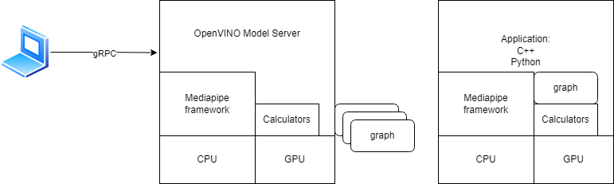

# Integration with mediapipe {#ovms_docs_mediapipe}

## Introduction
MediaPipe is an open-source framework for building pipelines to perform inference over arbitrary sensory data. It comes with a wide range of calculators/nodes which can be applied for unlimited number of scenarios in image and media analytics, generative AI, transformers and many more. Here can be found more information about [MediaPipe framework ](https://developers.google.com/mediapipe/framework/framework_concepts/overview)

Thanks to the integration between MediaPipe and OpenVINO Model Server, the graphs can be exposed over the network and the complete load can be delegated to a remote host or a microservice.
We support the following scenarios:
- stateless execution via unary to unary gRPC/REST calls
- stateful graph execution via [gRPC streaming sessions](./streaming_endpoints.md).

With the introduction of OpenVINO calculator it is possible to optimize inference execution in the OpenVINO Runtime backend. This calculator can be applied both in the graphs deployed inside the Model Server but also in the standalone applications using the MediaPipe framework.



Check [our MediaPipe github fork](https://github.com/openvinotoolkit/mediapipe) to learn how to use the OpenVINO calculator inside standalone MediaPipe application.

This guide gives information about:

- [Integration with mediapipe {#ovms\_docs\_mediapipe}](#integration-with-mediapipe-ovms_docs_mediapipe)
  - [Introduction](#introduction)
  - [OpenVINO calculators](#openvino-calculators)
  - [PythonExecutorCalculator](#pythonexecutorcalculator)
  - [PyTensorOvTensorConverterCalculator](#pytensorovtensorconvertercalculator)
  - [How to create the graph for deployment in OpenVINO Model Server](#how-to-create-the-graph-for-deployment-in-openvino-model-server)
    - [Supported graph input/output streams packet types](#supported-graph-inputoutput-streams-packet-types)
    - [Side packets](#side-packets)
    - [List of default calculators](#list-of-default-calculators)
    - [CPU and GPU execution](#cpu-and-gpu-execution)
  - [Graph deployment](#graph-deployment)
    - [How to package the graph and models](#how-to-package-the-graph-and-models)
    - [Starting OpenVINO Model Server with Mediapipe servables](#starting-openvino-model-server-with-mediapipe-servables)
    - [MediaPipe configuration options explained](#mediapipe-configuration-options-explained)
  - [Deployment testing](#deployment-testing)
    - [Debug logs](#debug-logs)
    - [Tracing](#tracing)
    - [Benchmarking](#benchmarking)
  - [Using MediaPipe graphs from the remote client](#using-mediapipe-graphs-from-the-remote-client)
  - [Adding your own mediapipe calculator to OpenVINO Model Server](#adding-your-own-mediapipe-calculator-to-openvino-model-server)
  - [MediaPipe Graphs Examples](#mediapipe-graphs-examples)
  - [Current limitations](#current-limitations)
  - [Known issues](#known-issues)


## OpenVINO calculators

We are introducing a set of calculators which can bring to the graphs execution advantages of OpenVINO Runtime.

Check their [documentation](https://github.com/openvinotoolkit/mediapipe/blob/main/mediapipe/calculators/ovms)

## PythonExecutorCalculator

`PythonExecutorCalculator` enables Python code execution in a graph node. Learn more about [Python nodes](python_support/reference.md).

## PyTensorOvTensorConverterCalculator

`PyTensorOvTensorConverterCalculator` enables conversion between nodes that are run by `PythonExecutorCalculator` and nodes that receive and/or produce [OV Tensors](https://docs.openvino.ai/2025/api/c_cpp_api/classov_1_1_tensor.html)

## How to create the graph for deployment in OpenVINO Model Server

### Supported graph input/output streams packet types
OpenVINO Model Server supports processing several packet types at the inputs and outputs of the graph.
Following table lists supported tag and packet types in pbtxt graph definition:

|pbtxt line|input/output|tag|packet type|stream name|
|:---|:---|:---|:---|:---|
|input_stream: "a"|input|none|ov::Tensor|a|
|output_stream: "b"|input|none|ov::Tensor|b|
|input_stream: "IMAGE:a"|input|IMAGE|mediapipe::ImageFrame|a|
|output_stream: "IMAGE:b"|output|IMAGE|mediapipe::ImageFrame|b|
|input_stream: "OVTENSOR:a"|output|OVTENSOR|ov::Tensor|a|
|output_stream: "OVTENSOR:b"|output|OVTENSOR|ov::Tensor|b|
|input_stream: "REQUEST:req"|input|REQUEST|KServe inference::ModelInferRequest|req|
|output_stream: "RESPONSE:res"|output|RESPONSE|KServe inference::ModelInferResponse|res|

In case of missing tag OpenVINO Model Server assumes that the packet type is `ov::Tensor'. The stream name can be arbitrary but the convention is to use a lower case word.

The required data layout for the MediaPipe `IMAGE` conversion is HWC and the supported precisions are:
|Datatype|Allowed number of channels|
|:---|:---|
|FP16|1,3,4|
|FP32|1,2|
|UINT8|1,3,4|
|INT8|1,3,4|
|UINT16|1,3,4|
|INT16|1,3,4|

> **Note**: Input serialization to MediaPipe ImageFrame format, requires the data in the KServe request to be encapsulated in `raw_input_contents` field based on [KServe API GRPC](https://github.com/kserve/kserve/blob/master/docs/predict-api/v2/grpc_predict_v2.proto) or in binary extension of based on [KServe API REST](./binary_input_kfs.md#http). That is the default behavior in the client libs like `triton-client`.

When the client is sending in the gRPC/REST request the input as an numpy array, it will be deserialized on the Model Server side to the format specified in the graph.
For example when the graph has the input type IMAGE, the gRPC/REST client could send the input data with the shape `(300, 300, 3)` and precision INT8. It would not be allowed to send the data in the shape for example `(1,300,300,1)` as that would be incorrect layout and the number of dimensions.

When the input graph would be set as `OVTENSOR`, any shape and precisions of the input would be allowed. It will be converted to `ov::Tensor` object and passed to the graph. For example input can have shape `(1,3,300,300)` and precision `FP32`. If passed tensor would not be accepted by model, calculator and graph will return error.

Check the code snippets for [gRPC unary](clients_kfs.md#request-prediction-on-a-numpy-array) calls and [gRPC streaming](clients_kfs.md#request-streaming-prediction).

There is also an option to avoid any data conversions in the serialization and deserialization by the OpenVINO Model Server. When the input stream is of type REQUEST, it will be passed-through to the calculator. The receiving calculator will be in charge of deserializing it and interpreting all the content. Likewise, the output format RESPONSE delegate to the calculator creating a complete KServe response message to the client. That gives extra flexibility in the data format as arbitrary data can be stored in [raw_input_content](https://github.com/kserve/kserve/blob/master/docs/predict-api/v2/grpc_predict_v2.proto#L202) and later decoded in custom calculator.

**Note:** For list of supported packet types and tags of `OpenVINOInferenceCalculator`, including graph examples, check documentation of [OpenVINO Model Server calculators](https://github.com/openvinotoolkit/mediapipe/blob/main/mediapipe/calculators/ovms/).

### Side packets
Side packets are special parameters which can be passed to the calculators at the beginning of the graph initialization. It can tune the behavior of the calculator like set the object detection threshold or number of objects to process.
With KServe API you are also able to push side input packets into graph. They are to be passed as KServe request parameters. They can be of type `string`, `int64` or `boolean`.
Note that with the gRPC stream connection, only the first request in the stream can include the side package parameters. On the client side, the snippet below illustrates how it can be defined:
```python
client.async_stream_infer(
   model_name="model_name",
   inputs=[infer_input],
   parameters={'SIDE_PACKET_NAME': 10})
```

### List of default calculators
Beside OpenVINO inference calculators, model server public docker image also includes all the calculators used in the enabled demos.
The list of all included calculators, subgraphs, input/output stream handler is reported in the model server is started with extra parameter `--log_level TRACE`.

### CPU and GPU execution
As of now, the calculators included in the public docker images supports only CPU execution. They exchange between nodes objects and memory buffers form the host memory. While the GPU buffers are not supported in the MediaPipe graphs, it is still possible to run the inference operation on GPU target device.
The input data and the response will be automatically exchanges between GPU and host memory. For that scenarios, make sure to use the build image with `-gpu` suffix in the tag as it includes required dependencies for Intel discrete and integrated GPU.

Full pipeline execution on the GPU is expected to be added in future releases.

## Graph deployment
### How to package the graph and models
In order to simplify distribution of the graph artifacts and the deployment process in various environments,
it is recommended to create a specific folders structure:
```
mediapipe_graph_name/
├── graph.pbtxt
├── model1
│   └── 1
│       ├── model.bin
│       └── model.xml
├── model2
│   └── 1
│       ├── model.bin
│       └── model.xml
└── subconfig.json
```

The `graph.pbtxt` should include the definition of the mediapipe graph.
The `subconfig.json` is an extension to the main model server `config.json` configuration file. The subconfig should include the definition of the models used in the graph nodes. They will be loaded during the model server initialization and ready to use when the graph starts executing.
Included OpenVINO inference session calculator should include the reference to the model name as configured in `subconfig.json`.
Here is example of the `subconfig.json`:
```json
{
    "model_config_list": [
        {"config": {
                "name": "model1_name",
                "base_path": "model1"
        	  }
	      }
    ]
}
```


### Starting OpenVINO Model Server with Mediapipe servables
MediaPipe servables configuration is to be placed in the same json file like the
[models config file](starting_server.md).
Both models and graphs can be defined in section `model_config_list`.
In this case `name` and `base_path` parameters are required and `graph_path` parameter is optional for custom graph configuration file names (other than default `graph.pbtxt`).

Here is an example `config.json` file that defines two MediaPipe graphs. One with custom `graph_path` and one default:
```json
{
    "model_config_list": [
        {
            "config": {
                "name": "mediapipe_graph_name",
                "base_path":"/custom/path/to/pbtxt",
                "graph_path": "custom_name_for.pbtxt"
            }
        },
        {
            "config": {
                "name": "mediapipe_graph_name_for_default_name",
                "base_path":"/custom/path/to/pbtxt"
            }
        }
    ]
}
```
In case the `mediapipe_graph_name_for_default_name` above, ovms will search for the default graph name `graph.pbtxt` in the `/custom/path/to/pbtxt` directory.
This will load the `mediapipe_graph_name_for_default_name` servable from `/custom/path/to/pbtxt/graph.pbtxt` path.

In case the `mediapipe_graph_name` above, ovms will search for the graph name `custom_name_for.pbtxt` in the `/custom/path/to/pbtxt` directory.
This will load the `mediapipe_graph_name` servable from `/custom/path/to/pbtxt/custom_name_for.pbtxt` path.

Graphs can also be configured in the `mediapipe_config_list` section.
When the MediaPipe graphs artifacts are packaged like presented above, configuring the OpenVINO Model Server is very easy.
Just a `config.json` needs to be prepared with a list of all the graphs to be deployed:
```json
{
    "model_config_list": [],
    "mediapipe_config_list": [
    {
        "name":"mediapipe_graph_name"
    },
    {
        "name":"mediapipe2",
        "base_path":"non_default_path"
    }
    ]
}
```
Nodes in the MediaPipe graphs can reference both the models configured in model_config_list section and in subconfigs.

### MediaPipe configuration options explained

|Option|Type|Description|Required|
|:---|:---|:---|:---|
|`"name"`|string|Graph identifier related to name field specified in gRPC/REST request|Yes|
|`"base_path"`|string|Path to the which graph definition and subconfig files paths are relative. May be absolute or relative to the main config path. Default value is "(main config path)\(name)"|No|
|`"graph_path"`|string|Path to the graph proto file. May be absolute or relative to the base_path. Default value is "(base_path)\graph.pbtxt". File have to exist.|No|
|`"subconfig"`|string|Path to the subconfig file. May be absolute or relative to the base_path. Default value is "(base_path)\subconfig.json". Missing  file does not result in error.|No|

Subconfig file may only contain *model_config_list* section  - in the same format as in [models config file](starting_server.md).


## Deployment testing
### Debug logs
The simplest method to validate the graph execution is to set the Model Server `log_level` to `DEBUG`.
`docker run --rm -it -v $(pwd):/config openvino/model_server:latest --config_path /config/config.json --log_level DEBUG`

It will report in a verbose way all the operations in the mediapipe framework from the graph initialization and execution.
The model server logs could confirm the graph correct format and loading all the required models.
Note that graph definition loading is not confirming if all the calculators are compiled into the model server. That can be tested after sending the request to the KServe endpoint.
During the requests processing, the logs will include info about calculators initialization and processing the nodes.

Please note that MediaPipe does not validate Input Handler settings during graph initialization, but graph creation phase (upon request processing). Therefore it is good practice to always test the configuration by sending example requests to the KServe endpoints before deployment.

### Tracing
Currently the graph tracing on the model server side is not supported. If you would like to take advantage of mediapipe tracing to identify the graph bottleneck, test the graph from the mediapipe application level. Build an example application similarly to [holistic app](https://github.com/openvinotoolkit/mediapipe/tree/main/mediapipe/examples/desktop/holistic_tracking) with the steps documented on [mediapipe tracking](https://github.com/openvinotoolkit/mediapipe/tree/main/docs/tools/tracing_and_profiling.md).

### Benchmarking
While you implemented and deployed the graph you have several options to test the performance.
To validate the throughput for unary requests you can use the [benchmark client](../demos/benchmark/python/README.md#mediapipe-benchmarking) .

For streaming gRPC connections, there is available [rtsp_client](../demos/real_time_stream_analysis/python/README.md).
It can generate the load to gRPC stream and the mediapipe graph based on the content from RTSP video stream, MPG4 file or from the local camera.

## Using MediaPipe graphs from the remote client

MediaPipe graphs can use the same gRPC/REST KServe Inference API both for the unary calls and the streaming.
The same client libraries with KServe API support can be used in both cases. The client code for the unary and streaming is different.
Check the [code snippets](clients_kfs.md)

Review also the information about the [gRPC streaming feature](./streaming_endpoints.md)

Graphs can be queried for their state using the calls [Model Ready](model_server_grpc_api_kfs.md#model-ready-api), [REST Model Ready](model_server_rest_api_kfs.md#model-ready-api)
and [Model Metadata](model_server_grpc_api_kfs.md#model-metadata-api) and [REST Model Metadata](model_server_rest_api_kfs.md#model-metadata-api).

The difference in using the MediaPipe graphs and individual models is in version management. In all calls to the MediaPipe graphs,
the version parameter is ignored. MediaPipe graphs are not versioned. Though, they can reference a particular version of the models in the graph.

## Adding your own mediapipe calculator to OpenVINO Model Server
MediaPipe graphs can include only the calculators built-in the model server image.
If you want to add your own mediapipe calculator to OpenVINO Model Server functionality you need to add it as a dependency and rebuild the OpenVINO Model Server binary.

If you have it in external repository, you need to add the http_archive() definition or git_repository() definition to the bazel [WORKSPACE](https://github.com/openvinotoolkit/model_server/blob/main/WORKSPACE) file.
Then you need to add the calculator target as a bazel dependency to the [src/BUILD](https://github.com/openvinotoolkit/model_server/blob/main/src/BUILD) file. This should be done for:

```
cc_library(
 name = "ovms_lib",
...
```

in the conditions:default section of the deps property:

```
  deps = [
         "//:ovms_dependencies",
        "//src/kfserving_api:kfserving_api_cpp",
        ] + select({
            "//conditions:default": [
                "//src:ovmscalculatoroptions_cc_proto", # ovmscalculatoroptions_proto - just mediapipe stuff with mediapipe_proto_library adding nonvisible target
                "@mediapipe_calculators//:mediapipe_calculators",
                 "@your_repository//:yourpathtocalculator/your_calculator
```

 Make sure the REGISTER_CALCULATOR(your_calculator); macro is present in the calculator file that you have added.


## MediaPipe Graphs Examples

[Holistic analysis](../demos/mediapipe/holistic_tracking/README.md)

[Image classification](../demos/mediapipe/image_classification/README.md)

[Object detection](../demos/mediapipe/object_detection/README.md)

[Multi model](../demos/mediapipe/multi_model_graph/README.md)


## Current limitations
- Inputs of type string are supported only for inputs tagged as OVMS_PY_TENSOR.

- KServe ModelMetadata call response contains only input and output names. In the response, shapes will be empty and datatypes will be `"INVALID"`.

- Binary inputs are not supported for MediaPipe graphs for the type IMAGE and OVTENSOR.

- Updates in subconfig files and mediapipe graph files do not trigger model server config reloads. The reload of the full config, including subconfig and graphs, can be initiated by an updated in the main config json file or using the REST API `config/reload` endpoint.


## Known issues
- MediaPipe `SyncSetInputStreamHandler` options are not validated during graph validation, but graph creation:
```
input_stream: "INPUT:input"
input_stream: "LOOPBACK:loopback"
input_stream_handler {
    input_stream_handler: "SyncSetInputStreamHandler",
    options {
        [mediapipe.SyncSetInputStreamHandlerOptions.ext] {
            sync_set {
                tag_index: "LOOPBACK:1"  # wrong index example
            }
        }
    }
}
```
MediaPipe closes entire application because there's no input stream with tag `LOOPBACK` and index `1` (correct index is `0`). Therefore, test the deployment for correct setting before deploying to production.
